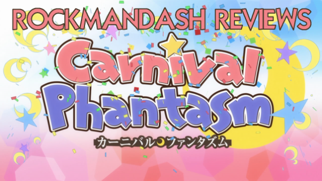

---
{
  title: "​Rockmandash Reviews: Anime Backlog Review Gauntlet #2",
  tags:
    [
      "Rockmandash Reviews",
      "Anime Backlog Review Gauntlet",
      "Backlog",
      "AniTAY",
    ],
  published: "2015-03-23T02:30:00-04:00",
  attached: [],
  kinjaArticle: true,
}
---

Welcome back to the <strong>SUPER DELUXE ANIME BACKLOG REVIEW GAUNTLET
  EXTRAVAGANZA, </strong>the fantastic and super amazing <a class="sc-1out364-0 hMndXN sc-145m8ut-0 gIacKn js_link" data-ga='[["Embedded Url","External link","http://anitay.kinja.com/rockmandash-reviews-anime-backlog-review-gauntlet-1-1680197346",{"metric25":1}]]' href="http://anitay.kinja.com/rockmandash-reviews-anime-backlog-review-gauntlet-1-1680197346" rel="noopener noreferrer" target="_blank">article series</a> where I do mini-reviews of shows I’ve been watching recently that
  was in my backlog.<strong> </strong>This time we have interesting OVAs, and amazing shows that everyone should watch!

<h2 class="sc-1bwb26k-1 fvCjqJ" id="h115321"><em>Paprika</em>
</h2>

<strong>Information:</strong> Satoshi Kon movie produced by Madhouse in 2006

<strong>Plot Summary: </strong>In the near future, a revolutionary new psychotherapy
  treatment called PT has been invented. Through a device called the “DC Mini” it is able to act as a “dream detective”
  to enter into people’s dreams and explore their unconscious thoughts. Before the government can pass a bill
  authorizing the use of such advanced psychiatric technology, one of the prototypes is stolen, sending the research
  facility into an uproar. In the wrong hands, the potential misuse of the device could be devastating, allowing the
  user to completely annihilate a dreamer’s personality while they are asleep. Renowned scientist, Dr. Atsuko Chiba,
  enters the dream world under her exotic alter-ego, code name “PAPRIKA,” in an attempt to discover who is behind the
  plot to undermine the new invention. <em>- Plot Summary from MAL</em>

<strong>Thoughts:</strong> It’s a Satoshi Kon film, which should really say it all.
  Honestly, I wanted to marathon through all of his works just because of how great they are , but going through all of
  them was a bit too dense for me, so <em>Paprika</em> is the only one on this list. Really, it’s quite an interesting
  movie, with really unique storytelling (that has no direct cause and effect), great concepts (The DC Mini is so cool!)
  and amazing writing. It’s Satoshi Kon at his best, doing what he does well, and it’s as enjoyable as ever... but once
  again it’s so trippy that it’s kinda difficult to watch and analyze. I couldn’t really get into this one as much as
  <em>Perfect Blue</em>, but I did still enjoy it quite a bit. :)

I find that the name really is fitting for the show as the best way to describe the
  show is with the name<em> Paprika</em>: a spice, something that’ll shake up your image of animation and spice it up.
  It’s movie that has people sharing dreams, illusion, and minds, a collective dream that will blow you away. A lot of
  people would describe this is a mindscrew, but I don’t really think mindscrew is not the right word to describe it: I
  would rather use the words mind melting, which describes the the film’s story, the narrative style, and what happens
  to your mind as you watch it. Watching this film just melting is interesting and awesome, and the way it executes it’s
  focus on dreams in is unique and makes for a great experience. Also, Madhouse dids a great job with this as this is a
  beautiful show, and they really did a great job representing what Satoshi Kon visioned. It’s really a very interesting
  movie that was done well, and it’s one that you should check out if you are interested in anime as a storytelling
  medium at all.

<strong>Score: </strong>8.5/10, Polarization: +1, -1. <strong><em>Rockmandash
  Recommends/Go For It!</em></strong>

<h2 class="sc-1bwb26k-1 fvCjqJ" id="h115322"><em>Zero
  Escape: Virtue’s Last Reward OVA</em></h2>

<strong>Information:</strong> Single OVA made by Gonzo in 2011

<strong>Plot Description:</strong> It’s a short, 13 minute OVA of the first few scenes of
  one of my favorite Visual Novels, <em>Zero Escape: Virtue’s Last Reward</em>. The plot is identical to the beginning
  of the game, as it’s pretty much an ad, so here’s a summary of the VN, straight from Askys:

<blockquote class="sc-8hxd3p-0 nvIqO" data-type="BlockQuote">
Virtue’s Last Reward that
  traps college student Sigma, a mysterious young woman named Phi, and seven other strangers in a game of life and
  death.

They are forced to take part in a game known as the Nonary Game: Ambidex Edition, which
    will place their lives on the line as they try to escape and discover the truth about why they’re there in the first
    place.
</blockquote>

<strong>Thoughts: </strong>It’s fine. I shouldn’t have really expected much as it is
  Gonzo and it’s only a 13 minute OVA, but yeah.. it doesn’t live up to the VN, but it doesn’t butcher it either. Like I
  said before, it’s the exact same plot as the first few bits of the game so there really isn’t much to say in that
  aspect, but I do have to note that the way they portrayed the game would lead up to a major plot issue in the future,
  and the show doesn’t capture the intensity and feeling in the story at all, being just meh and average... good thing
  it’s just an OVA, right?

As for production values, not much to say either: It has
  good voice overs with the same actors (not sure if the lines were just ripped from the game or recorded specifically
  for this) and decent art captures the feel of the game pretty well, but I think it’s completely lacking in the
  atmosphere that game has, and it lacks in the charm of the game. The visuals look pretty average, which really is to
  be expected. I do have to comment though that they managed to capture the essence of Zero 3 really well, which
  surprised me, but other than that, not really much to say.

Overall, it’s pretty much an ad for the game. I love the fact that I’m able to see
  my favorite series in animated form, but it’s just a short OVA that is very average. It doesn’t capture what makes
  Zero Escape so great, so I can’t show this off to friends and say check out how awesome this is, but it was a nice
  watch anyways.

<strong>Score: </strong>7/10, Polarization: +1, -1. <strong><em>Rockmandash
  Regular/Proceed with Caution.</em></strong>

<h3 class="sc-1bwb26k-1 fvCjqJ" id="h115323"><em>Tamako
  Market + Love Story</em></h3>

<strong>Information: </strong>13 Episode Series, made KyoAni in 2013 and Sequel
  Movie also by KyoAni in 2014

<strong>Plot Description: </strong>Tamako Kitashirakawa
  is the eldest daughter of a family which runs the Tama-ya mochi shop in the Usagiyama Shopping District. One day,
  Tamako encounters a strange talking bird named Dera Mochimazzi who comes from a distant land searching for a bride for
  his country’s prince. After becoming overweight from eating too much mochi, Dera ends up becoming a freeloader in
  Tamako’s home. The series follows the everyday life of Tamako, her friends, family and neighbors, and this peculiar
  bird.<em>- Plot Description from Wikipedia</em>

<strong>Thoughts:</strong> <em>Tamako Market</em> is a pretty pure slice of life
  show, with not much else in it... yet it grabs your attention and gets you to watch. It’s the daily life of Tamako and
  co, but KyoAni manages to make nothing entertaining, and I liked it quite a bit. Yes, there’s not much here, as it’s
  just a slice of life with next to no draw point but the characters are entertaining with the interactions being pretty
  solid (some may say otherwise , but I really liked the characters), the production values are stellar (If you don’t
  mind KyoAni’s moe art style, which I’m quite fond of), and the execution of it is pretty great. Honestly, I’ve never
  been the biggest fan of these pure slice of life shows, but if there’s anything that can change your mind on that,
  it’s this show, as it just does it so well, sucking you in and getting you interested with the characters. It’s a
  great slice of life as expected from KyoAni and it got me thinking why I haven’t seen it until now.

<strong>Tamako Market:</strong> 8/10, Polarization: +1, -1. <strong>Rockmandash
  Recommends/Go For It!</strong>

<iframe allow="accelerometer; autoplay; clipboard-write; encrypted-media; gyroscope; picture-in-picture" allowfullscreen="" frameborder="0" height="315" src="https://www.youtube.com/embed/hujMOUcu1R0" width="560"></iframe>

That sentiment continues over to <em>Tamako Love Story</em>, the sequel film that wraps up
  the series with one of the simplest, nicest, sweetest, cutest love stories you’ll ever see.. and amplifies this series
  into great territory. Almost all romances in anime are greatly exaggerated (which I really don’t mind), but a change
  of pace is really nice, and rarely do you ever see a romance done so well. It’s<strong> EXTREMELY</strong> well
  executed with everything working out perfectly... the visuals being absolutely beautiful, the music used to it’s
  fullest (especially<a class="sc-1out364-0 hMndXN sc-145m8ut-0 gIacKn js_link" data-ga='[["Embedded Url","External link","https://anitay.kinja.com/op-ed-a-day-31-tamako-love-story-1683035947",{"metric25":1}]]' href="https://anitay.kinja.com/op-ed-a-day-31-tamako-love-story-1683035947" rel="noopener noreferrer" target="_blank"> Koi no Uta</a>, which I had playing on
  repeat for days on end), the story getting out the emotions it wants to tell out so well (which was made even better
  considering I watched this on Valentine’s day, which had to be the ABSOLUTE perfect time to watch this) and the
  ending... the ending is just perfect. Yes, this whole movie <a class="sc-1out364-0 hMndXN sc-145m8ut-0 gIacKn js_link" data-ga='[["Embedded Url","External link","https://www.youtube.com/watch?v=CZL00G7j3OE",{"metric25":1}]]' href="https://www.youtube.com/watch?v=CZL00G7j3OE" rel="noopener noreferrer" target="_blank">could have been done in like a minute</a>,
  as it’s pretty uneventful, just being a slice of life, but that’s a part of the charm to it: It feels realistic, it’s
  simple and it’s very, very enjoyable. While not to the same extent as last time, KyoAni, you’ve done it again, you’ve
  made another amazing sequel film that outshines it’s predecessor, and it’s great. Just an absolute amazing execution
  of a romance, and it’s so perfect for what it is... one of the best romances done in a slice of life show out there,
  very fitting for with the name<em> Tamako Love Story</em>. 

<aside class="sc-1rh3ayr-6 jfFNjl inset--story branded-item branded-item--kinja" data-commerce-source="inset">

<a class="sc-1out364-0 hMndXN js_link" data-ga='[["Permalink page click","Permalink page click - inset headline"]]' href="https://anitay.kinja.com/op-ed-a-day-31-tamako-love-story-1683035947" rel="noopener noreferrer" target="_blank"><h6 class="sc-1rh3ayr-3 jRIPES">OP/ED A
    Day #32: Tamako Love Story</h6></a>

Spoilers for Tamako Market &amp; Tamako Love Story, proceed with caution or don't
      proceed at all! Turn…
<a class="sc-1out364-0 hMndXN sc-1rh3ayr-0 kOvmIi js_readmore inset--story__readmore js_link" data-ga='[["Permalink page click","Permalink page click - inset read more link"]]' href="https://anitay.kinja.com/op-ed-a-day-31-tamako-love-story-1683035947" rel="noopener noreferrer" target="_blank">Read more</a>

</aside>
<strong>Tamako Love Story:</strong> 9/10, Polarization: +1, -1. <strong>Rockmandash
  Recommends/Go For It!</strong>

<strong>Overall Score:</strong> 8.5/10, Polarization:
  +1, -1.<strong> Rockmandash Recommends/Go For It!</strong>

<h3 class="sc-1bwb26k-1 fvCjqJ" id="h115324"><em>Humanity
  Has Declined</em></h3>

<strong>Information: </strong>12 Episode Series + 6 Blu Ray Specials made by in
  2012/2013, Written by Romeo Tanaka and Animated by AIC A.S.T.A

<strong>Plot
  Description:</strong> Our human race has been slowly declining for several centuries now. In many ways, the Earth
  already belongs to the Fairies. Life is relaxed and care...free? Thus begins a story that is a little strange and just
  a tiny bit absurd. <em>– Plot description from Crunchyroll</em>

<strong>Thoughts:</strong> <em>Humanity has Declined</em> is truly something special. I
came into it with no idea what to expect other than the fact that it was a Romeo Tanaka work (who’s made stuff like
<a class="sc-1out364-0 hMndXN sc-145m8ut-0 gIacKn js_link" data-ga='[["Embedded Url","External link","http://rockmandash12.kinja.com/rockmandash-reviews-rewrite-visual-novel-1609445042#_ga=1.235155780.473183827.1418699279",{"metric25":1}]]' href="http://rockmandash12.kinja.com/rockmandash-reviews-rewrite-visual-novel-1609445042#_ga=1.235155780.473183827.1418699279" rel="noopener noreferrer" target="_blank"><em>Rewrite</em></a><em>) </em>and the urge to watch it
because one of my friends shared<a class="sc-1out364-0 hMndXN sc-145m8ut-0 gIacKn js_link" data-ga='[["Embedded Url","External link","https://www.youtube.com/watch?v=I1Fa9TQMaZg",{"metric25":1}]]' href="https://www.youtube.com/watch?v=I1Fa9TQMaZg" rel="noopener noreferrer" target="_blank"> this clip</a>... then promptly fell in love
with the amazing subversion in this show, the amazing execution of the world, the absolutely amazing humor, and
really... everything about it! I love it so much that it managed to seize the 10th spot in my Top 10 Anime of all Time
list (which I’m planning to post on AniTAY eventually), and I’d say it’s one of the best shows I have seen! I loved
every minute of this anime, Romeo Tanaka’s writing is just masterful and it just does so much right... Really, the
subversion of your expectations is what stole it for me, what makes this show just absolutely amazing. When you watch
a show that’s called <em>Humanity is Declined</em>, you’d expect a pretty serious show... but<strong> THIS IS AN
ABSOLUTELY HILARIOUS COMEDY </strong>with some of the best deadpan humor I’ve seen in anime... so great... Really,
who would have expected a post-apocalyptic comedy of all things? This balancing of cynicism and humor is just one
example of how this show subverts your expectations, and it does it just so well! It’s a silly show that is based
around a relatively serious premise, and it plays this to the extreme... I never thought I would ever want anything
like this, but it’s such a unique experience, such an entertaining experience, such an amazing experience, that I
can’t help but love it. 

Most of the humor in this show is based around the main character “Watashi” (as she’s never
really named, to my knowledge) and her interactions with this setting, or just the goofy things that are happening in
the silly/morbid/over exaggerated world of <em>Humanity has Declined</em> and all of the it is great. Really, the show
is super self-aware of what it is both mocking our world and its world with it’s hilarious subversions, then it has
just entertaining silliness, like that bread thing that I linked (I’d like to mention the <a class="sc-1out364-0 hMndXN sc-145m8ut-0 gIacKn js_link" data-ga='[["Embedded Url","External link","https://youtu.be/j_xLkPimJxc",{"metric25":1}]]' href="https://youtu.be/j_xLkPimJxc" rel="noopener noreferrer" target="_blank">chickens as well</a>). I have
to note though, this isn’t exactly a lighthearted show, as it has a decent amount of black humor and there’s always a
bit of that morbid darker tone in the background, which is pretty subtle but is still very much there. If you aren’t a
fan of this, you probably won’t like the show like how Ben Kanelos didn’t really care for it.

 Combine this humor with a main character that fits absolutely perfectly in this
  show, and you get just comedy gold (for those who are into that type of humor, I’m a big fan)… Romeo Tanaka could not
  have made a better main character than in Humanity has declined, as Watashi’s blunt personality is amazing and her
  deadpan outlook on this wacky world just works so well. I love every bit of it. Honestly, she’s one of my favorite MCs
  out there and she was just great the whole time... her reactions and interactions to and with everything is just so
  great, I loved every minute she was on the screen. The characters in general were great as well because every
  character, even the ones that don’t talk are entertaining in their own way because of how well this show implemented
  them.... And then we get to the fairies. I just loved the fairies, the way they act is like the topic of the whole
  show but they ‘re so endearing, cute, amazing, and hilarious as their unpredictable, and fickle nature is just
  amazing, best shown when “Watashi” and a few fairies get stranded on an island so they turn that island into a
  nation...just so great. 

Speaking of places, The setting in particular was handled really interestingly and
  it’s something I’m really surprised that I’m absolutely fine with. It tells you very little but it tells you enough to
  your curiosity intact, creating a nice mystery layer I really loved surprisingly. I love world building, a lot... and
  I would have loved it if they could have explained more about this world, especially how it came to be this way... but
  it doesn’t really matter and I have no idea how they managed to convince me, a person who <strong>LOVES</strong> world
  building, to think that the world doesn’t matter. Also, the visuals look quite nice. The simplistic yet really
  charming and art style works very well, so different and the vibrant colors add tons of charm to the show, charm that
  makes it stand out so much and make me love it that much more. It made it clear that this wasn’t our world, our time
  and I think it works really well, better than when<em> NGNL</em> did it. Out of this world is actually a nice way to
  explain pretty much everything about it, as everything is just so foreign and insane that it’s absolutely fantastic.
  The soundtrack was great as well, hitting the out of world idea out of the park and sounding unique, amazing, and
  pleasing to the ears. It works extremely well, and I adore it so much.

<em>Humanity
  has Declined</em> is the first anime that I can declare that I fell in love with it, with no expectations of even
  liking it at all. It does so much right and watching it, and is like eating candy: easy to watch and it consistently
  puts a smile on my face... It’s just so great, and I love this show.

<strong>Score:</strong> 9.5/10, Polarization: -1.5.<strong> <em>Rockmandash
  Remarkable!/Go For It!</em></strong>

<h3 class="sc-1bwb26k-1 fvCjqJ" id="h115325"><em>Sayonara
  Zetsubou Sensei</em></h3>

<strong>Information:</strong> 12 episode Series produced by Studio Shaft in 2007

<strong>Plot Description:</strong> Itoshiki Nozomu is always in despair! Even simple
  things like paying for the toll on the subway can send him to a despair so deep only attempted suicide is the answer.
  How Strange is it then, that he should be the teacher of a High School Class filled with students with even more
  emotional problems than his. This great Comedy will leave you in anything but ‘Despair’ as you meet each of his
  students and watch their wacky adventures. <em>- Plot Description from MAL</em>

<strong>Thoughts:</strong>After <em>Humanity was Declined</em>, I was in the mood
  for another comedy and heard a lot of great things about <em>Sayonara Zetsubou Sensei</em>, a black comedy that is
  similar to <em>Welcome to the NHK</em>... and whoever made that comparison should really stop, as these shows are
  fundamentally different.<em> NHK </em>is a black comedy about these serious topics in a hilarious yet morbid way,
  while <em>Zetsubou Sensei</em> is a satire that goes over these serious topics in a more lighthearted, over the top
  way, and this difference in humor can really make all the difference. It’s one of the few things that keep me from
  loving this show, and it aggravates me because this show is good and I just didn’t really click with it.

That being said, I was pretty entertained by it as its very entertaining show, with great
  gags, well written jokes, and an interesting use of culture humor that you just don’t really see. There’s nothing that
  this show does particularly wrong perse, but there was just so many little things that ate at me while watching this,
  like the the SHAFT style of presentation which I’m not the biggest fan of (it’s <strong>VERY SHAFT </strong>with its
  hard cuts and weird visual cues…), characters I found to be annoying (Zetsubou’s Despair is more of a Deus Ex Machina
  than actual despair…, and all the characters are exaggerated to the point that they are very one dimensional and
  annoying..), a lack of common sense throughout, etc... Honestly, I know it’s good, and I can see why others adore it,
  but I personally found it to be nothing more than just entertainment and I don’t really see the hubbub. It’s good, but
  not great, and I’m really sad to come to this conclusion because of just how much love it gets. :(

<strong>Score: </strong>7.5/10, Polarization +2. <strong><em>Rockmandash Regular/Go
  for it!</em></strong>

<h3 class="sc-1bwb26k-1 fvCjqJ" id="h115326"><em>Einzbern
  Consultation Room</em></h3>

<strong>Description:</strong><em> Einzbern Consultation Room</em> isa 6 episode OVA
  bonus for <em>Fate/Zero</em>, written by Kinoko Nasu.

<strong>Plot
  Description: </strong><em>Einzbern Consultation Room</em> is a prequel to<em> Fate/stay night</em>’s Tiger Dojo. It
  features alternate versions of Irisviel von Einzbern and Taiga Fujimura/Student No. 0, explaining various details
  unable to be elaborated on within the anime, and they speak with the various defeated Servants left with regrets after
  having been killed.

<strong>Thoughts: </strong>Like how <em>Fate/Zero</em> was a prequel of <em>Fate/stay
  night</em>, <em>Einzebern Consultation Room</em> is a prequel to Taiga Dojo, the comedic scenes in the VN that gave
  you tips on what to do next when you hit a bad end while being entertaining and hilarious in general... and man, do I
  love it! Really, this is just like the Taiga Dojo scenes, and I really appreciated that they made this. It explains
  aspects that Fate/Zero didn’t go in depth about, which is mostly the Holy Grail War. I think this works well, as it’s
  pretty good for<em> Fate/Zero</em> only watchers, while having enough entertaining aspects for VN fans to enjoy it and
  get a kick as well. That being said, Fate/Zero fans may be in for a shock because unlike the seriousness from
  Urobuchi, we’re back to Nasu, and the humor is a big clash from F/Z because it’s <a class="sc-1out364-0 hMndXN sc-145m8ut-0 gIacKn js_link" data-ga='[["Embedded Url","External link","https://tay.kinja.com/rockmandash-reviews-carnival-phantasm-ani-tay-1546038401",{"metric25":1}]]' href="https://tay.kinja.com/rockmandash-reviews-carnival-phantasm-ani-tay-1546038401" rel="noopener noreferrer" target="_blank">Carnival Phantasm</a> levels of humor, which may not be to everyone’s liking, but I
  adored it. 

<aside class="sc-1rh3ayr-6 jfFNjl inset--story branded-item branded-item--kinja" data-commerce-source="inset">

<a class="sc-1out364-0 hMndXN js_link" data-ga='[["Permalink page click","Permalink page click - inset headline"]]' href="https://tay.kinja.com/rockmandash-reviews-carnival-phantasm-ani-tay-1546038401" rel="noopener noreferrer" target="_blank"><h6 class="sc-1rh3ayr-3 jRIPES">
    Rockmandash Reviews: <i>Carnival Phantasm</i> [Anime]</h6></a>

You know how I typically spend most of my time here talking about VN's with stellar
      stories or…
<a class="sc-1out364-0 hMndXN sc-1rh3ayr-0 kOvmIi js_readmore inset--story__readmore js_link" data-ga='[["Permalink page click","Permalink page click - inset read more link"]]' href="https://tay.kinja.com/rockmandash-reviews-carnival-phantasm-ani-tay-1546038401" rel="noopener noreferrer" target="_blank">Read more</a>

</aside>

Really, I didn’t expect anything special about this, but another dosage of Nasu
  humor makes me smile, and this one has the added benifit of being the most nihilistic comedy I have ever seen and
  Ufotable animation (which is a cut down from F/Z &amp; UBW due to it’s SOL style, but it’s still great)! I loved every
  minute of it, and I would watch this again. It even had a bit of tiny character development, and it was really solid!
  (It reminded me a lot of Fate/Extra of all things...) If you have any interest in what I said, I urge you: Give it a
  shot! It’s a great short that’s pretty great.

<strong>Score: </strong>8.5/10,
  Polarization +1,-1. <strong>Rockmandash Reccomends/Go for it!</strong>

<strong>Copyright Disclaimer:</strong> Under Title 17, Section
  107 of United States Copyright law, these reviews are protected under fair use. This is a review, and as such, all
  media used in this review is used for the sole purpose of review and commentary under the terms of fair use. All
  footage, music and images belong to the respective companies.

<em>You can see all my reviews on </em><a class="sc-1out364-0 hMndXN sc-145m8ut-0 gIacKn js_link" data-ga='[["Embedded Url","Internal link","http://tay.kotaku.com/tag/rockmandash-reviews#_ga=1.42207205.1523386611.1417386122",{"metric25":1}]]' href="http://tay.kotaku.com/tag/rockmandash-reviews#_ga=1.42207205.1523386611.1417386122"><em>Rockmandash Reviews</em></a><em>.
  For An explanation of my review system, </em><a class="sc-1out364-0 hMndXN sc-145m8ut-0 gIacKn js_link" data-ga='[["Embedded Url","External link","https://rockmandash12.kinja.com/rockmandash-rambles-an-explanation-on-my-review-system-1619265485",{"metric25":1}]]' href="https://rockmandash12.kinja.com/rockmandash-rambles-an-explanation-on-my-review-system-1619265485" rel="noopener noreferrer" target="_blank"><em>check this out</em></a><em>.</em>

<aside class="sc-1rh3ayr-6 jfFNjl inset--story branded-item branded-item--kinja" data-commerce-source="inset">

<a class="sc-1out364-0 hMndXN js_link" data-ga='[["Permalink page click","Permalink page click - inset headline"]]' href="https://rockmandash12.kinja.com/rockmandash-rambles-an-explanation-on-my-review-system-1619265485" rel="noopener noreferrer" target="_blank"><h6 class="sc-1rh3ayr-3 jRIPES">
    Rockmandash Rambles: <i>An Explanation on my Review System</i> (Updated 11/15/2015)</h6></a>

If you’ve read any of my reviews and wanted to know why I did them the way I do,
      here’s an…
<a class="sc-1out364-0 hMndXN sc-1rh3ayr-0 kOvmIi js_readmore inset--story__readmore js_link" data-ga='[["Permalink page click","Permalink page click - inset read more link"]]' href="https://rockmandash12.kinja.com/rockmandash-rambles-an-explanation-on-my-review-system-1619265485" rel="noopener noreferrer" target="_blank">Read more</a>

</aside>

<strong><em>Note: </em></strong><em>This Article was Updated 5/27/15 to clarify
  Humanity has Declined and to replace the Koi no Uta as the version I had was taken down.</em>

