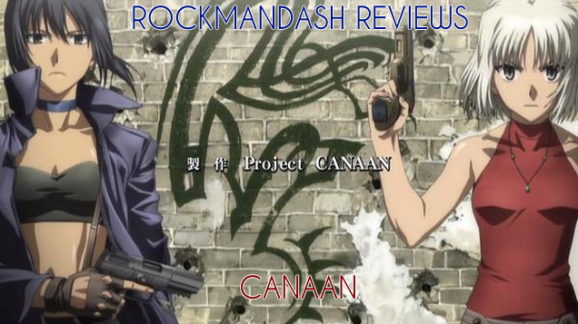
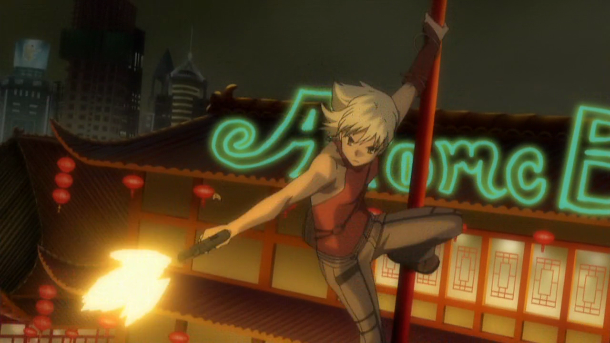
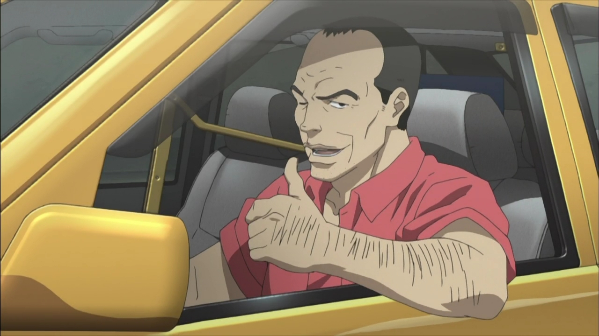
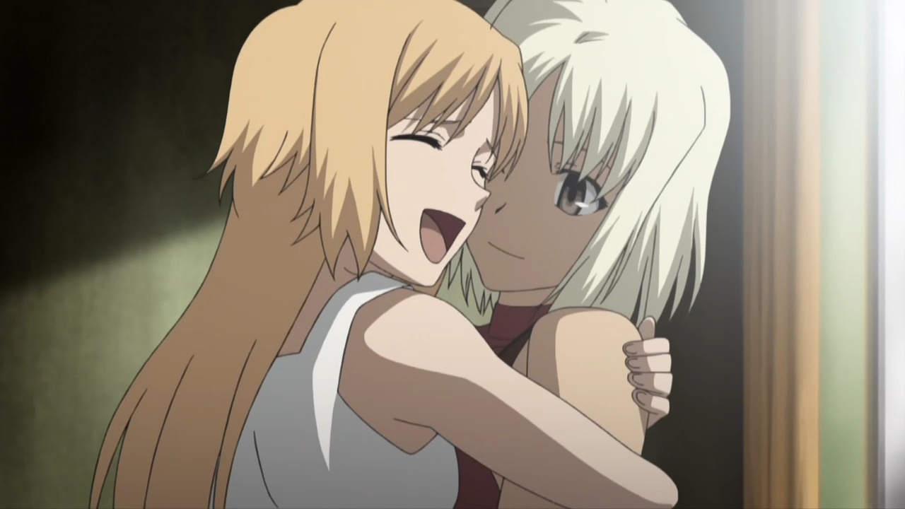
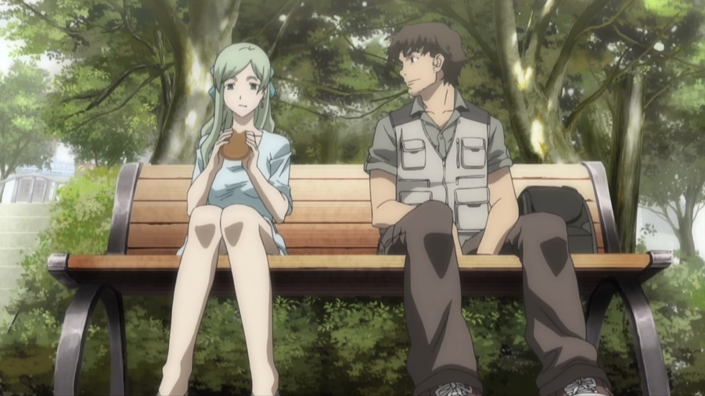
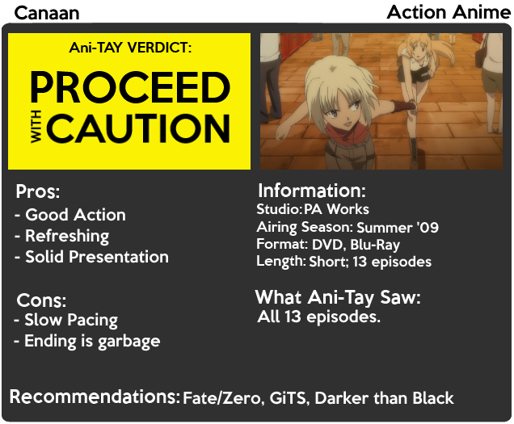

---
{
	title: "Rockmandash Reviews: Canaan [Anime]",
	published: "2014-09-01T18:00:00-04:00",
	tags: ["Rockmandash Reviews", "Canaan", "Ani-TAY", "Action", "Review"],
	kinjaArticle: true
}
---

**Refreshing (adj.): **pleasingly different and exciting. To me, this is the word that best describes my viewing of Canaan. I came into this show with little expectations: I knew it was a spinoff of a great VN known as 428: In a Blockaded Shibuya done by Type-Moon, and it seemed to be my cup of tea, but it got pretty poor reviews. Welcome to Rockmandash Reviews and Today we have my thoughts on the anime, Canaan.

The first thing that stood out to me was how interesting the premise was. The show follows Maria Osawa and Minoru Minorikawa (aka Mino) who arrive in Shanghai for a news report assignment. In Shanghai, Maria finds her friend Canaan: a mercenary with synesthesia ability who operates in the city. The three start running into dangerous situations when the terrorist group ‘The Snakes” who are ran by Alphard wrecks havoc in the city using the Ua virus: the virus from 428 that kills it’s victims within 12 hours. With the appearance of Alphard, The group try to figure out the root of the Ua virus, and on the way to that root, they learn the horrible origin story about said deadly virus.

The writing of Canaan is very much Type-Moon: it was writing full of philosophy, people’s psyche, thoughts, dreams etc. How does violence effect the mind? How does one relate to people who live a polar opposite life?What does it take to be a great person? What is real, what is an illusion? To one used to killing, how do you adjust to societal rules? These are just some of the thoughts covered in this show, and this aspect of the show was interesting and great.

Most of the show is your typical action with a slower pace than you would expect. It’s a steady yet enjoyable march through the story, similar to [Muv-Luv Alternative](http://tay.kotaku.com/rockmandash-reviews-muv-luv-extra-alternative-visua-1567978967), but this was a bad choice. Unlike Muv-Luv, who spent all that extra time fleshing out the world, this show spent it not explaining the world, premise, or the mysteries this show built, but it kept you interested with suspense. It wasn’t a progression of plot, it was trotting through the mud of what’s supposed to be a story. Don’t get me wrong there though: Individual scenes were done very well and were pretty interesting, but the connections between them were loose, and it hurt the show. The mysteries kept the show interesting, but at the latter half of the show, it essentially falls apart due to them not explaining things, or doing it very poorly. The ending is extremely anticlimactic, it leaves a lot of questions left unanswered, and the scenes in general could have been done better. The last few episodes are muddy, confusing, and in general not as enjoyable as the rest of the show. It was executed poorly, and even if you were paying attention, you wouldn’t really understand what’s going on, and at times in the end, events are happening for the sake of it. The ending was an absolute mess.

At least the time spent on the characters themselves was worth it: pretty much every character in this show is awesome and enjoyable. The most important and well developed character is Canaan, and she’s pretty similar to [Shiki Ryougi](http://tay.kotaku.com/rockmandash-reviews-kara-no-kyoukai-the-garden-of-si-1524615358), but she’s also pretty much what I wished from Kiritsugu; one with a horrible past and obvious trauma, but has a personality and is just interesting. What Canaan pulls of though... is **EVERY **character has some depth and charm because of the small cast. A great example is the taxi driver: he appears whenever the characters need a ride, and his reckless driving and eccentric personality keep you smiling whenever he’s on screen. If I had one complaint, it would be the main character, Maria.

ue to this being an action show, with Type-Moon writing, this show can get into darker tones, where characters like Canaan shine. It’s really well done, but whenever Maria appears, there’s a [mood whiplash](http://tvtropes.org/pmwiki/pmwiki.php/Main/MoodWhiplash) due to her always innocent and happy personality, and it can make scenes just less enjoyable. Unlike the Fate/stay night VN which manages to keep mood whiplash from being too big of an issue, in Canaan, it’s a big issue because it changes on a dime at unexpected times, unlike F/SN. One moment it can be a happy go lucky scene, but the next 2o minutes can be extremely dark, and this can hamper your enjoyment of a show.

The writing has it’s ups and downs. An interesting premise combined with Nasu’s writing style and solid action keeps it together, but everything that’s supposed to keep it together fails. It should be good enough to keep you interested, but it does fall apart.

#### Writing - 6.5/10

 

I have no complaints here. The action looks good, the characters are pleasing to the eye, and the world looks beautiful. It’s sharp, and it does what it wants to do. It’s solid for the time, and it hasn’t aged poorly. It doesn’t do anything really special though, and that lack of style is the difference between good and great. The only real way to describe the visuals is solid: Good, but not great.

#### Visuals - 7.5/10

The soundtrack in Canaan is hard to talk about. It has the same tones and beautiful atmospheric sounds as other Type-Moon stuff, and it definitely feels like a type moon soundtrack... but it’s not. It’s an early PA Works soundtrack and it definitely doesn’t have an impact. While Kara no Kyoukai never leaves my head, Canaan left my head as soon as I finished the episode. It does a great job at making an atmosphere, it fits the show well and it makes the mood, but as good as it is, it doesn’t do anything special. This is a soundtrack that’s better standalone, as it’s a beautiful soundtrack, but it doesn’t do much for the show. The soundtrack overall is pretty enjoyable yet forgettable, and that’s a darn shame. As for the voice over, It does the job. Miyuki Sawashiro did a stellar job with Canaan and Alphard, but other than that performance, it was just OK.

#### Sound - 7.5/10

When building expectations, I tend to categorize shows and build my expectations based on past experiences... but with such an interesting development... what do I categorize this as? Is this a Type-Moon Work, A sequel to a game I want to play but never had the opportunity to do so, or a PA Work? My expectations are all over the place with this one when I started this one.

What I got was a fun action show that screamed Type-Moon, while trying to do some things differently than other shows. Yes, the execution of the plot wasn’t that great, but I still enjoyed the action while it was there. After dealing with nothing but slice of life romances, shounen and meh mechas (not saying that any of those genres are bad, per se), seeing a serious Seinen was refreshing. It’s been so long since I’ve seen a well done Seinen, and to get this, I was happy. I miss this type of show, and I really enjoyed this ride. I enjoyed the raw action: gunshots all over the place, and cool stunts done by the characters. It wasn’t a mindblowing ride like other Type-Moon works; it was a smooth and solid ride with small touches that made it all the more enjoyable. (like Chinese people actually speaking Chinese!) I liked it for what it was, and I really hope[ stuff like this is made in the future](https://anitay.kinja.com/rockmandash-rambles-why-you-should-fund-under-the-dog-1626833454).

###### [Why You Should Fund *Under The Dog*, and What this Kickstarter Represents](https://anitay.kinja.com/rockmandash-rambles-why-you-should-fund-under-the-dog-1626833454)

When I first saw Under the Dog, I wasn't exactly sure what to think about it. I thought that it…

[Read more](https://anitay.kinja.com/rockmandash-rambles-why-you-should-fund-under-the-dog-1626833454)

#### Enjoyment - 8/10

Canaan represents an age of anime that’s past, but in it’s path to homage, it forgot to execute well. It was a nice change of pace and it was an enjoyable ride, but it’s one to enjoy not because of what it is, but because of what it represents.

## OVERALL - 7.5/10, Polarization +1, -3

 

***

**Copyright Disclaimer:** Under Title 17, Section 107 of United States Copyright law, reviews are protected under fair use. This is a review, and as such, all media used in this review is used for the sole purpose of review and commentary under the terms of fair use. All footage, music and images belong to the respective companies.

*You can see all my reviews on *[*Rockmandash Reviews*](http://tay.kotaku.com/tag/rockmandash-reviews)*. For An explanation of my review system, *[*check this out*](https://rockmandash12.kinja.com/rockmandash-rambles-an-explanation-on-my-review-system-1619265485)*.*

###### [Rockmandash Rambles: *An Explanation on my Review System* (Updated 11/15/2015)](https://rockmandash12.kinja.com/rockmandash-rambles-an-explanation-on-my-review-system-1619265485)

If you’ve read any of my reviews and wanted to know why I did them the way I do, here’s an…

[Read more](https://rockmandash12.kinja.com/rockmandash-rambles-an-explanation-on-my-review-system-1619265485)
