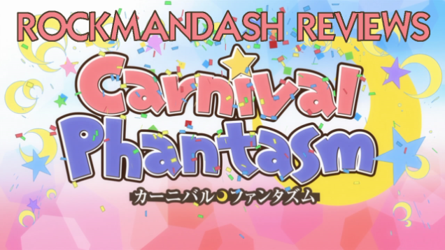
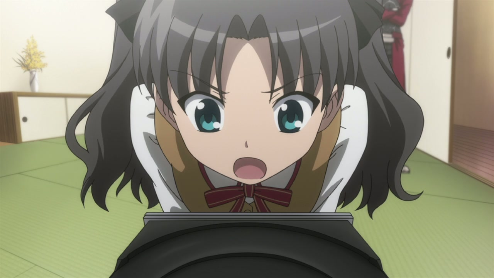
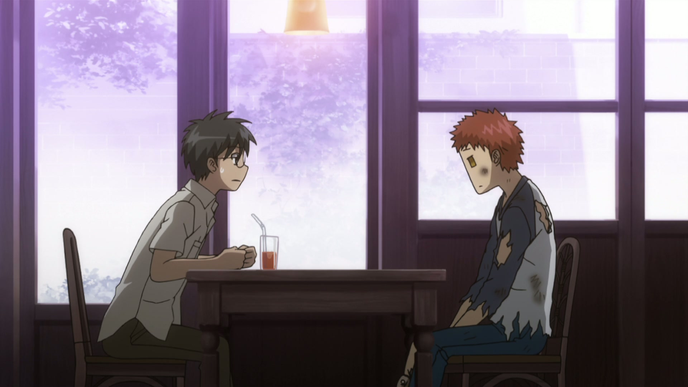
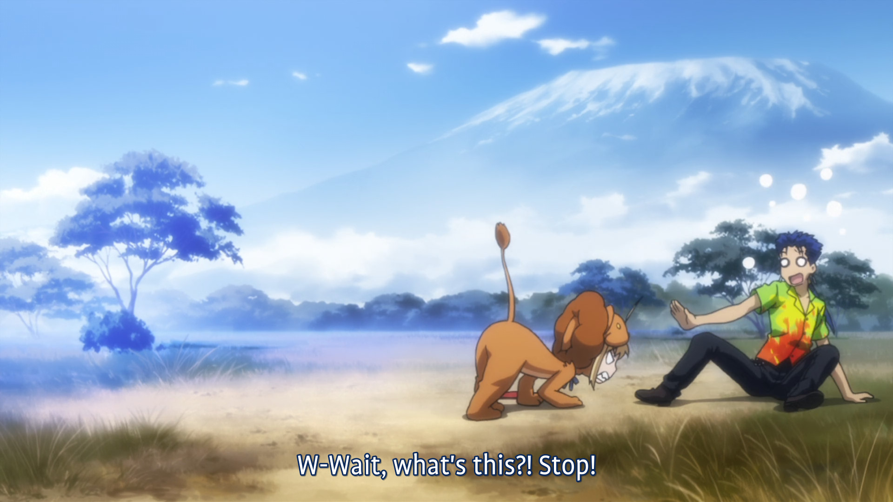
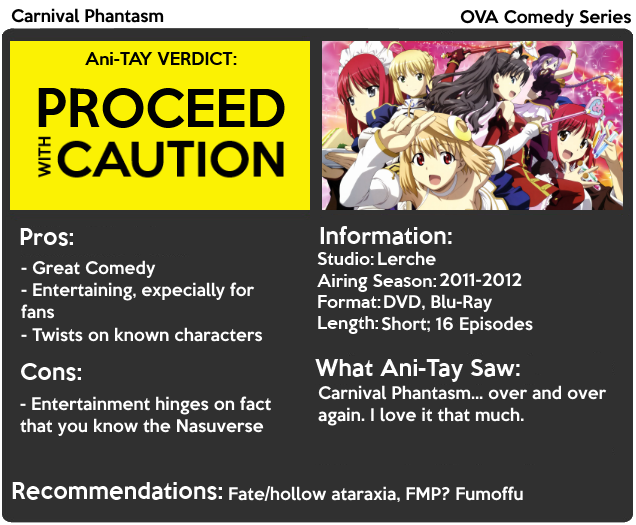

---
{
title: "Rockmandash Reviews: Carnival Phantasm [Anime]",
tags: ["rockmandash reviews", "rockmandash", "ani-tay", "reviews", "carnival phantasm", "type moon", "Type-Moon Marathon"],
authors: ['reikaze'],
published: '2014-03-17T23:09:00-04:00',
attached: [],
license: 'cc-by-4',
oldArticle: true
}
---

You know how I typically spend most of my time here talking about VN's with stellar
  stories or things of that nature? It's time to do something totally different: today on Rockmandash Reviews, we are
  going a complete 180° with an amazing show known as Carnival Phantasm. It's a weird yet hilarious <a class="sc-1out364-0 hMndXN sc-145m8ut-0 gIacKn js_link" data-ga='[["Embedded Url","External link","https://rockmandash12.kinja.com/type-moon-marathon-wip-1534726534",{"metric25":1}]]' href="https://rockmandash12.kinja.com/type-moon-marathon-wip-1534726534" rel="noopener noreferrer" target="_blank">Type-Moon</a>
  crossover comedy OVA animated by Studio Lerche, and it's probably my favorite comedy out there.

<iframe allow="accelerometer; autoplay; clipboard-write; encrypted-media; gyroscope; picture-in-picture" allowfullscreen="" frameborder="0" height="315" src="https://www.youtube.com/embed/uvbaM-URygs" width="560"></iframe>

 In any show, the
  opening is a first impression that shapes how the viewer thinks of the show. This opening, is spectacular influencing
  your opinion. It's one of my favorite OP's and it perfectly sets the tone for the show with it's cheery, catchy as
  hell song and ridiculous antics. It's one of the most notable parts of this OVA series, and it's fantastic. It's quite
  insane, with insane antics, silly dances, and a ridiculously high level of excitement that you can't help but
  mention.

<h4 class="sc-1bwb26k-1 fvCjqJ" id="h110305">Opening - 9/10</h4>

 As a comedy, it's sole purpose was to entertain. How did it do? FANTASTIC. I'm not going
  to lie, writing this review was an excuse to watch Carnival Phantasm. I re-watch Carnival Phantasm on a regular basis,
  because I love Carnival Phantasm. It's my go to comedy show when I'm in the dumps. It's just fantastic seeing all my
  favorite characters interacting with characters they never would have interacted with in the first place, or watch
  <a class="sc-1out364-0 hMndXN sc-145m8ut-0 gIacKn js_link" data-ga='[["Embedded Url","External link","http://tvtropes.org/pmwiki/pmwiki.php/Main/HilarityEnsues",{"metric25":1}]]' href="http://tvtropes.org/pmwiki/pmwiki.php/Main/HilarityEnsues" rel="noopener noreferrer" target="_blank">hilarity ensue</a>.
  This show is quite silly, and when I say silly, I mean really silly. There are many skits in this that I adore, like
  instead of F/SN characters battling it out in a brawl, they go racing with hilarious references everywhere, or seeing
  Rin Tohsaka epicly fail at trying to record an episode on a Blu-Ray player. <strong>One big thing that will affect
    your enjoyment is the fact that Carnival Phantasm is not a comedy series you can just jump into; It's necessary to
    know about Fate Stay Night and Tsukihime, and you need knowledge of Melty Blood, F/SN, Tsukihime and the fan disks
    to fully enjoy this series. </strong>The more you know about Type-Moon, the better it is. If you haven't seen
  anything type moon, I'm afraid that you wouldn't find it too entertaining, but if you haven't, why are you interested
  in this? It's a very enjoyable show, depending on who you are.

<h4 class="sc-1bwb26k-1 fvCjqJ" id="h110306"><strong>Enjoyment -
  10/10</strong></h4>

Carnival Phantasm is a nice and needed break from KnK and Fate Zero. This show is a
  complete 180 from the dark series Type-Moon does; CP is one of the most light hearted anime I've ever seen. There is
  no plot, it's 100% completely comedy in the form of short skits. It's very similar to how Full Metal Panic had the
  Fumoffu OVA season which was amazing, yet season 2 was all serious. The fact that there is no overarching story in
  Carnival Phantasm means that the essentially spend the whole time making fun of the series, and it's done very well:
  most of the jokes are hilarious, and the situations the characters get in are great. All the characters in Carnival
  phantasm are parodied and exaggerated versions of themselves, like how Saber loves food, and Lancer's incredibly bad
  luck. It's a great way of extracting humor out of series that typically are pretty dark, and it makes the characters
  very enjoyable. The writing is great for what it needs; a no frills, hilarious comedy.

<h4 class="sc-1bwb26k-1 fvCjqJ" id="h110307">Writing - 9/10</h4>

As a comedy series, they didn't really go overboard on budget, so the show is
  just average. Everything has a cute look to it, which is awesome and great but it doesn't stand out that much. It's
  miles better than what Studio Deen *sigh* did, but it can't really hold a candle to Ufotable's visuals. One thing that
  made me happy was finally being able to see the <a class="sc-1out364-0 hMndXN sc-145m8ut-0 gIacKn js_link" data-ga='[["Embedded Url","External link","http://angryfreak.files.wordpress.com/2009/06/hisuisays.jpg",{"metric25":1}]]' href="http://angryfreak.files.wordpress.com/2009/06/hisuisays.jpg" rel="noopener noreferrer" target="_blank">Tsukihime characters in an anime, and they were done pretty well</a>.
  I'm pretty happy that they were done very well the very first time they were animated. Carnival Phantasm's visuals get
  the job done, in a very cute way, yet manage not to stray away from the source material. 

<h4 class="sc-1bwb26k-1 fvCjqJ" id="h110308">Visuals - 7.5/10</h4>

 As this is a comedy series and most of Type-Moon stuff is not, a good majority of
  the sound track is original, with a few pieces re-used from the existing shows. A good majority of the stuff is catchy
  and cheery, and while it's enjoyable, there's nothing special about it. It's used well in the show, but it's not an
  amazing listen standalone. All of the voice actors return, so you are getting what you are expecting voice wise,
  nothing different. There's not too much to say about the sound in carnival phantasm, it does it's job.

<iframe allow="accelerometer; autoplay; clipboard-write; encrypted-media; gyroscope; picture-in-picture" allowfullscreen="" frameborder="0" height="315" src="https://www.youtube.com/embed/DcLu34MKrPI" width="560"></iframe>
<h4 class="sc-1bwb26k-1 fvCjqJ" id="h110309">Sound - 7/10</h4>

 Carnival Phantasm is one of my personal favorite comedy shows. Personally, I loved
  it, but your mileage may vary. This show is very dependent on whether you have read F/SN &amp; Tsukihime, and it will
  change how you like the show. If you have experienced those two, it's a must watch. 
<h2 class="sc-1bwb26k-1 fvCjqJ" id="h110310">OVERALL - 9/10, Polarization +.5,-1.5
</h2>

<strong>Copyright Disclaimer:</strong> Under Title 17, Section
  107 of United States Copyright law, reviews are protected under fair use. This is a review, and as such, all media
  used in this review is used for the sole purpose of review and commentary under the terms of fair use. All footage,
  music and images belong to the respective companies. 

<em>You can see all my reviews on </em><a class="sc-1out364-0 hMndXN sc-145m8ut-0 gIacKn js_link" data-ga='[["Embedded Url","Internal link","http://tay.kotaku.com/tag/rockmandash-reviews",{"metric25":1}]]' href="http://tay.kotaku.com/tag/rockmandash-reviews"><em>Rockmandash Reviews</em></a><em>, and the rest of
  my </em><a class="sc-1out364-0 hMndXN sc-145m8ut-0 gIacKn js_link" data-ga='[["Embedded Url","External link","https://rockmandash12.kinja.com/type-moon-marathon-wip-1534726534",{"metric25":1}]]' href="https://rockmandash12.kinja.com/type-moon-marathon-wip-1534726534" rel="noopener noreferrer" target="_blank"><em>Type-Moon Marathon here</em></a><em>. For An explanation of my
  review system, </em><a class="sc-1out364-0 hMndXN sc-145m8ut-0 gIacKn js_link" data-ga='[["Embedded Url","Internal link","http://tay.kotaku.com/rockmandash-rambles-an-explanation-on-my-review-system-1619265485",{"metric25":1}]]' href="http://tay.kotaku.com/rockmandash-rambles-an-explanation-on-my-review-system-1619265485"><em>check this out</em></a><em>. </em>

<aside class="sc-1rh3ayr-6 jfFNjl inset--story branded-item branded-item--kinja" data-commerce-source="inset">

<a class="sc-1out364-0 hMndXN js_link" data-ga='[["Permalink page click","Permalink page click - inset headline"]]' href="https://rockmandash12.kinja.com/type-moon-marathon-wip-1534726534" rel="noopener noreferrer" target="_blank"><h6 class="sc-1rh3ayr-3 jRIPES">
    Rockmandash Reviews: <i>Type-Moon Marathon</i></h6></a>

In preparation for the Fate/stay night: Unlimited Blade Works Adaptation by Ufotable,
      I decided to…
<a class="sc-1out364-0 hMndXN sc-1rh3ayr-0 kOvmIi js_readmore inset--story__readmore js_link" data-ga='[["Permalink page click","Permalink page click - inset read more link"]]' href="https://rockmandash12.kinja.com/type-moon-marathon-wip-1534726534" rel="noopener noreferrer" target="_blank">Read more</a>

</aside>

EDIT: On 9/10/14, I did some editing in this review and changed the end card. The
  review is slightly different than how it originally was, but it's not a major change.

