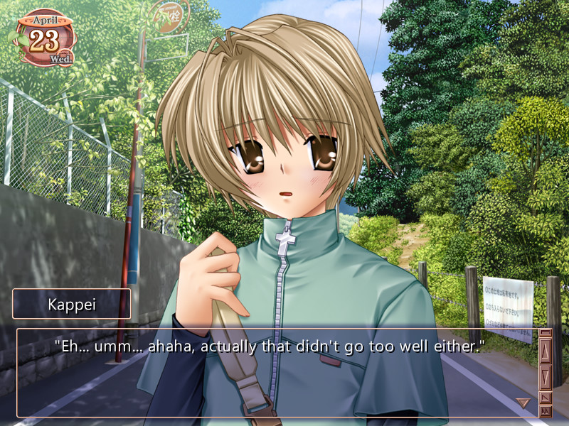
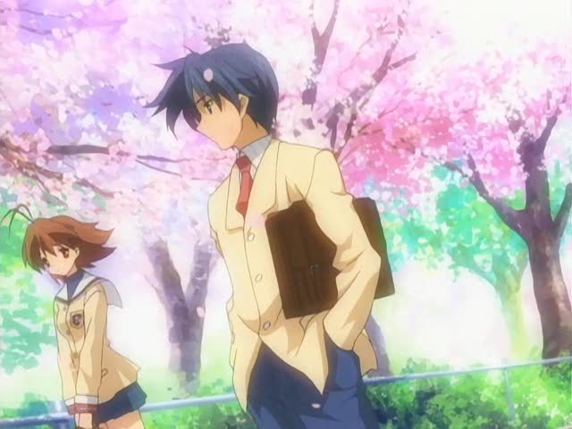
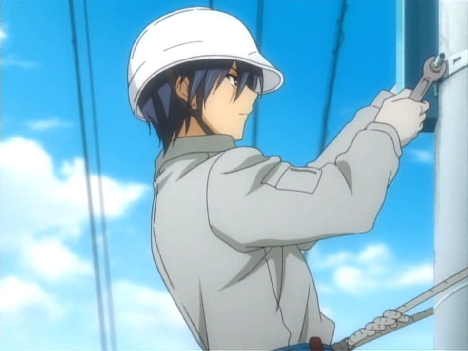
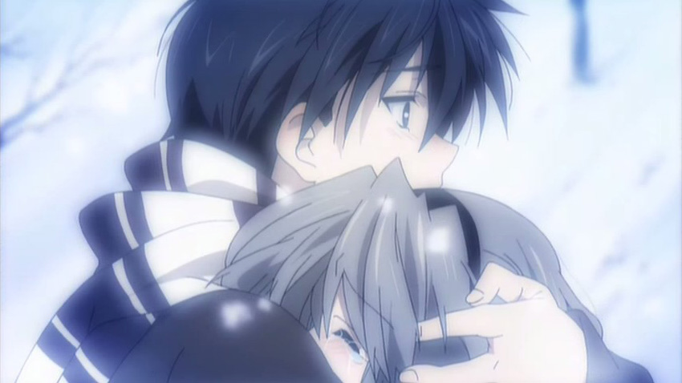
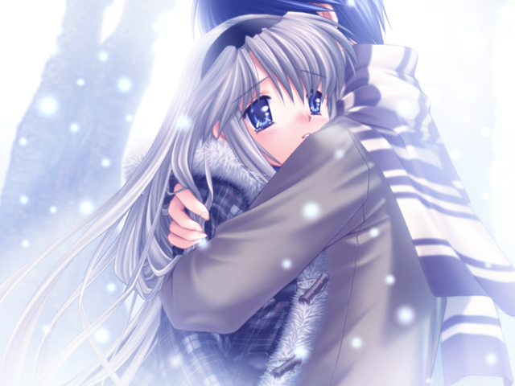
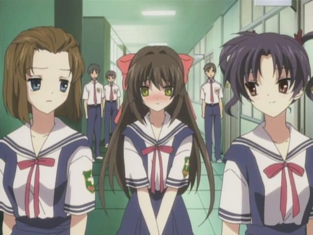
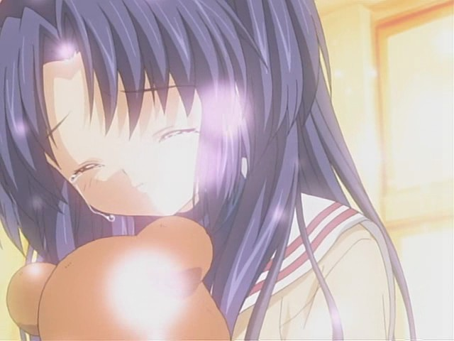

---
{
	title: "Rockmandash Reviews: Clannad [Visual Novel & Anime]",
	published: "2014-08-25T18:00:00-04:00",
	tags: ["Rockmandash Reviews", "Ani-TAY", "Tay Classic", "Key Marathon", "Rockmandash12", "Clannad", "Review", "Visual Novel", "Anime"],
	kinjaArticle: true
}
---

It’s only once in a blue moon that you’ll run into a story that fundamentally changes who you are. *Clannad* is a show that changed how I viewed the world, and how I treat others. I love it for what it did, and for what it is, and it’ll always hold a special place in my heart. Welcome to Rockmandash Reviews, and today in this [Key Marathon](https://tay.kinja.com/rockmandash-reviews-key-marathon-wip-1606707641), we have one of my favorite series: *Clannad*.

Before we get started talking about the plot and such, I want to get the differences between the Visual Novel and Anime (*Clannad* + *After Story*) out of the way, as most people will have probably seen the anime, and if not, comparing the two would help make your decision on which one you should check out. Due to the Visual Novel genre’s habit of branching out into different paths, KyoAni had to do some story manipulation to make that all of the routes fit into a single story. The adaptations for the arcs are integrated seamlessly for the most part, but there are some arcs that get axed because they simply do not work (Kyou’s and Tomoyo’s, but they each have an OVA episode), and one gets randomly cut for no reason (Kappei’s, probably because it doesn’t really add much, but it was still entertaining). As for the story, there’s simply no beating the full routes, especially if you are a fan of other characters, but it’s integrated well and Nagisa being there can improve the experience. No matter which version you try, you’ll still get the same core story because *Clannad* is just a solid adaptation. The biggest difference is the structure, and it’s really personal preference; do you prefer the branching paths, or do you prefer a seamless story? Do you prefer reading it, or do you prefer watching it? However, the VN does a much better job at explaining the ending, but if you are a keen viewer, you should be able to piece it out. I prefer the VN for a first time experience as it has more content and explains the story better, but the anime for all subsequent experiences, because it’s a better experience with better pacing and more seamless storytelling.

As for Visuals, I’m giving this one to KyoAni, which I’ll elaborate on later. The sound is pretty much the same excellent stuff, so no difference here. Overall, I don’t think that one version is particularly better than the other as they are both done very well, but they are executed a bit differently. If you’ve seen one, you’re not missing out on too much, so don’t worry.

The writing is amazing. Every step of the way is extremely well done, and is extremely enjoyable to re-experience. *Clannad *has a story with a great message, the character development is probably the best I’ve ever seen in a story, the pacing is not too fast or too slow for what it’s trying to do, and the emotions that this story extracts out of you are just unbelievable.

The story follows Okazaki Tomoya, our snarky delinquent protagonist who you can’t help but love. He’s had a distant relationship with his father since they got into a fight and his father injured his shoulder. One day, on his way to school, he runs into a klutzy and weird girl named Nagisa Furukawa, and as the two of them begin hanging out, Tomoya’s life begins to shift in a new direction. If you didn’t know, *Clannad *is a very character driven show with a stellar cast. While many of them are quite trope-y, it’s almost a non-issue due to Key’s charm. Every character has their own respective role which they excel at and because of this, they are very enjoyable. From Sunohara, the greatest butt monkey in existence, to Kyou, one of the best tsunderes you will ever see, we have a cast that’s absolutely brilliant. The characters are awesome, and I hope you will love them as much as I did.

Where *Clannad* really shines is when it goes over the personalities, back-stories, and interactions of the characters. *Clannad* is (in?)famous for making you cry, and that reputation is well earned due to it being the best example of the Key formula: Getting to know the characters and developing them in a happy, slice of life manner, then throwing a curve-ball on that situation, leading to tension and emotion, then having a happy resolution. I find that a quote from Tomoya describes this very well:

> “given happiness, then having it snatched away.”

As you watch the show or play the visual novel, you’ll get attached to the characters due to the amazing character development. These are characters dealing with real issues, and you’ll be able to relate to them. They run into hilarious scenes with well written comedy, so you are kept entertained. They are characters with interesting interactions with others, and with interesting personalities. *Clannad* builds them up so well..... then throws a curve-ball to the situation to create drama and tension, which is done equally as well. These scenarios are well written with great pacing, interesting back-stories and moving themes; no matter how many times they pull off the formula in the show, the impact doesn’t really lessen. The reactions, personal monologues, and dilemmas of the characters show development. This development is something that I really appreciate, and it makes *Clannad *stand out. The pacing is fantastic, enough for each character without feeling dragged out or rushed. Even though it may be slower paced than what some people want, it’s an enjoyable ride. The themes of family, bonds, friendships, relationships, etc. have a lot of impact, and they just make this show something special, something that is memorable, something that is amazing. They all add up to a very moving and excellent package that you will enjoy, and if you are like most people, you will cry. You will feel ALL THE FEELS!... unless your heart is a stone.

Also, I need to touch up on how great After Story is here. After Story is the second half of Nagisa’s route in the VN and the second season of anime, and it’s just amazing. It reinforces the theme of family like it’s an iron gate, it has so much emotions that it’s ridiculous, it goes through the back stories of Tomoya extremely well, and the best part is... IT’S OUTSIDE OF HIGH SCHOOL! One of the biggest complaints with most romance anime is that they spend the whole show building up to a relationship, and being stuck in high school. *Clannad* has the full relationship; marriage, having a child, etc. and it’s so nice to see all of these points of development with the main characters I love, and to see other characters’s changes due to time. I would love it if every series went this far in a relationship, but of course, that cannot be the case. It’s refreshing, epic, and it helps making the series memorable.

Overall, *Clannad* is a great slice of life romance drama thing with excellent character development and an amazing story. It’s a story that is memorable, and is so good that I keep coming back to it.

#### Writing 10/10

 

KyoAni did an amazing job with the visuals; it still looks great 7 years later. Visually, the anime improves upon the VN in every way: it has more depth to the scenery, it makes the characters more anatomically correct and pleasing to the eye, and has nice touches that make it shine. The best part about the visuals has to be the scenery: it looks aesthetically pleasing, beautiful, and helps make the tone of the show. The characters are also aesthetically pleasing, with their expressions shown well. The lighting and atmosphere were great as they worked well to make the show match the mood of the story and the music, and the visuals have a style and design that just make the show look great. Also, the animation gets a boost during the Robot sections; I can’t help but wonder how they nailed CG, when everybody was struggling with it. In my opinion, this is one of the most beautiful slice of life shows.

The VN’s visuals haven’t aged nearly as well due to the more complicated aesthetics that just aren’t as aesthetically pleasing. They are less consistent in quality, and the art doesn’t show nearly as much emotion. It’s still enjoyable and it shouldn’t ruin your experience, but it has aged.

That being said, even the anime hasn’t aged perfectly and there are elements where modern shows just blow it away. The scenery, while great, has been superseded by stuff like [Nagi no Asukara](http://tay.kotaku.com/rockmandash-reviews-nagi-no-asukara-anime-1567969970), and the character design, while leagues better than the VN, isn’t everyone’s favorite. The moe art style may detract for some, but I don’t mind it. Overall, *Clannad *is a good looking show that still looks good today.

#### Visuals - 8/10

It’s Key... do I even have to say it at this point? It’s **OUTSTANDING**. If you had to ask me what my favorite soundtrack is... this one would probably be mentioned, as I loved every bit of it. In my check-mark list of what a great soundtrack is for an anime or a visual novel, a soundtrack has to have music that is pleasing to listen to, creates the mood and atmosphere, and has to have enough variety and quantity so you never get tired of listening to the tracks. *Clannad* aces all of the above, and has something I normally never really consider when thinking about sound in a show: synergy. Jun Maeda just blew me away with this one: the songs match the tone of the writing extremely well, and the synergy pushes the soundtrack from great to perfect. There’s something about this soundtrack that just strikes a cord, no matter the tone. The soundtrack makes the slice of life even more entertaining than it would have, and it makes a huge impact when it comes to the scenes with lots of tension. It’s a really great soundtrack that’s full of well done songs, and a wide variety of them too. Likewise, the voice acting is top notch, as the voices really fit the personalities of the characters, which really helps the experience. The Dub, not so much, as some just don’t fit with what the characters represent. It’s not that pleasing to the ear, but it’s not the worst I’ve heard.

#### Sound (Subbed) - 10/10

#### Sound (Dubbed) - 7/10

 

When I first experienced *Clannad*, I wasn’t just watching a show or playing a game. I experienced a part of life that I acknowledged, but never really thought about. When I first experienced *Clannad* during the summer before the sophomore year of high school, I was an arrogant person that equated scholarly and economic success with being happy and good, even though I was depressed due to bullying and a horrible relationship with my family. *Clannad* shook my world and my viewpoint of it. It showed me that school wasn’t everything. It showed me a viewpoint that I never would have appreciated in the past, and fundamentally changed how I looked at the world. It helped me get out of that depression by being nice to people and realizing that, just like me, everyone’s suffering issues no matter how differently they live. It showed me that that people, no matter the ambitions, can live a happy life. *Clannad* showed the strength of family, and the weaknesses of it at the same life. It’s a story that anybody can relate to, even if you are nothing like the main character. It showed a simple yet happy life, it showed that everyone has issues they need to learn from. Put simply, I wouldn’t be writing this without *Clannad*, and it changed who I was for the better.

It was an amazing experience: a roller coaster of emotions ranging from happy to sad, from laughing to crying. *Clannad* is quite possibly the most moving story I’ve ever read. It has entertaining comedy combined with some of the best slice of life, one of the best soundtracks you will ever hear, and KyoAni art which helps to create a dynamic you really can’t beat. This show, is something I love and it holds a special place in my heart. Yes, it may not be perfect because it’s set in a high school, has some pandering, has dull moments at times and older art are that people may find an offence to their definition of anime, but it has a charm that is rarely matched and that’s what makes it special. Every time I watch it, I’m reminded of who I was, I’m reminded of my experience I had watching it, and I get to feel the whole gambit of emotions, all over again. *Clannad* is something that I love, and it’s something I hope you will too.

If you haven’t gotten it yet, I’m a *Clannad* fanboy, and I think it’s amazing. I adore it with a passion, and I hope you liked it just as much as I did.

### Overall - 9.5/10, Polarization - 2

 

***

**Copyright Disclaimer:** Under Title 17, Section 107 of United States Copyright law, reviews are protected under fair use. This is a review, and as such, all media used in this review is used for the sole purpose of review and commentary under the terms of fair use. All footage, music and images belong to the respective companies.

*You can see all my reviews on *[*Rockmandash Reviews*](http://tay.kotaku.com/tag/rockmandash-reviews)*, and the rest of my *[*Key Marathon*](https://tay.kinja.com/rockmandash-reviews-key-marathon-wip-1606707641)[* Here*](https://tay.kinja.com/rockmandash-reviews-key-marathon-wip-1606707641)*. For An explanation of my review system, *[*check this out*](https://rockmandash12.kinja.com/rockmandash-rambles-an-explanation-on-my-review-system-1619265485)*.*

***

*This game is available on *[*Fuwanovel *](http://fuwanovel.org/novels/clannad)*for download, but it should be coming down in the future because we are getting an OFFICIAL English release!!! So excited!*

*Also, big thanks to Protonstorm for helping out with the grammar and proof-reading of this review. I really appreciate it.*

