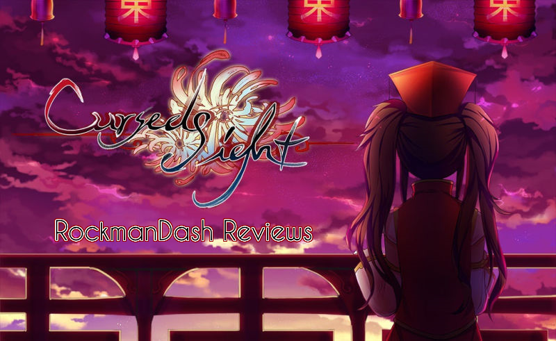
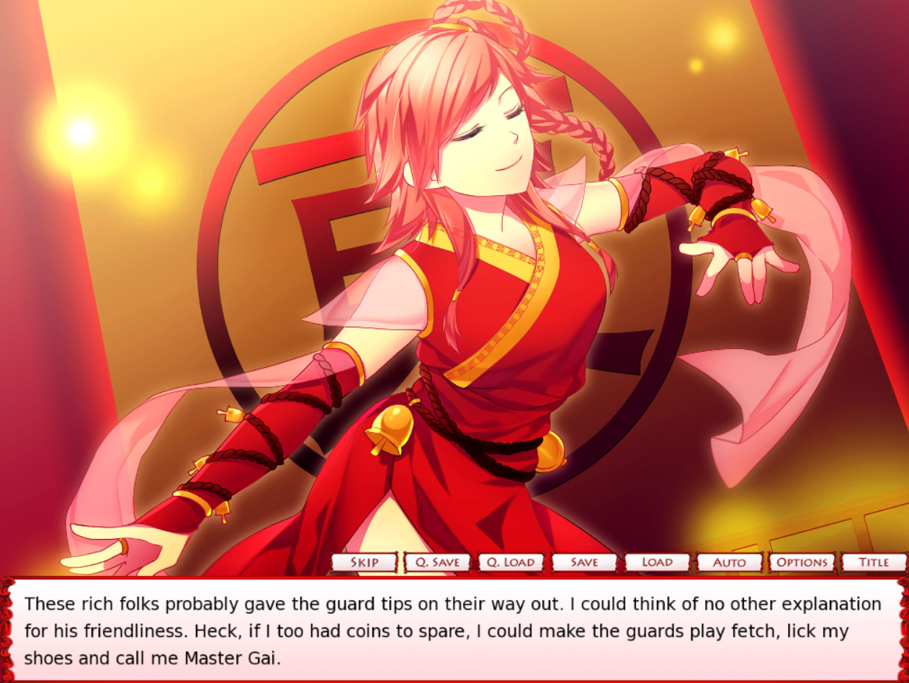
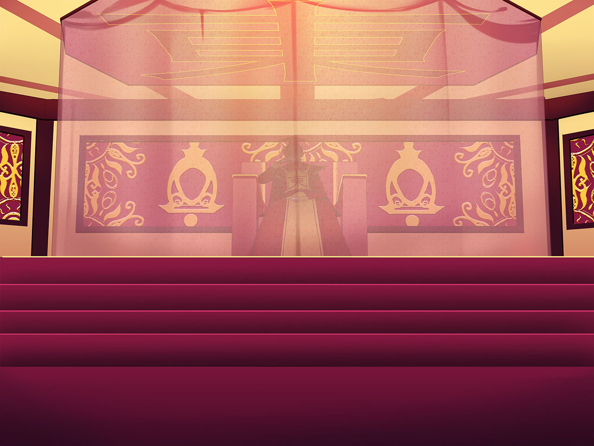
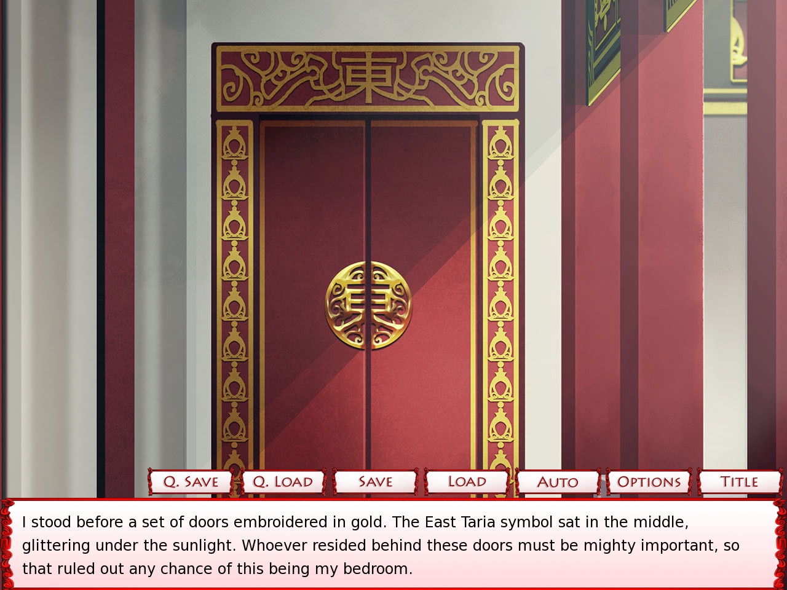
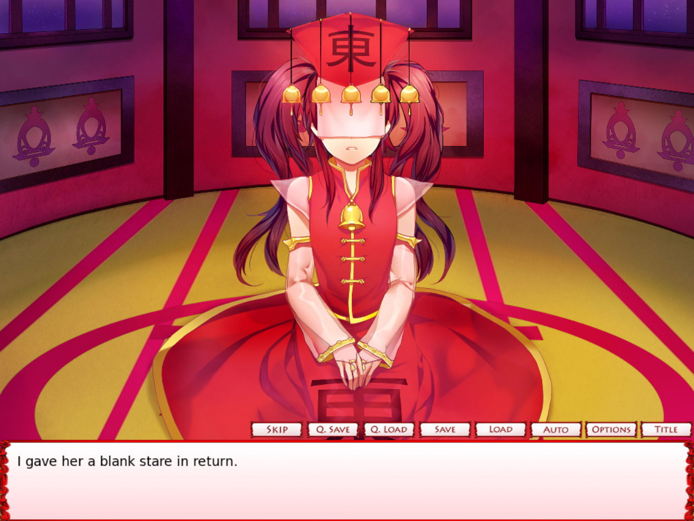
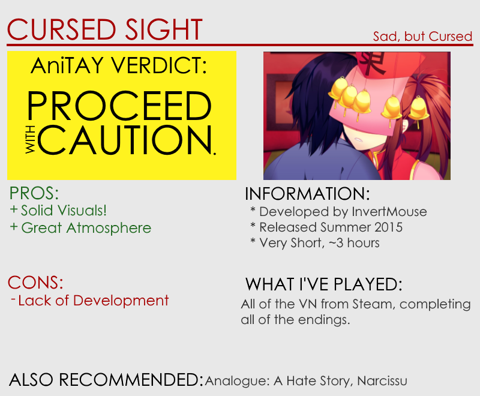

---
{
  title: "RockmanDash Reviews: Cursed Sight [Visual Novel]",
  tags:
    [
      "Rockmandash Reviews",
      "FuwaReviews",
      "Sekai Project",
      "Cursed Sight",
      "Visual Novels",
    ],
  published: "2015-11-06T19:30:00-05:00",
  attached: [],
  license: "cc-by-4",
  oldArticle: true,
}
---

There’s something rather interesting to see (or rather, not see) when it comes to deeper
  and darker stories. <em>Cursed Sight </em>is a Visual Novel that looks upon those concepts as it focuses on those who
  are cursed, from one with the curse of killing those with one look and the duty of controlling fate, to those being
  stuck with some absolutely horrible circumstances in life. That being said, the question must be asked: How does indie
  developer InvertMouse handle this story, leaving it cursed forever, or lifting it to greatness? Let’s find out in this
  review.

Before we start this review, I have to preface this by saying that I’m rather guilty
  of ignoring OELVNs (Original English Language Visual Novel), usually passing it up for something made in Japan. This
  isn’t necessarily because I don’t like OELVNs, but because OELVNs are usually lower quality so I never really had much
  interest picking one up. That being said, there are always exceptions to the rules, and InvertMouse is always a dev
  that has peaked my interest with great visuals that buck the trend of poor quality art. I’ve seen these works and have
  always been curious about it, but I never really actually played through any of the works, so when that said developer
  has contacted me and asked me to review it, I kinda had to do it, to stop the streak of me ignoring these works, and
  not doing these reviews. (Also, because I mentioned it, a disclaimer: I did get this game from the devs, but this
  review was not paid or influenced in any way.) Time to move on to the review!

When I first saw this game, I was quite intrigued about it because of how the
game looked, how it stood out from the crowd. This may be because I’m not all that familiar with OELVNs, but a good
majority of them just don’t look that great, ranging from good to absolutely atrocious. <em>Cursed Sight </em>however,
contrary to the name, is an exception to this trend, with the visuals being the highlight of the VN in my opinion.
With detailed character art that looks fantastic, a unique and interesting world that distance itself from the crowd
with it’s own personality, and a cohesive design that blends everything well to make a great atmosphere, this work
looks pretty great. Everything about the visuals work well together to make a nice aesthetic and I really appreciated
the attention of detail put into this VN throughout (my favorite touch has to be the changing of the font in specific
situations XD).

I do have one complaint though, which you may see as a nitpick: while not 800x600,
  it’s in a 4:3 aspect ratio, which is kinda recredulous to me given the world we live in. It’s 2015, and nearly
  everyone has a widescreen 16:9 monitor, meaning that there’s some serious letter boxing on this game for most people.
  I’m sure most people don’t care, but it’s something that can hinder your experience and if you asked me, leaving it at
  4:3 really isn’t acceptable, so i’ll mention it. Other than that though, no real complaints.

<iframe allow="accelerometer; autoplay; clipboard-write; encrypted-media; gyroscope; picture-in-picture" allowfullscreen="" frameborder="0" height="315" src="https://www.youtube.com/embed/0xjqwBZVc5Q" width="560"></iframe>

On the flip side of the presentation, there’s not much to say. While solid, the soundtrack
  in <em>Cursed Sight </em>for most part doesn’t draw attention to itself, keeping itself hidden in the background. It’s
  not bad, as no song got tiring to listen to and some of the tracks are actually pretty enjoyable, but it’s entirely
  forgettable, and if you’re not specifically looking for it, you probably won’t notice it. The usage of sound track was
  solid as well, with some tracks timed rather well, and others, not so much, but overall it was OK. I usually don’t
  touch on it, but the sound effects and other audio cues were a nice touch. Some may find the lack of voice acting a
  bummer, but I didn’t really mind. Overall though, the soundtrack was good but entirely forgettable.

<em>Cursed Sight </em>is one of those games in which the story isn’t so much about
  the premise, it’s about the characters, a focus which is emphasized by it’s slice of life nature of storytelling. The
  gist of the main premise is that two nations, East Taria and West Taria are fighting in a war because of issues
  relating about their “treasures”, but like I mentioned before, this story focuses on who are cursed. It has an
  emphasis on 2 characters, our MC Gai and the main heroine Miyon, living their lives in the Temple/Palace of East
  Taria. That being said, even though it focuses on characters with it’s slice of life story, it’s not an approach that
  automatically makes one care for the characters, and I’m pretty lukewarm about most of them. 

The big issue here with the writing is that it’s paced too fast. While the characters and
  writing itself is rather solid and interesting, with unique traits that get you interested in the characters, and
  solid writing to the point that it never feels amateurish, it’s just paced too fast, moving before you notice what
  happened. Almost everything about the story of the game could have benefited from being fleshed out more, like the
  main character’s backstory, and elements like the choices. The game’s rather short too, so while it was powerful given
  what it was, it could have used a bit more development. This is a VN, after all.

The lack of development affects all aspects of the work: It’s the essence of
execution. You can have a masterful story to tell, but if you tell it poorly, then it won’t be a great experience. It
throws your sense of time completely out of whack, which is made worse given it’s time jump in the story, and it makes
events feel illogical, leaving the reader to wonder why an event happened, a big suspension of disbelief breaker.
Along with that the choices: while the story is linear throughout a large portion of the game, you have a few
selections near the end of the game and the way the story branches feel artificial, splitting up characters for the
sake of doing so, and the resulting events feel like they to have little or nothing to do with your decisions. 

It’s also rather noticeable because of the slice of life execution, something I
  didn’t care for that much because it lead the writing to be a bit lost. <em>Cursed Sight </em>isn’t really a tight and
  focused story at times as it doesn’t have a real objective for large portions of the story and uses the day to day
  events as a crutch, something that is rather disappointing to see, but isn’t necessarily the end of the world. The
  game nails the atmosphere of the story, it has characters that are engaging and interesting, it has plot lines that
  could have been great, and it has a setting that was pretty good, but a rushed execution means it’s a story that’s
  only good instead of a story that while it could have been great. Kinda disappointing, but it leaves promise for the
  next attempt. 

The sentiment that it’s disappointing to see can extend to the whole game in
  general, as the game nails a lot right, and even though I have decent amount of criticism of the story, in no way am I
  saying it’s bad... it’s just disappointing because it could have been better. <em>Cursed Sight,</em> while triumphing
  over the curse of subpar Aesthetics for OELVNs, tumbles over writing issues that keep the game from greatness. If
  you’re in the mood for a sadder story that has good visuals and decent characters, or if you just feel like supporting
  the community, it’s a good time, but if not, look elsewhere.
<h3 class="sc-1bwb26k-1 fvCjqJ" id="h109011">Overall - 7/10, Polarization + 1, -1</h3>

<strong><em>Disclaimer: </em></strong><em>This copy of the
  game was provided by InvertMouse for the purpose of review. Also, Under Title 17, Section 107 of United States
  Copyright law, reviews are protected under fair use. This is a review, and as such, all media used in this review is
  used for the sole purpose of review and commentary under the terms of fair use. All footage, music and images belong
  to the respective companies.</em> 

<em>You can see all my reviews on </em><a class="sc-1out364-0 hMndXN sc-145m8ut-0 gIacKn js_link" data-ga='[["Embedded Url","Internal link","http://tay.kotaku.com/tag/rockmandash-reviews",{"metric25":1}]]' href="http://tay.kotaku.com/tag/rockmandash-reviews"><em>Rockmandash Reviews</em></a><em>. For an explanation
  of my review system, </em><a class="sc-1out364-0 hMndXN sc-145m8ut-0 gIacKn js_link" data-ga='[["Embedded Url","Internal link","http://tay.kotaku.com/rockmandash-rambles-an-explanation-on-my-review-system-1619265485#_ga=1.205141205.473183827.1418699279",{"metric25":1}]]' href="http://tay.kotaku.com/rockmandash-rambles-an-explanation-on-my-review-system-1619265485#_ga=1.205141205.473183827.1418699279"><em>check this out</em></a><em>.</em>

