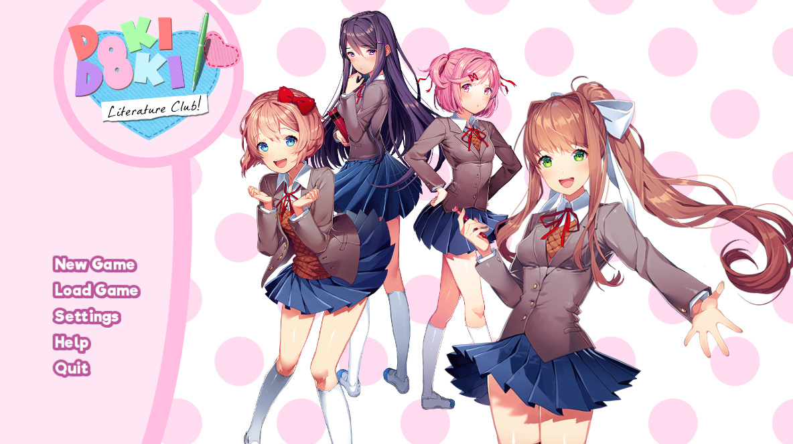
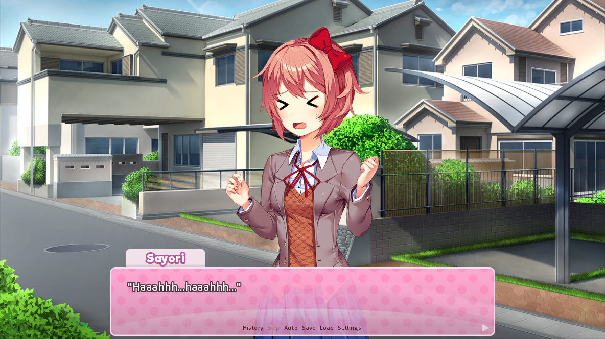
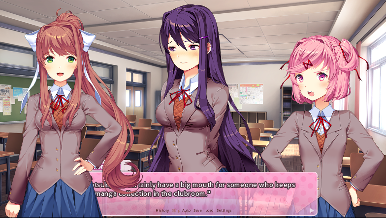
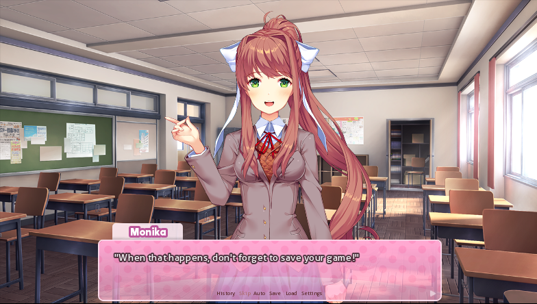

---
{
  title: "RockmanDash Reviews: Doki Doki Literature Club",
  tags: ["RockmanDash Reviews", "Doki Doki Literature Club"],
  published: "2017-10-06T11:31:51-04:00",
  attached: [],
  kinjaArticle: true,
}
---

I’m sure you’re looking at that picture and the name of the title and wondering
  why exactly am I reviewing this game, or why in the world you should care about it. It’s easy to judge something by
  it’s appearances, but to truly understand what makes something tick, one needs more than a cursory glance at a game.
  Welcome to <em>Doki Doki Literature Club</em>, the 2 year labor of love by Team Salvato that is more than it initially
  appears to be, a work that tears apart the structure of visual novels and turns genre conventions on its head.  
  Before you read this review, I encourage you to go to <a class="sc-1out364-0 hMndXN sc-145m8ut-0 gIacKn js_link" data-ga='[["Embedded Url","External link","http://ddlc.moe/",{"metric25":1}]]' href="http://ddlc.moe/" rel="noopener noreferrer" target="_blank"><em>DDLC</em>’s site</a>, download the game
  and play it, as <em>DDLC </em>is a rather short but sweet free to play Visual Novel. This is also the true start of
  <em>DDLC</em> in my opinion, as this game is all about expectations, and here it sets your expectations on the game
  itself.

<em>Doki Doki Literature Club </em>starts off exactly as you expect something
  with the name <em>Doki Doki Literature Club</em> to start. Your childhood friend Sayori ropes you into joining your
  school’s literature club, where you soon meet the other characters in the cast: Natsuki, the simple, pink haired manga
  fan, Yuri, the complex but quiet book enthusiast, and Monika, the club president that’s seemingly out of your league.
  <em>DDLC</em> sets up a pretty strong impression of what to expect from the game, but unlike the appearances suggest,
  this Visual Novel is not your typical Moe romance VN where you screw around in the Literature club but instead a meta
  work that plays with the medium itself. As the creator of the game Dan Salvato said himself, Visual Novels have the
  ability “to tell stories in ways not possible using traditional media”, and <em>DDLC</em> is a prime example of that,
  a Visual Novel that gets you to actively think about the structure of games, and what exactly characters are. 

  <em>DDLC </em>has the willingness to challenge conventional ways of telling a
  story, and this is easily my favorite part about the game. What I love about <em>Doki Doki Literature Club </em>is
  that it goes beyond genre savvy fourth wall breaking, but actually delves into the structure of the game and the core
  that makes it work. The game structure revolves around the game itself and actually plays an important role in
  progressing through the story and as a matter of fact, if you keep an eye on the file system you can see changes (and
  you eventually have to do some file changes yourself to progress in the story). It provides an amazing experience
  that’s a roller coaster of emotions with fascinating development of one character in particular, and it can leave a
  strong impression on you as a player. It’s unique and interesting experiences like <em>Doki Doki Literature Club</em>
  that you can only find in Visual Novels which keep me coming back to this medium, and due to that, I thoroughly
  enjoyed my time with this game.

That being said, I do have issues with this game. For everything that this game did
  right, there’s a con that goes along with it. None of these break the game, and ultimately the pros vastly outweigh
  the cons especially when we are talking about the experience in the moment, but these are worth mentioning. 

  First of all, This whole game centers around a twist in the game, and because of that
  is a one trick pony. It’s only 4 hours, which is the best and worst part about the game. Being short is inviting and
  makes it a concise work that is without fluff, but that short length means it has no real depth to it and it may make
  you want more in the end. This is only really an issue when looking back, but it makes the game a lot less satisfying.
  It also has a huge effect on the cast of the characters: these characters are boring and never really leave the
  archetypes that they have been cast into sans one of the characters. Sure, it’s deliberate, and helps to push the
  twist, but it also makes for less enjoyable characters, and for a work that can feel shallow after you finish it. 

<iframe allow="accelerometer; autoplay; clipboard-write; encrypted-media; gyroscope; picture-in-picture" allowfullscreen="" frameborder="0" height="315" src="https://www.youtube.com/embed/kB1663FTpzU" width="560"></iframe>

 Next, while <em>DDLC</em> has the willingness to change its structure from the norm, it
  bases everything else off the tried and true, which really hampers the experience.<em> DDLC</em>’s a game that’s an
  OELVN, but is written in a style that tries to act like a JVN when it isn’t, a curse on the game that even extends to
  the title. While this doesn’t seem to bother most, I find it really annoying, the fact that the western VN industry
  obsesses over the setting and tropes of JVNs when they can do something original is something I can’t stand: Just
  because we share the medium doesn’t mean we are bounded to its tropes. Sure, it’s a work that tries to subvert, but as
  it chases its twist, <em>DDLC </em>falls into the trap of being a romance VN, especially because <em>DDLC </em>is
  executed in a way that’s frankly forgettable, even if done well. It looks great, but it’s the typical slice of life
  art. The music is bubbly and cute, but it’s the forgettable moege stuff you hear in every visual novel. (That being
  said there are some notable tracks, like Sayo-nara) It panders along the traditional for too long, and it frankly just
  feels like a traditional VN in the end because of it. 

Finally, even though it’s technically a regular VN with choices, it restricts your
  ability to choose, which can reveal the twist early, can break the suspension of disbelief given what this work is
  going for, and it can be frankly a bit frustrating in the end. Ultimately , I felt that the benefits to the story
  outweighed this negative, but I can see some people being very agitated with this decision and ultimately, even though
  it didn’t bother my personal experience, it irks me anyways.  

That being said, while <em>Doki Doki Literature Club </em>has it’s flaws, it’s
  important to state that the positives do outweigh the negatives: <em>DDLC</em> is an experience you don’t want to
  miss, one that is a love letter to a genre and all of the capabilities that it has. I definitely would recommend you
  to give it a shot, it’s an experience that shows the best that Visual Novels have to offer, especially for that low,
  low price of free.

Get<a class="sc-1out364-0 hMndXN sc-145m8ut-0 gIacKn js_link" data-ga='[["Embedded Url","External link","http://ddlc.moe/",{"metric25":1}]]' href="http://ddlc.moe/" rel="noopener noreferrer" target="_blank"><em> Doki Doki Literature Club</em></a> on
  its site! | Get <a class="sc-1out364-0 hMndXN sc-145m8ut-0 gIacKn js_link" data-ga='[["Embedded Url","External link","http://store.steampowered.com/app/698780/Doki_Doki_Literature_Club/",{"metric25":1}]]' href="http://store.steampowered.com/app/698780/Doki_Doki_Literature_Club/" rel="noopener noreferrer" target="_blank"><em>Doki Doki Literature Club</em></a> on Steam!

<em>Thank you for reading! This is Rockmandash Reviews, a blog focused on everything
  revolving Visual Novels, with stuff like tech and anime every now and then. If you want to read more of my writing,
  check out FuwaReviews and AniTAY where I am a contributor.</em>  

