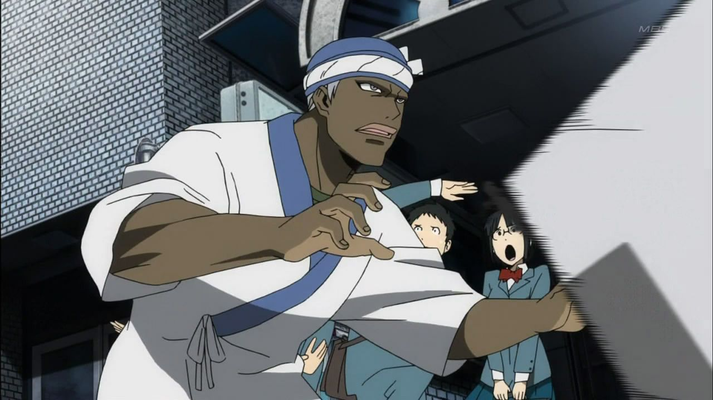
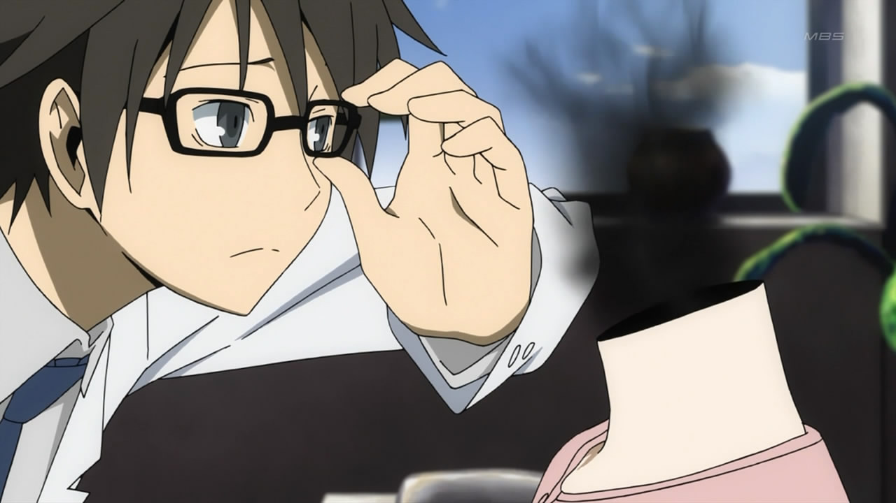
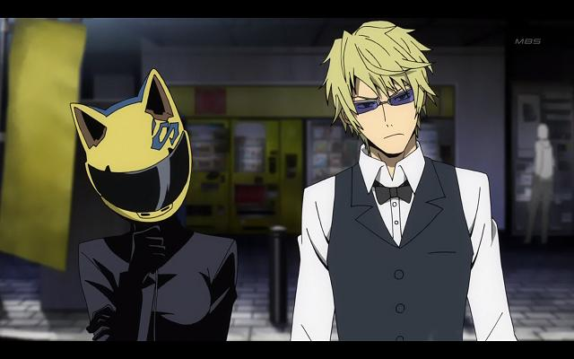
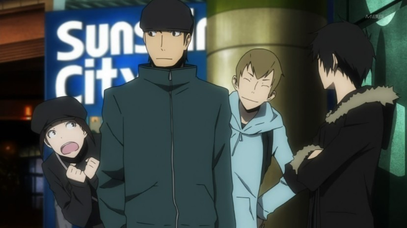
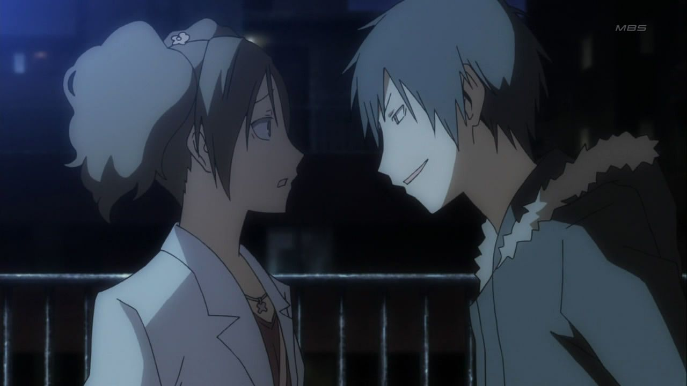
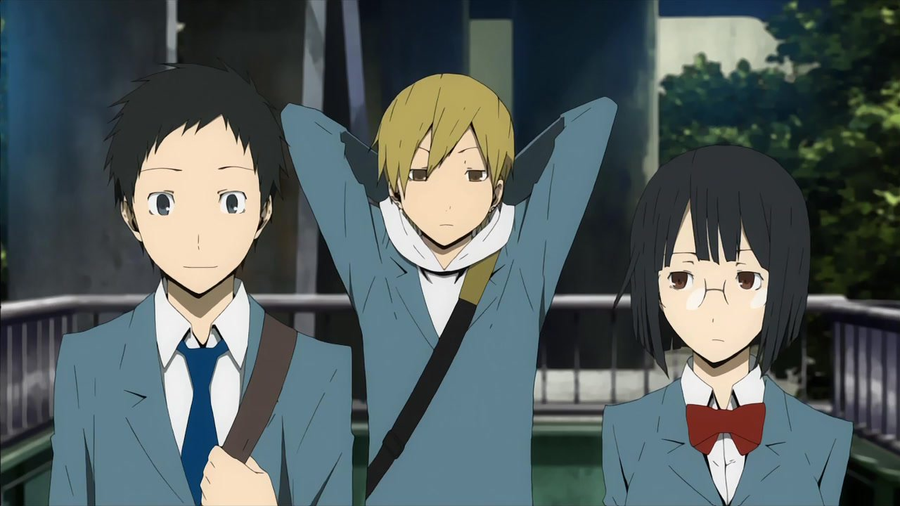
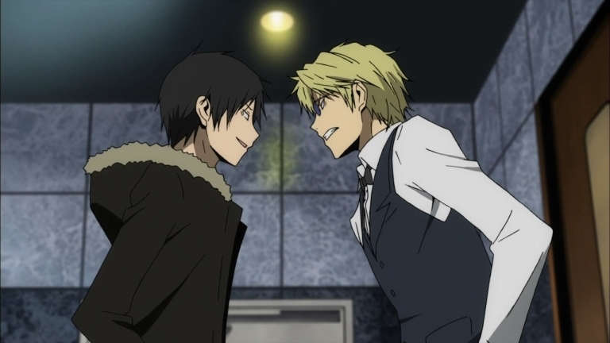
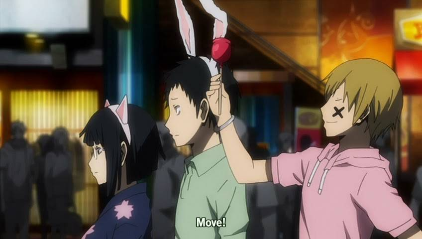
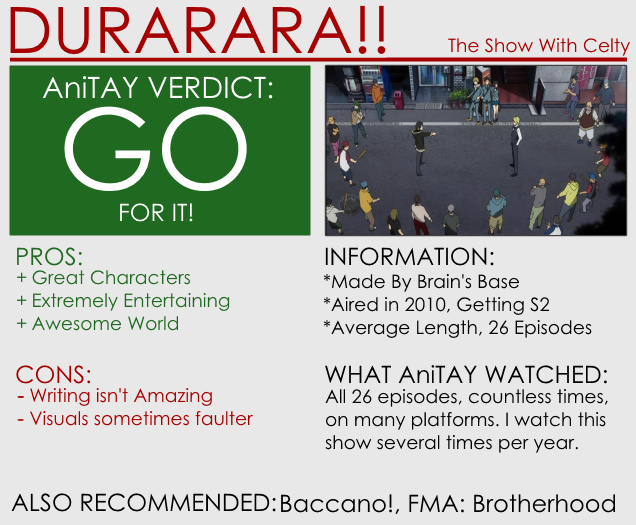

---
{
  title: "Rockmandash Reviews: Durarara!! [Anime]",
  tags: ["Rockmandash Reviews", "AniTAY", "Durarara", "Review", "TAYCLASSIC"],
  published: "2014-12-28T14:00:00-05:00",
  attached: [],
  kinjaArticle: true,
}
---

<video autoplay="" loop="" muted=""><source src="./1248077600568880997.mp4" type="video/mp4"/></video>
When I watch a show or play a game, I typically value the characters and the world heavily:
  All of my favorites excel in either one of these aspects. When I find a show that excels at both of these aspects,
  it’s pretty much a dead ringer for one of my favorite shows. Today in anticipation for the Season 2, we have a show
  that pulls this off and is one of my Top 10 anime: <em>Durarara!!</em>

<em>Durarara!!</em> has a story that tries to do everything, and manages to do
  everything. Written by Ryohgo Narita (who also did Baccano), it’s a story that matches expectations you may have and
  does a bit more: It’s an ensemble cast character drama with romance, pure comedy, supernatural aspects, gang wars, and
  anything else you can really imagine. The best part? Every one of these aspects is executed pretty well (in my
  opinion), creating a highly enjoyable show that never gets old no matter how often you watch it. That being said, it’s
  not so much something that’s made to blow your mind in how awesome it is, but it’s a show that’s just so enjoyable and
  fun that I can’t help but love it. It’s rare to see a show that focuses on being very entertaining while keeping the
  quality in other aspects high enough that you truly find an enjoyable show. It’s really a recipe of success, and I
  love it when I find shows like this. (Others that come to mind that is like this is FMA:B, Date A Live, Soul Eater,
  etc.)

<em>Durarara!!</em> takes place in Tokyo’s downtown district of Ikebukuro, an
  interesting yet dangerous town where many unusual things happen… you could almost say it’s magical. With cursed
  blades, headless dulahans, gang wars and people with superhuman strength, it’s a hectic story the story that manages
  to capture the feeling of the city, which is really what the story is about. What makes the city special though is
  that feels alive, sprawling, and ever-changing: it feels like a character with it’s mind of it’s own, a character that
  changes and develops the whole way through. It’s more than just a setting: It’s is the story of this living, changing
  city and all the absurdity that comes with this which makes it that much more enjoyable.. and I wouldn’t have it any
  other way. The show lets you get to know it’s version of Ikebukuro, from the gossip to the gangs and folklore, and it
  makes you feel like you are truly living in this hectic city. It feels very modern, fast paced and crazy, like a real
  city should. When Mikado feels nervous because he’s in a new town, you feel that too. When people start talking about
  rumors, they are like rumors that you would typically hear. It’s an amazing atmosphere that is directly attached to
  the story thus also to the characters and the viewer, and it’s something I love.

Speaking of the characters, <em>Durarara!! </em> has an ensemble cast that is
  absolutely fantastic, one of the few ensemble casts I actually like: every character is interesting, likable,
  memorable, unique and fleshed out. The characters are truly the core structure for the story, the fallback when other
  aspects grow weak or what motivates you to keep watching, it’s what the show relies on and it’s by far the best aspect
  of the show. While it’s probably the largest ensamble cast I’ve seen in anime, they manage to make such a large cast
  feel small because it’s done so well that they are all well rounded and enjoyable. The characters get solid
  development as they have interesting issues that they have to deal with, and the way they struggle through it is
  admirable, even if not relatable. I could talk to you about how great each of the characters are, but i’d be here for
  hours just babbling on how mikado is a perfect main character who is very easy to relate to or how awesome Celty is as
  a character and a legend.... yeah... they’re great, some of my favorites.

The whole is greater than the parts though, and it’s the interactions they have that
  is the icing on the cake. The interactions they have with each other is spot on just seeing what they do is very
  entertaining, and it makes the cast that much better... it’s rare that I see a cast that I like as much as <em>Durarara!!</em>.
  They have an interesting dynamic in the way that they deal with each other and seeing this dynamic is engaging and
  interesting. The way it balances the motivations and goals between the characters, entwining their thoughts and fate
  is great, and I loved every bit of it.

Speaking of the way that <em>Durarara!!</em> handles the story, the execution is
  pretty solid. The way they transition between the scenes is pretty great, going through and utilizing the ensemble
  cast by changing perspectives is something I appreciate. The story isn’t exactly a linear story, more like a slog
  through an outburst of information and rumors, going through what is running through the rumor mill. It’s not the
  neatest plot, but it’s a story I appreciate because it adds charm and realism, while making it feel episodic at
  times,a feeling I miss when watching shows as of late. The pacing is pretty solid as well, preventing the show from
  having a dull moment: it’s frenetic at times, lethargic at times, but always natural and entertaining... in a way it’s
  simulating how life is, which is really fitting for the show. I also really appreciate the integration of random
  aspects of the world like the chatroom and off comment remarks, it’s something that adds charm and is a reason why I
  love <em>Durarara!!</em> so much. It’s like a window into another world in our modern world (more specifically it’s
  version of Ikebukoro) and it’s extremely interesting.

That being said, the writing
  isn’t perfect, and there’s a lot of people who just don’t care too much for<em> Durarara!! </em>because of it.
  Personally, I never found any issues with the writing that have bothered me while watching the show, but those who
  have generally have valid complaints and I would be showing a little bit too much of my bias if I didn’t take a look
  at them and consider them.

<ol class="sc-1lmbno3-1 sizyJ" data-style="Number" data-type="List">
<li><em>The story isn’t really all that clear and can be confusing at times. It’s also pretty bad</em>: Yes, plot
    points do not connect, the writing isn’t there to blow your mind, it does have writing issues and it’s not really
    presented in a way that’s super clear, but nitpicking that in my opinion goes against the whole meaning of the show.<em>
      Durarara!!</em> goes with the flow to simulate life a bit in that aspect because it’s story of life in a city, but
    along with that is the hectic confusion that comes with living in a city. considering that this is a show about the
    lives of people in a city... it isn’t supposed to be clean cut. Real lives aren’t always tied up in a neat bow.
  </li>
<li><em>The show focuses too much on the 3 high schoolers (Mikado, Kida and Anri) and at the end of the show, and this
    is boring to watch, it turns into a “soap opera”</em>: I saw this complaint several times, but I didn’t see it when
    I watch the show. I really liked because of the personalities they have, the dynamics between their relationship,
    and the groups they represent. They may be not as great as others in the cast, but I don’t think that’s saying bad
    about them as it’s saying how great the rest of of the cast is as in my opinion, these three are well developed and
    interesting. While they may not be as interesting as other characters in the show, I don’t think boring is the right
    word to describe it.
  </li>
</ol>

Overall, <em>Durarara!!</em> is written in a way that’s fun. It may not be the most
  gripping or amazing narratives, but it’s done in a way that will absorb you in and engage you with the events
  happening in the show.
<h4 class="sc-1bwb26k-1 fvCjqJ" id="h116384">Writing -
  8/10</h4>

While<em> Durarara!!</em> doesn’t aim to be the best looking anime, that doesn’t
necessarily mean it looks bad... in fact, if you ask me, it looks pretty decent. <em>Durarara!!</em> has a great
stylized design that really adds to the show: it’s modern, it makes things pop, it’s very clean in design, and it
looks solid, but the animation itself could use a bit of polish. (But honestly, if this bothers you guys, you haven’t
seen anything .\_.) It does the job: it’s clean, looks solid in general and tries it’s best to not get in the way. Due
to the execution, the visuals usually serve to support other aspects of the story moreso than looking nice (It can
look pretty great as it sometimes picks up during action scene). It’s filled with minor niceties that add flair to the
show and make it stand out like the fact that non important people aren’t colored (lol), the colored highlights used
in the show to make things stand out , the atmospheric tones, and because of these, it can stand out from the rest of
the show. Overall though, it generally keeps a consistent level of quality and that’s what matters.

<h4 class="sc-1bwb26k-1 fvCjqJ" id="h116385">Visuals - 8/10</h4>

<iframe allow="accelerometer; autoplay; clipboard-write; encrypted-media; gyroscope; picture-in-picture" allowfullscreen="" frameborder="0" height="315" src="https://www.youtube.com/embed/uZ5N_c6qPJg" width="560"></iframe>

If there’s one aspect of this show that is universally praised, it’s the soundtrack. It’s a
  great soundtrack that is pleasing to the ear, absolutely makes the mood, and has a great personality. It’s thrilling,
  engaging, interesting, unique, awesome, and any other adjectives I can throw at it. Really, it speaks for itself. I
  just love how it fits with the situation extremely well, as it’s modern and there’s a huge variety that I appreciate,
  with a great use of distinct instruments and jazz. Absolutely one of my favorite soundtracks, tons of great stuff and
  they are all very amusing to listen to.

Onto the voice acting... I’m pretty sure that <em>Durarara!!</em> has the best voice
  acting I’ve seen in the past few years... both dubbed and subbed. I’ve originally got into <em>Durarara!! </em>via dub
  so I prefer that one, but both have A+ talant (Miyano Mamoru, Kana Hanazawa, Miyuki Sawashiro, Jun Fukuyama are some
  greats for the Japanese, and Crispin Freeman, Johnny Yong Bosh, Steve Blum are some greats for the English) and
  everyone did a fantastic job. It’s a treat for the ears, and it’s a joy to listen to.
<h4 class="sc-1bwb26k-1 fvCjqJ" id="h116386">Sound - 10/10</h4>

Take everything I said about it, and it’s pretty easy to see what this section is going to
be like. I love <em>Durarara!! </em>to no end, it’s one of my favorites, it’s one of the few shows that I rewatch
every year, and it’s one of the few shows that I can enjoy every time. <em>Durarara!! </em>is a show that’s geared for
your enjoyment, and it satisfies this exceedingly well. It’s an experience that’s loads of fun, a show that is a blast
every time I see it. All of the aspects build up to create an experience that feels alive, fells magical and it’s
something I appreciate. I get completely absorbed when watching it and i’m consistently entertained throughout. The
little things that this show does do so much to help my experience with this and I can’t help but love it. It’s a show
with a personality and this personality is something I fell in love with.

<h4 class="sc-1bwb26k-1 fvCjqJ" id="h116387">Enjoyment - 10/10</h4>

<em>Durarara!! </em> is a show that I love to no end. It may have it’s flaws, but
  I’m not going to let that prevent me from loving it. I’m looking to the continuation of one of my favorite shows, and
  hopefully I’ll love it as much as this season.
<h2 class="sc-1bwb26k-1 fvCjqJ" id="h116388">Overall 9/10, Polarization +1, -3</h2>

<strong>Copyright Disclaimer:</strong> Under Title 17, Section
  107 of United States Copyright law, reviews are protected under fair use. This is a review, and as such, all media
  used in this review is used for the sole purpose of review and commentary under the terms of fair use. All footage,
  music and images belong to the respective companies. 

<em>You can see all my reviews on </em><a class="sc-1out364-0 hMndXN sc-145m8ut-0 gIacKn js_link" data-ga='[["Embedded Url","Internal link","http://tay.kotaku.com/tag/rockmandash-reviews",{"metric25":1}]]' href="http://tay.kotaku.com/tag/rockmandash-reviews"><em>Rockmandash Reviews</em></a><em>. For An explanation
  of my review system, </em><a class="sc-1out364-0 hMndXN sc-145m8ut-0 gIacKn js_link" data-ga='[["Embedded Url","External link","https://rockmandash12.kinja.com/rockmandash-rambles-an-explanation-on-my-review-system-1619265485",{"metric25":1}]]' href="https://rockmandash12.kinja.com/rockmandash-rambles-an-explanation-on-my-review-system-1619265485" rel="noopener noreferrer" target="_blank"><em>check this out</em></a><em>. </em>

<aside class="sc-1rh3ayr-6 jfFNjl inset--story branded-item branded-item--kinja" data-commerce-source="inset">

<a class="sc-1out364-0 hMndXN js_link" data-ga='[["Permalink page click","Permalink page click - inset headline"]]' href="https://rockmandash12.kinja.com/rockmandash-rambles-an-explanation-on-my-review-system-1619265485" rel="noopener noreferrer" target="_blank"><h6 class="sc-1rh3ayr-3 jRIPES">
    Rockmandash Rambles: <i>An Explanation on my Review System</i> (Updated 11/15/2015)</h6></a>

If you’ve read any of my reviews and wanted to know why I did them the way I do,
      here’s an…
<a class="sc-1out364-0 hMndXN sc-1rh3ayr-0 kOvmIi js_readmore inset--story__readmore js_link" data-ga='[["Permalink page click","Permalink page click - inset read more link"]]' href="https://rockmandash12.kinja.com/rockmandash-rambles-an-explanation-on-my-review-system-1619265485" rel="noopener noreferrer" target="_blank">Read more</a>

</aside>

<em>This show is available on </em><a class="sc-1out364-0 hMndXN sc-145m8ut-0 gIacKn js_link" data-ga='[["Embedded Url","External link","http://www.crunchyroll.com/durarara",{"metric25":1}]]' href="http://www.crunchyroll.com/durarara" rel="noopener noreferrer" target="_blank"><em>Crunchyroll</em></a><em> for Free &amp; Legal streaming.</em>

<aside class="sc-1rh3ayr-6 jfFNjl inset--story branded-item branded-item--kinja" data-commerce-source="inset">

<a class="sc-1out364-0 hMndXN sc-1rh3ayr-0 kOvmIi js_readmore inset--story__readmore js_link" data-ga='[["Permalink page click","Permalink page click - inset read more link"]]' href="http://www.crunchyroll.com/durarara" rel="noopener noreferrer" target="_blank">Read more</a>

</aside>

