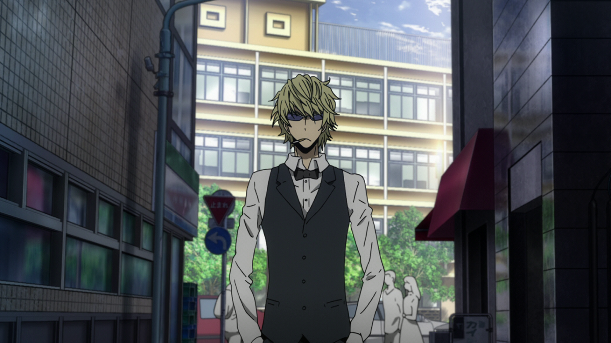
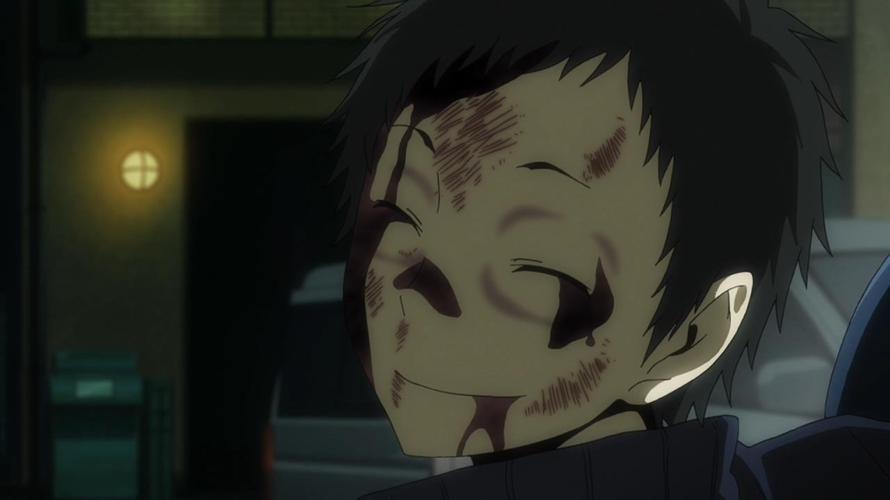
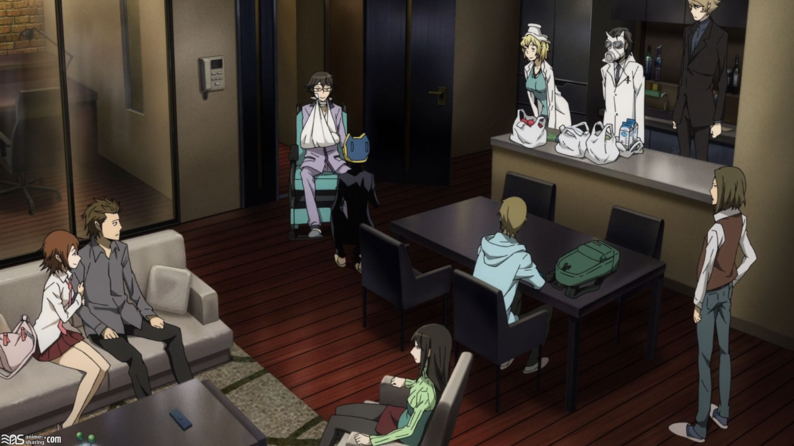
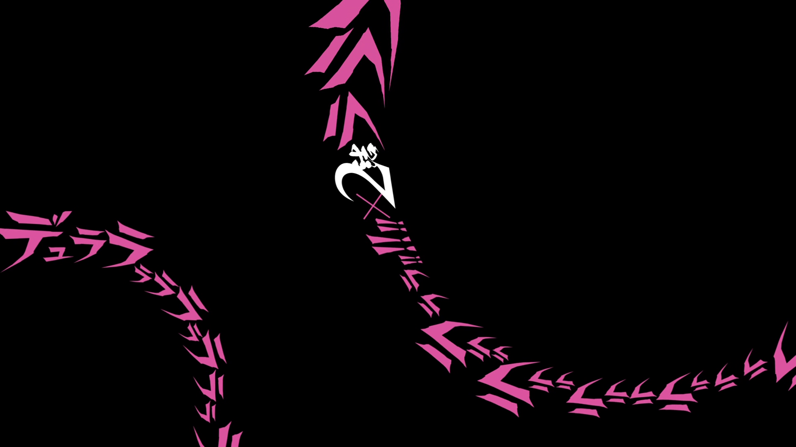
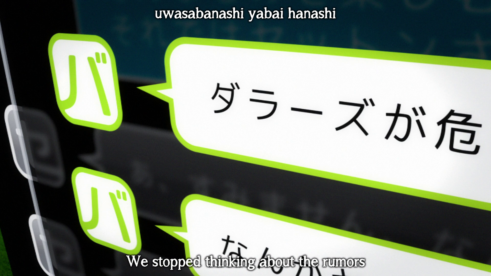
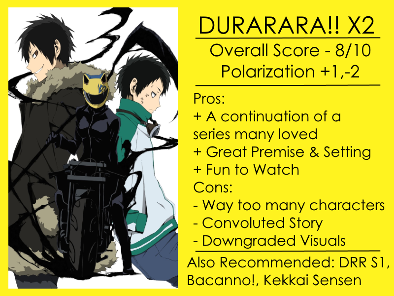

---
{
	title: "Rockmandash Reviews: Durarara!!x2 [Anime]",
	published: "2016-03-26T14:00:00-04:00",
	tags: ["Rockmandash Reviews", "AniTAY", "The AniTAY Review", "Durarara!!", "Winter 2016", "Winter 2015", "Summer 2015"],
	kinjaArticle: true
}
---

<video src="./ptv9vwzqupvgrbcynjxz.mp4"></video>

How do you react when you see an old friend for the first time in years? *Durarara!!x2* is a show that’s kinda exactly like that: Of course, it’s not at the point where the relation is at it’s best and the interactions are still a little bit more awkward than what you remembered, but it’s still really nice to see them and it’s still just as fun and enjoyable as it always was.

***

 

Durarara!!X2 is the second season of [Durarara](http://anitay.kinja.com/rockmandash-reviews-durarara-anime-1665959528), and we are back again for fun with a massive ensemble cast in the crazy town of Ikebukuro. Seeing a show get a sequel years after it’s aired is always nice, and brings hope that other shows may follow. *Durarara!! X2* is a show with a an ensemble cast character drama with romance, pure comedy, supernatural aspects, gang wars, and anything else you can really imagine, and while the show aims to keep up with season one, it mostly lags behind.

*Durarara!!X2*, like it’s predecessor, takes place in Tokyo’s downtown district of Ikebukuro, an interesting yet dangerous town where many unusual things happen, and the crazy train only continues with this season. With cursed blades, headless dullahans, gang wars and people with superhuman strength, it’s a hectic story the story that manages to capture the feeling of the city, which is really the core of the show. What makes the show special though is that feels alive, sprawling, and ever-changing: it feels like a character with it’s mind of it’s own, a character that changes to the point that it is no longer recognizable. This effect carries on from season one, to make it seem that much more enchanting and amazing. It’s more than just a setting: It’s is the story of this living, changing city and all the absurdity that comes with this which makes it that much more enjoyable.. and I wouldn’t have it any other way, but it’s not so magical this time around.

Central to Season 2 is the “purge” in the dollars and the path to chaos that it led, thanks to our main character Mikado Ryuugamine going off of the deep end. He essentially lets the dollars be taken over by the blue squares and this is a turn that makes the show more focused on gangs, more focused on conflict, going against everything I thought they stood for. It also makes this show a lot more hectic, though it takes a while to get insane, really only picking up in the third cour (where it’s REALLY good), but this has a rather important consequence on the way that the story is told. It leads to interesting but messy storytelling in a way that amps up both the positives and negatives of the show. While I think this chaos works thematically, with the story trying to portray a city in utter chaos, this can get a bit confusing for the viewer. There’s simply too much going on.

Last time I said that the major complaints didn’t really bother me, but I felt like they did this time. The fact that the story isn’t all the clear didn’t hinder the story last time, but can be straight up hard to follow now because the story is all that more confusing, and the fact that there were too many characters was compounded by adding **MORE** characters, with many serving very minor roles to make me even wonder why they added them. It feels like there’s about double the amount of characters in S1, and I think this ensemble cast is significantly worse off because of it.

I’d argued in season one, because they used most of their cast really well in season one by balancing the time spent with each character, the show made it’s cast feel small. Season 2 does not do this. The characters that you know and love from season one are still a blast to watch, but mixed in with the relatively underdeveloped cast in this show, it’s hard to say the characters are a strong point for this season. The new cast is huge to the point that I think it’s too big to really get to know the new characters well to the point someone would care for them, and too big to see how our old favorites are doing, which results in a less than ideal experience. For an example, we don’t really see much of Simon from Russia Sushi throughout the season, and the only really memorable scene with him was late into the third cour, which is not a lot of time. Less characters and a better use of said characters would have gone a long way in making the show more enjoyable, as much as season one, but the ones we do spend time with are still great, and it’s still enjoyable.

#### Writing - 7/10

***

 

If there’s something to take away from this though, that enjoyable aspect is really the sticking point, because if there’s one thing that will never falter, it’s *Durarara!!*'s ability to put a smile on your face (unless you didn’t like it from the start). Even though X2 is slow early on and it has a variety of things that may bother you, it’s still a show that is fun to watch week by week. If you asked me, this is a testament to how well they know how to entertain the viewer. Like I said before,

*Durarara!!* is a show that’s geared for your enjoyment, and it satisfies this exceedingly well. It’s an experience that’s loads of fun, a show that is a blast every time I see it. All of the aspects build up to create an experience that feels alive, feels magical and it’s something I appreciate. I get completely absorbed when watching it and i’m consistently entertained throughout. The little things that this show does do so much to help my experience with this and I can’t help but love it. It’s a show with a personality and this personality is something I fell in love with.

There is one big annoyance with the experience, and while it may not matter to those coming in, it was still something that greatly bothered me: Tri-Split Cours. This show has 36 episodes, and it showed them 12 at a time with a season in between. This is aggravating because it’s hard to remember all the details for 12 weeks, and it fragmented the viewing experience so you had to wait. This was especially annoying when the beginning half was rather slow to the point that it while it was nice to be back, I was just constantly waiting for more, and didn’t get it until the next year.

Overall, *Durarara!!X2*’s written fairly well, but it’s season 1 on steroids and that’s not necessarily a great thing. While it’s still the DRRR you know and love which is rather enjoyable, It’s exposed the weaknesses of the series which can hurt your experience. The writing in this season can be a mixed bag depending on who you are.

#### Experience - 9/10

***

With season 2, Brains Base is out, and in is an entirely new studio, Studio Shuka. Studio Shuka is a team composed by members who worked on DRRR Season 1, but this is a new studio and honestly, it looks the part. While it’s still pretty decent, this season has a significantly rougher look than before: it’s not as polished, not as detailed, and in my opinion, not as good. It has a “sharper” look to it, with the eyes being very angled which personally bothered me, and the consistancy isn’t as solid. The art, while serviceable, could use improvement.

#### Visuals - 6/10

***

For better or worse, the sound is one of the few aspects that haven’t changed at all. Other than new OPs and EDs (which are great btw), It’s the same great soundtrack that the fans have came to love and it’s great here, even if it’s the same as last time. I’ll let a quote from my review of season one do the honors here:

> It’s a great soundtrack that is pleasing to the ear, absolutely makes the mood, and has a great personality. It’s thrilling, engaging, interesting, unique, awesome, and any other adjectives I can throw at it. Really, it speaks for itself. I just love how it fits with the situation extremely well, as it’s modern and there’s a huge variety that I appreciate, with a great use of distinct instruments and jazz. Absolutely one of my favorite soundtracks, tons of great stuff and they are all very amusing to listen to.

This doubles for the voice acting as well: we are back with the same great voice actors from S1, and they do a great job, both sub and dub. The new characters do a great job as well, as they capture the personality of the characters they are playing It’s also one of the few shows with simul-dubbing so we already have part of the dub available, and the quality is on par with the sub.

#### Sound - 9/10

***

Durarara!! X2 is a sequel in an odd place: it doesn’t live up to the original season, even if it’s rather good on it’s own right. It has issues with a messy plot and subpar visuals that may irk you, but it’s still an enjoyable show that any fan of the series will enjoy.

***

**Copyright Disclaimer:** Under Title 17, Section 107 of United States Copyright law, reviews are protected under fair use. This is a review, and as such, all media used in this review is used for the sole purpose of review and commentary under the terms of fair use. All footage, music and images belong to the respective companies.

*You can see all my reviews on *[*Rockmandash Reviews*](http://tay.kotaku.com/tag/rockmandash-reviews)*. For An explanation of my review system, *[*check this out*](http://tay.kotaku.com/rockmandash-rambles-an-explanation-on-my-review-system-1619265485)*.*

*This show is available on *[*Crunchyroll*](http://www.crunchyroll.com/durarara)* for Free & Legal streaming.*
