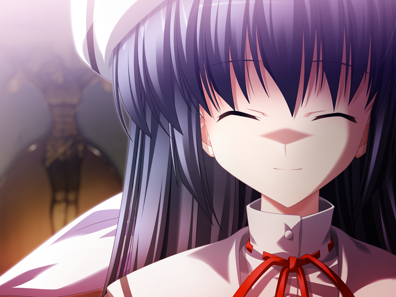

---
{
title: "Rockmandash Reviews: ef - a fairy tale of the two [Visual Novel & Anime]",
tags: ["Rockmandash Reviews", "Ani-TAY", "Tay Classic", "ef", "A Fairy Tale of the Two", "Tale of Memories", "Tale of Melodies", "Visual Novel", "Anime"],
authors: ['reikaze'],
published: '2014-10-23T23:20:00-04:00',
attached: [],
license: 'cc-by-4',
oldArticle: true
}
---

<video autoplay="" loop="" muted=""><source src="./1387775007850698161.mp4" type="video/mp4"/></video>
When I first saw <em>ef - a fairy tale of the two</em>, I was blown away by how beautiful
  it was, how stunning it is. The game had the visuals of a <a class="sc-1out364-0 hMndXN sc-145m8ut-0 gIacKn js_link" data-ga='[["Embedded Url","Internal link","http://tay.kotaku.com/the-garden-of-words-the-ani-tay-review-1524606376",{"metric25":1}]]' href="http://tay.kotaku.com/the-garden-of-words-the-ani-tay-review-1524606376">Makoto Shinkai</a> film, and I
  heard almost nothing but praise regarding the story of it, but impressions rarely tell you what your experience will
  be. Welcome to Rockmandash Reviews, and today, we have a review of what is one of the most beautiful games I’ve had
  the chance to experience: <em>ef - a fairy tale of the two, </em>developed by Minori, which is a VN spinoff of Makoto
  Shinkai’s animation studio CoMixWave.

Even though Makoto Shinkai’s only direct influence on the VN is OP, his style is all
  over it... for better or for worse. The messages that the story tries to tell in <em>ef - a fairy tale of the two</em>
  is surprisingly similar to Shinkai films; they have similar themes, style, writing, etc... and if I had just jumped
  into it blindly, I would have assumed he had some part in the story, even though he was only involved with the OP. 

The execution of the story, however, is very different: It’s similar to <a class="sc-1out364-0 hMndXN sc-145m8ut-0 gIacKn js_link" data-ga='[["Embedded Url","Internal link","http://tay.kotaku.com/rockmandash-reviews-kara-no-kyoukai-the-garden-of-si-1524615358",{"metric25":1}]]' href="http://tay.kotaku.com/rockmandash-reviews-kara-no-kyoukai-the-garden-of-si-1524615358">Kara no Kyoukai</a>
  in execution (but less confusing) by having stories that are only partially related to each other being blended
  together to make a seamless story. The chapters in <em>ef - a fairy tale of the two</em> all run different themes, yet
  when put together, there’s a feeling of cohesiveness in the story as a whole. I really admire how interconnected the
  game feels, and the further you go along, the feeling of the world grows.

<em>Ef</em> is an absolutely beautiful story with good pacing and solid character
  interactions, but for everything it does right, it does something wrong. In <em>ef</em>, the writing is always pretty
  decent, but it leaves the feeling that it’s supposed to be so much more, and sometimes it feels like it’s actively
  shooting itself in the foot (<a class="sc-1out364-0 hMndXN sc-145m8ut-0 gIacKn js_link" data-ga='[["Embedded Url","Internal link","http://kotaku.com/why-i-can-t-bring-myself-to-enjoy-akame-ga-kill-1641986983",{"metric25":1}]]' href="http://kotaku.com/why-i-can-t-bring-myself-to-enjoy-akame-ga-kill-1641986983">similar to Akame ga Kill</a>).

<strong>DISCLAIMER - There may be spoilers. I tried to avoid spoiling the bigger
  topics, but you may run into an important spoiler, or some light spoilers.</strong>

<em>Ef - a fairy tale of the two </em>is actually a compilation of 2 separate VN’s: <em>ef
  - the first tale &amp; ef - the latter tale</em>, which are comprised of 7 chapters in total. It’s hard to give a plot
  summary really because every chapter has their own separate story and telling you all of that would spoil the game and
  only give a partial look at the game, but I’ll try my best to give you the gist of it. It’s really split into two
  separate stories that converge: Prologue, and 5-7 is one story surrounding the tragic relationship between Amamiya
  Yuuko, a mysterious girl dressed like a nun, and Himura Yuu, a mysterious gentleman who is somehow attached to the
  church where Yuuko first appears while 1-4 are romances focused on high schoolers in the town, each kinda relating to
  each other. I’m going to talk about them in the order they are told for the sake of convenience, then do an overview
  of my thoughts.

<em>Ef - the first tale</em> is the first half of the game (Prologue, Ch1 &amp;
  Ch2), and it’s pretty much nothing but a fairy tale. While it has a nice romance that shows hints of something deeper
  happening, it’s just that... a nice romance. It’s a beautiful story, but <a class="sc-1out364-0 hMndXN sc-145m8ut-0 gIacKn js_link" data-ga='[["Embedded Url","Internal link","http://tay.kotaku.com/dexs-review-the-princess-and-the-pilot-1530878039",{"metric25":1}]]' href="http://tay.kotaku.com/dexs-review-the-princess-and-the-pilot-1530878039">it’s a type of</a><a class="sc-1out364-0 hMndXN sc-145m8ut-0 gIacKn js_link" data-ga='[["Embedded Url","Internal link","http://tay.kotaku.com/the-garden-of-words-the-ani-tay-review-1524606376",{"metric25":1}]]' href="http://tay.kotaku.com/the-garden-of-words-the-ani-tay-review-1524606376"> story that</a> <a class="sc-1out364-0 hMndXN sc-145m8ut-0 gIacKn js_link" data-ga='[["Embedded Url","Internal link","http://tay.kotaku.com/ani-tay-golden-time-review-and-discussion-1556588276",{"metric25":1}]]' href="http://tay.kotaku.com/ani-tay-golden-time-review-and-discussion-1556588276">we’ve seen before</a>. It
  will intrigue and entertain you but a lot of it is very cliche, and kinda generic. 

Besides the really enjoyable Prologue (which was extremely out of place because they
  essentially drop the plot they started there for something totally different, something much less enjoyable), The game
  is generic, with a generic love triangle in a generic love story. There were aspects that I liked, but lack of
  originality lingers and makes the themes feel a bit more dull than it really should. While it’s entertaining, it’s not
  really memorable, and it could have done better.

If <em>ef - the first tale</em> was just a simple fairy tale, <em>ef - the latter tale
  (Ch3-7) </em>steps that up a notch but stumbles: it’s better written and has a brilliant subversion... but it also has
  issues that inhibit the whole story.

<em>Ef - the latter tale</em> starts strong with Chapter 3, which is a beautiful
  tale of memories and troubled relationships. I don’t want to discuss the plot too much because that’s spoiler
  territory, but the situation that the writers put in place is very interesting, and the writing in general is improved
  because of it. Immediately, you see a stream of improvements: the characters, dialogue, and situations are more
  interesting and I genuinely enjoyed it. The reactions of the characters and the struggles to deal with the event were
  amazing, and watching what was essentially a mental breakdown was great. It made these characters feel real, not just
  a cliche, and this is something I wish they did more of.

After that amazing Chapter 3, you would expect Chapter 4 to be great, right? Well,
  this chapter was more in the style of <em>ef - the first tale</em>: another nice romance... but plain and generic.
  That being said, the age gap between the main characters of this bothered me (Shuichi Kuze, an older man with Mizuki
  Hayama, a middle schooler....), and I was surprised that they never pointed it out, considering how much this game
  tries to be realistic.

Remember that prologue that I said was really enjoyable? Well,
  in Ch5 and 6, they <strong>FINALLY</strong> continue the story from the prologue... and it makes the rest of the
  chapters feel pointless because of how boring they are in comparison.

If the other chapters were fairy tales, chapter 5 and 6 was reality coming out of nowhere
  and running you over. The bleak and morbid view on reality that it shows due to the horrible events that occur is
  shocking, engaging, and a genuine surprise, given how generic some of the chapters were. I generally state that shows
  that try to to be dark usually aren’t, as most edgy shows don’t have anything to back up the edgy tone
  thematically.<em> Ef </em>is the opposite of that; it gives off a lighthearted vibe, but it has dark and bleak themes
  that whack you when you least expect it. The way it’s issues is executed gloriously.. but bleakly, making it something
  that blew my mind while screaming how horrible it was.

 The way the story elements was executed and flowed, however... not so great. It has
  good character interactions and writing that is actually entertaining in comparison to the other chapters, but it’s
  <em>ef</em>, and it wouldn’t be <em>ef</em> without writing issues. The style of storytelling they went with in was
  extremely short sub-chapters. The transition between the sub-chapters was extremely rough; instead of being a
  continuous story, they would suddenly stop what was happening, thus breaking the pace, atmosphere, and mood. While it
  was still enjoyable due to the excellent character development, interesting writing, dark themes and the absolutely
  great presentation, it could have been so much more if they kept the flow. They shot some moments in the foot, and it
  felt.. anticlimactic.

Chapter 7 serves to wrap the story up, but it felt very anticlimactic in general,
  even when you take into account<a class="sc-1out364-0 hMndXN sc-145m8ut-0 gIacKn js_link" data-ga='[["Embedded Url","External link","http://tvtropes.org/pmwiki/pmwiki.php/Main/TomatoSurprise",{"metric25":1}]]' href="http://tvtropes.org/pmwiki/pmwiki.php/Main/TomatoSurprise" rel="noopener noreferrer" target="_blank"> the random plot twist at the end</a>.
  Everything starts to come full circle as the story and reader starts to piece together all of the events and that
  realization was great, but the ending was bittersweet, which I felt was unfitting.

<em>Ef - a fairy tale of the two</em> is interesting to talk about when it comes to the
  writing. It’s solid overall, and absolutely fantastic at points, but it always shot itself in the foot. From the
  generic-ness of the story, to something like flow that gets in the way... it has these tragic flaws that keep it from
  being so much more.

<h4 class="sc-1bwb26k-1 fvCjqJ" id="h106631">Writing - 7.5/10</h4>

<video autoplay="" loop="" muted=""><source src="./1387775009015843249.mp4" type="video/mp4"/></video>

I’m the type of person who prefers a good design over technological prowess. As
  such, I’ll say this: This is one of the most beautiful Visual Novels (and one of the most beautiful games) I’ve ever
  seen, even though it is dated in some technological aspects. Due to the stunning art style,<em> ef - a fairy tale of
    the two </em>has aged gracefully, impressing me nearly a decade after it’s release. 

In comparison to the static nature of most Visual Novels, <em>ef</em> is very dynamic when
  it comes to visuals. It has more than the typical sprite and a background for a good majority of the game: almost
  every scene has unique CG. The CG looks great, and because it’s not just the normal fixed viewpoint, it leads to well
  framed scenes and it builds an atmosphere that many VN’s just don’t. Also, <strong>STUFF MOVES</strong>! Blinking
  eyes, moving mouths, people actually making motions like they are walking when they are walking next to you, etc. It’s
  no anime, but it’s the little things like this that count and I really appreciate it.

Really, I cannot state this enough: <em>ef - a fairy tale of the two</em> has
  great art, with all the <a class="sc-1out364-0 hMndXN sc-145m8ut-0 gIacKn js_link" data-ga='[["Embedded Url","External link","http://tvtropes.org/pmwiki/pmwiki.php/Main/SceneryPorn",{"metric25":1}]]' href="http://tvtropes.org/pmwiki/pmwiki.php/Main/SceneryPorn" rel="noopener noreferrer" target="_blank">Scenery Porn</a> that you’d expect from a work
  associated with Makoto Shinkai. The character art is just as great too; while they give off the typical anime look,
  they look great, and they fit in extremely well with the world around them. It’s a VN that’s full of really great art,
  and everything is pleasing to the eye. The best word that can describe the visuals of this game (and the whole work as
  a whole) is beautiful... it’s seriously beautiful. There is one notable thing that isn’t really a positive: it’s an
  eroge, so <strong>CUE THE OBLIGITORY EROGE WARNING HERE</strong>, but you can turn it on and off so it’s not a
  deterrent from playing. When it skips an H-scene, the game give a description of what happens, so you aren’t missing
  anything, and I wish more games had that.

<h4 class="sc-1bwb26k-1 fvCjqJ" id="h106632"><em>Visuals - 10/10</em></h4>

<iframe allow="accelerometer; autoplay; clipboard-write; encrypted-media; gyroscope; picture-in-picture" allowfullscreen="" frameborder="0" height="315" src="https://www.youtube.com/embed/tPmDKb836eo" width="560"></iframe>

Continuing the trend of emphasizing how beautiful this game is, we have the absolutely
  amazing and unbelievably beautiful score done by Tenmon, the composer for most of the Shinkai works. It’s really
  amazing, and one of the most beautiful soundtracks in a game. It’s so good that you could leave running in background
  and not realize it’s a soundtrack for a game, with almost every song in the soundtrack being pleasing to the ear. It’s
  the type of soundtrack that you chuck into your iPod/phone without hesitation. Even though it has a clear bias for
  classical music, there is a surprisingly large range of variety here with everything from happy go lucky generic VN
  music to some really amazing violin. Everything is well composed, leading to some really beautiful tracks and some
  amazing songs that will blow you away. 

The implementation of this soundtrack is superb as well, with the tracks
  supplementing the story throughout the game, and when it needed to, solidifying the mood, creating an amazing
  atmosphere and intensifying the feelings you have during the scene. <em>Ef </em>has some very intense tracks that fit
  perfectly with their respective scenes which really goes a far way in improving the storytelling, and it’s not every
  day you will find a soundtrack that’s this well executed in a story. 

As for the
  voice acting, I’m not an expert, but it’s once again... fantastic. The voice actors did a great job portraying the
  characters, no matter how difficult the situation was... I was especially impressed by Yuuko’s voice actor, as she did
  a stellar job with that role no matter the situation, and it was a joy to listen to.

<h4 class="sc-1bwb26k-1 fvCjqJ" id="h106633"><em>Sound - 10/10</em></h4>

When I started up <em>ef - a fairy tale of two</em>, I hoped this would be the
  opportunity to get the Shinkai presentation that I love without <a class="sc-1out364-0 hMndXN sc-145m8ut-0 gIacKn js_link" data-ga='[["Embedded Url","Internal link","http://tay.kotaku.com/dexs-review-5-centimeters-per-second-1499521371",{"metric25":1}]]' href="http://tay.kotaku.com/dexs-review-5-centimeters-per-second-1499521371">his writing style</a>. I have
  always appreciated his movies, but I’ve never really “got into” any of his films and truly enjoyed/loved them like
  many have. Even with my favorite Shinkai film, <em>The Place Promised in Our Early Days, </em>I didn’t enjoy it for
  the events going on; I enjoyed it because of the scenario of alternate-history Japan, instead of the Shinkai’s typical
  romance writing with the themes of distance. 

This would not be that opportunity.
  It’s a different writing style, but it felt very similar. Due to the writing style in the game, I couldn’t shake this
  feeling off after playing it: I felt like I’ve been trolled by the writer. I came in expecting something amazing due
  to fans, but I didn’t think it was nearly as good as everyone was saying. I started the game expecting a light
  romance, and came out having my soul crushed... <a class="sc-1out364-0 hMndXN sc-145m8ut-0 gIacKn js_link" data-ga='[["Embedded Url","External link","https://tay.kinja.com/loving-and-hating-the-same-story-the-objective-and-sub-1555683326",{"metric25":1}]]' href="https://tay.kinja.com/loving-and-hating-the-same-story-the-objective-and-sub-1555683326" rel="noopener noreferrer" target="_blank">I hated what they did at the end of Chapter 6</a><a class="sc-1out364-0 hMndXN sc-145m8ut-0 gIacKn js_link" data-ga='[["Embedded Url","External link","http://anitay.kinja.com/rockmandash-rambles-sakurasou-is-the-first-romantic-co-1603256720",{"metric25":1}]]' href="http://anitay.kinja.com/rockmandash-rambles-sakurasou-is-the-first-romantic-co-1603256720" rel="noopener noreferrer" target="_blank">, but I thought it was brilliant...</a> this feeling was aggravating and annoying,
  and I wish they didn’t successfully troll me as well as they did.

<aside class="sc-1rh3ayr-6 jfFNjl inset--story branded-item branded-item--kinja" data-commerce-source="inset">

<a class="sc-1out364-0 hMndXN js_link" data-ga='[["Permalink page click","Permalink page click - inset headline"]]' href="https://tay.kinja.com/loving-and-hating-the-same-story-the-objective-and-sub-1555683326" rel="noopener noreferrer" target="_blank"><h6 class="sc-1rh3ayr-3 jRIPES">Loving
    and Hating the Same Story: The Objective and Subjective</h6></a>

Is it possible to hate a story while loving it at the same time?
<a class="sc-1out364-0 hMndXN sc-1rh3ayr-0 kOvmIi js_readmore inset--story__readmore js_link" data-ga='[["Permalink page click","Permalink page click - inset read more link"]]' href="https://tay.kinja.com/loving-and-hating-the-same-story-the-objective-and-sub-1555683326" rel="noopener noreferrer" target="_blank">Read more</a>

</aside>
I didn’t really enjoy most of <em>ef - a fairy tale of the two</em>. I guess the
  best way to describe how I feel about<em> ef </em>is that it felt like a <a class="sc-1out364-0 hMndXN sc-145m8ut-0 gIacKn js_link" data-ga='[["Embedded Url","Internal link","http://tay.kotaku.com/rockmandash-reviews-muv-luv-extra-alternative-visua-1567978967",{"metric25":1}]]' href="http://tay.kotaku.com/rockmandash-reviews-muv-luv-extra-alternative-visua-1567978967"><em>Muv-Luv Unlimited</em>, when it could have been an <em>Alternative</em></a>.
  The writing and character interactions were enjoyable and there is no point in the story that’s written really
  poorly... but it’s just the feeling of wasted potential, and like <em>Unlimited</em>, there is absolutely no sense of
  tension because the light hearted tone counteracts that. 

Throughout <em>ef</em>, my anticipation rose for something that would eventually crash, and
  this is an experience that I don’t really appreciate. The Prologue built it up, then Ch1-2 made it fall. Chapter 3
  built it up, then Chapter 4 made it fall. Chapter 5 did that to itself, consistently shooting itself in the foot,
  etc.This is one of my personal gripes in a story: a good part of a story doesn’t completely justify a poor execution
  in other parts, because you still had to experience the poor execution... and by doing this constantly, it just made
  me feel very lukewarm about the game in general.

<h4 class="sc-1bwb26k-1 fvCjqJ" id="h106634"><em>Enjoyment - 6/10</em></h4>

<video autoplay="" loop="" muted=""><source src="./1387775009648505521.mp4" type="video/mp4"/></video>

When I wrapped up the VN and heard that there was a 2 season anime adaptation of
  <em>ef - a fairy tale of two</em> known as <em>ef - a tale of memories</em>, and <em>ef - a tale of melodies</em>
  (respectively), I was nervous to watch it. Partly because I didn’t want to go back into that phase of being a nervous
  wreck, but also because the people doing the adaptation: <a class="sc-1out364-0 hMndXN sc-145m8ut-0 gIacKn js_link" data-ga='[["Embedded Url","External link","http://anitay.kinja.com/mekakucity-actors-rockmandashs-ani-tay-review-1594049265",{"metric25":1}]]' href="http://anitay.kinja.com/mekakucity-actors-rockmandashs-ani-tay-review-1594049265" rel="noopener noreferrer" target="_blank">Studio Shaft with Akiyuki Shinbo as the director</a>. Those fears were unnecessary
  though; the anime is executed very well.

The reason? While the story is based on the
  Visual Novel, Shaft took some liberties with the adaptation and improved most of the problems I had with the story...
  but it’s <em>ef</em>, so the show still has some flaws. Most of the changes vary in quality on a scene by scene basis,
  but most of the story changes is for the better, especially for the first arcs. The best part about <em>ef - a tale of
    memories</em> is that doesn’t do nearly as much risk aversion as the game. While the VN always had everything go the
  best way possible (unless you went to a bad end), the anime decides to take risks, most of the changed scenes add more
  drama, intensity, passion, and enjoyment... and they feel truthful to the source material; like it’s something that
  could have happened. It really helps to improve the beginning as it doesn’t feel nearly as generic.

<blockquote class="sc-8hxd3p-0 nvIqO" data-type="BlockQuote">
Sidenote here: Even the
  logo’s been messed around. Shaft changed pretty much everything with this adaptation...
</blockquote>

Chapter 6 in<em> ef - a tale of melodies</em> takes a massive hit because of this
  though; Shaft’s changes make it much less impactful. While they fixed the pacing for chapter 5 and led it to chapter 6
  better, the changes they made in chapter 6 were pretty bad... they got rid of some of the best scenes entirely and
  tweaked all of those around them... making the story less interesting, less memorable, and more messy. I was not a fan
  of these changes.

The story structure was changed and I’m not too sure about what to
  think about it. Instead of the one story at a time that the VN did, they ran the stories simultaneously; Chapters 1-3
  were in <em>tale of memories</em>, 4-7 in<em> tale of melodies</em>, and the prologue was axed. It has an ensemble
  cast feel this way, which makes it feel more connected and more consistent as a story. While its more consistent in
  quality, I think that the individual stories took a hit, and it felt unfocused. It still captures the essence of the
  VN with this story structure, but it doesn’t have the right atmosphere; it’s story structure, ensemble-castness, and
  scene by scene nature keep <em>ef - a tale of memories</em> and <em>melodies </em>from being great. It’s hard to get
  absorbed into the anime of <em>ef</em>, and it doesn’t do a lot to be entertaining, so it’s hard to keep interested.

The biggest change that Shaft made was the presentation. Shaft’s experimental and sharp art
  style is passable, but in comparison, they are nowhere near the quality of the original. At times, the visuals can be
  very distracting, taking away from the experience, which is a total failure to me. At other times it’s more tame, but
  there are things that prevent it from being as nice as Midori’s visuals. The story was written for a very smooth feel,
  and the harsh lines and colors of the adaptation dampens the experience in my eyes. The atmosphere is shattered which
  it gets rid of that feeling of a seamless transition between arcs, breaks the flow and emotion of a story, and makes
  the scenes less memorable and impactful. Besides... The original VN was extremely beautiful already, why change it?
  It’s almost like change for the sake of change, which kinda is the theme of this whole adaptation; lots of change that
  isn’t for better or for the worse, just different.

<iframe allow="accelerometer; autoplay; clipboard-write; encrypted-media; gyroscope; picture-in-picture" allowfullscreen="" frameborder="0" height="315" src="https://www.youtube.com/embed/PLA7CB8D79649968B3" width="560"></iframe>

One thing that didn’t change was the music. Tenmon still does the music, and lots are
  straight from the VN. It’s just as powerful as it was there, but due to the changes in, it creates a dissonance
  between the sound and visuals, which was something that bothered me, but never was a big deal in the end; it’s still
  great music. The voice actors are also the same, and they did a great job here as well.

The anime is a totally different beast than the visual novel. There are a lot of
  changes for the sake of change, and what makes these great are very different than the others. You are pretty much
  trading flaws. 
<h4 class="sc-1bwb26k-1 fvCjqJ" id="h106635"><em>Anime -
  8/10</em></h4>

<em>Ef - a fairy tale of the two</em> is extremely beautiful,
  yet extremely flawed. Its production values are something to be admired, but like everything related to Makoto
  Shinkai, its writing is half-baked. The anime improves on the writing, but sacrifices visuals and a few other things
  to get there, so it’s pretty much a wash.<em> Ef</em> is ok, but it could have been so much better. 

Keep in mind that this is my opinion, and this is one where I’m a minority. It’s a
  good series and many have enjoyed it much more than I did.<strong> I’ll recommend it to most people, but there are
    flaws that may inhibit your enjoyment of the series, so be aware of that.</strong>
<h2 class="sc-1bwb26k-1 fvCjqJ" id="h106636">Overall - 7.5/10, Polarization +2,-1
</h2>

<video autoplay="" loop="" muted=""><source src="./1387775012193587889.mp4" type="video/mp4"/></video>

<strong>Copyright Disclaimer:</strong> Under Title 17, Section
  107 of United States Copyright law, reviews are protected under fair use. This is a review, and as such, all media
  used in this review is used for the sole purpose of review and commentary under the terms of fair use. All footage,
  music and images belong to the respective companies. 

<em>You can see all my reviews on </em><a class="sc-1out364-0 hMndXN sc-145m8ut-0 gIacKn js_link" data-ga='[["Embedded Url","Internal link","http://tay.kotaku.com/tag/rockmandash-reviews",{"metric25":1}]]' href="http://tay.kotaku.com/tag/rockmandash-reviews"><em>Rockmandash Reviews</em></a><em>. For An explanation
  of my review system, </em><a class="sc-1out364-0 hMndXN sc-145m8ut-0 gIacKn js_link" data-ga='[["Embedded Url","External link","https://rockmandash12.kinja.com/rockmandash-rambles-an-explanation-on-my-review-system-1619265485",{"metric25":1}]]' href="https://rockmandash12.kinja.com/rockmandash-rambles-an-explanation-on-my-review-system-1619265485" rel="noopener noreferrer" target="_blank"><em>check this out</em></a><em>. </em>

<aside class="sc-1rh3ayr-6 jfFNjl inset--story branded-item branded-item--kinja" data-commerce-source="inset">

<a class="sc-1out364-0 hMndXN js_link" data-ga='[["Permalink page click","Permalink page click - inset headline"]]' href="https://rockmandash12.kinja.com/rockmandash-rambles-an-explanation-on-my-review-system-1619265485" rel="noopener noreferrer" target="_blank"><h6 class="sc-1rh3ayr-3 jRIPES">
    Rockmandash Rambles: <i>An Explanation on my Review System</i> (Updated 11/15/2015)</h6></a>

If you’ve read any of my reviews and wanted to know why I did them the way I do,
      here’s an…
<a class="sc-1out364-0 hMndXN sc-1rh3ayr-0 kOvmIi js_readmore inset--story__readmore js_link" data-ga='[["Permalink page click","Permalink page click - inset read more link"]]' href="https://rockmandash12.kinja.com/rockmandash-rambles-an-explanation-on-my-review-system-1619265485" rel="noopener noreferrer" target="_blank">Read more</a>

</aside>

<em>This game is available from Mangagamer, but digital only at the moment, and it’s
  split into first tale and latter tale. However, </em><a class="sc-1out364-0 hMndXN sc-145m8ut-0 gIacKn js_link" data-ga='[["Embedded Url","External link","http://www.animenewsnetwork.com/press-release/2014-10-15/mangagamer-announces-hard-copies-of-ef-the-fairy-tale-of-the-two/.79994",{"metric25":1}]]' href="http://www.animenewsnetwork.com/press-release/2014-10-15/mangagamer-announces-hard-copies-of-ef-the-fairy-tale-of-the-two/.79994" rel="noopener noreferrer" target="_blank"><em>they just announced a physical release with both combined into ef - a fairy tale of the two coming later this winter</em></a><em>.
  If you want to see the anime, both seasons are available on </em><a class="sc-1out364-0 hMndXN sc-145m8ut-0 gIacKn js_link" data-ga='[["Embedded Url","External link","http://www.crunchyroll.com/ef-a-tale-of-memories",{"metric25":1}]]' href="http://www.crunchyroll.com/ef-a-tale-of-memories" rel="noopener noreferrer" target="_blank"><em>Crunchy</em></a><a class="sc-1out364-0 hMndXN sc-145m8ut-0 gIacKn js_link" data-ga='[["Embedded Url","External link","http://www.crunchyroll.com/ef-a-tale-of-melodies",{"metric25":1}]]' href="http://www.crunchyroll.com/ef-a-tale-of-melodies" rel="noopener noreferrer" target="_blank"><em>roll</em></a><em> for Free &amp; Legal streaming.</em>

<em>Once again, thanks to Protonstorm for helping with this review. I really appreciate
  everything you do to help. :D</em>

<em>Edit - 2/5/15 to cut down the writing section so it’s less ramble-y. 8/16/15,
  Aesthetic edits. </em>

