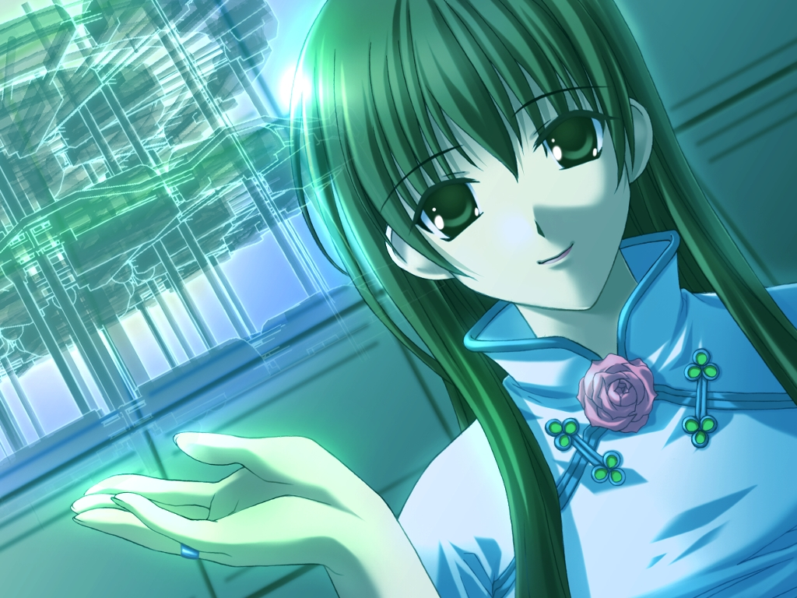
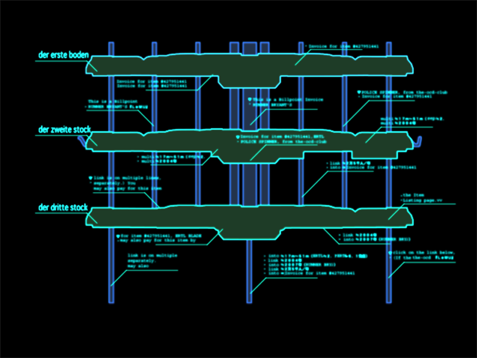
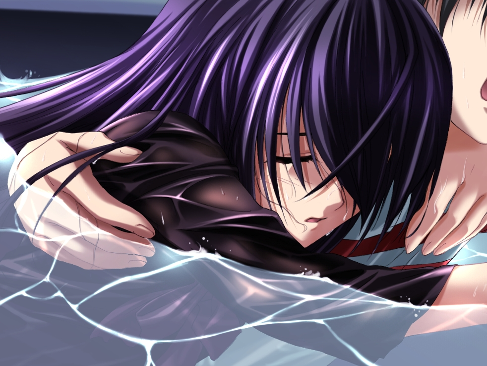
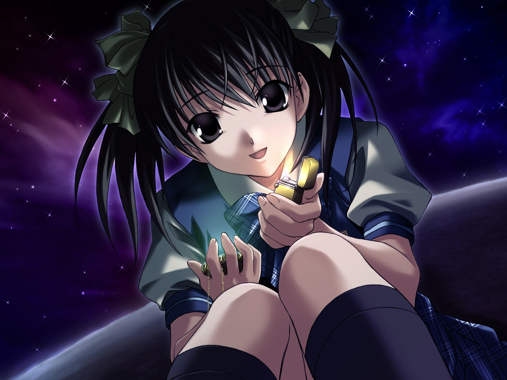
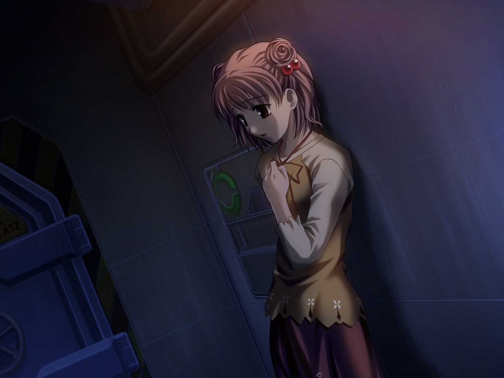
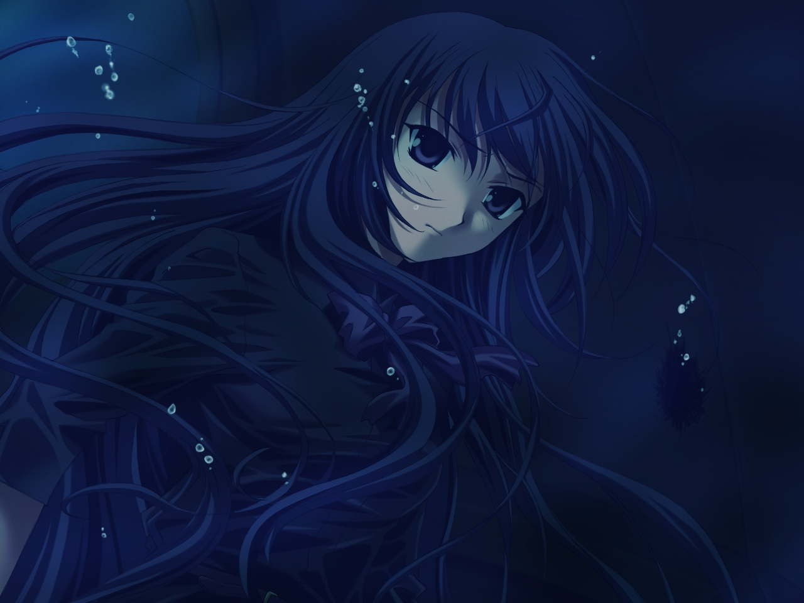
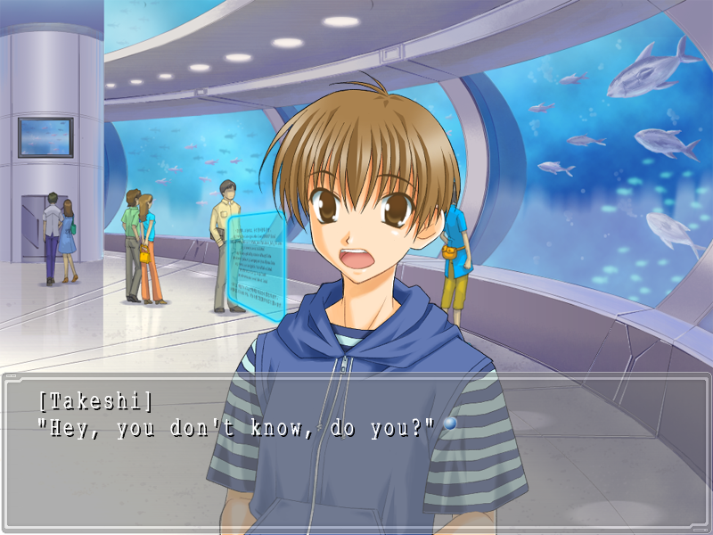
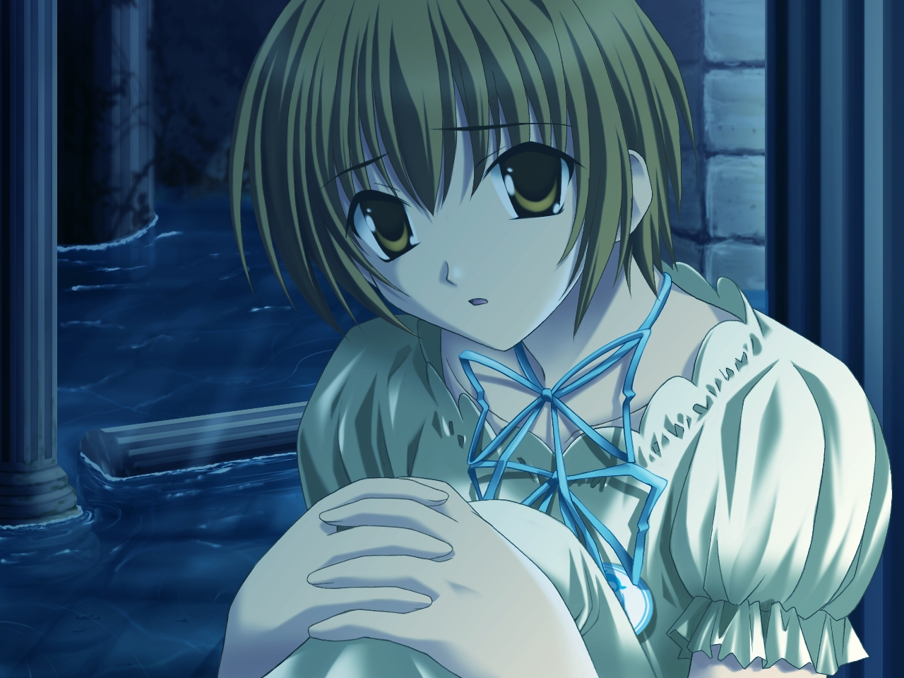
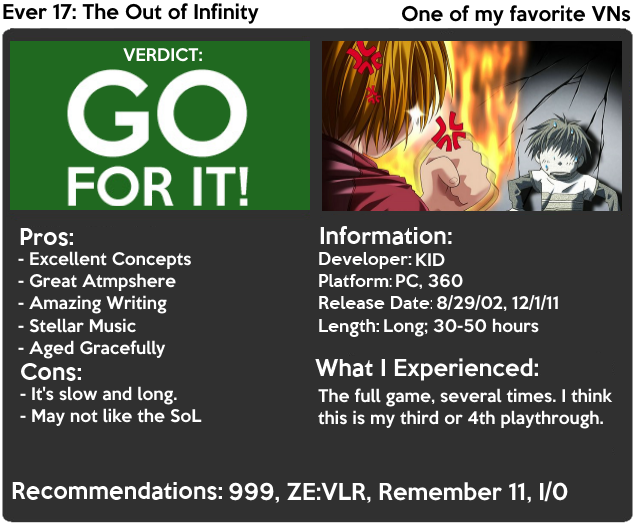

---
{
	title: "Rockmandash Reviews+: Ever 17: The Out of Infinity [Visual Novel]",
	published: "2014-11-03T21:30:00-05:00",
	tags: ["Rockmandash Reviews", "Ever 17", "Visual Novels", "Infinity Series", "Zero Escape", "Uchikoshi", "Amazing"],
	kinjaArticle: true
}
---

Have you ever experienced a work that left such a strong impression on you that it started to influence how you perceive everything else related to it? Has that experience rose to the top of your favorites because you liked it so much, but is obscure to the point that almost nobody you know has even heard of it? Whether you’ve have had this experience or not, today we’re going to review a game that influenced me in the very same way as that hypothetical. Welcome to Rockmandash Reviews and this is my a review+ of *Ever 17: The Out of Infinity*, a visual novel made by the now defunct KID and written by [Koutarou Uchikoshi](http://rockmandash12.kinja.com/rockmandash-reviews-infinity-zero-escape-marathon-w-1664979798), the writer of the well acclaimed [*999: Nine Hours, Nine Persons, Nine Doors*](http://rockmandash12.kinja.com/why-i-love-999-nine-hours-nine-persons-nine-doors-so-1688146811), and [*Zero Escape: Virtue’s Last Reward*](http://rockmandash12.kinja.com/zero-escape-virtues-last-reward-is-nearly-perfect-expe-1713427517)*.*

<video src="./1306104797334163626.mp4"></video>

If you are curious enough, here’s a link to my outdated [Video Review](https://www.youtube.com/watch?v=xINxrJM2YRk), the first review I’ve ever made (it took two weeks or more because I didn’t know anything about video editing :/). Looking back on it, it’s not very good, so I’ll redo this video review eventually. Also, if you want to dig up more of my poor writing, here’s the [original Written Review](http://rockmandash12.kinja.com/rockmandash-reviews-ever-17-the-out-of-infinity-visu-1504908037), and it’s equally as rusty.

 

Ever 17 is one of those stories that was so impactful to me that it bent my perception of how I viewed storytelling, and it redefined what I thought a good story was. It was an essential part of my [entry into the Visual Novel genre](http://tay.kotaku.com/why-i-love-visual-novels-so-much-and-how-i-got-into-th-1571227739), and it’s a game that I will always hold in high regard due to the fantastic execution of the story. *Ever 17* has a premise that holds unbelievable potential and the best part is that it nails the execution, squeezing all the setting has to offer (if you can get into it).

It’s a Kotaro Uchikoshi story through and through. Almost everything about the writing that people loved from the *Zero Escape* series originated from *Ever 17* (and the infinity series as a whole). The interesting premise, story progression, awesome concepts, amazing atmosphere, great mystery, mind blowing twists, and intriguing writing that one would expect from those games all came from here.

Let’s start with the premise: *Ever 17* tells a story of 7 people who get trapped in the underwater theme park called LeMU due to an accident. They have no communication with the outside world, no way to escape, and due to the difference in pressure, they only have 119 hours to live. As they try to find out a way to get out of the complex, they come across many aspects of this incident that feel off. As the clock ticks, the events begin to intensify, and the group begin to unravel the mysteries about the situation around them, and about themselves.

How could you not be interested in that? The premise itself is unique and interesting, and the way *Ever 17* handles it is something I really appreciate, focusing on character interactions, and mystery. A good majority of the story is character interactions, and this may be a plus or minus depending on who you are. *Ever 17* is primarily Slice of Life, and this may inhibit your enjoyment of the game. The tedium of going through these conversations may get on your nerves, and because it’s long and has slow pacing, this may be very frustrating if you do not enjoy this type of story. It’s common route may tire you, just like how Kid is tired of chicken sandwiches. I personally enjoyed it, but there were times where I got bored of it and started skipping on my first playthrough.

On the flipside, this time is used to develop the characters, and when they are developed in used in their routes, it can lead to great things. This is one thing that Ever 17 has over it’s spiritual successors: it has characters that are actually memorable. In *Ever 17*, there are 5 routes, 4 focused on one heroine (Two under Takeshi’s perspective, and the other Two under Kid’s perspective), with the last one (Coco’s route) serving as a true route that combines everything you’ve experienced into one amazing story. The character arcs are great because they both develop the heroine and the main character, and the interactions between said characters are interesting due to interesting aspects in the characters, and solid chemistry. It even has some enjoyable romance! (it’s not the main focus, but it’s still enjoyable.) While the characters basic personalities may be kinda archetypical, they all develop into something a bit more than a typical archetypical character, and they all have interesting and unique about them which ties into the story. They are all memorable to me, and they are all great characters that I love to see.

If character interactions are the meat of the plot, the mystery would be what pushes the story forward. The intrigue they build with the differences in the routes, the concepts they cover that don’t really get explanation, the weird things that shouldn’t happen, the other characters, they all urge you on. You never know what’s going to happen in the story, but at the end everything is pieced together in the last route, and it’s brilliant. You will want to binge through this game. This was one of the first VN’s I played, and I was absolutely hooked because of this sense of mystery, and I played through it every day until I was done. It was that good.

One of the strong points in Ever 17’s writing is that every story element is based on actual concepts of science and culture, and it’s execution helps flesh out the world. Just to list some of them, we have 4th dimensional beings, a 3rd eye, syphons, AI that’s nearly human, extremely lethal viruses, cloning, etc. Of course, this is all fiction, but the fact that it feels realistic adds to the story. It’s interesting, well explained, entertaining to read about, and a story element I really appreciate.

It’s the small things that add up, and they can have a big difference how you perceive a story. The small things that make me enjoy Uchikoshi’s writing is how he always builds a story that has an amazing premise, and then creates an atmosphere that is paralleled by few. *Ever 17* uses every aspect it has (including the perspective you play in!) to create an experience that gets you absorbed in, and this starts with the writing. It’s a story about being stuck in an underwater theme park, and the way it’s written makes you feel trapped. The killing of time, the occasional flooding, the way it’s written is a big part of the atmosphere it creates. Good world building is something I appreciate, and the way *Ever 17* does it is solid, with these interesting characters tied to interesting concepts, building a world with this beautiful water theme, and creating the feeling that you are trapped underwater.

Due to the routes being pretty similar to the others, your experiences add up, and you learn more and more about these characters and this world. When Coco’s route comes by, it uses everything you know to blow you away like a roller coaster. The last route is intriguing, interesting, exhilarating, and amazing with a glorious ending that answers almost any question you could throw at it. It’s one of the best I’ve seen. The ending is sort of like a Charles Dickens book, but not done in a dated way; everything’s wrapped up in a neat little bow, creating a satisfying conclusion. The best part? If you want more, there is an audio novel that is like an epilogue.

All of these aspects culminate to create a well written story with lots of depth and intrigue. Ever 17 is one of my favorite stories I’ve ever experienced, and due to the writing, it was a blast to experience. There’s the pacing that may bother some out there, but I didn’t really find anything wrong with it. I wish every story was like this: extremely intriguing, extremely enjoyable, and extremely interesting.

# **Writing - 10/10**

 

As of writing this review, *Ever 17* is the second oldest visual novel I have reviewed (The oldest being Tsukihime), originally coming out in 2002… and unlike what you would think, it hasn’t aged that badly when it comes to Visuals. In fact, many aspects of the visuals in *Ever 17* are still very pleasing to the eye, and it holds its ground in extremely well.

I can’t help but enjoy how it looks because it’s an underwater abandoned theme park, which is two great looking concepts (abandoned complexes, and water) put together to make a combo that looks pleasing to the eye. The water themes and the industrial aspects of LeMU are done pretty well, and the anime-esque CG was done at a decent enough resolution that it doesn’t look bad at all. There’s a consistent water-esque look to the game that helps add to the atmosphere, and it does a great job in making you feel like you are a part of it.

To be specific, the backgrounds of LeMu were pretty solid, the special CG for important scenes still hold up, the character art is some of my favorites from the era, and the game just looks pleasing to the eye in general. Of course there have been [better looking VN’s since](http://rockmandash12.kinja.com/rockmandash-reviews-ef-a-fairy-tale-of-the-two-visu-1646035015), but the fact that it looks this nice after all this time is fantastic. I think *Ever 17* held up this well due to a solid art style, good artists working on it, and a level of polish that kept it from aging horribly. A beautifully styled work will age much better than one that goes for technological prowess.

There are aspects that haven’t aged so well however; the sprites and the fonts have not aged that well. The sprites at times can look unnatural in the environments they are in, and the font just looks old. Really though, these won’t inhibit your enjoyment of the game at all, so it’s nothing to worry about.

> *Yes, the gif was just a snippet of this OP. Deal with it.*

In 2011, 5pb & Cyberfront gave *Ever 17* a 360 only remake, and with this remake came change, mostly visual. The game is finally in glorious 16:9 HD (note that the art is just HD-ified art from the original release... that’s how well this has aged) and the backgrounds look stunning, but the visuals did take a hit when it comes to character art: the horrible 3D models. These models look bad and the people who worked on them should feel bad. It looks like early PS2 polygon work, there’s no detail in the models at all. If the sprites stood out from the visuals, these models are skyscrapers in the middle of nowhere. I personally believe that they are way worse than the sprites. These will not age well, and they should have stuck with sprites...

Ignoring the remake’s horrible 3d models, the visuals in *Ever 17* have passed the test of time, and still look good today. This is a feat that many shows would dream of achieving, and it’s an aspect I enjoy.

# **Visuals - 8/10**

The soundtrack in *Ever 17* is one of my favorite soundtracks out there: it’s one of those soundtracks that are great in the game, but are so solid that you can listen to them at almost any time and they’ll still be enjoyable. I’ve never gotten tired of listening to the soundtrack in the game, and I doubt you will either.

The soundtrack itself overall isn’t particularly mind blowing, with most of it composed of atmospheric pieces, but it does have some standouts like Karma. The atmospheric nature is also an aspect of why the soundtrack is so good though; it’s the atmosphere, a mood, and uses its music very well. In my opinion, music in media is made to manipulate the emotions, and along with the visuals, create a feeling of existence in the world. Due to the fact that we do not exist in these experiences, these works have to try absorbing us into the world by creating an atmosphere that is engaging and a mood that interests the viewer. *Ever 17* has a soundtrack that does this atmosphere building to near perfection, and this soundtrack is a big part of that process. It really takes the writing and story up by a few levels, and creating a soundtrack like this is what every work should strive for.

One of the best parts of this soundtrack is how it fits with the themes of the game, with a smooth, watery feel that helps make this soundtrack blend into the location. The happy and upbeat tracks like [Lemurianishce Ruine ](https://www.youtube.com/watch?v=h99YYncmzeY)sound bubbly and entertaining, the more normal tracks like [Hologramm ](https://www.youtube.com/watch?v=5K5PsF5Y2dM)sound smooth, the tracks like [Karma](https://www.youtube.com/watch?v=zkvQte7JWpw) have a serene and calming feel, yet have the feelings it intends, and the intense tracks like [IBF Notfall](https://www.youtube.com/watch?v=hMiO3ZbyxQY) are like water flooding in, with all the swiftness and dread that comes with it. Really, it’s a phenomenal soundtrack, and it’s very pleasing to the ear.

Considering the age of *Ever 17,* you probably wouldn’t expect voice acting, but it’s here and it’s pretty good! The voice actors do a pretty good job portraying the characters and the emotions that come with them, which I really appreciate. The sound clips seem like they have low sampling rates and are compressed a bit, but it doesn’t really get in the way of your experience.

When 5pb decided to remake *Ever 17* in 2011, they also decided to remake the soundtrack... and it’s hit and miss. Some aspects are better, with more instruments, and cleaner sound... but a lot of the charm and smoothness from the original soundtrack is gone, which causes some tracks to sound worse in comparison (Insel null is a great example of this: [360](https://www.youtube.com/watch?v=BjVzqA41neg\&list=PL3E52C022C271E4DD\&index=1) vs [PC](https://www.youtube.com/watch?v=mmuLlROPVLo))

Ignoring the crummy remixes, *Ever 17* has a soundtrack that I love. While the tracks themselves may not be the greatest thing since sliced bread, they sound nice, and the execution is stellar.

# **Sound - 9/10**

 

I’m pretty sure I gushed over it enough in this review, but if it hasn’t sunk in, I love *Ever 17*. It hits all the buttons on what I’d find enjoyable: the writing style is one I fell in love with, I’m a big fan of the soundtrack, the atmosphere is something to die for, the characters are fantastic, and the last route... that was something else. Everything about Coco’s route was just so amazing, seeing all the time you sank being resolved in an extremely interesting way was the greatest thing ever. I was so blown away by it that I [fell in love with a genre](http://tay.kotaku.com/why-i-love-visual-novels-so-much-and-how-i-got-into-th-1571227739) then started doing internet reviews about it. (Yes, this was my inspiration for reviews and that’s why my original review for this was the first review I had done). It’s impacted how I enjoy a story, and it’s an essential part of who I am.

Also, I didn’t think this warranted it’s own segment, but I found it interesting: *Ever 17* got a manga adaptation. It’s a pretty low budget, poorly done manga, but it exists, and the fact that it does makes me happy.

# Enjoyment - 10/10

*Ever 17* has a story that’s intriguing, focused, creates an atmosphere that many should strive for, and is my gauge on what is great, with everything else complimenting it. While it’s not perfect, its flaws have never inhibited my enjoyment of this game. This is one of the best Visual Novels I have had the chance to experience, and it’ll always be one of my favorites.

If you’ve enjoyed *999* or *Zero Escape: Virtue’s Last Reward*, this is a must. You’ll love it just as much as I do. If you haven’t, you may find *999* and *VLR* more accessible, but I’d view this as a must play for you. If there was only one recommendation you would take from me from all my reviews thus far, it’s this one. Seriously. Go play this.

# **Overall - 9.5/10, Polarization +.25, -2**

 

***

**Copyright Disclaimer:** Under Title 17, Section 107 of United States Copyright law, reviews are protected under fair use. This is a review, and as such, all media used in this review is used for the sole purpose of review and commentary under the terms of fair use. All footage, music and images belong to the respective companies.

*You can see all my reviews on *[*Rockmandash Reviews*](http://tay.kotaku.com/tag/rockmandash-reviews)*. For An explanation of my review system, *[*check this out*](https://rockmandash12.kinja.com/rockmandash-rambles-an-explanation-on-my-review-system-1619265485)*.*

*Once again, thanks to Protonstorm for helping with this review. I really appreciate everything you do to help. :D*

*Note: Ever 17 doesn’t play nicely with newer versions of windows out of the box, due to some lazy coding that involves text. To get it working, replace the main exe with*[*this one*](http://goo.gl/mFdncf)*.*
