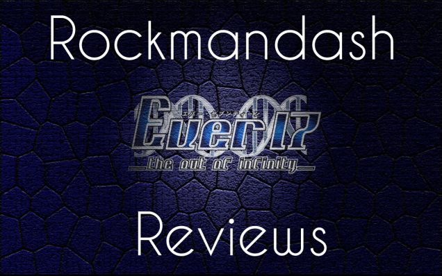

---
{
	title: "Rockmandash Reviews: Ever 17: The Out of Infinity [Visual Novel] - ARCHIVE",
	published: "2014-01-20T00:26:00-05:00",
	tags: ["rockmandash reviews", "tayclassic", "ever 17 the out of infinity", "ever 17", "999", "visual novel", "tay review"],
	kinjaArticle: true
}
---

To those who came and found this from google or something, Please check out my [re-done review](https://rockmandash12.kinja.com/rockmandash-reviews-ever-17-the-out-of-infinity-vis-1626111485) of Ever 17 as it's much better written and executed in general. This review is here for archival purposes, but it does not completely represent my thoughts on the game, or the quality of writing of reviews I make now. This message was written on 11/13/14, and I originally wrote this review on 2/1/13 ([for my video and forums I used to go to](http://petesgameroomforum.com/topic/5061836/1/).)

[](https://rockmandash12.kinja.com/rockmandash-reviews-ever-17-the-out-of-infinity-vis-1626111485)

###### [Rockmandash Reviews+: *Ever 17: The Out of Infinity* \[Visual Novel\]](https://rockmandash12.kinja.com/rockmandash-reviews-ever-17-the-out-of-infinity-vis-1626111485)

Have you ever experienced a work that left such a strong impression on you that it started to…

[Read more](https://rockmandash12.kinja.com/rockmandash-reviews-ever-17-the-out-of-infinity-vis-1626111485)

Welcome to Rockmandash Reviews and this is actually one of my very first reviews I've wrote and did, so coming back to this in a review for TAY is quite interesting. This game is Ever 17, a PC Sci-fi visual novel game from the now defunct KID. The game is written by the same writer as 999, and Zero Escape: Virtue's Last Reward. I love this game, and it's in my top 10 favorite games of all time. This one is overlooked by many people, and I'm here to change that.

Link to [Video Review](https://www.youtube.com/watch?v=xINxrJM2YRk)

### Plot and Charecters:

Yea, I know what you're thinking, a Visual Novel? Why would I ever want to play one of those? Aren't those all about love and stuff? Not this time. The game is much more a sci-fi mystery game than anything. There's a bit of the traditional Visual novel stuff like dating, but it's only to get the endings. This game is based all around the plot and I'll try not to spoil anything to the best of my abilities. The game is about 7 charecters, 2 of which are playable characters, trapped in an underwater theme park LeMU, because all of the exits get flooded. Due to water pressure, they have to escape in 5 days. They have no contact with the outside world, and they cannot swim out. There are a lot of mysteries and stuff that make your mind EXPLODE. 4th dimensional beings, chicken sandwiches, 3rd eye, fluctuating bio readings, IBF, etc. The plot is amazing.

The 7 characters are: Takeshi Kuranari, One of the protagonists, who's a college student. Kid, a person with amnesia…. REALLY? He's sort of boring, but he's ok. You, no not you, but You Tanaka, an employee looking for her father, who is sort of annoying at some times, but is great at others. Tsugumi Komachi, a mystery girl who seems really annoying at first, but becomes one of your favorite characters at the end, Sora Akanegasaki, an AI that works for LeMU, who is pretty cool. Sara Matsunaga, a hacker, whose plot point just confused the flip out of me, and thinks is a ninja, and is only in Kid's story. Lastly, Coco Yagami, a student who acts like she's 7, seems annoying but is a great character, and is strangely only in Takeshi's story. The characters are great, the setting is great, and the plot is excellent. The writing is great, and the character development is superb, there are lots you learn about the characters that you are trapped with. You never know what's going to happen with the characters or the plot on your first few runs, but at the end everything is pieced together. In the game, everything is important, it's ridiculous. I have nothing but praise about the story, it's amazing. The story is the closest to perfect I've seen in a long time, and is overall great, especially the last route. The ending is sort of like a Charles Dickens book, all the mysteries and secrets are wrapped up at the end, and if you want more, there is an audio novel that is like an epilogue. The Plot is everything about this game, and it does it very, very well.

#### Plot and Charecters - 10/10

### Gameplay:

The gameplay is standard visual novel fare, you select options to do things, and that's it. The game has multiple routes, like every game in the genre has. Until you get to the true ending, you are stuck in an infinity loop; the same 5 days will replay over and over again. This is one of the only games that I feel that playing as 2 characters makes sense, and it really works well. Playing the game is like playing a chose your own adventure book, which I love. You select options to get a good ending for a girl, and you need to get 4 endings, 2 per timeline, to get the last route. You need to replay the game several times, but the game has a great shortcut system so it's not that hard to do so. It's a lot of reading, and your choices influence the path you are taking, so it's not for everyone, but for those who like it, it's good enough.

#### Gameplay: 8/10

### Music:

The music. IT'S ABSOLUTELY OUTSTANDING. The music make the mood, and take the game up a few levels. It's some of the best you will listen to in a game and you'll want to listen to it over and over. The best part of these songs, is the tone of them. They really do fit the location. The most happy and upbeat tracks have a bit of creepiness, and it all works well. Karma, one of the saddest songs in the game, is a piano track and it's one of the most memorable pieces in the game. The songs that add tension, like IBF Notfall, work well and you never get sick of hearing them. These songs are so good that they never get old listening to them via MP3 or via the game. It's a phenomenal soundtrack.

#### Music - 10/10

### Art & Graphics:

Considering that this game is 10+ years old, it's pretty darn good looking. The environments are great, some of the scenes look perfect. The game looks great, considering the age. I like the art style, nothing looks out of place, and it fits with the theme. I really love how some of the things look nice, but I never really notice anything bad. I love how the characters are drawn, looks much better than if they did models, like in the Japanese only 360 remake. The theme itself is amazing. It's an underwater abandoned theme park, and that's amazing. Everything has a water like feel, this is a beautiful game, expecially when you consider it's age.

#### Art & Graphics - 8/10

### Replay Value:

(this is an old section I don't have anymore lol) Like I said before, you need to play multiple endings to get to the final ending. That adds a lot of replay value, to see all the endings and to try to get all the endings. You will play it over and over again until you will get the last ending, because the plot is so mysterious. Playing this game over again is like re-watching a very good movie. You know what's going to happen, and your anticipating it. There are many things that make it easy to replay, so it's great. The game has a lot of unlockables, which make it worth your time to go through every nook and cranny, but I doubt you're going to use these wallpapers. There is a ton of replay value, and the game is a lot of fun to replay.

#### Replay Value - 9/10

### Conclusion:

This is an amazing game that everybody should play. It has a great plot, looks decent, great sound track, great game overall, and is one of my favorites.

### Overall - 9.75/10 Rockmandash Remarkable

### Pros:

Great Music

Great Writing

EVERYTHING

### Cons:

..... none?

***

**Copyright Disclaimer:** Under Title 17, Section 107 of United States Copyright law, reviews are protected under fair use. This is a review, and as such, all media used in this review is used for the sole purpose of review and commentary under the terms of fair use. All footage, music and images belong to the respective companies.

*You can see all my reviews on *[*Rockmandash Reviews*](http://tay.kotaku.com/tag/rockmandash-reviews)*. For An explanation of my review system, *[*check this out*](https://rockmandash12.kinja.com/rockmandash-rambles-an-explanation-on-my-review-system-1619265485)*.*

###### [Rockmandash Rambles: *An Explanation on my Review System* (Updated 11/15/2015)](https://rockmandash12.kinja.com/rockmandash-rambles-an-explanation-on-my-review-system-1619265485)

If you’ve read any of my reviews and wanted to know why I did them the way I do, here’s an…

[Read more](https://rockmandash12.kinja.com/rockmandash-rambles-an-explanation-on-my-review-system-1619265485)

*This game is available on *[*Fuwanovel *](http://fuwanovel.org/novels/ever17-the-out-of-infinity)*for download.*\
**