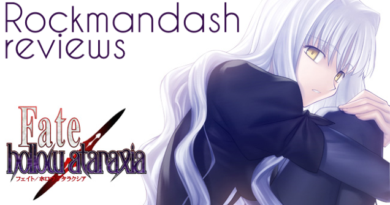
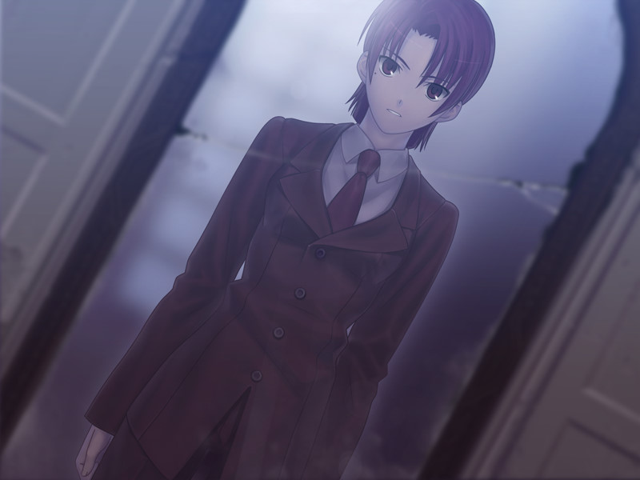
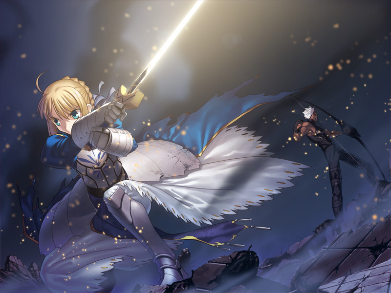
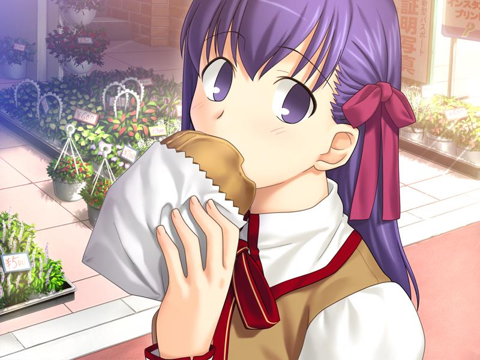
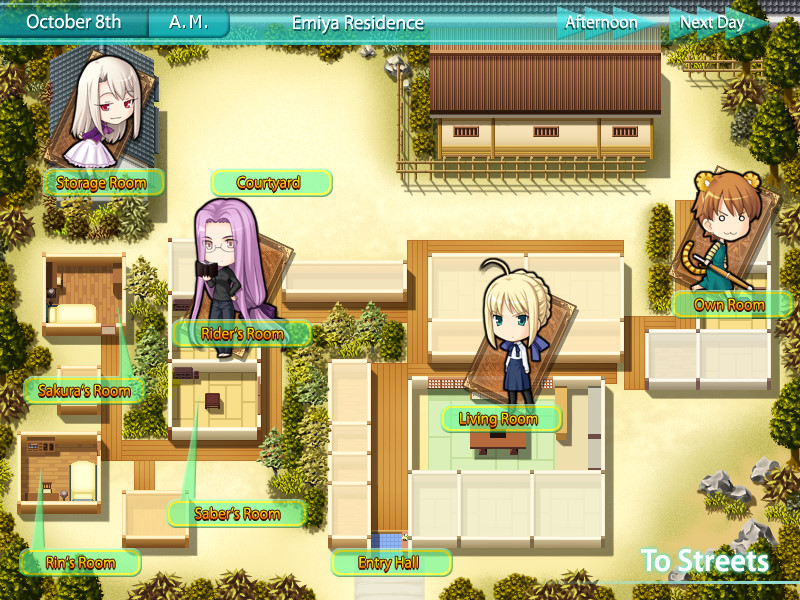
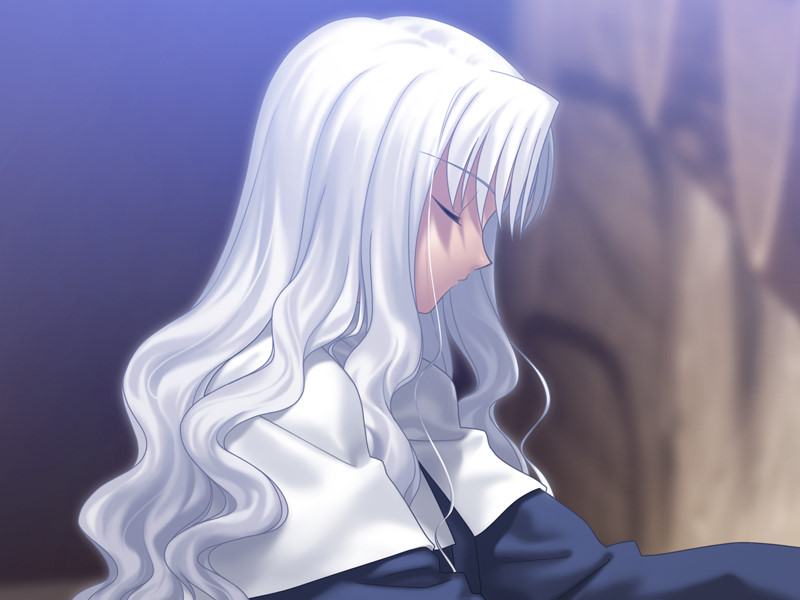
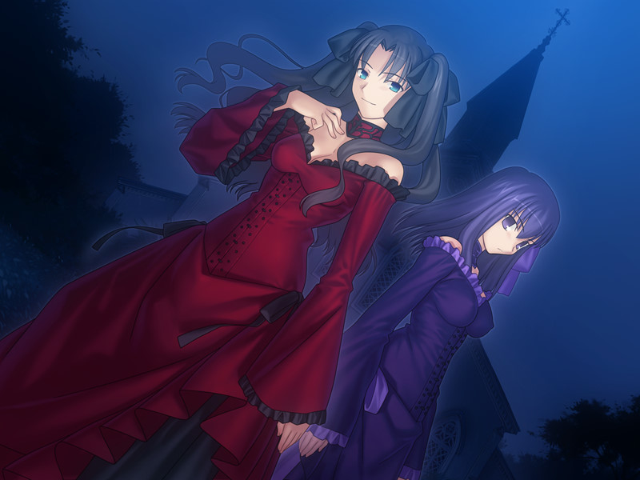
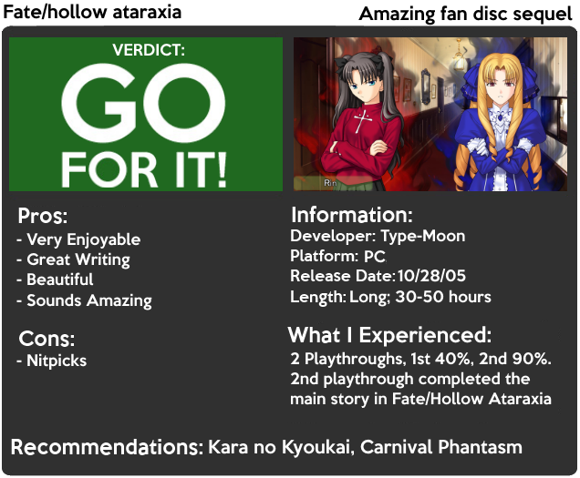

---
{
  title: "Rockmandash Reviews: Fate/hollow ataraxia [Visual Novel]",
  tags:
    [
      "rockmandash reviews",
      "fate hollow ataraxia",
      "fate",
      "type moon",
      "review",
      "Type-Moon Marathon",
    ],
  published: "2014-08-03T20:00:00-04:00",
  attached: [],
  license: "cc-by-4",
  oldArticle: true,
}
---

 If you haven't noticed, I'm a big fan of Type Moon, and their most prominent series, the
  Fate Series. That being said, if you asked me what my favorite <a class="sc-1out364-0 hMndXN sc-145m8ut-0 gIacKn js_link" data-ga='[["Embedded Url","Internal link","http://tay.kotaku.com/type-moon-marathon-wip-1534726534?rev=1406682520485",{"metric25":1}]]' href="http://tay.kotaku.com/type-moon-marathon-wip-1534726534?rev=1406682520485">Type-Moon</a> game was, you
  wouldn't get the typical F/SN or Tsukihime; Instead, my response to you would be what we have for review today: <em>Fate/hollow
    ataraxia</em>.

<em> Fate/hollow ataraxia</em> is a sequel set a half of year later, after all
  endings in <em>Fate/stay night</em>. How does that work, you may ask? A magical accident goes horribly wrong, messing
  with time and space, causing everybody who died in the 5th holy grail war to come back to life, with the 5th holy
  grail war starting up again. To me, that sounded like a huge excuse to continue the plot, and if there is an excuse to
  continue a story that's more BS than that, I'd like to hear it. Just to prove how absurd it is, in an interview with
  the writer, Nasu said 

<blockquote class="sc-8hxd3p-0 nvIqO" data-type="BlockQuote">
 "It's best if you don't
  think too much about it (laugh)." 
</blockquote>

 Because I'm too lazy to write up my own plot summary, and Wikipedia does a good job
  in summarizing it, I'm just going to use theirs.

<blockquote class="sc-8hxd3p-0 nvIqO" data-type="BlockQuote">
 Bazett Fraga McRemitz, a
  member of the Mages' Association and a master in the 5th Holy Grail War, wakes on the fourth day of the 5th Holy Grail
  war with a new servant, Avenger, and no memory of what happened to her beforehand. She and Avenger set off to fight
  and win the Holy Grail. 

 Meanwhile, Shirou Emiya lives a peaceful life with all his friends from the 5th Holy
    Grail War. The Servants sense a new danger while dark creatures appear soon afterward. Shirou sets off to ensure
    nobody is in danger and finds himself frequently meeting a mysterious girl, Caren Ortensia. 

 Both Bazett and Shirou find themselves in time loop that lasts four days, beginning of
    the fourth day of the 5th Holy Grail War. Each time they die or survive four days, they always awake on the first
    day of the loop aware of what has happened to them since the first time loop began. Determined to end the loop,
    Bazett, Avenger, and Shirou fight to discover the truth behind what's causing the endless four days. 

</blockquote>

 While the premise of this story might seem quite generic given the whole groundhog
  day plot, (and the fact that it's eerily similar to <em>Kagetsu Tohya, </em>another Type-Moon game), that's not really
  the point. It might not have the large scope like the other stories in the Fate series, but it's not necessarily a bad
  thing, because it leads to a more focused narrative. What makes <em>Fate/hollow ataraxia</em> special is not the
  premise, but the execution: almost everything about this story is executed very well, with the only exception being
  the ending. While enjoyable, it's anti-climactic and uses a <a class="sc-1out364-0 hMndXN sc-145m8ut-0 gIacKn js_link" data-ga='[["Embedded Url","External link","http://tvtropes.org/pmwiki/pmwiki.php/Main/DeusExMachina",{"metric25":1}]]' href="http://tvtropes.org/pmwiki/pmwiki.php/Main/DeusExMachina" rel="noopener noreferrer" target="_blank">Deus Ex Machina </a>to
  wrap up the story, which is extremely frustrating, given how great the rest of the story is.

The more serious elements of the story are done extremely well with no major writing
  issues: it has stellar pacing, intense writing that keeps you interested, and a fantastic atmosphere. The atmosphere
  is what pushes this from great to amazing in my eyes: It's an atmosphere that absorbs you in, engages you with the
  story and makes you crave more. It's one that makes you feel like you are part of this world and the conflict that is
  going on, and it attaches you to the story. This atmosphere is very apparent in Bazett's segments, where the utilized
  it to balance the mystery, and tension beautifully. Also, like every Type-Moon work, F/HA has interesting themes and
  ideals floating around, and the way it executes it's theme of falseness is intriguing, interesting, and well
  integrated into the story. It's little things like integrating your title into the story without making it obvious
  that helps games like <em>Fate/hollow ataraxia</em>, and these little things are what make games interesting and
  memorable.  That being said, <em>Fate/hollow atraraxia</em> is a much more light hearted story than any of
  Type-Moon's other games: the tone is like a mixture between <a class="sc-1out364-0 hMndXN sc-145m8ut-0 gIacKn js_link" data-ga='[["Embedded Url","External link","http://rockmandash12.kinja.com/rockmandash-reviews-fate-stay-night-visual-novel-1493594993",{"metric25":1}]]' href="http://rockmandash12.kinja.com/rockmandash-reviews-fate-stay-night-visual-novel-1493594993" rel="noopener noreferrer" target="_blank"><em>Fate/stay night</em></a> and <a class="sc-1out364-0 hMndXN sc-145m8ut-0 gIacKn js_link" data-ga='[["Embedded Url","Internal link","http://tay.kotaku.com/rockmandash-reviews-carnival-phantasm-ani-tay-1546038401",{"metric25":1}]]' href="http://tay.kotaku.com/rockmandash-reviews-carnival-phantasm-ani-tay-1546038401"><em>Ca</em></a><a class="sc-1out364-0 hMndXN sc-145m8ut-0 gIacKn js_link" data-ga='[["Embedded Url","Internal link","http://tay.kotaku.com/rockmandash-reviews-carnival-phantasm-ani-tay-1546038401",{"metric25":1}]]' href="http://tay.kotaku.com/rockmandash-reviews-carnival-phantasm-ani-tay-1546038401"><em>rnival Phantasm</em></a><em>.</em>
  It has the seriousness of <em>Fate/stay night</em> at times, but it also has the exaggerated silliness of <em>Carnival
    Phantasm. </em>The best part? It manages to excel at both. It doesn't just shaft either tone.... instead it
  prioritizes them as equally as they possibly can, and seeing this balance is something I love. If you are coming from
  <a class="sc-1out364-0 hMndXN sc-145m8ut-0 gIacKn js_link" data-ga='[["Embedded Url","Internal link","http://tay.kotaku.com/rockmandash-reviews-fate-zero-ani-tay-1538163593",{"metric25":1}]]' href="http://tay.kotaku.com/rockmandash-reviews-fate-zero-ani-tay-1538163593"><em>Fate/Zero's</em></a>
  cold seriousness, this might be a turn off, but if you are like me and enjoyed the humor of <em>Carnival Phantasm</em>,
  you will love this. <em>Fate/hollow ataraxia</em> is so enjoyable to me because it's like a compilation of everything
  that I enjoy about Type-Moon works: Great writing, hilarious comedy, and intriguing themes that make the works
  entertaining throughout.

 No matter what tone <em>Fate/hollow ataraxia</em> utilizes, it excels in creating
  excellent scenes that are interesting and enjoyable. It has a high quality of writing that is consistent throughout,
  with almost every scene helping to develop characters, have interesting character interactions or just be flat out
  enjoyable to the reader. These scenes, which range from a simple things like eating food, to epic fights, is something
  that really make the story great and help the enjoyment of the game. Even though a good majority of characters already
  have a great deal of development due to <em>Fate/stay night</em> being way longer than it needed, the extra
  development is appreciated and the development with the new characters like Caren and Avenger was absolutely great.

I can go on and on about how great the writing is in <em>Fate/hollow ataraxia,</em>
  and how well it does every little thing, but i'll spare you the gushing. It's like a compilation of everything great
  about Type-Moon stories to me, and it's a story I can't help but enjoy. It's well written, very enjoyable, and does
  very little wrong. 

<h4 class="sc-1bwb26k-1 fvCjqJ" id="h118172">Writing - 10/10</h4>

 Due to <em>Fate/hollow ataraxia's</em> interesting way of plot progression, this
creates an interesting means of gameplay. It creates a semi-linear plot, with the main plot being broke into chapters
and told in a straight line, but for all the side stories, it's very open: you can do most of the events in any order
you feel like. You switch between the perspectives of Bazett and Shirou; at the beginning of each chapter you have the
kinetic novel-like Bazett segments, then you play with Shirou for the rest of it. When you are playing Shirou, it's 4
days, each day broken up into 4 segments (morning, noon, afternoon, night) in which you see one event. Each character
represents an event and when there's an event you haven't seen, there's either a NEW or ! that pops up. All ! events
are for the story, while the NEW ones are just things on the side. The big kicker to the gameplay? Saves act as
quick-saves and you can't make a ton of them, and you have to continue where you were at. 

 This system of gameplay gives you a lot of control on the pace you want to go at:
  you can fool around with all the Slice of Life side scenes, and have slower SoL pacing, or you can go straight to the
  important stuff and have a very tight, almost thriller-esque story. I did a mix of the two depending on my mood, and I
  absolutely loved the amount of control they give you when it comes to pace; it's like a book in that aspect. This
  makes you feel more like you are actually progressing through the plot with Shirou, and accompanied by the ability to
  change the pace makes for a game that is a change of pace for visual novels (pun intended). I loved this aspect of it,
  and it made for an engaging experience that you typically don't see in a visual novel.
<h4 class="sc-1bwb26k-1 fvCjqJ" id="h118173">Gameplay - 9/10</h4>

 If you haven't noticed, this game is pretty. While a good majority of art is
just carryovers from Fate/stay night, but all the new stuff is amazing and there's quite a bit. This is really the
first truly modern Type-Moon work in my eyes, and it has some absolutely beautiful CG. Even though it's only a year
after F/SN, it's aged so much better. It's so polished, beautiful and detailed; It's a game with style, one that uses
style to get over technological feats. I also really appreciate all the visual effects this game has, like the simple
omake-esque art, to more advanced things like bokeh, and it really spices it up makes the visuals into something
special. Even b etter than that though... is those amazing fight scenes. While being a Visual Novel, they have so much
art, and the motion is so fluid that it's like watching an anime. The archer fight with saber was just brilliant...
It's fantastic and I love it. 

 Also, just like its predecessor, This is an eroge... soo.. <strong> QUE THE
  OBLIGATORY EROGE WARNING HERE</strong>. That being said, most of the H scenes are completely optional, which is nice
  but there's one at the end of the game that you'll have to get through to finish the story, so be aware of that.

<h4 class="sc-1bwb26k-1 fvCjqJ" id="h118174">Visuals - 9/10</h4>

<iframe allow="accelerometer; autoplay; clipboard-write; encrypted-media; gyroscope; picture-in-picture" allowfullscreen="" frameborder="0" height="315" src="https://www.youtube.com/embed/0Z0S2h9aiFk" width="560"></iframe>

 Icing on the cake. That's what this soundtrack is. Wonderful. Personally, I wasn't a big
  fan of F/SN's soundtrack, so stepping into F/HA's was something that blew my mind. <em>Fate/hollow ataraxia</em> has
  variety, extremely memorable tracks, and is just composed well. There's some really stellar stuff in here, and almost
  always you'll be listening to something that's pleasing to your ear. This soundtrack does it all: great usage, sets up
  an atmosphere that works extremely well, is great to listen to outside of the game, and manages to blow your mind. One
  thing to note though is that there's no voice acting like in <em>Fate/stay night</em>, which sucks, but considering
  how great the soundtrack is, it's not a really big deal.

<h4 class="sc-1bwb26k-1 fvCjqJ" id="h118175">Sound - 9.25/10</h4>

 My issue with so much of Type-Moon stuff is that a good majority have a huge
flaw. Tsukihime has it's low production values, <em>Kara no Kyoukai</em> has an insanely high barrier of entry, <em>Fate/stay
night</em> is way too long for it's own good, and <em>Fate/Zero</em> was really boring due to the characters. <em>Fate/hollow
ataraxia</em> has none of this. Unlike the others, this game is constantly trying to entertain you, and I've been
entertained. Fate/hollow ataraxia is probably the most fun I've ever had playing a VN.... totally serious here.

 I first played this on the 3.1 official translation, and only got about 40 percent
  through the game because the translation wasn't anywhere close to done. Even though I never even got close to
  finishing it, I loved the hell out of it, and I called it my favorite type moon work.... with 40% DONE! When I went to
  play through it this time... I loved it just as much! Replaying it didn't hinder my experience at all; that's how
  enjoyable this game is.

 The list of great things about <em>Fate/hollow ataraxia</em>
  can go on and on... The references from<em> Fate/Zero</em> and <em>Fate/stay night</em> were entertaining, the world
  building was outstanding, the balance of slice of life and plot was great, the game has a great sense of humor, and
  overall... I love <em>Fate/hollow ataraxia</em>.

<h4 class="sc-1bwb26k-1 fvCjqJ" id="h118176">Enjoyment - 10/10</h4>

 If you haven't gotten the message yet, <strong>I love <em>Fate/hollow ataraxia</em></strong>.
  How can a small fan disk sequel be better than the original game that spawned a huge series that's adored by tons of
  fans? Simple. By being much more entertaining, improving upon it's predecessor every way, and having a charm that few
  games can match. It's a great game, and hope you'll love it just as much as I did.
<h3 class="sc-1bwb26k-1 fvCjqJ" id="h118177">OVERALL - 9.5/10, Polarization -1</h3>

<strong>Copyright Disclaimer:</strong> Under Title 17, Section
  107 of United States Copyright law, reviews are protected under fair use. This is a review, and as such, all media
  used in this review is used for the sole purpose of review and commentary under the terms of fair use. All footage,
  music and images belong to the respective companies. 

<em>You can see all my reviews on </em><a class="sc-1out364-0 hMndXN sc-145m8ut-0 gIacKn js_link" data-ga='[["Embedded Url","Internal link","http://tay.kotaku.com/tag/rockmandash-reviews",{"metric25":1}]]' href="http://tay.kotaku.com/tag/rockmandash-reviews"><em>Rockmandash Reviews</em></a><em>, and the rest of
  my </em><a class="sc-1out364-0 hMndXN sc-145m8ut-0 gIacKn js_link" data-ga='[["Embedded Url","External link","https://rockmandash12.kinja.com/type-moon-marathon-wip-1534726534",{"metric25":1}]]' href="https://rockmandash12.kinja.com/type-moon-marathon-wip-1534726534" rel="noopener noreferrer" target="_blank"><em>Type-Moon Marathon here</em></a><em>. For An explanation of my
  review system, </em><a class="sc-1out364-0 hMndXN sc-145m8ut-0 gIacKn js_link" data-ga='[["Embedded Url","Internal link","http://tay.kotaku.com/rockmandash-rambles-an-explanation-on-my-review-system-1619265485",{"metric25":1}]]' href="http://tay.kotaku.com/rockmandash-rambles-an-explanation-on-my-review-system-1619265485"><em>check this out</em></a><em>. </em>

<aside class="sc-1rh3ayr-6 jfFNjl inset--story branded-item branded-item--kinja" data-commerce-source="inset">

<a class="sc-1out364-0 hMndXN js_link" data-ga='[["Permalink page click","Permalink page click - inset headline"]]' href="https://rockmandash12.kinja.com/type-moon-marathon-wip-1534726534" rel="noopener noreferrer" target="_blank"><h6 class="sc-1rh3ayr-3 jRIPES">
    Rockmandash Reviews: <i>Type-Moon Marathon</i></h6></a>

In preparation for the Fate/stay night: Unlimited Blade Works Adaptation by Ufotable,
      I decided to…
<a class="sc-1out364-0 hMndXN sc-1rh3ayr-0 kOvmIi js_readmore inset--story__readmore js_link" data-ga='[["Permalink page click","Permalink page click - inset read more link"]]' href="https://rockmandash12.kinja.com/type-moon-marathon-wip-1534726534" rel="noopener noreferrer" target="_blank">Read more</a>

</aside>

<em>This game is available on </em><a class="sc-1out364-0 hMndXN sc-145m8ut-0 gIacKn js_link" data-ga='[["Embedded Url","External link","http://fuwanovel.org/novels/fate-hollow-ataraxia",{"metric25":1}]]' href="http://fuwanovel.org/novels/fate-hollow-ataraxia" rel="noopener noreferrer" target="_blank"><em>Fuwanovel </em></a><em>for
  download.</em>

<em>Note: This review was edited on 10/29/14 to improve the writing
  section, and at 11/13 to improve flow.</em>

<em>If you are interested in a video review, I made one here:</em>

<iframe allow="accelerometer; autoplay; clipboard-write; encrypted-media; gyroscope; picture-in-picture" allowfullscreen="" frameborder="0" height="315" src="https://www.youtube.com/embed/QmvRJTGTmKI" width="560"></iframe>

