---
{
  title: "Rockmandash Reviews: Fate/kaleid liner Prisma☆Illya [Anime & Manga]",
  tags:
    [
      "Rockmandash Reviews",
      "Fate/kaleid liner Prisma Illya",
      "Review",
      "Tay-Classic",
      "Ani-TAY",
      "Fate/illya",
      "Type-Moon",
      "Summer 2014",
      "Type-Moon Marathon",
    ],
  published: "2014-09-14T12:00:00-04:00",
  attached: [],
  license: "cc-by-4",
  oldArticle: true,
}
---

When the first thing you think of when you hear about a series is “Why does it exist?” you
  know you are for a confusing ride. This is a series that baffled me, then broke my baffled expectations. Today, we
  have a review for Fate/kaleid liner Prisma Illya; a spinoff that is better than you probably think it is.

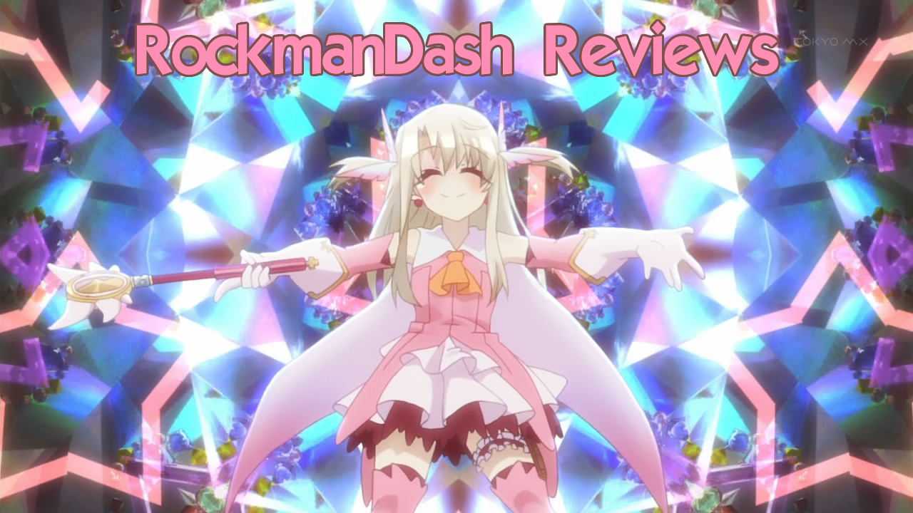

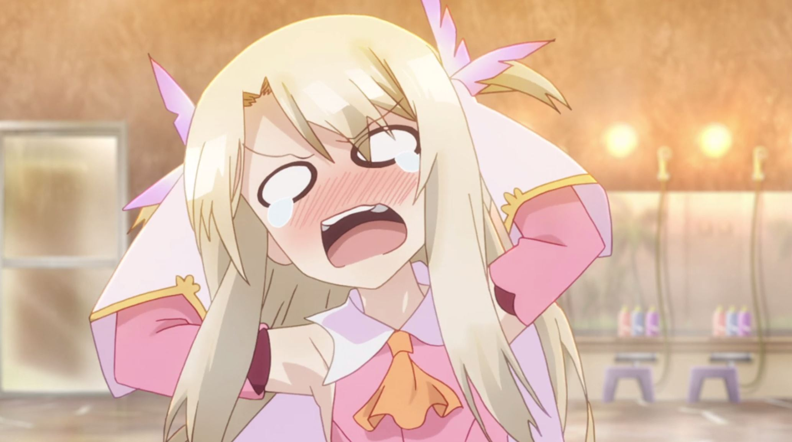
<blockquote class="sc-8hxd3p-0 nvIqO" data-type="BlockQuote">
<strong>Caption:</strong> My
  reaction after I learned 2wei was split-cour, and after kinja ate my review. Rewriting reviews is not really fun.

</blockquote>

Like most anime, Fate/illya is an adaptation of an existing work (This time it’s a
  manga adaptation). For this review, I read through the manga right after Season 1 ended (and read through 3rei near
  the end of 2wei Pt.1), and what I found was that it’s scary how well adapted this show is. What I find most impressive
  is how well it gets the “essence” of the source material. While most anime are adaptations of the same work, they
  “feel” different. What I mean by this is that when you compare the two versions, they usually have a different style,
  tone, etc and it can feel like a different work. Sometimes when I do a review of a work with an adaptation, the change
  in execution is quite apparent, like in <a class="sc-1out364-0 hMndXN sc-145m8ut-0 gIacKn js_link" data-ga='[["Embedded Url","External link","http://anitay.kinja.com/rockmandash-reviews-kanon-visual-novel-anime-1605160517",{"metric25":1}]]' href="http://anitay.kinja.com/rockmandash-reviews-kanon-visual-novel-anime-1605160517" rel="noopener noreferrer" target="_blank">Kanon</a>, but in
  most cases, it’s usually not so big of a deal (<a class="sc-1out364-0 hMndXN sc-145m8ut-0 gIacKn js_link" data-ga='[["Embedded Url","Internal link","http://tay.kotaku.com/rockmandash-reviews-steins-gate-visual-novel-anime-1557342550",{"metric25":1}]]' href="http://tay.kotaku.com/rockmandash-reviews-steins-gate-visual-novel-anime-1557342550">like Steins;Gate</a>).
  That’s not the case here; the anime is almost exactly the same as the manga, and it feels like it too. They have
  almost the exact same tone, pacing, writing, visuals, etc... so you aren’t gaining or missing anything by reading only
  the manga or watching only the anime. When I think of Fate/illya, I don’t think of the anime and manga as separate
  entities because they are so similar in execution. This is something I rarely see and I applaud Silver Link for being
  able to adapt it this way, knowing the history of Type-Moon adaptations.

I do need to
  talk about the anime ending though: 2wei Herz changes the ending from the big dramatic twist that the manga ends to
  something more SoL. I’m mixed on this, as while it makes for a less painful wait, it’s not as good. Much better than
  the awkward wait after the end of 2wei part one, but it’s still noteworthy.

When I first heard about this show, I wasn’t exactly sure why it existed. Making a magical
girl show for the Fate series is just something that doesn’t make a whole lot sense logically, as it’s already
chock-full of magic, but later on the show tries to make it apparent that it isn’t about the fact that it’s a magical
girl show.If you think of it as another viewpoint of the Nasuverse instead, then you’ll probably enjoy this quite a
bit more.

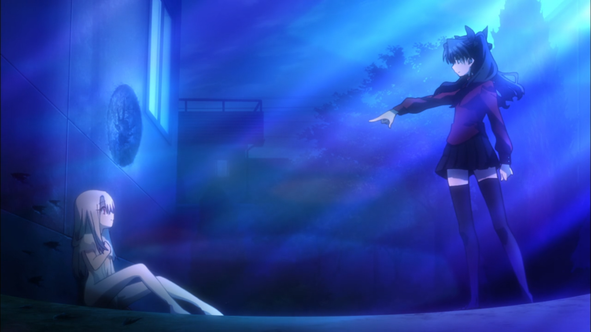
One day, a magical rod named Ruby comes crashing into Illya’s bathroom as she’s
taking a bath. Ruby was running away from Rin Tohsaka, a magus, and decides to make Illya into a magical girl. When
Rin figures this out, Rin gives Illya the task of obtaining 7 class cards which contain the spirits from heroes of
legend, and Illya has to fight a series of battles with each respective hero. When 2wei starts though, a girl named
Kuroe (who looks extremely similar to Illya) appears before her and throws Illya’s everyday life upside down.

Sounds very magical-girly, right? At the beginning, Fate/illya is nothing but a
  normal magical girl show, but the farther along you get, this show evolves into something more like what you would
  expect from Type-Moon. The show starts as a typical magical girl show, running through the typical monster of the week
  scenario (which was entertaining), but then 2wei went and turned this formula on its head while keeping what S1 did
  great. That’s when the show started something new, that’s when the show started gaining a personality of it’s own, and
  that’s when it became something other than just another typical magical girl show.

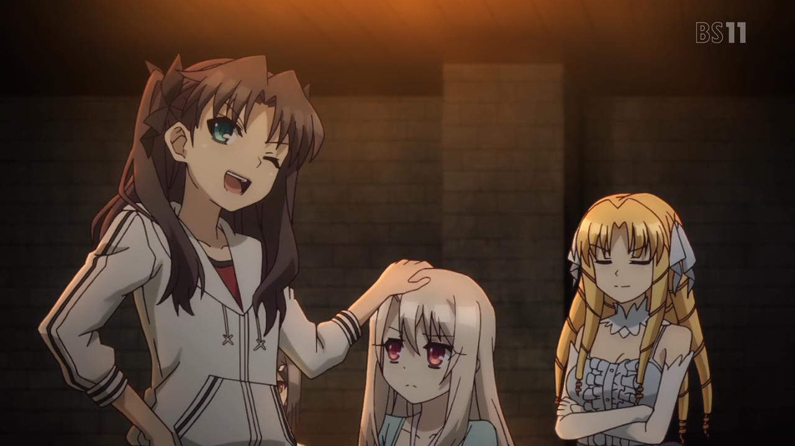

You see, Fate/illya has the benefit of running in the already really well developed
  Nasuverse; it doesn’t need to do world building, character development, or unique plot elements. And it didn’t. As a
  typical run-of-the-mill magical girl show, it was fairly interesting and entertaining due to the solid base that
  <a class="sc-1out364-0 hMndXN sc-145m8ut-0 gIacKn js_link" data-ga='[["Embedded Url","External link","http://rockmandash12.kinja.com/rockmandash-reviews-fate-stay-night-visual-novel-1613176306",{"metric25":1}]]' href="http://rockmandash12.kinja.com/rockmandash-reviews-fate-stay-night-visual-novel-1613176306" rel="noopener noreferrer" target="_blank">Fate/stay night</a> and <a class="sc-1out364-0 hMndXN sc-145m8ut-0 gIacKn js_link" data-ga='[["Embedded Url","External link","http://rockmandash12.kinja.com/rockmandash-reviews-fate-hollow-ataraxia-visual-novel-1612260148",{"metric25":1}]]' href="http://rockmandash12.kinja.com/rockmandash-reviews-fate-hollow-ataraxia-visual-novel-1612260148" rel="noopener noreferrer" target="_blank">Fate/hollow ataraxia</a> built. When it took that developed world
  and started to run in a different direction, one that had never really been touched before in the Nasuverse yet with a
  similar writing style and quality to the Fate route, I couldn’t help but enjoy it. When the show starts to kick in the
  more serious themes, really solid character development, and interactions between the new cast, it gets that much
  better, especially if you’ve seen the other Fate works. Also, how could you forget the philosophical writing that
  Type-Moon does consistently well that starts popping up in 3rei: What makes a person; the body or the mind? Would you
  be willing to destroy the world for a single person? Even though you think you are doing good things, is it OK to
  actually be the bad guy? It was entertaining, helped fill up the Fate/stay night void, and got me hyped up. 

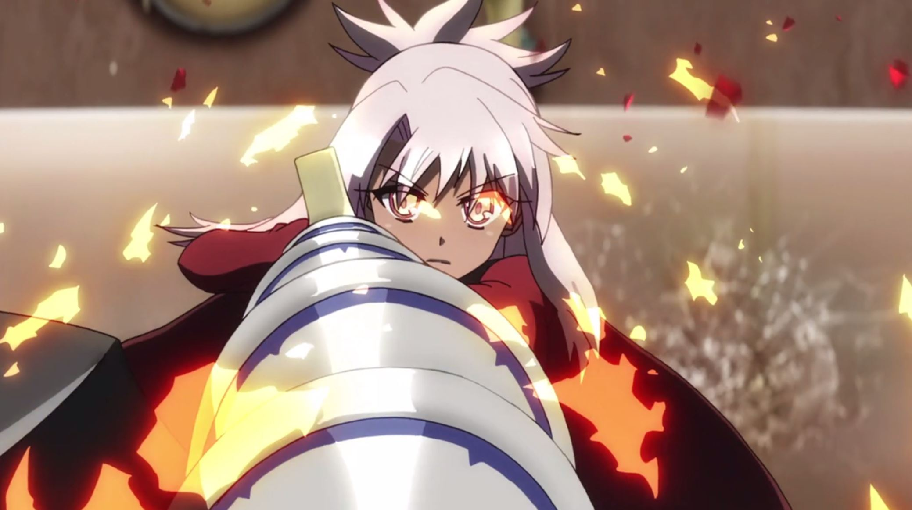

About the characters: keep in mind that a lot of the characters are from F/SN and
  F/HA. They’ve all had a bit of tweaks here and there, but they are pretty much the same characters you know and love
  (hopefully). Half of the fun is just seeing the characters you know and love acting differently due to the situation,
  and that’s great. However, it’s the new characters that really take the spotlight: Miyu and Kuroe are interesting
  characters with solid personalities and well done character development, and they are big reasons why I enjoyed the
  show. The further along the plot goes, the better these characters get, and the interactions are are enjoyable.

In my opinion, the best way to think of Fate/illya is as a more lighthearted and girly
  version of F/SN, with Illya as the protagonist instead of Shirou. Even though there’s quite a bit more silliness
  running around in Fate/illya, and the tone overall isn’t nearly as serious, the mood is similar. The most important
  bit though is how Fate/illya has the “essence” of Fate/stay night; when I see Fate/illya, I can’t help but think about
  parallels from F/SN and compare the two. This is not exactly a bad thing as I enjoyed F/SN and enjoy stuff like it,
  but it pretty much makes this show much more dependent on it.

<h3 class="sc-1bwb26k-1 fvCjqJ" id="h119873">Writing - 8/10</h3>

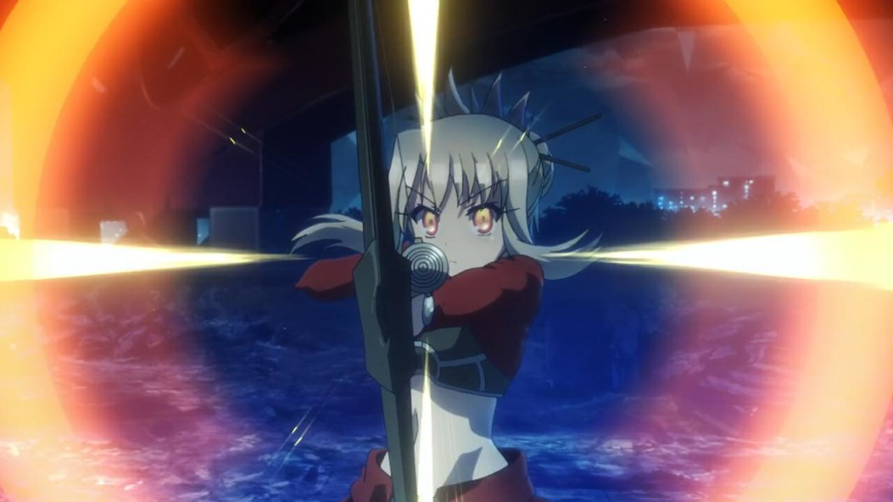
I think the best way to describe the visuals in Fate/illya would be cute.
Fate/illya has a bright color palate (<a class="sc-1out364-0 hMndXN sc-145m8ut-0 gIacKn js_link" data-ga='[["Embedded Url","Internal link","http://tay.kotaku.com/no-game-no-life-the-ani-tay-review-1595368572",{"metric25":1}]]' href="http://tay.kotaku.com/no-game-no-life-the-ani-tay-review-1595368572">similar to NGNL</a>).
Considering that this show is a magical girl show with a lighter tone and attitude, this adds quite a bit of charm and
character to the show, which I appreciate as it helps it stand out from the crowd while looking nice. The visuals have
clean lines, solid backgrounds, neat effects, and pleasing to the eye animation (especially during the battles),
combines into a show that looks nice, but doesn’t particularly blow you out of the water.

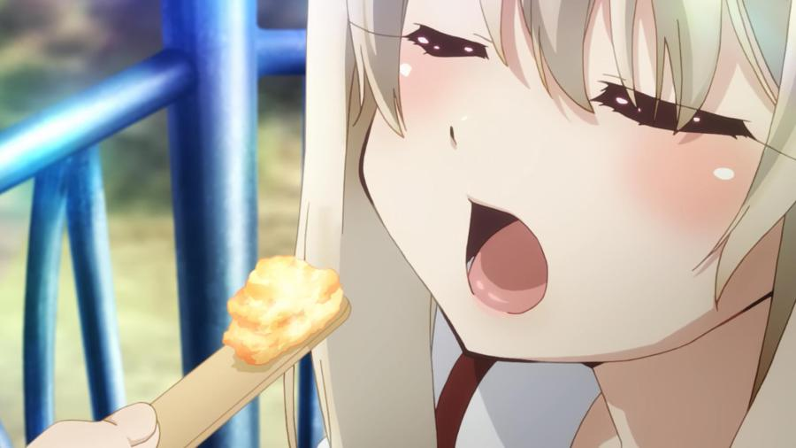
There are a few things that may annoy you when it comes to the visuals, and the big things
are the lewdness and the the character designs. It has to be mentioned though that and during 2wei and Herz! the
lewdness, sexual content and yuri undertones was cranked up to 11, being surprisingly suggestive at times and quite
ridiculous considering the context of the show. With the introduction of Kuro as a character, kissing scenes go way up
and they even have episodes talking about it... going completely meta about it. Also, even though the show isn’t
technically ecchi, it’s rather explicitly suggestive, making for one of the most “lewd” show I’ve seen in a while even
though it isn’t explicit about it at all. Considering the subject matter, this may be a gamebreaker for some, and for
others it may be another source of comedy, but it is what it is.

Also, in comparison to the rest of the fate series, the character designs looks off
  somehow (yet similar to Fate/extra), but this design characteristic is probably to keep the art consistent to the
  mangaka’s art, and you should be able to get used to it fairly quickly so it’s not really a big deal.

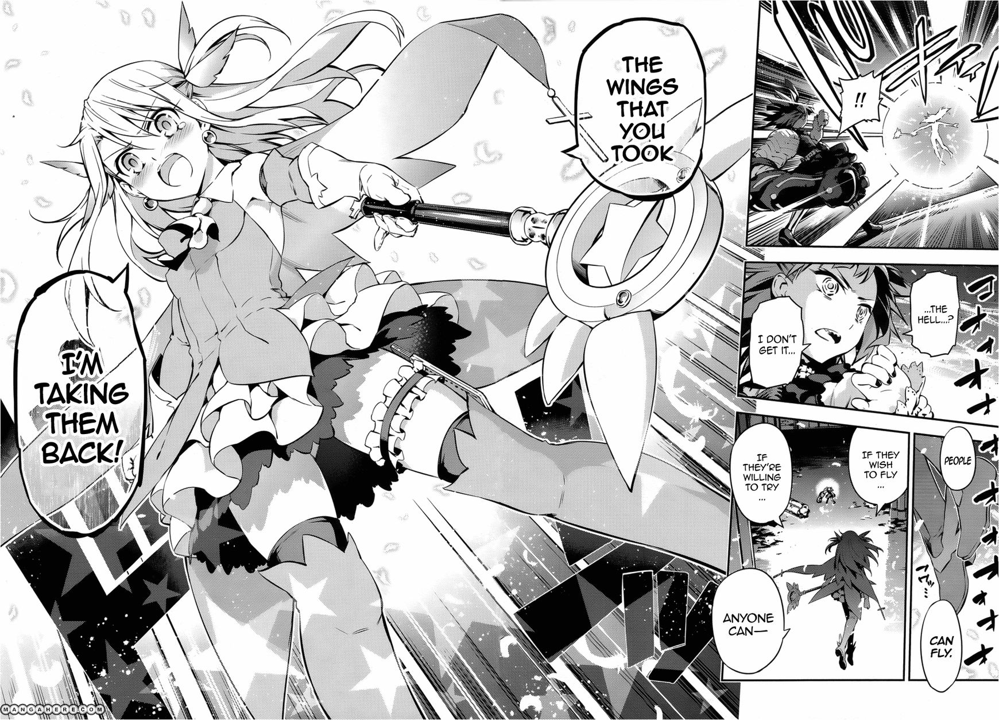

Speaking of the manga, I find that it looks quite nice. It has clean lines, solid
  backgrounds, nice effects and action that is pleasing to the eye... just showing you how well done Silver Link did
  with the adaptation. I don’t really have any experience with critiquing visuals in manga, but I found that it looked
  nice.
<h4 class="sc-1bwb26k-1 fvCjqJ" id="h119874">Visuals - 8/10</h4>

<iframe allow="accelerometer; autoplay; clipboard-write; encrypted-media; gyroscope; picture-in-picture" allowfullscreen="" frameborder="0" height="315" src="https://www.youtube.com/embed/6pXBA0Tu1K4" width="560"></iframe>

I don’t really have much to say about the sound in Fate/illya, mainly because I didn’t
  remember any of it after I watched through the show. I listened through the soundtrack standalone and this listen
  reaffirmed my thoughts on the soundtrack: It’s pretty average. While there’s nothing that sounds bad per se and
  everything is pleasing to the ear, overall it’s pretty forgettable. It has a wide variety of instruments and the songs
  in the show are composed well, but nothing stands out is or is really memorable. This soundtrack is one that does its
  job; nothing more, nothing less.  

I don’t really have much to add about the voice actors. The returning characters
  have their old voice actors and once again they do a bang-up job with their roles, and the voice actors for the new
  characters are equally as solid.
<h4 class="sc-1bwb26k-1 fvCjqJ" id="h119875">Sound - 7.5/10</h4>

<strong>DISCLAIMER: </strong>This segment of the review is full of spoilers, so be
  aware. 

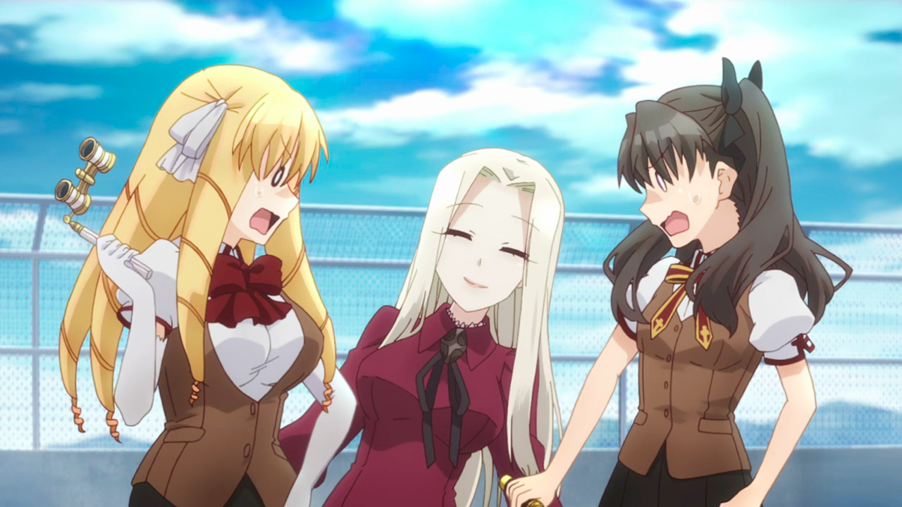

To me, Fate/illya is pretty entertaining throughout. It was a magical girl show
  that, while pretty generic at the start, still had enough humor, interesting plot scenes and interesting character
  interactions to keep me watching.

I also really enjoyed the occurrence of the
  Fate/hollow ataraxia characters like Luvia Eidefelt (who had a really minor appearance) just because I never expected
  them to appear in anything else, and their personalities and charm really add to the story. However, once it started
  to dip into the more familiar parts of the Nasuverse territory, I started to enjoy it a lot more. Fate/illya relies on
  a twist on the Nasuverse: in the Fate/illya world, the Holy Grail War never happened. This is the exact same world as
  Fate/Zero and F/SN, and to see it without the scars of the Holy Grail War is quite interesting. The tweaks on the
  world, especially the characters, are quite enjoyable, and what made it even better was that Fate/illya takes this
  idea and runs with it in 3rei. This leads to some unique and interesting stuff, like having both <a class="sc-1out364-0 hMndXN sc-145m8ut-0 gIacKn js_link" data-ga='[["Embedded Url","External link","http://img.bato.to/comics/2014/08/25/f/read53fafada2c790/img000027.png",{"metric25":1}]]' href="http://img.bato.to/comics/2014/08/25/f/read53fafada2c790/img000027.png" rel="noopener noreferrer" target="_blank">the most epic</a> and <a class="sc-1out364-0 hMndXN sc-145m8ut-0 gIacKn js_link" data-ga='[["Embedded Url","External link","http://livedoor.blogimg.jp/animemangasokuhou/imgs/a/8/a8993aca.jpg",{"metric25":1}]]' href="http://livedoor.blogimg.jp/animemangasokuhou/imgs/a/8/a8993aca.jpg" rel="noopener noreferrer" target="_blank">the most pathetic</a>
  Shirou, all in the same show, which left me pleasantly surprised. I love 3rei because it’s like a second coming of the
  Fate route from F/SN; it takes everything that the Fate route does right and amplifies to a ridiculous level (it
  reminded me of Negima! at points), and I really appreciated how it did so.

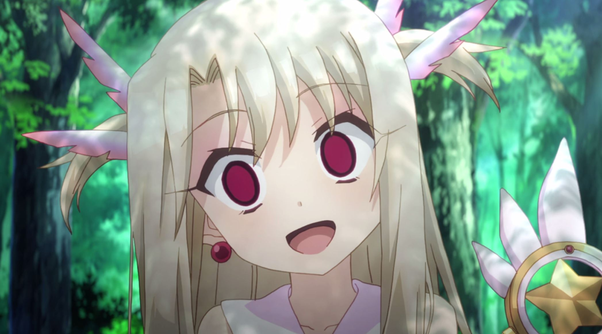
However, this is my opinion and your mileage may vary. <strong>Simply put,
Fate/illya is a show made for Type-Moon fanatics like me, and if you are not one, you will probably like this much
less than I did. </strong>

<h4 class="sc-1bwb26k-1 fvCjqJ" id="h119876">Enjoyment - 8.5/10</h4>

Fate/Kaleid liner Prisma Illyais a good show with a clear idea on what it wants to
  do, so it spends its time executing it well. <strong>However, the show is heavily drenched in the Nasuverse and yuri
    undertones, which limits it’s audience quite a bit. If you are uncomfortable with said suggestiveness, you may want
    to stay away, but if it’s just the nasuverse, go check out the anime or VN of Fate/stay night.</strong>

If you enjoyed Fate/stay night’s VN and want more of that and can handle the more
  lighthearted and girly approach to the show at the beginning, I’d recommend you check out Fate/illya. <strong>However,
    you still have to wait for 3rei for the best of the series.</strong> I recommend you check out the manga if you are
  a fan of the Nasuverse, but the anime is serviceable as well.

<h2 class="sc-1bwb26k-1 fvCjqJ" id="h119877">OVERALL 8.25/10; Polarization
  +.25, -1.25</h2>

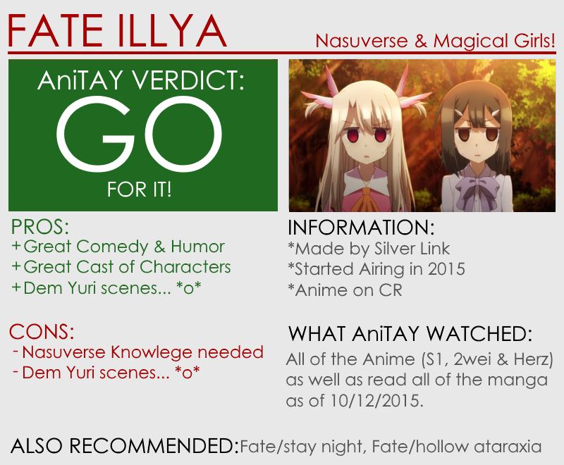

<strong>Copyright Disclaimer:</strong> Under Title 17, Section
  107 of United States Copyright law, reviews are protected under fair use. This is a review, and as such, all media
  used in this review is used for the sole purpose of review and commentary under the terms of fair use. All footage,
  music and images belong to the respective companies. 

<em>You can see all my reviews on </em><a class="sc-1out364-0 hMndXN sc-145m8ut-0 gIacKn js_link" data-ga='[["Embedded Url","Internal link","http://tay.kotaku.com/tag/rockmandash-reviews",{"metric25":1}]]' href="http://tay.kotaku.com/tag/rockmandash-reviews"><em>Rockmandash Reviews</em></a><em>, and the rest of
  my </em><a class="sc-1out364-0 hMndXN sc-145m8ut-0 gIacKn js_link" data-ga='[["Embedded Url","Internal link","http://tay.kotaku.com/type-moon-marathon-wip-1534726534",{"metric25":1}]]' href="http://tay.kotaku.com/type-moon-marathon-wip-1534726534"><em>Type-Moon Marathon here</em></a><em>.
  For an explanation of my review system, </em><a class="sc-1out364-0 hMndXN sc-145m8ut-0 gIacKn js_link" data-ga='[["Embedded Url","Internal link","http://tay.kotaku.com/rockmandash-rambles-an-explanation-on-my-review-system-1619265485",{"metric25":1}]]' href="http://tay.kotaku.com/rockmandash-rambles-an-explanation-on-my-review-system-1619265485"><em>check this out</em></a><em>.</em>

<em>This show is available on </em><a class="sc-1out364-0 hMndXN sc-145m8ut-0 gIacKn js_link" data-ga='[["Embedded Url","External link","http://www.crunchyroll.com/fatekaleid-liner-prisma-illya",{"metric25":1}]]' href="http://www.crunchyroll.com/fatekaleid-liner-prisma-illya" rel="noopener noreferrer" target="_blank"><em>Crunchyroll</em></a><em>
  for free and legal streaming. The Manga is not licensed in the west and if you want to read it, you’ll have to rely on
  scanlations.</em>

<em>Note - this review has been updated on 10/12/15 because of the adaptation of
  2wei Herz, to update assets and to add a section on the fanservice/yuri undertones. Not sure why I didn’t mention it
  in the past.</em>

