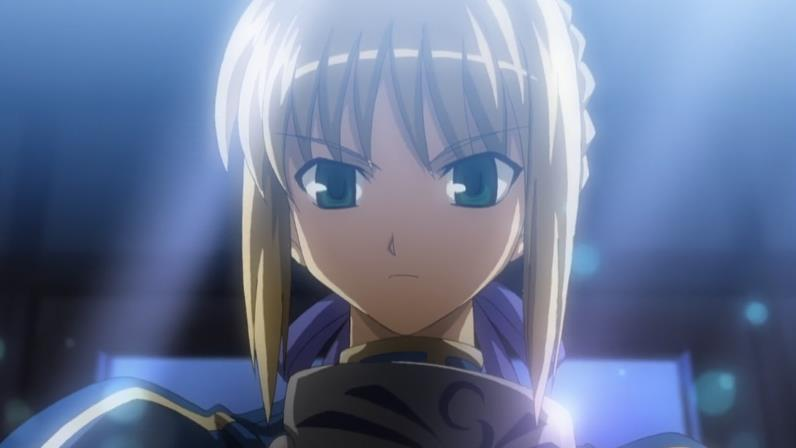

---
{
	title: "Rockmandash Reviews: Fate/stay night [2006 Anime]",
	published: "2014-01-08T18:59:00-05:00",
	tags: ["tayclassic", "rockmandash reviews", "anime", "anime reviews", "fatestay night", "fate stay night anime", "2006", "studio deen", "ani-tay", "Type-Moon Marathon"],
	kinjaArticle: true
}
---

Welcome to Rockmandash Reviews! I’m Kevin and this part 2 of my *Fate/stay night* anime review, My third review on TAY and just one of the many reviews in my Type Moon Marathon. For those of you reading on TAY, I’m still going through my backlog of stuff I’ve already written, but after UBW’s movie review, The reviews should be original to TAY. This is review of the* Fate/Stay night *anime, made by studio Deen in 2006.

 

Adapting a visual novel can be difficult, as there are multiple routes. Studio Deen tried their best but could not tell the story as well as the visual novel. In Fate Stay night, there are 3 main routes, Fate, Unlimited Blade Works and Heaven’s feel. They decided to take most basic yet bland arc; Fate, and try to throw other arc plot points into the story. Fate by itself is just above average, but when you throw in other plot points and never resolve them, It’s kind of like the anime doesn’t know that People die when they are killed, or how to make a story without plot holes and red hearings that weren’t red hearings in the original. Even the parts directly from fate aren’t explained as well. The plot is less than average, and but it’s not the worst out there.

One thing it did do well is the pacing, it’s not too long but it’s not too short. The pacing is pretty good in this anime, which is kinda surprising because the tsukihime anime was too short, and the source material was too long.

#### Writing - 7/10

 

It’s meh. Studio deen has a habit of going off model with shows, and even though it’s better than say… higurashi, it’s not great either. In comparison to the source material, it’s pretty accurate, but usually looks worse… especially the CG dragon. FSN’s visual novel has a few sex scenes, and what the anime did to get around this was make a Sega Saturn quality CG Dragon which looked horrible, and it was just rubbish. The biggest disappointment with the art in this show is the more detail you have in the video, the worse it looks. I first watched this on a low quality stream and I didn’t think it looked too bad, then I watched a HD one and now that I can actually see the details, I can see all of the flaws this show has, and that’s generally something that shouldn’t happen. I have no other description for the animation other than its consistently worse than the visual novel.

#### Animation & Art - 6/10

This soundtrack is actually quite great. I really liked the first OP, it’s one of my favorites and is really soothing. Most of the soundtrack fits the atmosphere better than the game does, and I prefer the soundtrack overall. It has a grander feel in comparison to the soundtrack in the game. The voice acting for the Japanese dub has the same voice actors as game, so if you liked the game’s dub then you will like this one. As for the English dub, it’s a mixed bag. Some of the acting is really good but others are very bad. Shirou, Issei and Ilya sound just horrible while Saber, Rin, and Archer are ok. The Dub has some really good talent on it, I just believe it’s worse than the Japanese dub.

#### Sound - 8/10

 

I’ve watched this show twice. I didn’t care for it both times. It’s just not very interesting in my opinion, but if you haven’t seen the source material I’d assume you would like it more than I did.

#### Personal Enjoyment - 6/10

This show is hard to talk about. It’s the polar opposite of the visual novel yet it’s the same thing. The biggest problem this show faces is that Studio Deen messed with the plot, thus it becomes worse than it really should be, even if it’s better in some aspects. If I were you, I’d just watch ufotable’s Fate/Stay Night anime when it comes out.

## Overall - 7/10, Polarization +.5,-1.5

 

***

**Copyright Disclaimer:** Under Title 17, Section 107 of United States Copyright law, reviews are protected under fair use. This is a review, and as such, all media used in this review is used for the sole purpose of review and commentary under the terms of fair use. All footage, music and images belong to the respective companies.

*You can see all my reviews on *[*Rockmandash Reviews*](http://tay.kotaku.com/tag/rockmandash-reviews)*, and the rest of my *[*Type-Moon Marathon here*](https://rockmandash12.kinja.com/type-moon-marathon-wip-1534726534)*. For An explanation of my review system, *[*check this out*](https://rockmandash12.kinja.com/rockmandash-rambles-an-explanation-on-my-review-system-1619265485)*.*

Note: This review had an aesthetic overhaul and minor editing on 9/15
