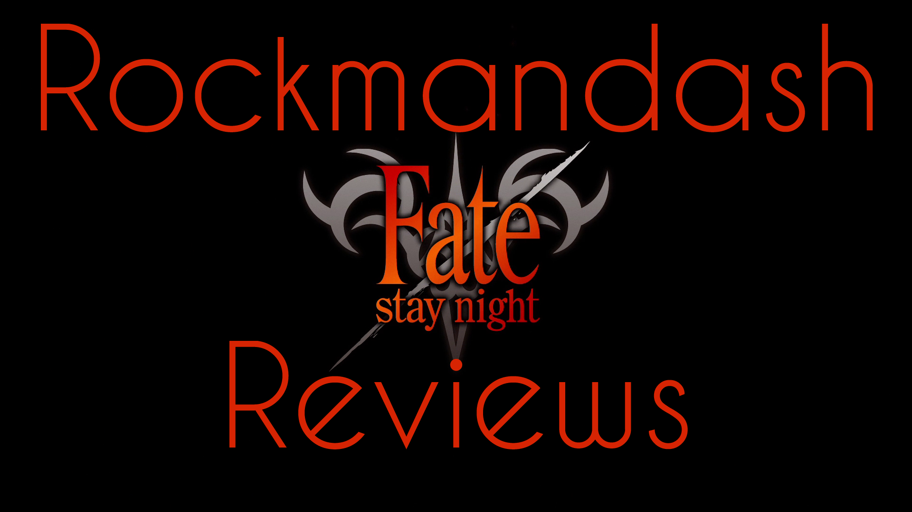
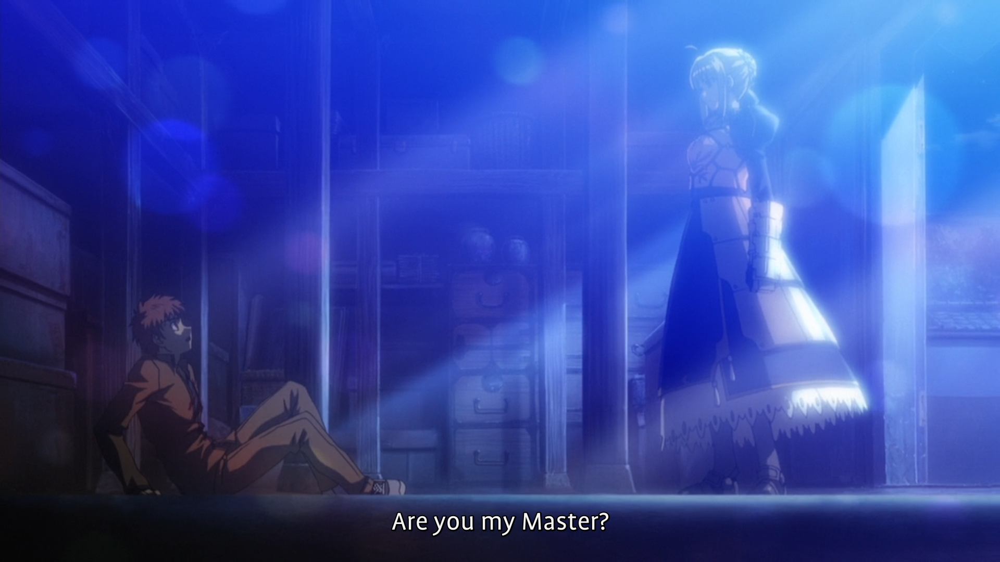
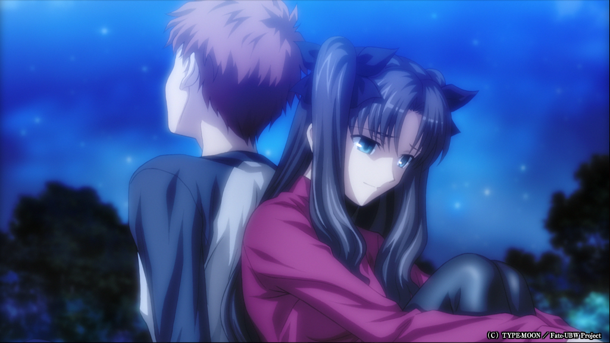
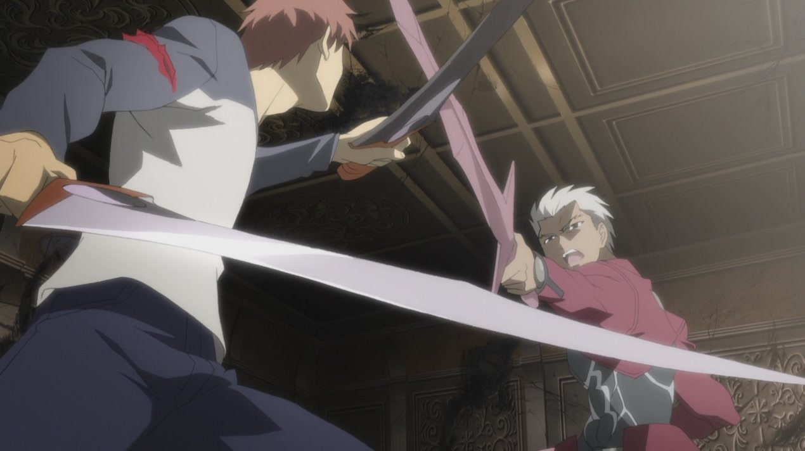
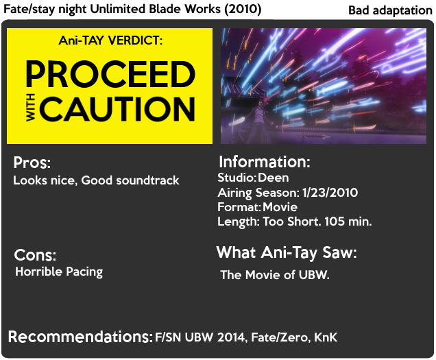

---
{
	title: "Rockmandash Reviews: Fate/Stay Night Unlimited Blade Works (2010) [Anime Movie]",
	published: "2014-01-19T15:50:00-05:00",
	tags: ["rockmandash reviews", "tayclassic", "anime movie", "anime reviews", "fatestay night", "fate stay night unlimited blade works", "studio deen", "ani-tay", "Type-Moon Marathon"],
	kinjaArticle: true
}
---

Welcome to Rockmandash Reviews! This is another review in my [Type-Moon Marathon](https://rockmandash12.kinja.com/type-moon-marathon-wip-1534726534), and this is a review of *Fate/Stay Night: Unlimited Blade Works (2010)*, an anime movie adaptation of the route with the same name, adapted by Studio Deen. How does the movie stand against the test of time? That really depends on what you’re comparing it to...

Link to [Visual Novel Review](https://rockmandash12.kinja.com/rockmandash-reviews-fate-stay-night-visual-novel-1493594993) and my [Video Review](http://dai.ly/x19zaey) (based on the original version of this review)

  

Not much to say here, it’s pretty much the *Unlimited Blade Works* route, just rushed as all hell. It’s a pretty straightforward adaptation, but the pacing really just sucks, rushing through everything at an incomprehensible blur. The movie doesn’t explain **ANYTHING,** and if you have not played the visual novel you will be totally lost as you try to piece together the plot of the movie. They show mostly action scenes, which is kind of just fan service for people who have already seen it, so very helpful. It’s like somebody went crazy with editing and cut half of the movie away... They did a good job trying to cram a 10-20 Hour Route into a 1 Hour 40 minute movie, but that’s exactly the problem with this movie… it’s a rushed version of the Unlimited Blade Works route.

#### Writing - 6/10

 

As I was watching through the *Unlimited Blade Works* movie, I was pretty afraid that Studio Deen would screw this one up, as they have never been great in this category. While it’s not the best out there, it is a movie and it looks quite a bit better than the 2006 anime. It’s about the typical quality you’d expect from the time, but with a movie budget, so it probably should have been better. Also, while I appreciate the gradients and effects from the show, it may not be everyone’s cup of tea. I think it could have been done better if a different studio had it, but what we got wasn’t horrible.

#### Visuals - 7.5/10

The soundtrack in the *Unlimited Blade Works *movie was pretty solid overall with no real flaws worth mentioning. It’s enjoyable, is executed well to enhance the experiences and it fits well with the scenes. A nice touch too was that while it was mostly original tracks, they were solid tracks that worked well with the route and they still used VN tracks in specific situations to make scenes more memorable. That being said, While I did enjoy the soundtrack wile watching the film, I didn’t think the soundtrack stood out in any way and probably wouldn’t be a good listen outside of the movie. Also, not much to say about the lll voice acting: solid as ever, no complaints here. All of the Japanese versions of of fate stuff have the same voice actors, and this is no exception.

#### Sound - 8/10

 

Unlimited Blade Works was my favorite route, and this is a relatively entertaining adaptation if you know what actually happens, so I thoroughly enjoyed the movie. If you have seen UBW, this is a great, condensed way to see UBW, and be able to see the epic fight scenes animated, but other than that, you probably won’t get much out of it. It’s just a bit of fanservice, and while I’d hope for better, I’ll take that as is.

#### Enjoyment - 8/10

To put it simply, This movie is an inferior way of experiencing the Unlimited Blade Works route, more of a check mark on Type moon’s check list for anime adaptations then an actual attempt for adapting the work. It’s a nice condensed way of experiencing the story if you already know it, **but unless you have seen the original version, stay far, far away.**

## **Overall - 7.5/10, Polarization +.5,-2.5**

 

***

**Copyright Disclaimer:** Under Title 17, Section 107 of United States Copyright law, reviews are protected under fair use. This is a review, and as such, all media used in this review is used for the sole purpose of review and commentary under the terms of fair use. All footage, music and images belong to the respective companies.

*You can see all my reviews on *[*Rockmandash Reviews*](http://tay.kotaku.com/tag/rockmandash-reviews)*, and the rest of my *[*Type-Moon Marathon here*](https://rockmandash12.kinja.com/type-moon-marathon-wip-1534726534)*. For An explanation of my review system, *[*check this out*](https://rockmandash12.kinja.com/rockmandash-rambles-an-explanation-on-my-review-system-1619265485)*.*

*Note 1: I prettied up this review and did some minor edits on 9/15/14.*

*Note 2: Edited content on 6/10/15, changed scores a bit.*
