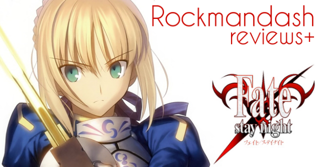

---
{
	title: "Rockmandash Reviews: Fate/Stay Night [Visual Novel]",
	published: "2014-01-02T13:23:00-05:00",
	tags: ["rockmandash reviews", "tayclassic", "fate stay night", "fate", "stay", "night", "tay review", "pilot", "type-moon", "visual novel"],
	kinjaArticle: true
}
---

I guess i'll start off by saying HELLO TO TAY! I've been doing anime reviews and game reviews for a while now, and after seeing Dex's wonderful reviews, and the amazing reaction to them, I thought that I would start posting my own content onto TAY. This post is kinda like a pilot in that aspect, as it's a test run to see if I will get any sort of feedback on my stuff. I must note that I wrote and uploaded this before, so it might not be Similar to Kotaku's reviewing style like Dex's Review and you might have seen this before, if you are one of the 3 people who know who i am lol. So... here it is... My Fate Stay Night visual novel review.

BTW- If you like video reviews, here is my [Video Review](http://www.youtube.com/watch?v=7bfVwJ5KSik), and here's my[ New Review](https://rockmandash12.kinja.com/rockmandash-reviews-fate-stay-night-visual-novel-1613176306).

###### [Rockmandash Reviews+: *Fate/stay night* \[Visual Novel\]](https://rockmandash12.kinja.com/rockmandash-reviews-fate-stay-night-visual-novel-1613176306)

"I ask of you. Are you my master?" It's a quote that started it all; a huge franchise, an amazing

[Read more](https://rockmandash12.kinja.com/rockmandash-reviews-fate-stay-night-visual-novel-1613176306)

**Story- **Playing FSN is like playing 3 equally long games with 3 separate plots, and 3 completely different writing styles. Because of the structure of the game, and how vastly different each route is, I'll review each route separately and create a cumulative score for the plot. The premise of the story is that there is a Fight-to-the-death tournament called The Fifth Holy Grail War (which isn't really a war....) where people known as masters fight with Heroes throughout history, known as servants, for a chance to get the Holy Grail, which grants their wishes. Each servant is one of the 7 classes, Saber, Archer, Lancer, Berserker, Rider, Assassin, and Caster. If you didn't get that, well, this game has a lot of exposition to explain that basic premise, so you won't be totally lost. The premise is one of the stronger parts of the game, it's so unique that it's made a pretty large franchise. The main character in FSN is Emiya Shirou, whose ideals change along with the route, but he's usually a hardworking idiot who cares about others more than himself, so much so that he's willing to risk his life. The strength of the game is in the characters; all of the characters are likable in some fashion, and they usually have something to add to the story.

**Fate -** Fate is a typical, yet better than average plot, with Saber, Shirou's blond haired servant as your main heroine. This route a good way to start, as it focuses on the most popular character saber, and explains quite a bit but it doesn't really stand by itself well. Saber's personality and situation in the arc makes her a very likable character, and she's the reason this route is any good. There arn't a lot of interesting plot points in comparison to the other routes, and in my oppinon the fate route really makes you want to face palm depending on the levels of Shirou's idiocy. Fate is about Shirou embracing his ideals of becoming a hero, full on, and it's just above average. 7.5/10

**Unlimited Blade Works - **Unlimited blade works is the most action packed out of all the arcs, and is my personal favorite. There's alliances, change in power, and I hope you like a large dosing of Tsundere, because the main heroine is Rin Tohsaka, A tsundere honours student magus who comes from a family who's history is ingrained with the holy grail war. Rin Tohsaka is easily my favorite character in the game because of her amazing and not totally bipolar tsundere-ness, and all the other quirks that tohsaka has. Unlimited Blade Works is about Shirou struggling with himself about his ideal and his life, both past and future which is something that's really relatable to me and one reason why I love UBW. I believe that in UBW, the characters were the best of the whole visual novel, especially shirou. 9.5/10

**Heaven's feel -** Heaven's feel is by far the most depressing and best written of all the arcs. The main heroine, kinda out of the blue, is Sakura Matou, Shirou's kouhai and Shinji's little sister… and the choice of sakura as a heroine makes sense in context. Any real details about heaven's feel in my opinion, would ruin it, so no spoilers here. Heaven's feel is conflict within Shirou about reality and his ideals, and it is the most contrasting out of the others. There's a reason this route is last; you need to sink into the world of FSN before heaven's feel rips you out of it and throws you into the curb. It's the best written route and its bloody fantastic, even if it's quite depressing and dark. 10/10

For a game like this, story is everything. If you experience the game as intended, this game has a story that will really make you think a bit. It's a fantastic story, interweaving ideals with a personal and action story. It's well written, and it's fantastic.

**9.5 /10**

**Pacing & Length –** One big thing that separates word based mediums like Visual novels and books from their anime and manga counterparts is length. Visual novels are much longer to flesh out the world and characters, and this one is no exception… The game should take you about a month or more to go through just main story. Do I prefer it this way? Not really… it drags out quite long and it's hard to get into and complete because of the length. In comparison, I thought that the anime, was a more manageable size. Surprisingly, the pacing was pretty good even though the story is so long, which is really nice, but MY GOD IS IT LONG.

**8/10**

**Gameplay – **IT'S A FRICKING VISUAL NOVEL. There's really nothing special…. You select options and read text…. When you get a bad ending, you get sent to Tiger Dojo, where give you advise on how to get the good endings and hilarity ensues. Tiger Dojos give this game A LOT of replay value and content, and if you get them all, you get a hidden extra scene. The gameplay is par for the course, nothing spectacular here.

**7.5/10**

**Sound – **Do yourself a favor and get Realta Nua, the PS2 version or a Mod for the PC version that adds the voice acting. It's great voice acting, and other parts of the series have the same voice actors. Almost all of the text is voiced, which is OUTSTANDING, considering the amount of text that this game actually has. The soundtrack frankly is not one of FSN strongpoints though. Most of the music is there for atmosphere building, but it does that quite well. It's a very memorable soundtrack, mainly because you have to listen to the same few tracks over and over again. There are good tracks, but most of it is just ok. It's a good soundtrack, but I can't really say that it's one of my favorite soundtracks.

**8/10**

**Art/ Graphics - **Ok, Keep in mind that this is a visual novel from 2004. This game looks pretty good, even if it's just sprites. I prefer sprites over 3d models in visual novels usually, with a few exceptions (show AA here) and in FSN, the sprites are done very well. The character design in this game is great, and all of the characters look unique and interesting. The designs of the characters, especially the servants are intricate and detailed, which help build this world in FSN. One thing about the art in this game that I have to mention is that fate stay night is an eroge, aka Hentai game. If you're not really into that, well…. There's a censor patch for UBW and fate, but for Heaven's feel… Just hold control until it's over I guess… This is a huge reason why I want an official English version: the console version of realta nua replaces ero scenes with scenes of CG Dragons and Dolphins which is kinda random, but it's still better than ero scenes. Other than that FSN looked great for the time, and it still holds up well today.

**8/10**

**Personal Enjoyment –** Honestly, I didn't like it the first time I played it. I'm not the biggest fan of fantasy, but the more I played, and the more it sinks in, the better it gets. It's like aged cheese in that aspect. One part I loved in FSN is that the world it builds is so thorough in the art, the music, the characters, etc. It's so cohesive and strict with following the rules it set that you really feel like your observing this great story…. Which leads me to my next point… if it has so much action, did it have to be a visual novel? I know for structuring the story, VN's are more convenient, but whenever I get to an action scene, I wish I was either watching all of that fluid animated fight, or playing a game where I can influence the fight itself. Even with that nitpick aside, I really did love this game, and after I finished this, I had the feeling of the void and accomplishment. If a game can do either of those, it's a winner.

**9.5/10**

**Conclusion –** Fate Stay Night is a fantastic yet really long Visual Novel. As a story, it's bloody amazing, but it's not perfect in its current state as a game. Everything negative I say about this game is nitpicky though, as this game is fantastic, with great writing, a great world, and great characters. This is not a part of the review, but availability is an important part of any series and considering the popularity of this series, you would think Fate Stay Night would come to the states. NOPE! The only way to play this game in English is via pc thanks to the fantastic translation by the guys at mirror moon, or on the DS and Android platforms via VNDS. I hope in the future we can get something like the Vita version of the game, or if they ever decide to do an HD remake with the new character designs and art from Ufotable, but for now, the only way to get the definitive version of the FSN story in English is via a fan translation.

### Pros:

Fantastic Writing

Great World

Great Characters

### Cons:

Nothing major

## 9.25/10

I am the Keyboard of my Review

Reviewing is my Body and writing is my blood.

I have read over a Thousand Words

Unknown to Action Nor known to Tsundere

Have withstood pain to create many reviews

Yet this Keyboard will never type anything

So as I Review

UNLIMITED REVIEW WORKS

***

**Copyright Disclaimer:** Under Title 17, Section 107 of United States Copyright law, reviews are protected under fair use. This is a review, and as such, all media used in this review is used for the sole purpose of review and commentary under the terms of fair use. All footage, music and images belong to the respective companies.

*You can see all my reviews on *[*Rockmandash Reviews*](http://tay.kotaku.com/tag/rockmandash-reviews)*, and the rest of my *[*Type-Moon Marathon here*](https://rockmandash12.kinja.com/type-moon-marathon-wip-1534726534)*. For An explanation of my review system, *[*check this out*](http://tay.kotaku.com/rockmandash-rambles-an-explanation-on-my-review-system-1619265485)*.*

###### [Rockmandash Reviews: *Type-Moon Marathon*](https://rockmandash12.kinja.com/type-moon-marathon-wip-1534726534)

In preparation for the Fate/stay night: Unlimited Blade Works Adaptation by Ufotable, I decided to…

[Read more](https://rockmandash12.kinja.com/type-moon-marathon-wip-1534726534)

*This game is availible on *[*Fuwanovel *](http://fuwanovel.org/novels/fate-stay-night)*for download.*