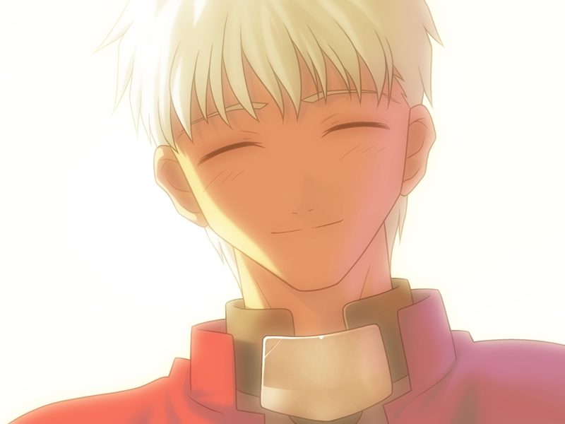

---
{
	title: "Rockmandash Reviews+: Fate/stay night [Visual Novel]",
	published: "2014-08-04T12:00:00-04:00",
	tags: ["rockmandash reviews", "reviews", "fate stay night", "nasuverse", "type moon", "visual novel", "Type-Moon Marathon"],
	kinjaArticle: true
}
---

"I ask of you. Are you my master?" It's a quote that started it all; a huge franchise, an amazing concept that will entrance fans for years, and a great visual novel. With the Utofable anime adaptation coming up, now is a great time to see how the gateway drug into the [Nasuverse ](http://tay.kotaku.com/type-moon-marathon-wip-1534726534?rev=1406682520485)holds up. Welcome to Rockmandash Reviews+, and today, we have *Fate/stay night*.

You might be questioning why I posted this, considering I posted a [*Fate/stay night*](http://rockmandash12.kinja.com/rockmandash-reviews-fate-stay-night-visual-novel-1493594993) review earlier this year. Yes, I did release a *Fate/stay night* review, but I've improved my review style: both the substance and how it looks aesthetically. That's where the review+ comes in: Whenever I redo or spice up a review but want to keep the original the way it was, i'll be one of these reviews+.

 

*Fate/stay night* is a well crafted story, with a stellar world, great writing and and an amazing premise. It's famous for this premise, and for a good reason: it's about a Fight-to-the-death tournament called The Fifth Holy Grail War (which isn't really a war....) where people known as masters fight with Heroes throughout history, known as servants, for a chance to get the Holy Grail, which grants their wishes. Each servant is one of the 7 classes, Saber, Archer, Lancer, Berserker, Rider, Assassin, and Caster. If you didn't get that, well, this game has a lot of exposition to explain that basic premise, so you won't be totally lost. The premise is one of the stronger parts of the game, and it's so brilliant that it's spawned a large franchise.

While *Fate/stay night* may seem like just an action story due to the premise, it's more than that. It is a story about grand ideals, and motivations of characters, which is something I fell in love with. The* Fate/stay night* Visual Novel follows Emiya Shirou, an altruistic person so willing to help others that he's willing to die for them... and this ideal is the focus of the story. Whether you like his ideals or not, the way they deal with it is brilliant, and the way each route deals with it is interesting. The atmosphere, the feeling of being with shirou as he goes through the events creates an engaging story, even if it's one that is slow and slice of life at times.

Playing through *Fate/stay night* is like experiencing 3 equally long VN's with 3 separate plots, and 3 completely different tones. Due to the structure of the game, and how vastly different each route is, I'll cover each route separately and then do a cumulative score for the plot.

### **Fate**

Fate is a typical yet better than average action/romance story with Saber: Shirou's blond haired servant who's a genderbent King Arthur as your main heroine. This route a fantastic introduction route as it focuses on the most popular character Saber, it does a great job with the world building, develops the characters so you can enjoy them more later on, and it has a bunch of exposition while still creating an atmosphere of mystery yet managing a tone and message that makes it feel essential to the story. It follows Shirou embracing his ideals of becoming a hero, full on, and he's altruistic to the max, thus grating on people's nerves but doing a good job setting up what's to come.

Other than the introduction and doing a decent action story, what carries this route along is Saber. Her personality and actions in this route are the best parts of it, and she's a really enjoyable character. The thing about the fate route is that it doesn't really do anything special; there aren't a lot of interesting plot points in comparison to the other routes, it doesn't stand out well, and due to Shirou's idiocy, it might be annoying to go through, especially in the first run (it's nowhere near as bad in subsequent runs though).

#### Fate - 8/10

### **Unlimited Blade Works**

Unlimited Blade Works is the most action packed out of all the arcs, and is my personal favorite. Unlimited Blade Works is about Shirou struggling with himself about his ideal and his life, both past and future, which is something that's really relatable and is the biggest reason of why I love Unlimited Blade Works. There's also alliances, wild changes in power, and I hope you like a large dosing of Tsundere, because the main heroine is Rin Tohsaka, A tsundere honors student magus who comes from a family who's history is ingrained with the Holy Grail War. I'm just going to state that I'm a sucker for tsunderes, and Rin's probably my favorite... so yeah... I loved her in this route.

The Unlimited Blade Works route can be described as the concepts of the fate route but with an adrenaline rush, epic feel and a focus on the action and the protagonist. It move you in ways you would never expect an action show to do, and the clash of ideals while keeping the characters interesting pulls off something* Fate/Zero* could only dream of. Unlimited Blade Works is very well executed: in my eyes, UBW has the most enjoyable character interactions, the most memorable scenes, and it keeps you on the edge of your seat with a great atmosphere and a great sense of tension.

#### Unlimited Blade Works - 9.5/10

### **Heaven's feel**

Heaven's feel is by far the most depressing and best written of all the arcs. Even with my personal bias that makes me favor Unlimited Blade Works, I have to admit that Heaven's feel is written better. Unlimited Blade Works was strong because of the action, but Heaven's feel is strong for completely different reasons; it's disturbing, it's shocking, it has an interesting subversion, it has a dark and awesome atmosphere, and it will **BLOW YOUR MIND**.

Heaven's feel is primarily about conflict within Shirou: Reality vs Ideals, and it is the most contrasting out of the others, and it's the most contrasting because you get to see Shirou act completely different in the other arcs. The main heroine is Sakura Matou: Shirou's kouhai and Shinji's little sister. The choice of Sakura might not make any sense early on, but the more they screw with your the situation, the more sense it makes. Discussing any more about why this is great is spoilers, but there's a reason this route is last; you need to sink into the world of Fate/stay night before Heaven's feel rips you out of it and throws you into the curb. It's the best written route and its bloody fantastic, even if it's quite depressing and dark.

#### Heaven's feel - 10/10

### Writing Overall

The *Fate/stay night* VN has a well written and memorable story that is really unlike many stories I've had the chance to experience. It's a fantastic story, full of interweaving ideals, amazing monologue, great characters and amazing action that's well executed, and is something unlike what you'll experience in other mediums. If you are looking for an epic story, *Fate/stay night* is definitely one to check out.

#### **Writing - 9.5/10**

 

Normally, When I do my reviews, I have Pacing integrated into my Writing segment. The thing is though... this VN is really long, and is way too long for most people. One big thing that separates word based mediums like Visual Novels and books from their anime and manga counterparts is length. Visual novels are much longer to flesh out the world and characters, and this one is no exception… it uses that time to flesh out the world and it's very memorable... but My first run of it took about a month of daily reading, and that's something most people are unwilling to do. If you are not a fan of reading, stay far away: it's about a million words of text, and it's definitely feels like it. Due to the length it feels really slow paced when you are playing, and at times you might lose interest. It's not the worst pacing I've seen though; a lot of the fluff does make the experience better, and usually is entertaining and engaging enough that it keeps your attention most of the time but the pacing is a glaring flaw in a great game. In comparison, I thought that the 2006 anime was a more manageable size and had better pacing, and I hope the UBW remake and Heaven's feel movie improve on this.

#### **Pacing - 7/10**

 

It's been 10 years. While there are parts that shine visually, overall it just looks about average now. There's nothing wrong with it: everything is crisp, memorable, detailed and does it's job well, I just wish that it had a better style, or was more aesthetically appealing, like later Type-Moon works. The designs of the characters, especially the servants are intricate, detailed, and are pretty memorable. While most of the CG looks pretty good, most of it doesn't really stand out. Also there's one thing that needs to be mentioned about the visuals, and that is the fact that this is an eroge... soo.. **CUE THE OBLIGITORY EROGE WARNING HERE. **While the plot hasn't been hit by age, the visuals have. What was once great, is now just average.

#### **Visuals - 7.5/10**

The sound in *Fate/stay night* is pretty good, especially the voice acting. It's great voice acting with all of the actors doing a great job with their roles, and other parts of the series have the same voice actors, which helps keep a level of consistency unmatched on other series. Almost all of the text is voiced, which is **OUTSTANDING**, considering the amount of text that this game actually has. The soundtrack though, is not one of *Fate/stay night's *strong points. The soundtrack is distinctly average; Most of the music is there for atmosphere building which it does quite well, but it's not memorable or mind-blowing. While there are a few memorable tracks like Ever-present feeling and Emiya, most sound a bit better than average, but nothing amazing. It's lacking in something, it sounds good, but it could use some more instruments, and more character. It's a good soundtrack, but it's just lacking that extra something.

#### **Sound - 8/10**

 

Honestly, I didn't really care for F/SN at the beginning. I'm not the biggest fan of fantasy, but the more I played, and the I let it sink in, the better it gets. Like I said earlier, it's the gateway drug into the Nasuverse;the more you dip your toes in, and the more you go through it, the more you will fall in love with the game and the series. The fights, the night patrols, the character development, the world building, the lore: they all build up into something great, and you'll grow to love it. That being said, the pacing can hamper your experience: it's slow, long and at times, it'll make you wish you were just at that next action scene or plot twist. Even with the slow pacing, it's still a really well executed story. I really did love this game, and after I finished this, I had the feeling of the void and accomplishment. If a game can do either of those, it's a winner.

If you want more of my personal opinions on F/SN, check out my [rambles article](https://rockmandash12.kinja.com/rockmandash-rambles-fate-stay-night-hype-1633708239).

#### **Enjoyment - 8.5/10**

*Fate/stay night* has not stagnated in the past 10 years; in 2007, Type-Moon released a censored version called *Realta Nua*. *Realta Nua* was not just a censor though: they improved it with every release of it. The version I'm going to talk about is Beast's Lair's translation of the 2007 release which came out in 2014, which may be the definitive version of the VN thought [because of some changes they made](https://www.youtube.com/watch?v=Q0rMA6piiUE).

Due to the fact that it's the same game, it has the same story, so we don't have to cover that because it's pretty much the same thing, but there are some changes, with new scenes and such. I appreciated them, but they aren't really the big focus here.

About the Visuals, the improvements are mostly small touches and most of the complaints are still valid. The new CG looks solid ([F/HA quality imo](https://rockmandash12.kinja.com/rockmandash-reviews-fate-hollow-ataraxia-visual-novel-1612260148)), the improvements (effects, camera pans, etc.) help make the game more modern and it helps fit the mood of the game. The visuals are improved, but not to the level of Type-Moon's newer stuff, mostly due to the fact that RN keeps most of the original art. It's still mostly the same, so it still has the same atmosphere and style, but it's been polished up quite a bit. The best part about the visuals though has to be the fact that there's no eroge, something I wish all VN's were. All the H-Scenes are optional and replaced with the alternate scenes from RN, and I wish every VN release was like this. I really appreciated the option to just skip the H-Scenes while getting all of the context.

The soundtrack though is really another story: the Mirror-Moon patch for the original release had the Voice Acting added in with a *Realta Nua* patch that added a some stuff from RN, but it still had the original soundtrack. The 2012 soundtrack from the vita is fantastic though; at times it's very similar, but it fits the tone and mood of the game so much more. It has a grander feel, it sounds more "full", more grand, it fits the story quite a bit better than the original and makes it feel more modern. F/HA is still my favorite Fate soundtrack, but this soundtrack closes the gap quite a bit, and fills up a lot of my complaints.

*Realta Nua* is leaps and bounds better than the original release. It fixes quite a few of my gripes, and is just great. If you are interested in the VN, don't even consider playing the original. *Realta Nua* is the way to go.

*Fate/stay night* is a fantastic visual novel. It has an amazing story, one that revolves around thrilling ideals and an excellent premise, but there are aspects that haven't aged particularly well (referring to the Mirror-Moon release) and the pacing can be improved. If you are interested in getting the full story of *Fate/stay night*, play through *Realta Nua*: the definitive version of the VN.

## Overall - 9.25/10, Polarization +.5,-1

 

> **I am the Keyboard of my Review**
>
> **Reviewing is my Body and writing is my blood.**
>
> **I have read over a Thousand Words**
>
> **Unknown to Action Nor known to Tsundere**
>
> **Have withstood pain to create many reviews**
>
> **Yet this Keyboard will never type anything**
>
> **So as I Review,**
>
> **UNLIMITED REVIEW WORKS**

***

**Copyright Disclaimer:** Under Title 17, Section 107 of United States Copyright law, reviews are protected under fair use. This is a review, and as such, all media used in this review is used for the sole purpose of review and commentary under the terms of fair use. All footage, music and images belong to the respective companies.

*You can see all my reviews on *[*Rockmandash Reviews*](http://tay.kotaku.com/tag/rockmandash-reviews)*, and the rest of my *[*Type-Moon Marathon here*](https://rockmandash12.kinja.com/type-moon-marathon-wip-1534726534)*. For An explanation of my review system, *[*check this out*](http://tay.kotaku.com/rockmandash-rambles-an-explanation-on-my-review-system-1619265485)*.*

*This game is availible on *[*Fuwanovel *](http://fuwanovel.org/novels/fate-stay-night)*for download, but you should really be downloading the *[*Realta Nua patch from Beast's lair*](http://forums.nrvnqsr.com/showthread.php/4745-Fate-Stay-Night-Realta-Nua-PC-version-Mirror-Moon-TL-insertion-project)*.*

*Note: This review got an update on 10/1, including Realta Nua, score changes, and minor edits. On 10/25, it got another update, with changes to the writing section, and I moved the enjoyment section above Realta Nua.*
