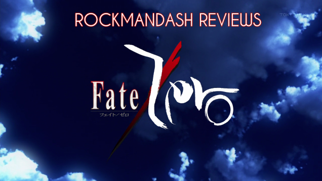

---
{
  title: "Rockmandash Reviews: Fate/Zero [Anime]",
  tags:
    [
      "rockmandash reviews",
      "ani-tay",
      "type moon marathon",
      "fate",
      "fate zero",
      "Type-Moon Marathon",
    ],
  published: "2014-03-06T05:37:00-05:00",
  attached: [],
  kinjaArticle: true,
}
---

Welcome to Rockmandash Reviews, and today on the <a class="sc-1out364-0 hMndXN sc-145m8ut-0 gIacKn js_link" data-ga='[["Embedded Url","External link","https://rockmandash12.kinja.com/type-moon-marathon-wip-1534726534",{"metric25":1}]]' href="https://rockmandash12.kinja.com/type-moon-marathon-wip-1534726534" rel="noopener noreferrer" target="_blank">Type Moon Marathon</a>,
  we have the 2012 anime known as <em>Fate/Zero</em>. <em>Fate/Zero</em> was created by a group of people with
  unbelievable talent and heralded as one of the best anime of the year....but can the clash of ideals replace actual
  character development?

<aside class="sc-1rh3ayr-6 jfFNjl inset--story branded-item branded-item--kinja" data-commerce-source="inset">

<a class="sc-1out364-0 hMndXN js_link" data-ga='[["Permalink page click","Permalink page click - inset headline"]]' href="https://rockmandash12.kinja.com/type-moon-marathon-wip-1534726534" rel="noopener noreferrer" target="_blank"><h6 class="sc-1rh3ayr-3 jRIPES">
    Rockmandash Reviews: <i>Type-Moon Marathon</i></h6></a>

In preparation for the Fate/stay night: Unlimited Blade Works Adaptation by Ufotable,
      I decided to…
<a class="sc-1out364-0 hMndXN sc-1rh3ayr-0 kOvmIi js_readmore inset--story__readmore js_link" data-ga='[["Permalink page click","Permalink page click - inset read more link"]]' href="https://rockmandash12.kinja.com/type-moon-marathon-wip-1534726534" rel="noopener noreferrer" target="_blank">Read more</a>

</aside>

What do you get when you let Gen Urobuchi have a slice of the Nasuverse? You get
<em>Fate/Zero</em> of course! <em>Fate Zero</em> was written by Gen Urobuchi, and Gen takes a very interesting
approach to the Nasuverse, but one that blends in with the rest of the Nasuverse very well. <em>Fate/Zero</em> is the
predecessor to <em>Fate/stay night</em>, and takes place during the 4th Holy grail war (which isn’t really a war....)
where people known as Masters fight with Heroes throughout history, known as servants, for a chance to get the Holy
Grail, which grants their wishes. Each servant is one of the 7 classes, Saber, Archer, Lancer, Berserker, Rider,
Assassin, and Caster. If you didn’t get that, well, <em>Fate/Zero</em> includes an extremely long 45 minute first
episode that’s almost nothing but exposition, and exposition on pretty much every topic. It’s a well written, polished
plot, with interesting themes, great ideas, and amazing premise. One issue I came into is that <em>Fate/Zero</em> has
some pacing issues. <em>Fate/Zero</em> tries to be both an action show yet have a dark, and conversational plot, and
these interfere with each other. The pacing is much better than KnK (having a plot in order helps a lot), but still
it’s still slow at the beginning.

<h4 class="sc-1bwb26k-1 fvCjqJ" id="h119785">Plot - 9/10</h4>

Normally when I review, I usually clump plot and characters into one category known
  as Writing. I decided to change it up, because I have a pretty polarized view on the characters. This is because in my
  eyes, a good majority of characters represent ideals and all conflicts are those characters fighting because of the
  difference between ideals, and they are lacking in development. This is possible because <em>Fate/Zero</em> has an
  ensemble cast which focuses on all the characters, yet focuses on none. They all have interesting ideals, but due to
  the ensemble cast, they don’t develop them enough, and to me, it feels like wasted potential. They run with the
  conflict, but they never go deeper into what these ideals stand for like in <em>F/SN</em>, and because the character
  pretty much represent the ideals, they feel hollow. 

Due to the ensemble cast and focus on ideals, there are only a few characters I was
  attached to, and truly enjoyed. The only original characters that get any development are Rider and Waiver. Rider is
  epic, always brings up the mood and is so charismatic that every time he’s on the screen, you cannot help but look at
  him. Waiver is Rider’s master, and is a dynamic character with amazing development as he grows from a spineless wimp
  to one who you can relate to, yet admire for his actions. Depending on who you are, You might like this approach with
  ensemble characters to focus on the action, but I wish it had more time to flesh in the characters, and more
  focus.
<h4 class="sc-1bwb26k-1 fvCjqJ" id="h119786">Characters - 7.5/10</h4>

Ufotable does it once again. <em>Fate/Zero </em>has some of the best visuals in
anime, with absolutely beautiful visuals: Visuals that are so good, that people still debate that they haven’t been
surpassed yet. In my eyes, what <em>Fate/Zero</em> does really well in the visuals is the is the fight scenes, with
fluid animation and excellent consistency. <em>Fate/Zero</em> has some of the best fight scenes in anime, in my
opinion, and as a Fate fan, it’s great to see characters I love animated so beautifully. It’s one of the best looking
anime I’ve seen, and it’ll hold up for years.

<h4 class="sc-1bwb26k-1 fvCjqJ" id="h119787">Visuals - 9.5/10</h4>

<iframe allow="accelerometer; autoplay; clipboard-write; encrypted-media; gyroscope; picture-in-picture" allowfullscreen="" frameborder="0" height="315" src="https://www.youtube.com/embed/4Ka9qDAII-c" width="560"></iframe>

One name can sum up what I think about the soundtrack, and that’s Yuki Kajiura. Just like
  Kara no Kyoukai, this series is full of epic music that is pleasing to the ear and absolutely beautiful, once again
  made by Yuki Kajiura. It’s truly excellent music, this time with a nice orchestral sound. They use it extremely well,
  with each track sounding awesome and supporting the show at the same time. The superb voice acting helps make up for
  that a bit though as all the characters had great voices and they all did a great job. As for the eternal Dub vs Sub
  debate, I’m going to have to give this to Dub, but the voice work is fantastic no matter what language you’re watching
  this in. While the sub has the returning characters from other Fate works, I felt like the dub cast did a better job
  in representing the characters. (Especially the servants, who are mostly foreign to Japan anyways.)

<h4 class="sc-1bwb26k-1 fvCjqJ" id="h119788">Sound - 9.5/10</h4>

While I did enjoy <em>Fate/Zero</em>, I didn’t like it nearly as much as the rest of
  the Type-Moon universe. and I blame that to <a class="sc-1out364-0 hMndXN sc-145m8ut-0 gIacKn js_link" data-ga='[["Embedded Url","External link","http://tvtropes.org/pmwiki/pmwiki.php/Main/HypeBacklash",{"metric25":1}]]' href="http://tvtropes.org/pmwiki/pmwiki.php/Main/HypeBacklash" rel="noopener noreferrer" target="_blank">hype backlash</a>, and a lack of
  personality, which I talk about in my <a class="sc-1out364-0 hMndXN sc-145m8ut-0 gIacKn js_link" data-ga='[["Embedded Url","External link","http://rockmandash12.kinja.com/rockmandash-rambles-fate-zero-revisited-1637549445",{"metric25":1}]]' href="http://rockmandash12.kinja.com/rockmandash-rambles-fate-zero-revisited-1637549445" rel="noopener noreferrer" target="_blank">revisited article</a>.

About the hype backlash; I heard so much coming into this that I was expecting
  something amazing, and what I saw was pretty good; but not as good as I was expecting. I heard so many saying it’s the
  best show ever, but that never clicked with me. I gave it plenty of chances, but it really didn’t engage me. My
  biggest gripe is the lack of character development throughout the series. I really don’t care for a good majority of
  the characters, because how they are embodiments of ideals instead of fleshed out characters with personalities.
  Because of this distinct lack of character development, episodes with it like Rin’s Big Adventure (Rin, EP 10),
  Distant Memories (EP 18) &amp; Where Justice Swells (EP 19) are the peaks for me, if the show was like this the whole
  time, I’d love it. If you are looking for something that grips you , you aren’t going to find that here.
<h4 class="sc-1bwb26k-1 fvCjqJ" id="h119789">Enjoyment - 7.5/10</h4>

Fate/Zero is a fantastic show, as it’s polished as all hell and is a good watch. The
  show is epic and has some really good points, and many fans will love it, but I have a few gripes with it and I just
  can’t love it as much as you guys do.
<h2 class="sc-1bwb26k-1 fvCjqJ" id="h119790">Overall - 8.75/10,
  Polarization +1,-.5</h2>

<strong>Copyright Disclaimer:</strong> Under Title 17, Section
  107 of United States Copyright law, reviews are protected under fair use. This is a review, and as such, all media
  used in this review is used for the sole purpose of review and commentary under the terms of fair use. All footage,
  music and images belong to the respective companies. 

<strong>Note: </strong>This review was edited on 9/22 to reflect my current
  thoughts, to pretty it up, and in preparation for Fate/stay night.

<em>You can see
  all my reviews on </em><a class="sc-1out364-0 hMndXN sc-145m8ut-0 gIacKn js_link" data-ga='[["Embedded Url","Internal link","http://tay.kotaku.com/tag/rockmandash-reviews",{"metric25":1}]]' href="http://tay.kotaku.com/tag/rockmandash-reviews"><em>Rockmandash Reviews</em></a><em>,
  and the rest of my </em><a class="sc-1out364-0 hMndXN sc-145m8ut-0 gIacKn js_link" data-ga='[["Embedded Url","External link","https://rockmandash12.kinja.com/type-moon-marathon-wip-1534726534",{"metric25":1}]]' href="https://rockmandash12.kinja.com/type-moon-marathon-wip-1534726534" rel="noopener noreferrer" target="_blank"><em>Type-Moon Marathon here</em></a><em>.
  For An explanation of my review system, </em><a class="sc-1out364-0 hMndXN sc-145m8ut-0 gIacKn js_link" data-ga='[["Embedded Url","External link","https://rockmandash12.kinja.com/rockmandash-rambles-an-explanation-on-my-review-system-1619265485",{"metric25":1}]]' href="https://rockmandash12.kinja.com/rockmandash-rambles-an-explanation-on-my-review-system-1619265485" rel="noopener noreferrer" target="_blank"><em>check this out</em></a><em>. </em>

<aside class="sc-1rh3ayr-6 jfFNjl inset--story branded-item branded-item--kinja" data-commerce-source="inset">

<a class="sc-1out364-0 hMndXN js_link" data-ga='[["Permalink page click","Permalink page click - inset headline"]]' href="https://rockmandash12.kinja.com/type-moon-marathon-wip-1534726534" rel="noopener noreferrer" target="_blank"><h6 class="sc-1rh3ayr-3 jRIPES">
    Rockmandash Reviews: <i>Type-Moon Marathon</i></h6></a>

In preparation for the Fate/stay night: Unlimited Blade Works Adaptation by Ufotable,
      I decided to…
<a class="sc-1out364-0 hMndXN sc-1rh3ayr-0 kOvmIi js_readmore inset--story__readmore js_link" data-ga='[["Permalink page click","Permalink page click - inset read more link"]]' href="https://rockmandash12.kinja.com/type-moon-marathon-wip-1534726534" rel="noopener noreferrer" target="_blank">Read more</a>

</aside>
<aside class="sc-1rh3ayr-6 jfFNjl inset--story branded-item branded-item--kinja" data-commerce-source="inset">

<a class="sc-1out364-0 hMndXN js_link" data-ga='[["Permalink page click","Permalink page click - inset headline"]]' href="https://rockmandash12.kinja.com/rockmandash-rambles-an-explanation-on-my-review-system-1619265485" rel="noopener noreferrer" target="_blank"><h6 class="sc-1rh3ayr-3 jRIPES">
    Rockmandash Rambles: <i>An Explanation on my Review System</i> (Updated 11/15/2015)</h6></a>

If you’ve read any of my reviews and wanted to know why I did them the way I do,
      here’s an…
<a class="sc-1out364-0 hMndXN sc-1rh3ayr-0 kOvmIi js_readmore inset--story__readmore js_link" data-ga='[["Permalink page click","Permalink page click - inset read more link"]]' href="https://rockmandash12.kinja.com/rockmandash-rambles-an-explanation-on-my-review-system-1619265485" rel="noopener noreferrer" target="_blank">Read more</a>

</aside>

<em>This show is available on </em><a class="sc-1out364-0 hMndXN sc-145m8ut-0 gIacKn js_link" data-ga='[["Embedded Url","External link","http://www.crunchyroll.com/fate-zero",{"metric25":1}]]' href="http://www.crunchyroll.com/fate-zero" rel="noopener noreferrer" target="_blank"><em>Crunchyroll</em></a><em> for Free &amp; Legal streaming.</em>

<aside class="sc-1rh3ayr-6 jfFNjl inset--story branded-item branded-item--kinja" data-commerce-source="inset">

<a class="sc-1out364-0 hMndXN sc-1rh3ayr-0 kOvmIi js_readmore inset--story__readmore js_link" data-ga='[["Permalink page click","Permalink page click - inset read more link"]]' href="http://www.crunchyroll.com/fate-zero" rel="noopener noreferrer" target="_blank">Read more</a>

</aside>

