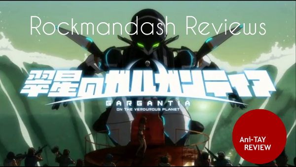
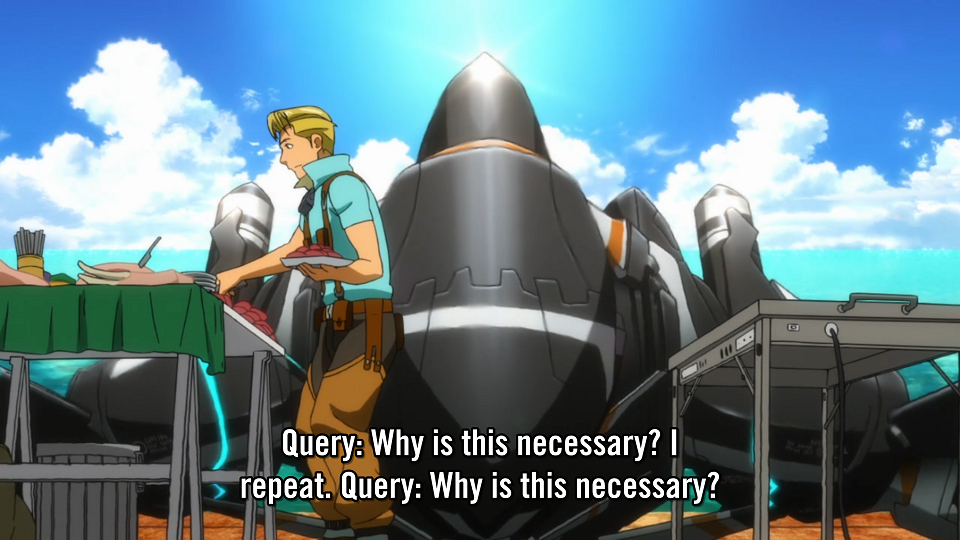
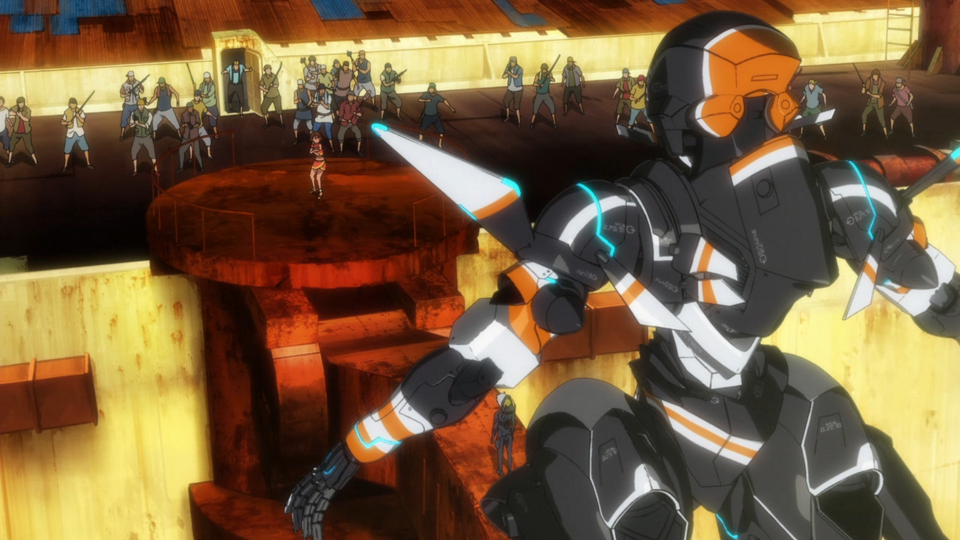
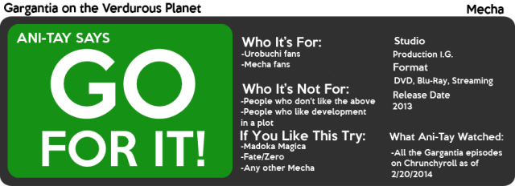

---
{
	title: "Rockmandash Reviews: Gargantia on the Verdurous Planet [Anime] BACKLOG",
	published: "2014-02-20T14:50:00-05:00",
	tags: ["rockmandash reviews", "rockmandash12", "gargantia", "review", "production ig", "ani-tay", "ani-tay review", "backlog"],
	kinjaArticle: true
}
---

I decided i'd finally get to posting my reviews that I wrote before I joined TAY, and this is the first one I thought I'd post. Hello, this is Rockmandash and this is a review of the anime Gargantia on the Verdurous (vur-jer-uhs) Planet (Season 1), a mecha written by Gen Urobuchi who is known for writing Fate Zero, Saya no Uta and Madoka Magica and animated by Production I.G.

Edit: I forgot that I even made a video review of this lol:

Gargantia is set in a distant future, where humanity lives in **SPAAAACCCEEEE**, far away from the home planet of earth. Humanity is governed by the Galactic Alliance, who's fighting a war against the Hideauze (ヒディアーズ) On one battle, Ensign Ledo, an Alliance soldier who's our main character of the story, who's inside his Machine Caliber called "Chamber", gets separated from the rest of his platoon and sucked into a wormhole. When Ledo wakes up 6 months later, He's in an unknown planet full of indigenous natives on the ship called "Gargantia". Chamber learns that the planet, which is full of water and air, is the planet known as earth, the origins of Humanity. Ledo has to learn how to adapt to the world, while questioning his own motives, world and society. The premise is simple and interesting, and it's quite enjoyable. The obligatory Gen Urobuchi plot twist is done well, and is really what made the show for me. The episodes after the plot twist were a roller coaster, showing all of the conflicts with Leno, and the alliance. The society of the Alliance, with the contrast of Gargantia is amazing, and is the best parts of the show. Overall, plot is enjoyable, but it's not the best. It has it's high points, but quite a bit of the plot is weak.

The Characters were pretty enjoyable, even the minor characters were entertaining and fleshed out a bit. Chamber is the best robot A.I. character ever. He takes everything too seriously, his interpretations of anything are hilarious, he spouts amazing one liners, and in my opinion is the best character in the show. Ledo, the main character, is great because of his realistic reactions to foreign concepts like sick people, capitalism and the social structure of Gargantia. The last important character is Amy: a hyper, over-energetic delivery genki girl who serves as Leno's love interest and a link to Gargantia's society. The characters were enjoyable, especially Chamber, but they could be better.

# **Plot 7.5/10**

# **Characters 8.5/10**

Unfortunately, the pacing is probably the weakest point of the anime, as it's very inconsistent. Gargantia is a 13 episode anime series, which spends about half of it's episodes giving you a feel for the world and developing characters. Gargantia has one of the best starts of recent anime, equivalent to that of Attack on Titan's great start, but that pace slows down…. Episodes 2-7 are extremely slow, and almost nothing really gets done, like it's a Slice of Life anime. The show takes it's time to tell it's story and show it's world. What's weird is that the same thing is done in Madoka Magica, maybe that's just Gen Urobuchi's style. Once it picks up again though, it's like a roller coaster. The Pacing could be much, much better.

# **Pacing 6/10**

**THIS SHOW IS BEAUTIFUL**. If Free! was Kyoto Ani showing their water physics off, Gargantia was Production I.G. flexing their water muscles. The world looks beautiful, relaxing and pretty. The ships have very unique designs, especially when they are in fleets. The battles looked great, with good looking mechs and good animation. The CG they used wasn't very distracting, and it was positive overall. One small downside would be that they have a bit of fanservice, but in the show it was never distracting. Get the blu-ray however, and it's quite distracting. Gargantia is really just a beautiful show.

# **Visuals 9/10**

The sound is one of the best parts of Gargantia. The music, in battles is orchestrated goodness, it's beautiful. It's just fantastic, I've never loved mecha music in animes other than Code Geass, but I loved Gargantia's music. In normal parts of the show, it's great, with a very tropical feel with unique instruments. The Voice acting is pretty good, some of the characters are fantastic, and some are just OK. Chamber's voice is perfect for the character, and he sounds great. The fake language that Leno speaks is really interesting, it sounds like German and it's awesome. Amy's voice acting, is kinda annoying though, like the character. The Opening and ending themes are nothing special, they are relaxing but nothing outstanding. Overall, the sound is solid, and quite amazing.

# **Sound 9/10**

I enjoyed Gargantia, and though it was a fun anime. I watched this right after Valvrave; another mecha of this season, expecting this to be worse off than that but I came out surprisingly positive about this show. What I look for in an anime is to be engaged, like how I was in Code Geass, and Steins;Gate. This does that, but only at the end. The rest isn't bad, but it's kind of slow. The overall, the show was enjoyable, especially at the end.

# **Personal Enjoyment 8.75/10**

Gargantia is a great show ruined by bad pacing, and wasted potential. The show is a very entertaining mecha, and is one of the better mechas I've seen. It's a beautiful show with a good soundtrack, and interesting premise. This anime is currently available for internet on Crunchyroll for free legal streaming, A DVD release from Viz eventually, or Blu-Ray import from Japan.

# **Overall - 8/10**

 

***

**Copyright Disclaimer:** Under Title 17, Section 107 of United States Copyright law, reviews are protected under fair use. This is a review, and as such, all media used in this review is used for the sole purpose of review and commentary under the terms of fair use. All footage, music and images belong to the respective companies.

*You can see all my reviews on *[*Rockmandash Reviews*](http://tay.kotaku.com/tag/rockmandash-reviews)*. For An explanation of my review system, *[*check this out*](https://rockmandash12.kinja.com/rockmandash-rambles-an-explanation-on-my-review-system-1619265485)*.*

*This show is available on *[*Crunchyroll*](http://www.crunchyroll.com/fate-zero)* for Free & Legal streaming.*
