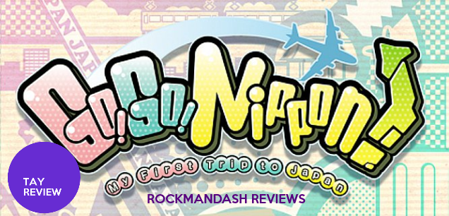
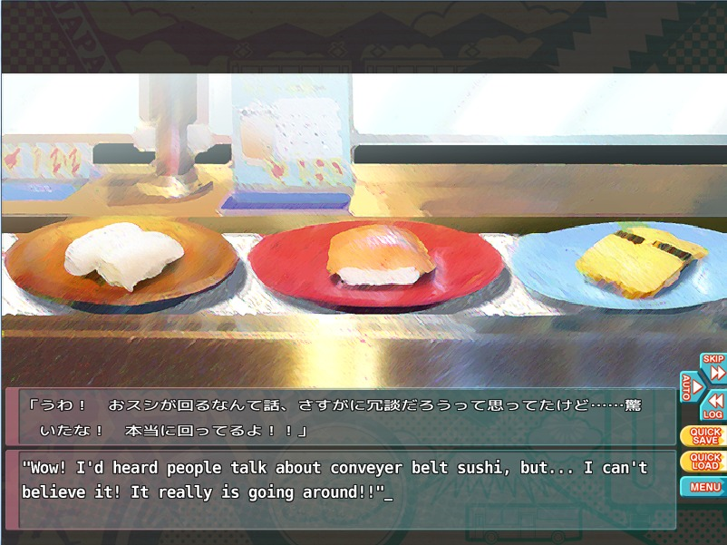
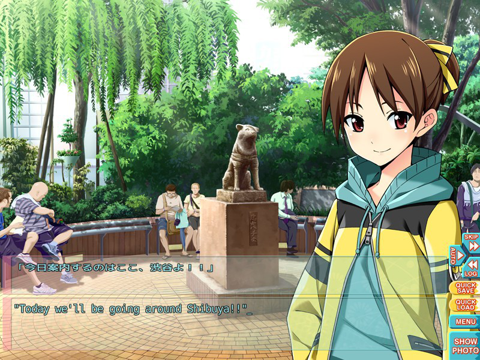
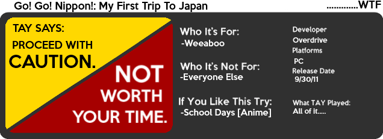

---
{
	title: "Rockmandash Reviews: Go! Go! Nippon! My First Trip to Japan [Visual Novel]",
	published: "2014-03-29T13:02:00-04:00",
	tags: ["rockmandash reviews", "go go nippon", "japan", "weeaboo", "visual novel", "review"],
	kinjaArticle: true
}
---

Now here’s a game that lives and dies on the concept alone. It’s a game that will make you double take it when you hear about it, and it’s definitely an interesting game. Welcome to Rockmandash Reviews, and today we have the review of Go! Go! Nippon! .... a game about visiting Japan.

### The Novelty

There’s only one reason why you would buy this or play this at all. That one reason, is that this game has a novelty factor that’s just insane. This is a visual novel about GOING TO JAPAN... IT’S A VISUAL NOVEL... ABOUT GOING TO JAPAN. LET THAT SINK IN. Common, that’s just mind boggling and insane. the execution and everything just make the novelty factor great, which is great because this is the only reason why your even playing it in the first place.

#### Novelty - 8/10

### Writing

If you were expecting AAA writing from a game that’s about visiting japan... well you need to get your head checked. The game tries to be a virual reality tour guide while throwing in a cheezy and poorly written love story. It fails. at both. The game is about a weeaboo (un-named, but I called him Weeaboo-san, and will refer to such throughout this review) coming to japan for a week to visit all the cool things it has to offer. He decides to stay with two online chatroom friends which he didn’t know were girls. He goes to places with said girls, visiting places all around Tokyo. The characters are the most cookie cutter personalities I’ve seen in a long time, and are pretty much as deep as a piece of cardboard, which doesn’t help the shoehorned romance and makes the interactions feel pointless. The main character Weeaboo-san, isn’t really helping much. He spews out the stupidest phrases, and a good majority of them are cringe worthy.When you think about it, this game is actually a decent workout. Lots of Palm to Face action. I’ve facepalmed more in playing this than I have ever done in such a short time period.

#### Writing - 4/10

### Length

The Time/Entertainment ratio is really low. This game has a total length of 2 hours. TWO HOURS. Let that sink into you. You can finish this in one sitting. And that’s playing through the whole game, going to a total of SIX locations. this game is way too short, and Anybody who accepts this is long enough needs to be strangled.

#### Length - 2/10

### Information dump

This game is a tour guide. The game dumps a ton of information about the issue... including very basic things that any fan of Japanese culture should know about. What confuses me about this is 2 things:

1. Who wouldn’t know about these basics if they are buying this? I came into this expecting a hilarious but weird game about a weeaboo’s experience in japan, focused on the characters. What I got was information that I already knew, or could look up on Wikipedia. This game would have been better if it had a TIPS section to explain things, instead of making the explanation the plot. It’s dumb.
2. **WHY DOESN’T THE MAIN CHARECTER KNOW THIS VERY BASIC INFORMATION?** My dear Weeaboo-san... if your dream is to go to Japan but you don’t know what something as basic as the Shibuya Crossing... **YOU ARE DOING IT WRONG.** There’s plenty of occurrences like this, and it makes me wonder what they were going for when they wrote the story.

Pretty much most of this game is an info dump, and I found this annoying. I’ve learned a bit from it, but doesn’t make up for it all my facepalming.

#### Information Dump - 4/10

### Low budget assets

This game screams low budget. From the about 3 songs played, to the little variety in character frames..... Ugh this game is meh. In both aspects, Go Go Nippon! is lacking. It doesn’t have enough music, there’s not enough art, and they aren’t that great in either category. The music is pretty meh, and visuals are average at best. It’s so generic....

#### Presentation - 5/10

Go! Go! Nippon! is a game you play because you saw it from Game Grumps or something like this. It’s a really bad game with a really good concept. Maybe next time? **This game really does hinge on whether you like the concept or not,will determine my recommendation or not.** If you like the concept, proceed with caution as the writing is pretty bad. If you don’t, avoid this with all your power. I give this a Rockmandash Regrets and a 4/10.

## OVERALL - 4/10

 

***

**Copyright Disclaimer:** Under Title 17, Section 107 of United States Copyright law, reviews are protected under fair use. This is a review, and as such, all media used in this review is used for the sole purpose of review and commentary under the terms of fair use. All footage, music and images belong to the respective companies.

*You can see all my reviews on *[*Rockmandash Reviews*](http://tay.kotaku.com/tag/rockmandash-reviews)*. For An explanation of my review system, *[*check this out*](https://rockmandash12.kinja.com/rockmandash-rambles-an-explanation-on-my-review-system-1619265485)*.*

###### [Rockmandash Rambles: *An Explanation on my Review System* (Updated 11/15/2015)](https://rockmandash12.kinja.com/rockmandash-rambles-an-explanation-on-my-review-system-1619265485)

If you’ve read any of my reviews and wanted to know why I did them the way I do, here’s an…

[Read more](https://rockmandash12.kinja.com/rockmandash-rambles-an-explanation-on-my-review-system-1619265485)
