---
{
	title: "RockmanDash Reviews: Grisaia no Kaijitsu [Visual Novel]",
	published: "2015-08-21T16:22:00-04:00",
	tags: ["Rockmandash Reviews", "Grisaia no Kaijitsu", "Grisaia", "AniTAY", "FuwaReviews", "Visual Novels"],
	kinjaArticle: true
}
---

There’s always that one work in which many people claim it’s one of the best in the medium. In the VN community, *Grisaia no Kaijitsu* by Frontwing was such a work, seen as amazing and loved by many. Now that I’m reviewing it, it begs the question: Is *Grisaia no Kaijitsu* truly the fantastic game as many fans say it is?

In my opinion, No.... Not really.

***

***

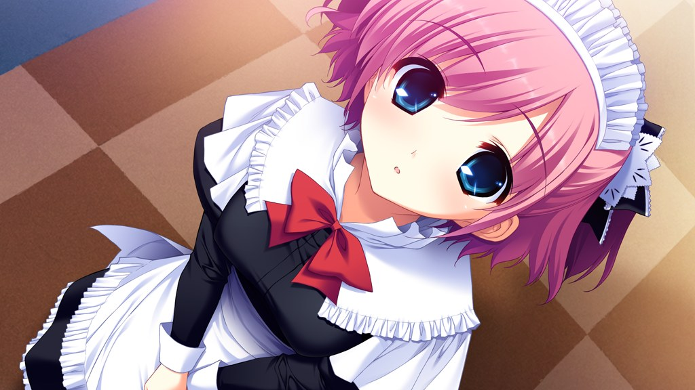

My justification? The execution of the story, which many would call the single most important aspect of a VN, isn’t handled amazingly, questionable at best and maybe even horrendous if you aren’t so kind. In *Grisaia no Kajitsu*, we follow Yuuji Kazami, a rather stoic yet military-esque transfer student to the bizarre, prison-like Mihama Academy, which is inhabited only by five female students (Amane, Makina, Michiru, Sachi & Yumiko) each embodying a stereotype, but aren’t truly as they appear, with their own unique “circumstances” for being at this school. As we go through the story, we do eventually learn their circumstances of their past, and how they became their stereotype, ranging from horrifying and tragic to psychotic. It’s certainly an interesting premise that’s quite memorable, which should make for an interesting game but *Grisaia no Kaijitsu* has some issues that make this nowhere as enjoyable or good as it really should be.

Also, before we jump into this, I do have to note that I played the Sekai Project version from steam, and thus there was no H-scenes, so your experience may differ. While it was relatively apparent where they were, the absence of the scenes themselves don’t hurt the execution of the story at all, and the way that this game passed by the issue wasn’t bad at all... now, onto the story!

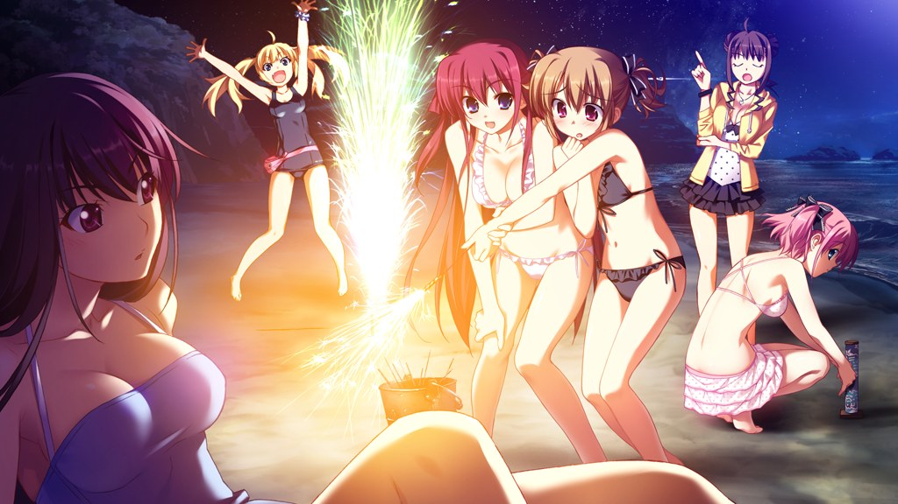

First off, there’s how it’s set up in regards to the common route: most of the action of the story happens at the very end of the routes, with a majority being filled with **TONS** of slice of life. The game makes it fairly apparent that there will be development of the characters and subversion, taking no time to hide the fact that the quirks of the characters are largely superficial and the environment that the game is set in is rather constructed. Even though this is fairly obvious to any observant player, due to the structure of the game, you can’t get to it without going through tons of things you may or may not care about, all slice of life. The common route is very long, one of the longest I’ve played... or at least it felt that way, because hours and hours of slice of life and teasing that there is more when the game won’t let you get to the subversion isn’t exactly the most exciting and fun thing to get do.

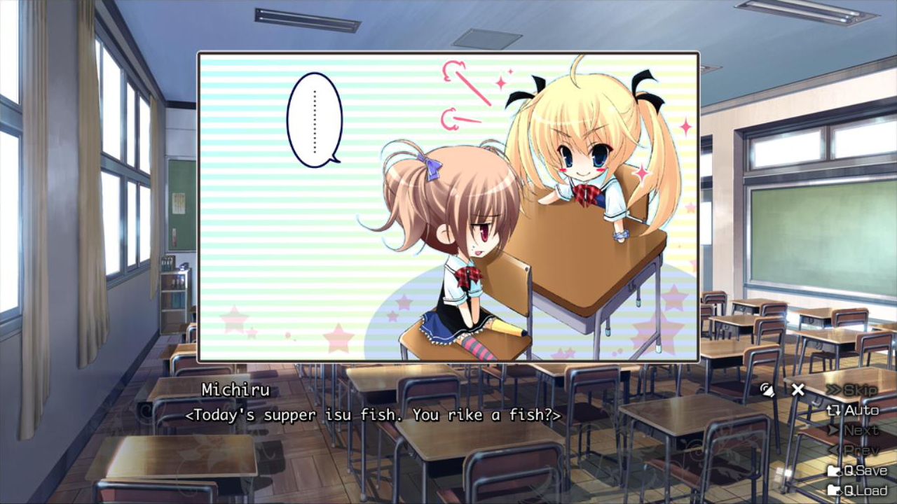

That being said, it’s not that I mind the slice of life itself, or it’s particularly bad, as the scenes themselves are almost all entertaining and fun to read, but I have 2 major issues with the execution of it: A vast majority of the Slice of life rather pointless that doesn’t directly contribute to the story in any meaningful way (which a good story would do) and **THERE’S JUST WAY TOO MUCH OF IT**, making it feel poorly paced, and poorly executed in general. It felt like it would never end, with a constant bombardment of random scenes that are all meaningless... and when you combine that with the teasing of a better story that the game and everyone else tells you about, it makes for a rather brutal experience. There was a point in time where I felt that the game was pretty much rubbing salt on my wounds, commenting on how a normal life was awesome, as I was felt like I wanted to smash my head in the wall. I played through 30+ hours until I got some real character development, and no game should be 30 hours of nothing while teasing something more... just shallow interactions with characters that serve no purpose other than to be a slice of life.... which is rather frustrating.

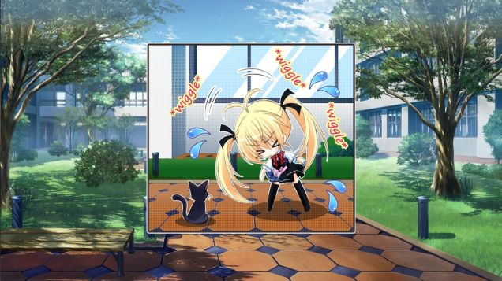

To those that don’t care or see the hinting of this game, coming into this game with the sole expectation that this was nothing but slice of life, then this execution may be OK, but that’s not really great design considering they hint and foreshadow all of the place.... so enjoyment is totally dependant on the person you are and how you experience it, it may be a very hard read (so, if you came in with the intent of reviewing it, this may be pretty frustrating). there’s the first issue of the slice of life doing nothing, making it rather hard to play because there’s no sense of progress, no sense of direction. Either you enjoy it as a sitcom-esque, directionless and meaningless slice of life or not, having to click with the characters which can be rather hard given the cast we are working with (i’ll talk about them later on), and having to deal with the flawed structure of the game. There’s also the fact that this game is one of the most well regarded game in the community with knowledge of the subversions apparent even before you play the game. I like to equate it to trying to get through *Muv-Luv Extra*, but kinda worse because it’s significantly longer.

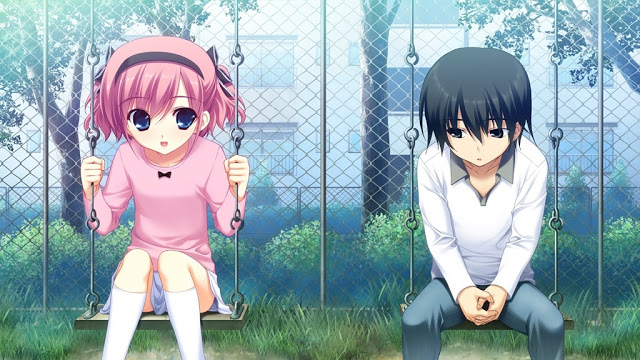

Once you get out of the common route and into the main routes, you kinda open another can of worms when it comes to the writing. There’s very little of the story that one may perceive as done poorly, and I pretty much enjoyed all of it in some form of manner because the writing overall is pretty solid, but it has its issues, with something that bothered me about them.

The most glaring of these is by far the rather contrived and lazy stunts they come up with in the story, making the story rather ridiculous at times. I’m not one who usually complains about deus/diabolus ex machinas because I care more about the execution of the story and how an element works in the context of it, but they’re all over the place here, each hampering the effect of the story and making me question more and more on why they need to do execute the story this way.

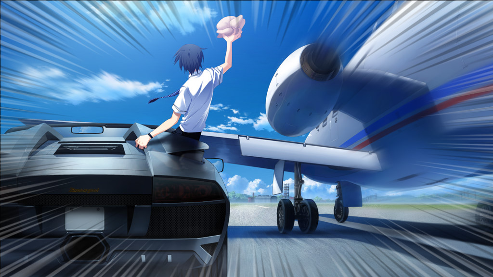

There’s one scene in particular that really stuck in my mind, and that’s the bit in Yumiko’s route in which Yumiko goes to go to america to see her father, and Yuuji prevents her from going by taking Sachi’s bike and keeping pace with a car on the way to a private transfer airport, but being too late,then running into a guy who just happens to have a lambo and keeping up with the airplane is it flies to the other airport in japan to go to america, then driving up to the plane as it is about to take off, throwing a frozen chicken into the plane engine to stop the plane. I couldn’t make this shit up: that’s just the level of contrived BS that this story has.

Another thing to note is the rather disproportional amount of content when comparing the length between the main routes and the slice of life elements: There’s a lot more slice of life, and some of the actual routes are chock full of it. They spend too much time with slice of life and not enough time with the actual character development, leaving some of the character arcs feeling rather underdeveloped, considering all the time the slice of life took. Also, because of this approach, they decided to leave out what I was looking forward to most in *Grisaia no Kaijitsu*, the story of Yuuji’s past, which you have to wait for in the other games, *Grisaia no Meikyuu* and *Grisaia no Rakuen*, and that kinda stings, especially given the length this game. It was the equivalent of buying a PS3 for *Kingdom Hearts 3*, *FF15* and *Last Guardian*, but only to learn that they got moved to the PS4. I played through a majority of this game, hoping, begging for some development of Yuuji, who’s past was hinted throughout the game, but nope...

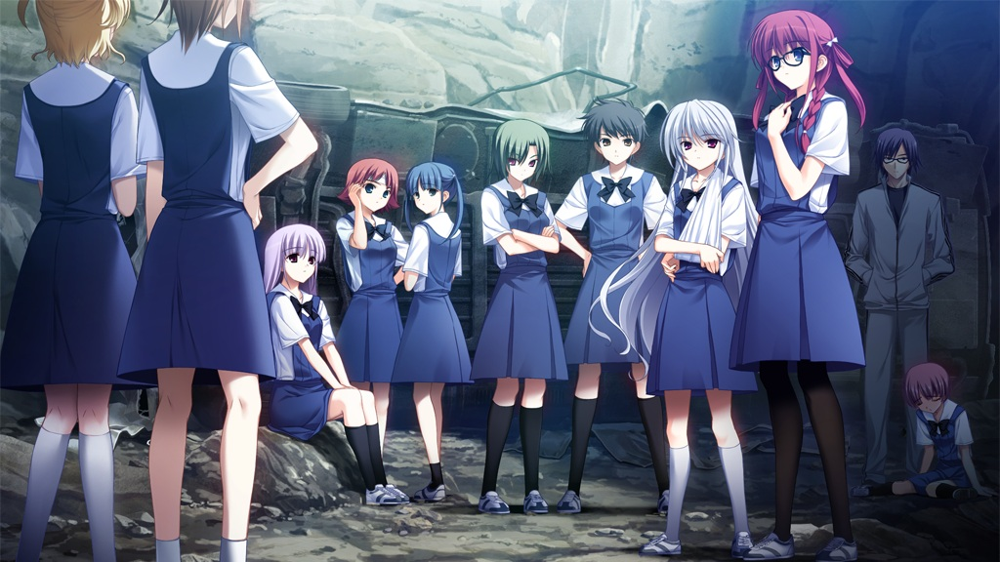

That being said, the routes vary in quality, with some of them having more issues than not, so I’ll describe by them one by one in the order I played them with my basic thoughts on them.

* **Amane** - I started *Grisaia* off with quite possibly the worst route to start off, Amane’s route, Amane always tries to act as the older sister type character, attempting to seduce Yuuji, but they manage to subvert this in the best way possible, a tragic backstory called Angelic Howl. It’s the best route in the game, doing quite a bit right with the best handling of atmosphere and tone, has best girl of the game (Kazuki) plus most realistic relationship between Yuuji and the MC. I really enjoyed it, but would recommend to play this last, as it shaped my expectations for the game and it flows better with *Grisaia no Meikyuu and Grisaia no Rakuen.*
* **Sachi -** Sachi’s route was solid and entertaining, but it was a bit weird and rather abrupt at times, jumping the gun or throwing a plot device out of nowhere to proceed. Sachi is our moe maid character who takes everything straight, doing every task she’s asked but subverts it by showing a rather human story that displays how one could be such a way, while showing a nice childhood friend story. I liked the beginning, and really enjoyed the flashback scenes, but that sentiment didn’t carry on in the later half where the relationship between the characters got a bit questionable (their relationship never felt like a romantic one, so the romantic elements felt forced) and when the scenes ramped up in insanity (the bombing in particular made me lose my shit). I’d say it’s good, but not great.

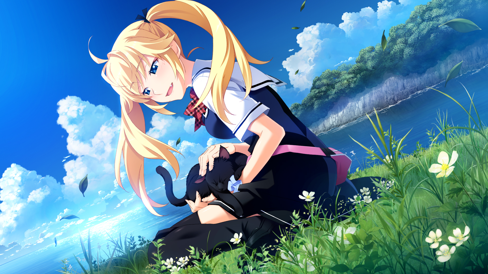

* **Michiru -** Michiru’s route was the most psychological of them and was rather surprising considering the character, but was questionable in it’s own right. She’s the dumb blond fake tsundere, and they subverted this with a rather interesting tragic story of her past and multiple personalities, with solid character interactions that were rather engaging but it felt like it was trying too hard, really stretching the boundaries of one’s suspension of disbelief with so many plot points that didn’t seem feasible, so many Deus/Diabolus Ex Machinas. Other than that, it was a pretty nice story though.
* **Yumiko -** Yumiko’s route, while entertaining is surprisingly average and generic... You’ve probably seen this before. Yumiko’s the cold kuudere, but they didn’t really subvert her charcter, instead focusing on how loneliness and horrible family situations shape a person, with outside forces screwing her life from afar. I liked it, especially because shitty parenting is something I can relate to, but I couldn’t help but feel it was out of place because it didn’t subvert the character, and the fact that this is a story that’s out there (plus the Deus Ex Machinas don’t help either). That being said, it was still a good route, but just not there.
* **Makina -** *Uggh.* Seen as the second best route of the game, I found it painful to go through, and it’s absolutely my least favorite in the game, with a questionable premise and an annoying relationship. Centered around our Loli moe character, it’s another story of a tragic family, but this time throwing PTSD and a questionable relationship with the MC, having him be a father figure when he really isn’t one, and showing slice of life that could be considered cringe worthy. You may like it because of the subject matter, but I found it rather grating and painful... not really a great way to end the game, and not a great route in general.

Overall though, the writing was good, but questionable choices make this a much more painful experience than it had to be. Your expectations will shape your experience with this though, so it’s really a your mileage may vary on whether you like the writing or not.

***

***

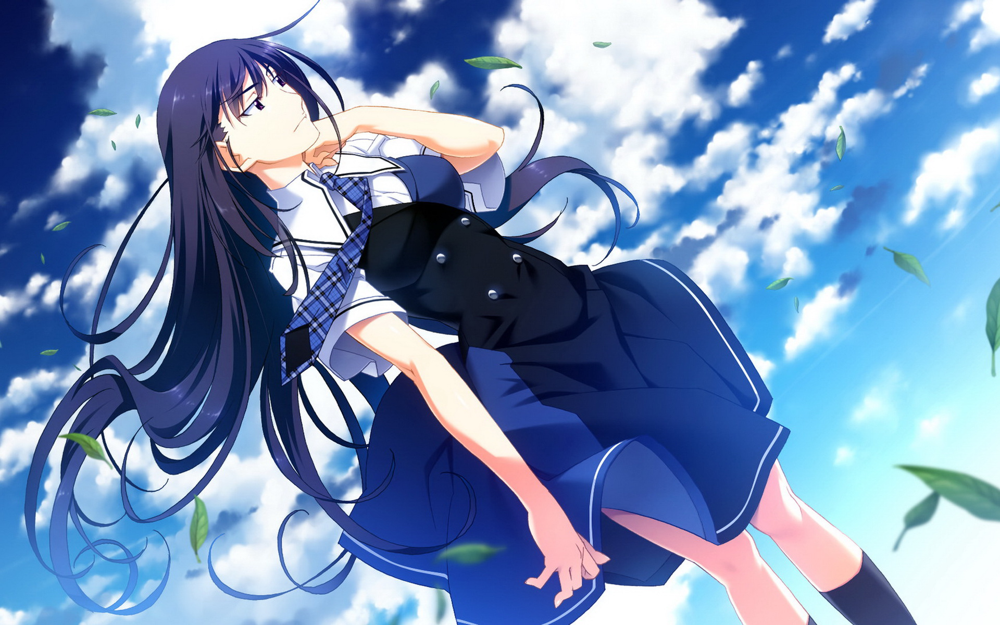

If there’s one aspect that shines in *Grisaia*, it’s probably the presentation: Being a relatively new VN, this is one of the few visual novels in 16:9 in HD (with the steam release scaling to pretty much all resolutions nicely), which is a rather nice surprise considering all of the VNs that are still in 800x600, and it has a nice soundtrack to boot. The art itself is nice: colorful, clean and sharp, doing a great job at looking great and representing everything it does well. The normal art is great, and the CG is flat out wallpaperable, looking great pretty much the entire time you stare at the screen. Everything was portrayed really well, and there’s almost nothing here that you can knock here.

I do have one gripe with the presentation though, and that lies in the soundtrack: While the soundtrack itself sounds nice and is executed well in general, managing to make scenes emotional and impactful, it’s rather repetitive due to it’s use of a few songs over and over again. It’s not the biggest deal, but it’s definitely notable, making the game feel less fresh the further you go along and it makes the songs lose impact in my opinion (especially after Angelic Howl...). All in all though, pretty good.

***

***

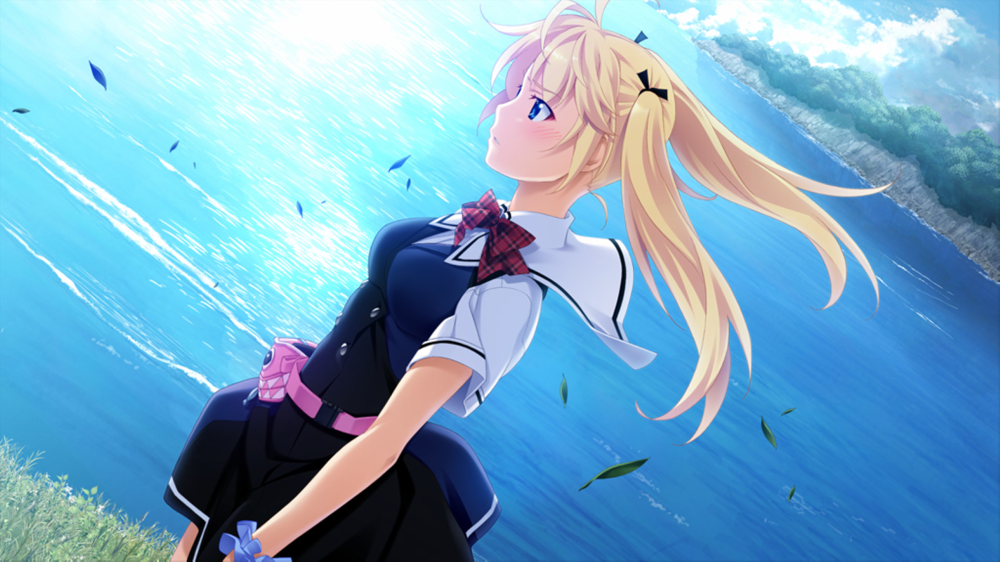

Expectations. This word is the name of the game when it comes to me and *Grisaia no Kaijitsu*, a game that has had relatively strong emotions battered at me which shaped my whole experience throughout the whole game. With expectations bolstered up by fans and friends who have said it’s one of the best VNs ever and then said expectations shot down by the stupid shit that happened during the kickstarter and my friend Dex and his commentary on the game, I had no idea what to expect, no idea what to think about the game. One thing I did know was that I would be for an experience, and what an experience it was....

When one says that a work is one of the best in the medium, they need to realize that those words hold weight and demand attention, especially to a big fan of the media such as myself. I took these words literally, hoping for a *Muv-Luv Alternative*, or at least something that would move me and engage me like a great work would do, but I ended up... really, really bored, disappointed with the extremely long slice of life, rather average subversions of the characters, lackluster execution of key elements, and pretty much the whole endeavour in general. This game is an experience that I wanted to like but there’s a ton of things that keep it from greatness. I wanted to like this game but I ended up siding with my friend on dex on this game as it really does not deserve the hype it gets. One of the Best Visual novels out there, sitting in the top twenty VNs on VNDB? I really disagree, trying to get through large chunks of *Grisaia* the same way Yuuji went through some conversations in the game, spacing out and spewing out empty phrases to get out of a conversation. That may just be me though, as i’m the type who can care less about the prose but cares more about the plot, but *Grisaia no Kaijitsu* is the opposite, caring about prose and not the plot. If you have different expectations, or are a different type of person, your experience will be different, but this is my experience I can tell, and it’s not exactly brimming with positivity, instead filled with disappointment.

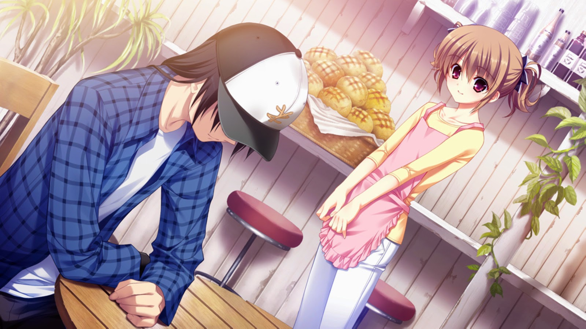

*Grisaia no Kaijitsu* is another *Muv-Luv Extra*, hinting about something deeper and preparing for something ahead while having it’s own experience suffer, and that’s not really for me. As a single experience, it’s a pain to me, and I don’t really want to review this by itself because it’s not a complete story, but the fact that it’s being sold as one, the fact that this instead of *Rakuen* being at the top of VNDB and and the fact that it’s 50+ hours means it really lends itself to that, mandating itself as a single story, which it really isn’t a great one.

If you are interested in *Grisaia*, you have to ask yourself a few questions, first and formost, if you’re OK with sinking in a lot of time. You have to ask yourself if you’re OK with going through so much fluff, if you’re OK with dealing with all of this Slice of Life, and if you said no to either of these, avoid the game, the opportunity cost is too high. If so, wait until Sekai Project/DenpaSoft releases the whole trilogy, or watch the anime, as this is something to be experienced at once, as one story. *Grisaia* as a trilogy is a really solid story, with *Kaijitsu* serving up to lead to them... but *Kaijitsu* is also much larger than those two combined, so unlike *ML*, this isn’t a minor aspect of the series, this is the majority of it. If you had to ask me if it was worth it to me, I’d have a hard time answering, and for that alone, it cannot be one of the best VNs I’ve ever played. It’s good, but so far I’d put stuff like [*Rewrite*](/posts/rockmandash-reviews-rewrite-visual-novel-1609445042?rev=1440195977007) way ahead of it., as to me anyone who really loves this has to be a SoL freak or abused the ctrl button.... Even [*Ever 17*](/posts/rockmandash-reviews-ever-17-the-out-of-infinity-vis-1626111485) with it’s slow ass pace and chicken sandwiches had a looming sense of terror and an actual plot to go around, something *Grisaia* lacks for a majority of the game.

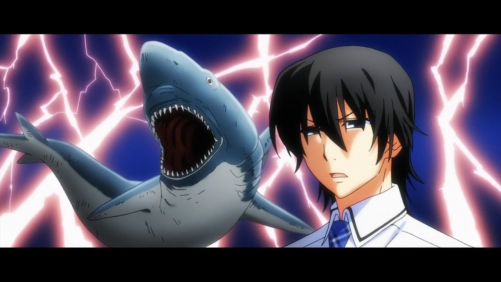

Also, about the anime adaptation: While I haven’t seen all of the *Grisaia no Kaijitsu* anime, stopping around episode 5, [I’ll let this article by Fatalis do the talking](http://anitay.kinja.com/grisaia-no-kajitsu-the-anime-you-should-not-be-watchin-1651115065#_ga=1.30369526.838445421.1439275084), but I think it’s another case of your milage may vary as they cut out a lot of the crap the VN has. The anime of *Grisaia no Meikyuu* and *Grisaia no Rakuen* were pretty good. I don’t know how the VN stacks up in comparison, and I’ll tell you how they do when Sekai Project releases them, but I’ve heard the Anime does a good job adapting them.

***

***

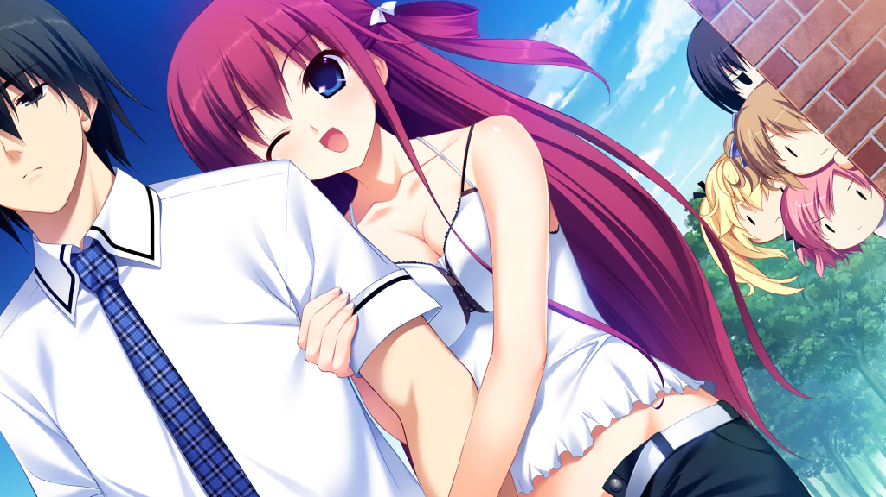

*Grisaia no Kaijitsu* is an interesting game, one of the most important in the Visual Novel medium. The choices that it makes absolutely infuriates me, the game’s slice of life is way too long and I don’t really think it stands up as an individual work, but there’s something in here that’s made so many people love it, the interesting premise and solid writing throughout. It has it’s problems, but it’s up to you to determine if you love it or not, and many people do.

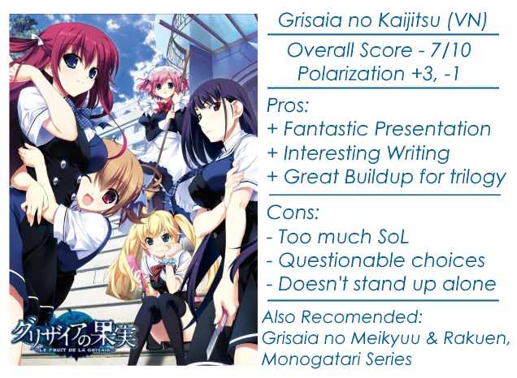

***

****Disclaimer:*** This copy of the game was provided by Sekai Project for the purpose of review. Also, Under Title 17, Section 107 of United States Copyright law, reviews are protected under fair use. This is a review, and as such, all media used in this review is used for the sole purpose of review and commentary under the terms of fair use. All footage, music and images belong to the respective companies.*

*You can see all my reviews on *[*Rockmandash Reviews*](http://tay.kotaku.com/tag/rockmandash-reviews)*. For An explanation of my review system, *[*check this out*](http://tay.kotaku.com/rockmandash-rambles-an-explanation-on-my-review-system-1619265485#_ga=1.205141205.473183827.1418699279)*.*
