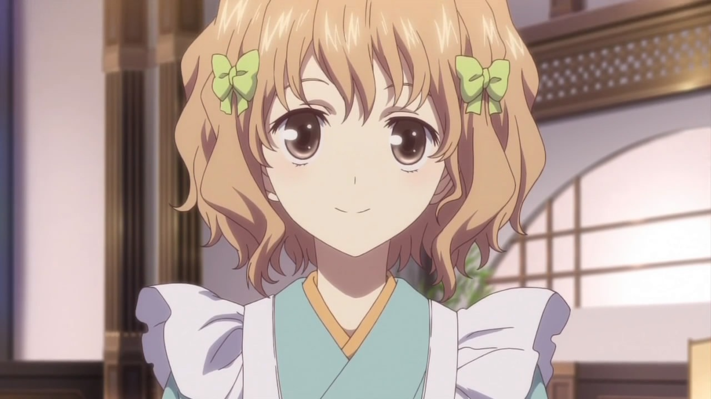
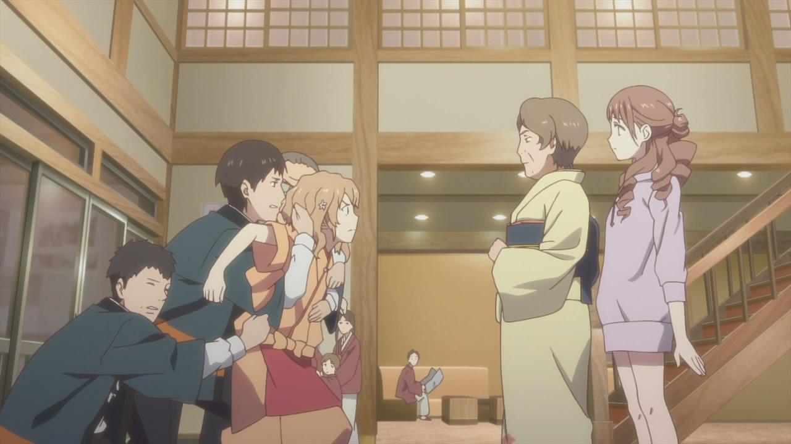
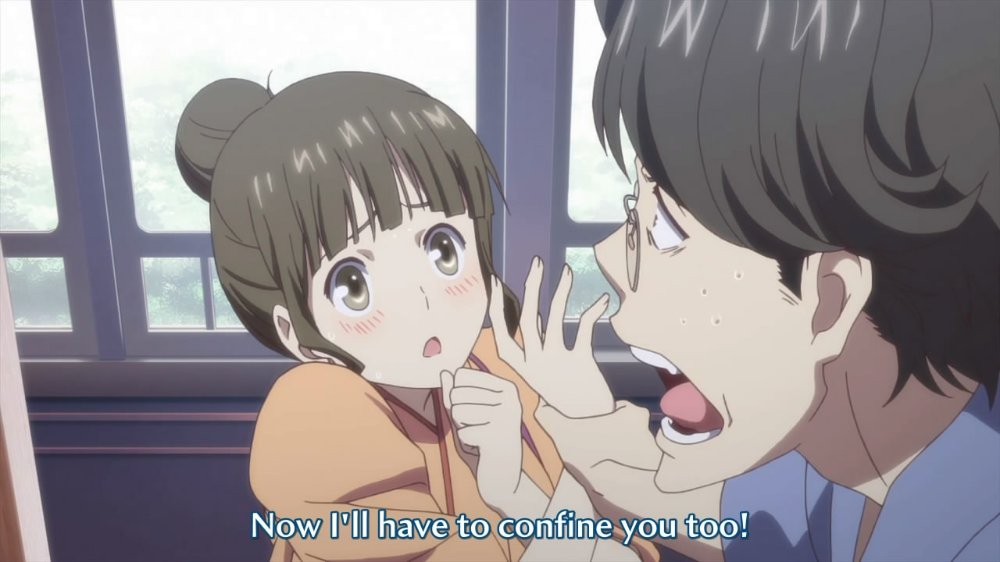
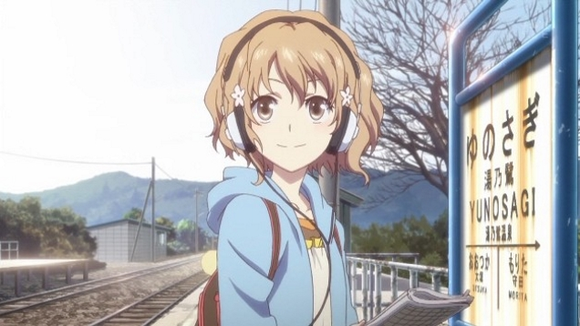
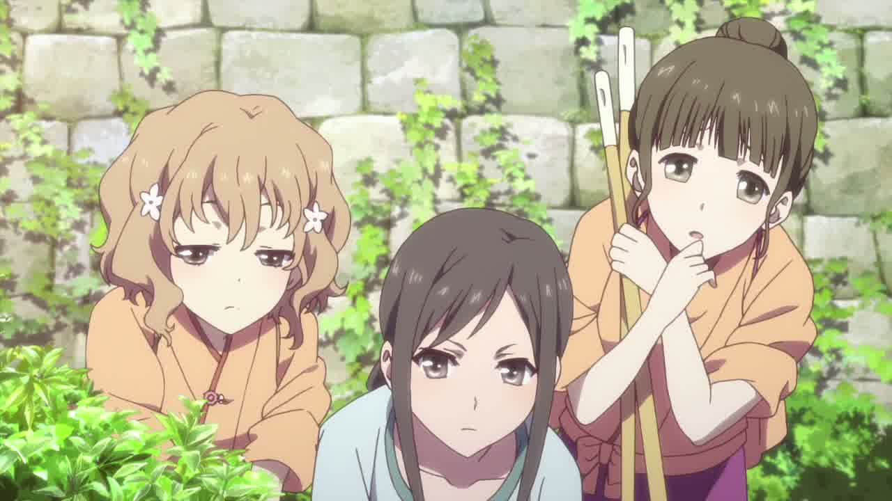

---
{
	title: "Rockmandash Reviews: Hanasaku Iroha [Anime]",
	published: "2014-10-09T16:00:00-04:00",
	tags: ["Rockmandash Reviews", "Ani-TAY", "Review", "Ani-TAY Review", "PA Works", "Mari Okada", "Hanasaku Iroha"],
	kinjaArticle: true
}
---

<video src="./1248085435824665261.mp4"></video>

Even though I write a lot of reviews on anime, there are so many shows I haven’t seen. When Dex put *Hanasaku Iroha* in the Also Recommended section of the end card for our [*Glasslip* review](http://anitay.kinja.com/glasslip-ani-tay-review-and-discussion-1641880502) and I saw how much people liked it in the comments, I thought now would be a good time to check it out. Welcome to Rockmandash Reviews, and today we have a *Hanasaku Iroha*: a great PA Works show written by Mari Okada.

Mari Okada is an amazing writer, and *Hanasaku Iroha* is yet another example of her great writing. The perfect balance of day to day activities, character interactions, interesting events, and well developed themes is really a sight to behold; this show is written well, and this balance will keep you interested.

*Hanasaku Iroha* follows Ohana Matsumae, a 16-year-old teenager living in Tokyo, but Ohana has to move because her mother elopes with her boyfriend. Ohana arrives at her grandmother’s country estate and realizes her grandma runs an inn called the Kissuisou. Ohana’s grandma starts making her work at the Kissuisou but she finds herself at odds with many of the employees and customers at the inn. This discourages Ohana, so she uses these circumstances as an opportunity to change herself for the better.

*Hanasaku Iroha* is slice of life done right: the daily events in it are much more interesting than most in this genre because it’s not just focused on a normal life, but something that’s different and unique. Just seeing how the staff of the Kissusiou keep the inn running, the antics they try to pull to get more customers, and how they deal with issues like large events is entertaining and kept me watching. On top of that, they pair those with great characters, and it makes it a slice of life that stands out from the crowd.

I can’t emphasize this enough: The characters are superb in *Hanasaku Iroha*. Ohana is probably the best main character I’ve ever seen in a slice of life show, and the rest of the cast is equally as great. The coming-of-age during the first episodes for Ohana was fantastic, and the themes she dealt with during that time were amazing and the themes she dealt with, such as loneliness, facing reality, the struggle to fit in, and dealing with the fact that effort doesn’t equal results were amazing and made me able to relate to her. When she changed herself, it was for the better: Ohana became a loud and overly optimistic lead who butted into many of the other characters’ problems, yet this personality never got on my nerves unlike many characters of that nature. Her quirks become strong points in the story and her actions, while annoying and reckless, always lead to the best situations. The rest of the cast is just as dynamic and interesting: they have eccentric personality traits and they all get fantastic development, with some of them even having whole episodes dedicated to developing it, with that info actually helping the story. If I spent time discussing every character and what development they went through, I’d be here all day talking about them because of how well the character development is executed. It’s what a good slice of life should do: spending time to flesh out the characters in an enjoyable way.

The interactions between the characters is one of the strong points of *Hanasaku Iroha*’s writing. The Kissusiou staff have some of the best chemistry I’ve seen in anime, leading to some interesting scenes. The bonds and feelings between the characters, along with their ideals of how they should live to achieve a happy life is something that is extremely enjoyable to watch as they run their course. The idea that the customer should always be the number one priority, the mentality of those who work in comparison to those who don’t, what one should dream for, what makes a successful team, the awkward relationship of a broken family that despises each other, the relationships between friends and coworkers, and of course, the relationships that lead to love are interesting, and engaging themes that were executed very well. Even the romantic sub-plot that felt shoehorned at times was handled pretty well: never overwhelming the main story and still being entertaining.

If I had to say there was any flaws with this show, it has 2 of them: the middle parts of the show where it falls into the typical event-of-the-week type of show, and the direction at the beginning which was unclear. Both of these cause the plot and themes to falter, but the interesting interactions between the characters kept me watching. Really, Mari Okada is a stellar writer and this is another example why. It had good pacing, and it was entertaining throughout the show, especially at the end. It was a slice of life done right, and it shows that an interesting setting with interesting characters can go a long way.

# Writing – 9.25/10

 

I can pretty much copy and paste this segment for PA Works shows at this point: it’s a beautiful show, just like everything they have made. They are called Progressive Animation for a reason: they manage to blow you away with image quality every time you see one of the shows they made. Once again, the scenery is just blows my mind; the episodes in Tokyo are absolutely stunning. It’s pretty much at Makoto Shinkai levels of [scenery porn](http://tvtropes.org/pmwiki/pmwiki.php/Main/SceneryPorn) in those episodes, and it looks very pretty. They were my personal favorite parts of the show visually as they make the city look amazing, yet they captured the look and feel of the city from Ohana’s perspective. That’s a theme continues on; they really capture what a countryside would look like (Probably because It’s inspired by a real place), and they capture the feel of the countryside with the great lighting, insane detail, and the vivid greenery. However, there is a slight con due to this: the visuals don’t tend to pop out that much in the show nearly as much as something like [*Nagi no Asukara*](http://tay.kotaku.com/rockmandash-reviews-nagi-no-asukara-anime-1567969970) because it’s more subdued and realistic, which is kind of a shame, but it helps the mood at the same time.

I normally don’t really touch on them, but I thought that the character designs in *Hanasaku Iroha* were quite great because the characters have designs that work with their personalities. Ohana in general had a great design: Her hair with the flowers look amazing, no matter the expression she has on her face it’s pleasing to the eye, and the design really fits with her personality.

# Visuals – 9.25/10

It goes without saying that *Hanasaku Iroha* has great soundtrack... but there’s one big thing that separates this soundtrack from the other PA Works soundtracks: subtlety. The soundtrack in *Hanasaku Iroha* is made to compliment the mood, not to make the mood or atmosphere. Once you finally notice the soundtrack, you’ll be pleasantly surprised as it has well composed tracks, it utilizes a wide variety of instruments, it’s pleasing to the ear and it’s pretty great overall. As for voice acting, it’s pretty solid, but I’m not really an expert when it comes to voice acting so I can’t say much about it.

# Sound - 8.5/10

 

Normally, with Okada stories, I have strong opinions on the stories she writes. With *Hanasaku Iroha*, that’s not really the case. I’ve been saying it throughout the review; this show is very subtle and what it’s trying to do, and this subtlety is something that makes me appreciate the show after the fact more than while watching it. It gives it a feeling that this show was more planned than others, and I liked that. However, this can be a flaw; the show was thoroughly enjoyable and found it to be great… but it doesn’t have the passion I usually feel when dealing with Mari Okada works. I missed that, and I’m not exactly sure what to think of the change, but I don’t think that’s the point with this show. This was a show that set out to be an enjoyable slice of life and a feel good show, which it certainly does. It’s kinda like the [Anti-Sakurasou](https://anitay.kinja.com/rockmandash-rambles-sakurasou-is-the-first-romantic-co-1603256720) in execution, but they share a lot of similarities otherwise. It’s an enjoyable ride that you’ll appreciate, but it’s not a story that’s memorable because of the emotions it inflicted on you.

# Enjoyment - 8.5/10

*Hanasaku Iroha* is a great show, but for reasons I did not expect. It’s one of the best slice of life shows I’ve seen, with a feel good attitude and subtlety that’s been forgotten in many shows. It does a lot right, and while it may not have the passion that I typically think of when I think of a Mari Okada work, it was still enjoyable, and I would definitely recommend this one.

# Overall - 9/10, Polarization +.25, -1

<video src="./1248085436537259181.mp4"></video>

***

**Copyright Disclaimer:** Under Title 17, Section 107 of United States Copyright law, reviews are protected under fair use. This is a review, and as such, all media used in this review is used for the sole purpose of review and commentary under the terms of fair use. All footage, music and images belong to the respective companies.

*You can see all my reviews on *[*Rockmandash Reviews*](http://tay.kotaku.com/tag/rockmandash-reviews)*. For An explanation of my review system, *[*check this out*](https://rockmandash12.kinja.com/rockmandash-rambles-an-explanation-on-my-review-system-1619265485)*.*

*This show is available on *[*Crunchyroll*](http://www.crunchyroll.com/hanasaku-iroha)* for Free & Legal streaming.*

[Read more](http://www.crunchyroll.com/hanasaku-iroha)

*Once again, thanks to Protonstorm for helping with the editing for this review. I really appreciate all the help. :)*
