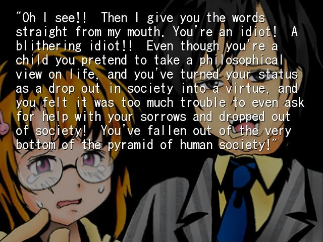
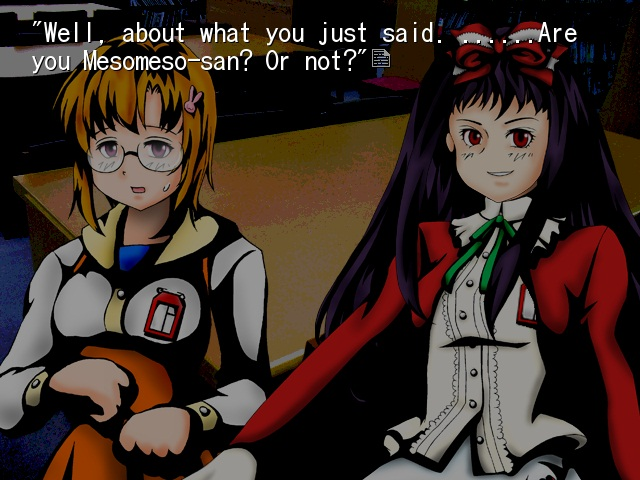
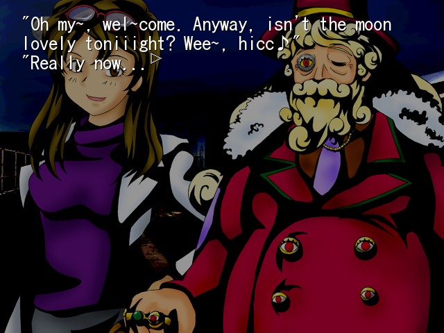
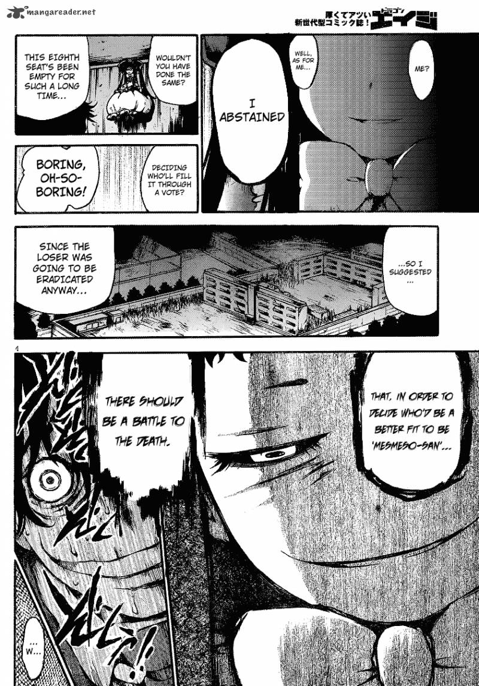
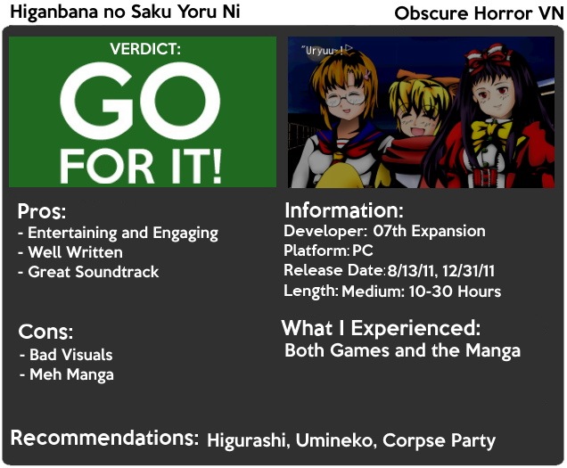

---
{
title: "Rockmandash Reviews: Higanbana no Saku Yoru Ni [Visual Novel & Manga]",
tags: ["Rockmandash Reviews", "Higanbana", "Higurashi", "07th Expansion", "Visual Novel", "Manga"],
authors: ['reikaze'],
published: '2014-12-08T22:25:00-05:00',
attached: [],
license: 'cc-by-4',
oldArticle: true
}
---

<video autoplay="" loop="" muted=""><source src="./1248079700163017064.mp4" type="video/mp4"/></video>
Every now and then, I’ll run into works made by groups that are well known, but the works
  themselves aren’t. From <a class="sc-1out364-0 hMndXN sc-145m8ut-0 gIacKn js_link" data-ga='[["Embedded Url","External link","http://rockmandash12.kinja.com/rockmandash-reviews-canaan-anime-1626371217",{"metric25":1}]]' href="http://rockmandash12.kinja.com/rockmandash-reviews-canaan-anime-1626371217" rel="noopener noreferrer" target="_blank"><em>Canaan</em></a><em>,</em> which
  was written by Type-Moon, to <a class="sc-1out364-0 hMndXN sc-145m8ut-0 gIacKn js_link" data-ga='[["Embedded Url","External link","http://rockmandash12.kinja.com/rockmandash-reviews-rewrite-visual-novel-1609445042",{"metric25":1}]]' href="http://rockmandash12.kinja.com/rockmandash-reviews-rewrite-visual-novel-1609445042" rel="noopener noreferrer" target="_blank"><em>Rewrite</em></a><em>,</em>
  which was made by Key, its fun to see these works that are nobody’s heard of and be pleasantly surprised by them.
  Today on Rockmandash Reviews, we have such a game: <em>Higanbana no Saku Yoru Ni</em> (both <em>Dai-ichi Yoru</em> and
  <em>Dai-Ni Yoru</em>) by 07th Expansion, the doujin group that wrote the ever popular<em> Higurashi</em> and <em>Umineko</em>.

There’s not much you can say directly about the plot of <em>Higanbana</em> without
  spoiling it, because it has such a strong story that hones in on a few themes, continuously reinforcing it and the
  message it wants to tell. Like 07th Expansion’s other games, it’s another supernatural horror game, this time taking
  place in an unnamed school, executed similar to <em>Corpse Party</em>. It’s a series of short stories about horrible
  (yet extremely engaging) events started by supernatural beings called <a class="sc-1out364-0 hMndXN sc-145m8ut-0 gIacKn js_link" data-ga='[["Embedded Url","External link","http://en.wikipedia.org/wiki/Y%C5%8Dkai",{"metric25":1}]]' href="http://en.wikipedia.org/wiki/Y%C5%8Dkai" rel="noopener noreferrer" target="_blank">Yokai</a>, with each
  story having a different protagonist.

These stories are separated yet connected; it
  feels episodic at times with each chapter being its own story, but each chapter influences another and really is just
  the story of what horrible things are happening at the school... with bullying as the overarching theme. When I say
  that, I really mean it: Bullying really is an overarching theme in this game, with Higanbana showing how horrible kids
  are (Well, people in general, but mostly kids), with themes of revenge, delusions, loneliness, the strength of a
  person, group psychology, death and hierarchies in life. When I say horrible I really mean horrible, with some of them
  having people that I would describe as scumbags of humanity doing absolutely atrocious deeds… but even that makes for
  a great read.

That being said, I don’t believe it’s that much of a horror game, as there are even
  lighthearted parts of the story later on . It’s more a tragic story of people and horrible things they can do, instead
  of a true horror game. It’s an engaging story that draws you in, but it’s never really scary, and it never really
  tries to scare you. It doesn’t really show any of the actions, but if you don’t do well with scary situations or
  thought <em>Higurashi </em>/<em>Umineko</em> was scary, you’ll probably be afraid of this too. <em>Higanbana</em>’s
  done in a subtle, ambiguous way which helps the story quite a bit, getting you to ponder the ideas that the story
  bounces around, while not destroying your suspension of disbelief.

The spiritual elements in <em>Higanbana</em> were some of the most enjoyable parts
  of the writing to me as they fleshed out the world, with it’s unique society that was intriguing and interesting.
  While the story could have been just another character drama, the interesting world of the Yokai makes
  <em>Higanbana</em> that much better, and it was one of my favorite aspects of this game. Normally, I’m not the biggest
  fan of the supernatural, but when it’s done this well, with so much detail and emotion, I have to love it.

The execution in general was pretty solid, with every element building up to make a great
  experience. Some of the stories were pretty weak (like ch6 of <em>Dai-ichi Yoru</em>) and some of the stories end very
  anticlimactically, but they all serve a purpose and are all pretty enjoyable to a point. The characters were solid,
  with all of them interesting and enjoyable, and the two main characters were just great. Higanbana (yes, there is a
  character called that in the game) and Marie were just awesome, with Higanbana was an epic troll throughout, and Marie
  was innocent yet determined, a little slice of sanity in this insane world, providing hope where everyone wants
  despair. Her character really helped keep the story engaging and entertaining, keeping it sane and humane. The pacing
  in the game never got in the way and was pretty solid, the story as a whole was interesting, engaging and well
  written. It compelled me to want more and pushed me through the story, due to how well written it was. The games both
  had a great ending, being entertaining, concluding well, and were both very satisfying. <em>Higanbana</em> is written
  very well, and it’s a story that you should try out.

<h4 class="sc-1bwb26k-1 fvCjqJ" id="h109447">Writing - 9/10</h4>

When playing through 07th expansion games, there are things that are expected when it comes
  to visuals (which is that the visuals are best described as passable). <em>Higabana </em>doesn’t change a thing. It
  has bad character art, the Nscripter engine is annoying/outdated, and the backgrounds look average at best; it’s a
  2011 game, but it looks like it was made in the early 2000’s. The worst part is though, unlike the other
  07th expansion games, there’s no update patch so you’ll have to deal with the BS art, but the art shouldn’t
  get in the way of your experience and it never did for me. Also, I thought that the backgrounds, while outdated, added
  charm at times, and the selective utilization of sight works to your advantage in the story, so it’s not all horrible.

<h4 class="sc-1bwb26k-1 fvCjqJ" id="h109448">Visuals - 5/10</h4>

<iframe allow="accelerometer; autoplay; clipboard-write; encrypted-media; gyroscope; picture-in-picture" allowfullscreen="" frameborder="0" height="315" src="https://www.youtube.com/embed/PL2614736EDC061735" width="560"></iframe>

Like the Visuals, 07th expansion is very consistent with the quality of the sound, but
  unlike the Visuals, the auditory experience is great. It has memorable tracks, creates a great atmosphere to enhance
  the story, and it’s pleasing to the ears. It’s very well composed, extremely engaging, and the best way to describe it
  would be rich, beautiful, and haunting (due to the setting). It does a great job and it’s an amazing soundtrack.

<h4 class="sc-1bwb26k-1 fvCjqJ" id="h109449">Sound - 9/10</h4>

While <em>Higanbana</em> isn’t as mind-blowing like <em>Higurashi</em> and <em>Umineko</em>
  are, it’s just as enjoyable. It’s written exceedingly well, the characters and the ideals that it deals with are
  intriguing and engaging, the soundtrack is great, and everything is just pretty solid. I really enjoyed this one, with
  the writing keeping me absorbed into the story and into the world. The occult and the Yokai elements were intresting
  and intriguing, building a fantastic and interesting world, while not being too overbearing... which I find typically
  happens with these types of stories and to me this change of pace was pretty enjoyable. <em>Higanbana </em>is pretty
  subdued in general, which means it’s harder to screw up, but it also means that this story isn’t nearly as memorable.
  Also, the story didn’t have that much impact on me, mainly because it didn’t feel all that original; the story was
  quite similar to <em>Corpse Party</em> in both scenario and execution, which doesn’t hurt the enjoyment, but it did
  lessen the impact it had. That being said,<em> Higanbana</em> is a very enjoyable work, and I think you’ll enjoy it as
  much as I did.

<h4 class="sc-1bwb26k-1 fvCjqJ" id="h109450">Enjoyment - 8/10</h4>

<em>Higanbana</em> also has a manga, but contrary to what you would expect, the manga is
  the original, with the VN as the adaptation. Weird, huh? That being said, avoid the manga. Although the manga has much
  better art, they have the same plot, and is the original, it’s nowhere near as good. It’s not as good because it’s
  very over the top, which really inhibits the enjoyment the series. That subtlety I mentioned earlier that helps the
  story so much? Completely absent here. Instead, you get a manga that shows too much and tells too little, thus making
  it feel more like a horror story but does it in a way that’s so overkill that you can’t really take it seriously. The
  manga fails to execute: the pacing is too fast, it doesn’t show the emotions that makes<em> Higanbana</em> great, and
  even the aspects that were better (visuals) aren’t utilized correctly. Also, it lacks the stellar music that helped
  the VN so much, which is a major blow to the execution of the story in my opinion. Ryukishi07 is at his best working
  on visual novels, and it shows here.

Personally, I just don’t understand why Higanbana didn’t get popular like 07th
  expansion games. It’s just as amazing as them, with great music, and engaging writing, so I’m at a loss. If you were a
  fan of those (Or Corpse Party), you will love this, and if you aren’t, it’s a great Visual Novel that is deeply
  engaging, but with poor visuals (07th expansion’s VN’s are called sound novels for a reason). I’d recommend
  it to anybody interested, as it’s a pretty great ride.

<h3 class="sc-1bwb26k-1 fvCjqJ" id="h109451">Overall 8/10</h3>

<strong>Copyright Disclaimer:</strong> Under Title 17, Section
  107 of United States Copyright law, reviews are protected under fair use. This is a review, and as such, all media
  used in this review is used for the sole purpose of review and commentary under the terms of fair use. All footage,
  music and images belong to the respective companies. 

<em>You can see all my reviews on </em><a class="sc-1out364-0 hMndXN sc-145m8ut-0 gIacKn js_link" data-ga='[["Embedded Url","Internal link","http://tay.kotaku.com/tag/rockmandash-reviews",{"metric25":1}]]' href="http://tay.kotaku.com/tag/rockmandash-reviews"><em>Rockmandash Reviews</em></a><em>. For an explanation
  of my review system, </em><a class="sc-1out364-0 hMndXN sc-145m8ut-0 gIacKn js_link" data-ga='[["Embedded Url","External link","https://rockmandash12.kinja.com/rockmandash-rambles-an-explanation-on-my-review-system-1619265485",{"metric25":1}]]' href="https://rockmandash12.kinja.com/rockmandash-rambles-an-explanation-on-my-review-system-1619265485" rel="noopener noreferrer" target="_blank"><em>check this out</em></a><em>. </em>

<aside class="sc-1rh3ayr-6 jfFNjl inset--story branded-item branded-item--kinja" data-commerce-source="inset">

<a class="sc-1out364-0 hMndXN js_link" data-ga='[["Permalink page click","Permalink page click - inset headline"]]' href="https://rockmandash12.kinja.com/rockmandash-rambles-an-explanation-on-my-review-system-1619265485" rel="noopener noreferrer" target="_blank"><h6 class="sc-1rh3ayr-3 jRIPES">
    Rockmandash Rambles: <i>An Explanation on my Review System</i> (Updated 11/15/2015)</h6></a>

If you’ve read any of my reviews and wanted to know why I did them the way I do,
      here’s an…
<a class="sc-1out364-0 hMndXN sc-1rh3ayr-0 kOvmIi js_readmore inset--story__readmore js_link" data-ga='[["Permalink page click","Permalink page click - inset read more link"]]' href="https://rockmandash12.kinja.com/rockmandash-rambles-an-explanation-on-my-review-system-1619265485" rel="noopener noreferrer" target="_blank">Read more</a>

</aside>

<em>This game is available on Fuwanovel for download: </em><a class="sc-1out364-0 hMndXN sc-145m8ut-0 gIacKn js_link" data-ga='[["Embedded Url","External link","http://fuwanovel.org/novels/higanbana-no-saku-yoru-ni-the-first-night",{"metric25":1}]]' href="http://fuwanovel.org/novels/higanbana-no-saku-yoru-ni-the-first-night" rel="noopener noreferrer" target="_blank"><em>First Night</em></a><em> &amp; </em><a class="sc-1out364-0 hMndXN sc-145m8ut-0 gIacKn js_link" data-ga='[["Embedded Url","External link","http://fuwanovel.org/novels/higanbana-no-saku-yoru-ni-the-second-night",{"metric25":1}]]' href="http://fuwanovel.org/novels/higanbana-no-saku-yoru-ni-the-second-night" rel="noopener noreferrer" target="_blank"><em>Second Night</em></a>

<em>Once again, thanks to
  Protonstorm for helping with this review. I really appreciate everything you do to help. :D</em> 

