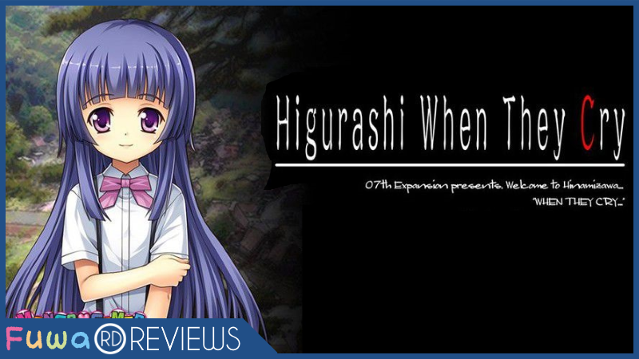
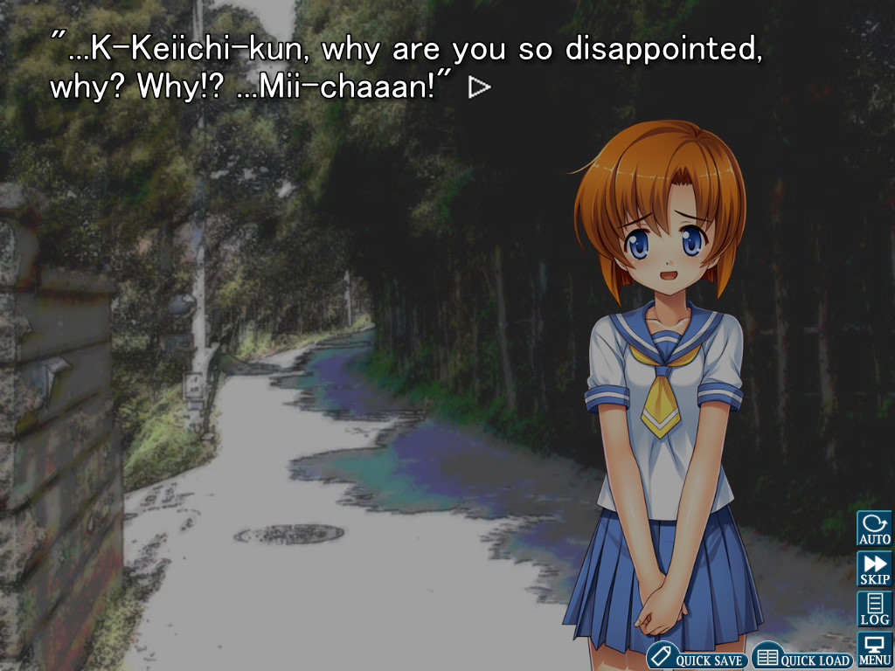
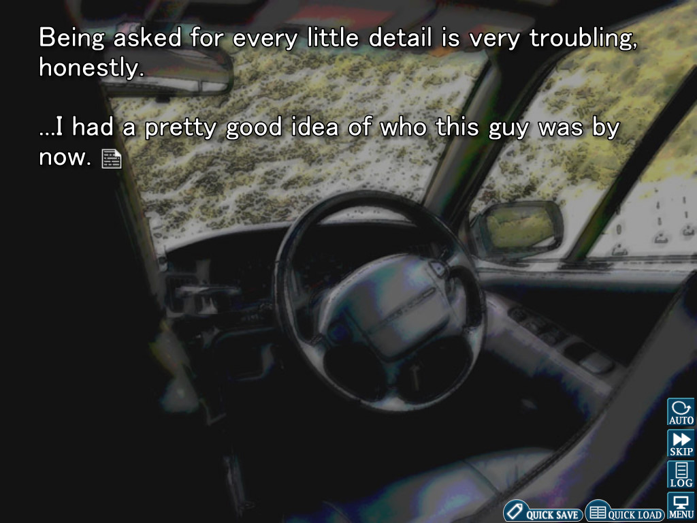
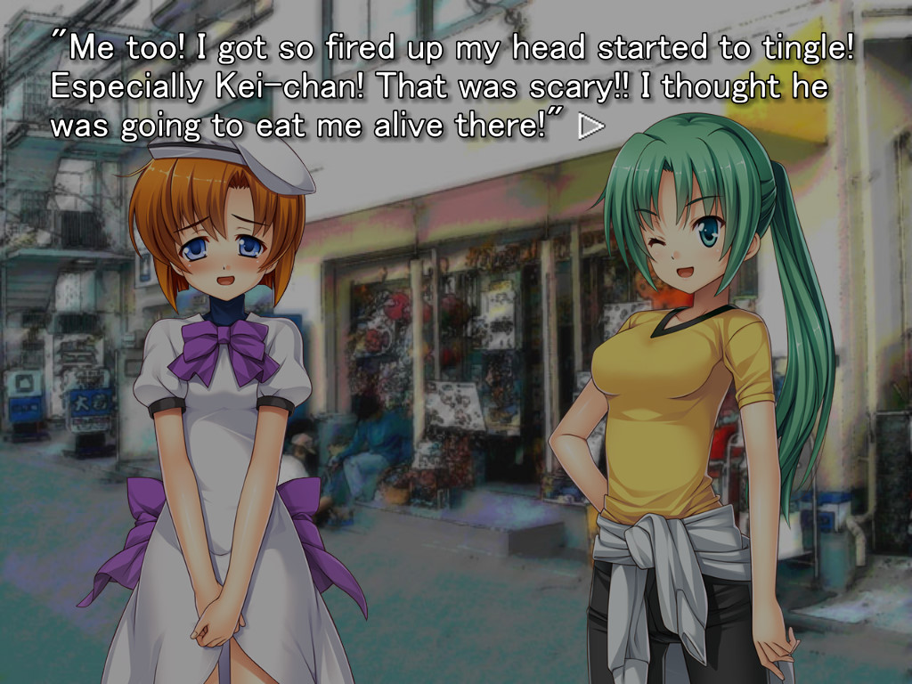
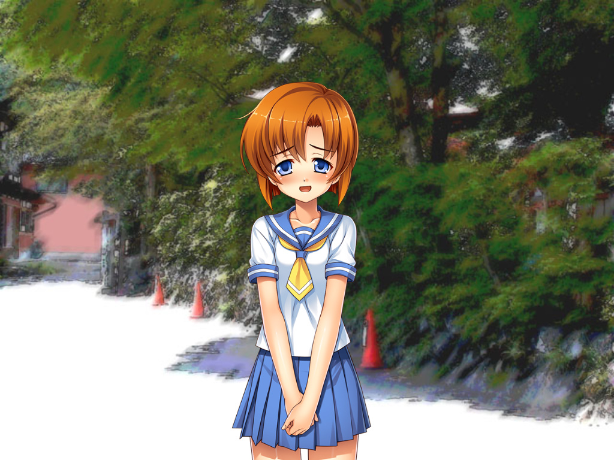
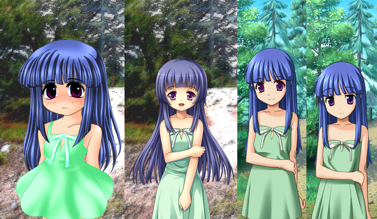
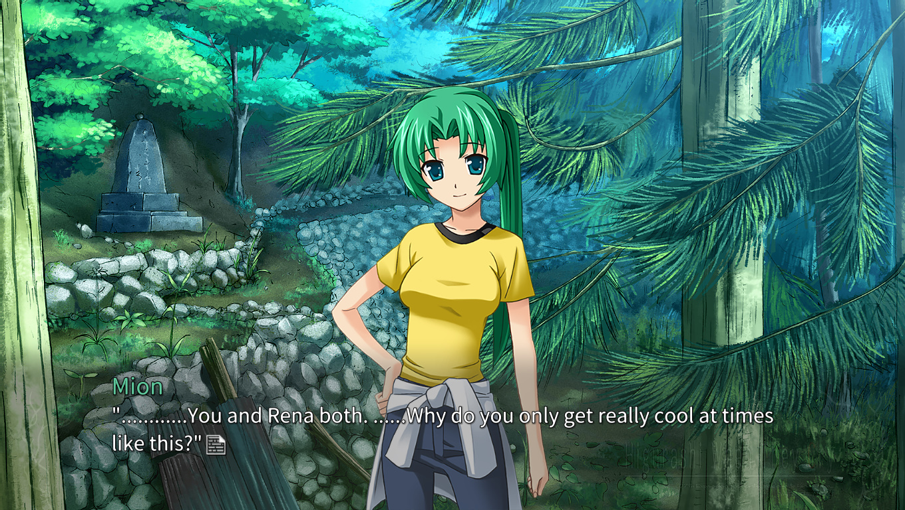

---
{
	title: "Rockmandash Reviews: Higurashi When They Cry Question Arcs (Chapters 1-4) [Visual Novel]",
	published: "2017-08-14T10:00:00-04:00",
	tags: ["RockmanDash Reviews", "Higurashi", "Visual novels"],
	kinjaArticle: true
}
---

Have you ever visited a town in the middle of nowhere and have been shocked about how radically different the place is than what you call home? Everything is shaped by its surroundings, and nowhere is this more apparent than in these isolated parts of the world, where unique cultures are forced to build amongst themselves. These differences are not always to be admired though, as what seems to conjure a more simple, fonder time can actually be archaisms that should have been left in the past. Welcome to the world of* Higurashi When They Cry* by Ryukishi07 and 07th Expansion, where the tragedies caused by deranged traditions are the name of the game in the events that unfold in the twisted village of Hinamizawa.

Set in the year 1983, we follow our protagonist Keiichi Maebara as he leaves the familiar city to move into the quiet village of Hinamizawa. He soon befriends his classmates and starts to get accustomed to his new life here in Hinamizawa, but as the annual Watanagashi festival slowly inches closer, the village’s facade falls apart. It’s not the peaceful town he once thought, but one of horror and brutality. Keiichi finds himself in the middle of a murder mystery caused by the local deity Oyashiro, leading to events that are filled with barbarity that hasn’t been seen since the dark ages, personality shifts, betrayals, and more—a horrifying story full of tragedies that can shake you to your core.

This is all a result of the fact that* Higurashi* is a horror mystery, a choice that allows the story to use the Visual Novel medium to its fullest extent. After playing through this Visual Novel, the first thing that comes to mind when I think about Higurashi is that it’s truly a shame that horror mystery isn’t more common in Visual Novels: the genre plays exceedingly well with the Visual Novel strength of information management, a defining trait of the medium. With fixed visual perspectives, the ability to explain things in detail while keeping the work engaging, and the flexibility to portray information in many different ways, this is a medium that has all the tools for someone to create something great, and 07th Expansion did just that. It might not be the type of story you might like, but start to play it and it’s hard to deny how well-done this work is and how fitting it is for the medium. Then there’s the quality of the mystery and horror itself. The mystery is some of the best in visual novels as it never feels forced or contrived, and the horror is amazing, rewarding your patience by having some of the most interesting and engaging experiences in this medium. It’s a work that gives you just what you need to let your imagination run wild,with beautiful descents into madness, jaw-dropping betrayals, horrific events, and extremely well fleshed out stories. *Higurashi* knows what it wants to do and consistently nails it, with events that are some of the most memorable I’ve ever seen.

Though, going back to the premise, the deception of Hinamizawa devolving into a horror mystery isn’t the only deceiving part of Higurashi: there’s more to this Visual Novel than what it appears to be on first glance. *Higurashi* is a story that is more than just horrific events happening, but a personal story of Keiichi’s inner struggles, the tragedies that surround Hinamizawa, regrets on decisions made in the past, and more. *Higurashi *is more than just a Horror Mystery it’s gained a reputation for, instead being a story that aims for perfection, creating a complex world that aims to resonate with you instead of trying to just jump scare you… and it does this exceedingly well. The execution is on-point, and the prose and writing are top notch. I loved how this work paced itself, giving the right amount of detail to make this work feel polished and complete while not dragging on, how it was able to monologue thoughts in a compelling way, and how it executed the mystery. This is a work that gets you to care about the characters with great interactions, gets you to resonate with the work itself, and tries to make it’s story truly outstanding. As a result, it’s a work that has great moments, one that is very engaging and very memorable.

*Higurashi* then wraps this with its atmosphere, one that serves to completely immerse you into the story. When you think about it, a Visual Novel is a terrible medium to portray an atmosphere because it’s compromised in presenting the world: it has a more limited window to display the world in comparison to TV/movies, but it doesn’t leave the world to one’s imagination like a true book can. While everyone focuses on the visuals of a work, it’s the sound that actually creates the atmosphere; it manipulates emotions, places fear into your soul, and creates resonance that allows you to immerse yourself into the world. 07th Expansion realized this and with this realization, utilized sound in a way that created a whole new subgenre in Visual Novels\*, one that truly allows the village of Hinamizawa to feel alive. Hinamizawa is already a well-crafted, phenomenal setting—one that creates a realistic yet alien atmosphere that is immersive and believable. Then 07th Expansion adds on this by changing the paradigm of Visual Novels on its head through sound, and frankly you have a work that’s almost unfair with how immersive it is, and it’s stunning. The music in *Higurashi* is the heart and soul of this game, and without the score, you aren’t truly experiencing this game. While a fair amount of the score is slice of life that is rather unremarkable, single tracks can take a scene and manipulate the reader unlike anything else, being entrancing and stunning to listen in a way that can be breathtaking. The events that we witness here are chilling, haunting, foreign, and amazing, and this experience on the reader is all thanks to the score, a soundtrack that’s one of the best you’ll hear in Visual Novels, as expected from 07th Expansion.

#### *\*Technically, Chunsoft coined the term in the 80’s, and was the original term for what we now call visual novels. Unfortunately for Chunsoft, everyone called it visual novels to avoid their trademark, so whenever someone mentions the term Sound Novel, it’s almost exclusively referring to a 07th Expansion work.*

All of this being said, there are some side effects of the choices this game made that aren’t all positive. First and foremost is *Higurashi*’s Key style of story progression. Key was/is a popular Visual Novel maker, who made works like *Kanon* and *Clannad*. At the time of *Higurashi*’s development, the main writer Ryukishi07 saw Key’s success and deconstructed them to see how they worked. What he found was they try to get you to care about the characters through ordinary, enjoyable days, but then transition into a more impactful story through a sudden occurrence. *Higurashi *very much does this, but instead of the romantic drama Key does, *Higurashi* turns this into mystery and horror. While some may see this approach as a negative due to how it slows the game down, how it impacts the early parts of the work, or how it creates a tonal dissonance. If you asked me however, I think the positives outweigh the negatives. The slice of life is done well enough to be always interesting thanks to the great humor and excellent character development, and the slice of life serves to make the twists and horror all that much more compelling because thanks to the slice of life, the you to care about the characters, and contrast of tone is used to a great effect.

Then there is the “Groundhog Day” approach that *Higurashi *takes: *Higurashi* is broken into 8 different chapters, each chapter a unique spin on the story while building the mystery and intrigue onto each other. Each arc adds something new to the experience, feeding you new information while unraveling more mysteries, all working together to make a compelling experience that couldn’t be presented any other way. That being said, there is a huge downside to this approach for now. The series is broken in half, with the first four chapters being reviewed today known as the question arcs. These arcs are exactly what they say on the tin—serving only to build the mystery and not really answer the dying questions the player might have, which can seriously hinder the experience for some. If you’re interested in playing this, I’d wait until all 8 are out.

And last but not least are the side effects of the Sound Novel approach: the lack of choices and the art.

While *Higurashi* is called a Sound Novel by 07th Expansion, there are more to the Sound Novel subgenre than an emphasis on sound: *Higurashi *birthed the Kinetic Novel subgenre in a different name, and this means there are no choices here. Everything is here to enhance the atmosphere and experience, but in its attempts to reach to engage the viewer, hindered the immersion of the game due to the lack of interaction. This might not bother some, but it’s definitely worth a mention.

Then there’s the art. Visuals are the traditional downfall with any 07th Expansion work, and for a good reason. 07th Expansion was a Doujin group when making* Higurashi*, and they have never really had the best art in the medium. In fact, the original *Higurashi* art is infamously bad, to the point that many people wouldn’t even consider playing the game. It’s not too bad in this release, however, as Mangagamer’s take on the art breathes new life into the game, turning characters that look like a joke into something that resembles actual humans, and actually looks nice. To me, there are some questionable parts about the sprites Mangagamer created, like the facial expressions that don’t really resemble the expressions they are supposed to have in the game, but it’s leagues better than the original. Also better than the original is the technical improvements from Mangagamer that make the game look even better. *Higurashi* was originally made in another era, with a native resolution of 640x480, a far cry from the ultra HD we are now approaching and the 1080p that is now standard. This means a different aspect ratio (4:3), and much lower resolution, less detailed assets. Mangagamer’s release of *Higurashi *doesn’t deal with the first issue but does deal with the latter: it brings in new HD assets into the game, with a native resolution of 1024x768, and the ability to upscale the assets to even higher resolutions if your monitor can handle it. These are improvements that are appreciated, but if one isn’t satisfied by these, there’s a way to take it even further: the mods.

Created by 07th Modding, these mods take the Mangagamer version of *Higurashi *and take the game to another level, making* Higurashi* feel truly modern. These mods render the game at 16:9(showing extra art instead of cropping it), it redoes the background art, it allows the use to pick the PS2/PS3 art for the character art, puts in the original music, and last but not least, the mod adds voice acting. The mangagamer version + the mod is the definitive version of the game for me, as I prefer the PS2 art which is much closer to the anime than the original or Mangagamer art, and I would argue it just looks better in general. The technical improvements are really appreciated, and the voice acting adds a whole other dimension to the game that helps to enhance the experience. It’s the way I prefer to play the game and is the one I played with for most of my playthrough. There is one downside to this mod, depending on your viewpoint, however: the patch puts *Higurashi* into ADV with a text box in the bottom instead of the NVL style that the original uses. This is up to personal preference, but it might be a dealbreaker to some as there’s a viewpoint that that NVL is better for monologuing, which this game has in spades. It never bothered me and I didn’t even notice it was different until someone pointed it out to me, but it’s definitely worth noting.

Overall,* Higurashi* is an extraordinary Visual Novel that is a shining example of how to create a compelling work. To make something that will blow people away, you need more than just an interesting premise: you need to understand the medium in which you are telling the story, and you need the right atmosphere to make this all compelling. *Higurashi *is a work that manages to check all these boxes in a way that was truly revolutionary for its time and still extremely compelling today. It has its flaws, but the latest release fixes many of the work’s issues, and many can be seen as non-issues depending on your personal preferences. Overall though, it’s one of the best Visual Novels out there, regarded as one of the best. You should definitely read it if you’re interested.

***

*Get*[* Higurashi When They Cry*](https://www.mangagamer.com/detail.php?goods_type=1\&product_code=191)* on MangaGamer! | Get *[*Higurashi When They Cry*](http://store.steampowered.com/bundle/709/Higurashi_When_They_Cry_Hou/)* on Steam!*

*Thank you for reading! This is Rockmandash Reviews, a blog focused on everything revolving Visual Novels, with stuff like tech and anime every now and then. If you want to read more of my writing, check out FuwaReviews and AniTAY where I am a contributor.*