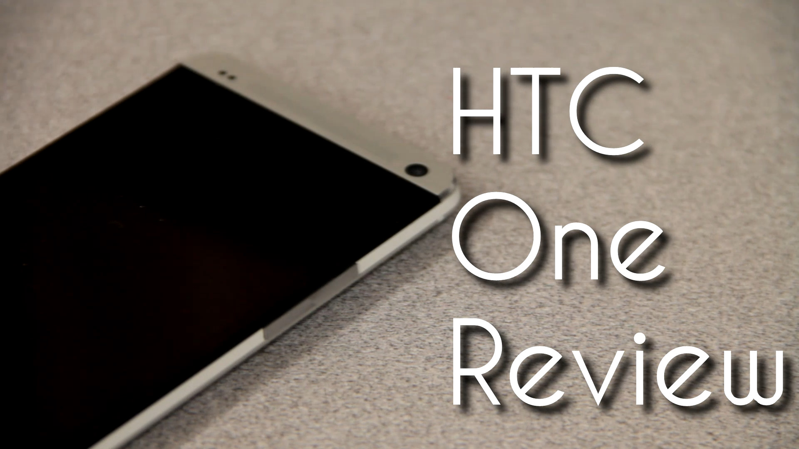
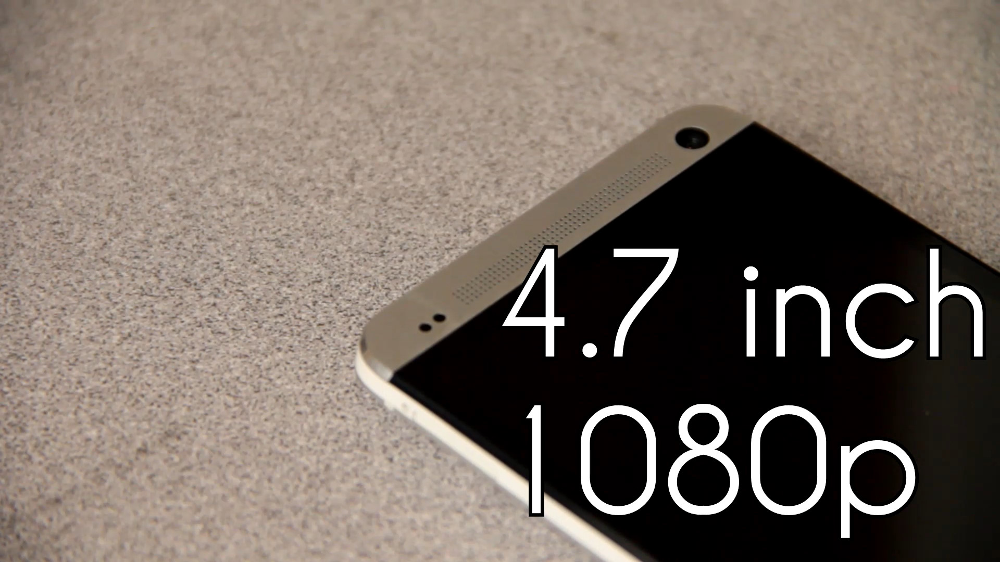
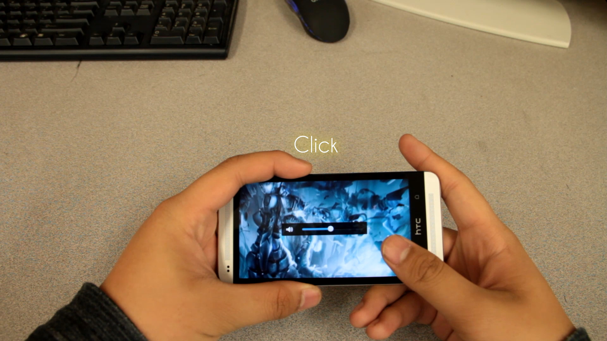

---
{
	title: "Rockmandash Reviews: HTC One [M7]",
	published: "2014-04-15T13:34:00-04:00",
	tags: ["Rockmandash Reviews", "HTC One", "Device", "Android", "Get a Vita and 3DS", "Tech Review", "Review"],
	kinjaArticle: true
}
---

Welcome to Rockmandash Reviews! Today's a bit different, as we have a tech review! I was inspired by [Raw Danger's Galaxy Note 3 Review](http://tay.kotaku.com/samsung-galaxy-note-3-the-tay-review-1563322794) [and post](http://tay.kotaku.com/why-dont-we-have-smartphone-reviews-for-gamers-1563327652) to put up my own review relating to tech... so here we are! A slightly gamer oriented review of last year's HTC One! (with some parts re-used from when I originally did a Video Review of the One)

Non-Gaming Video Review -

Obviously when you mention the HTC One, you think of the hardware, because this phone is beautiful. Built out of glass, polycarbonate and last but not least Aluminum, the HTC one is a premium built device. When I think of the HTC One's hardware, it makes me think of the iPhone. HTC One is like the android version of the iPhone in build quality and design, as it's just as nice as the iPhone with it's aluminum body.

The Specs of this device is very nice, even though it's been a while since the device launched. It has a beautiful 4.7 inch SLCD3 1080p screen, and it's really pretty. Colors are great, viewing angles are superb, Text is sharp, etc. HTC really has something magical with their displays… it's one of the best in the market, even a year after release. The screen is absolutely amazing and when you go back to something like your 3ds, you'll be wishing for a higher PPI....

Powering this device is a 1.7 Gigahertz Snapdragon 600 with 2gb of ram. It runs games great, and it never slows down. I've never hit a game where I needed a more powerful device, or ran into lag with this. It's great.

Have you noticed the speaker grills yet on the front of the device? Those massive speaker grills are for what HTC calls Boomsound. Boomsound is a pair of front facing speakers that blast great sound with rich bass, and clear sound. The auditory experience is absolutely great for games, especially rhythm games like Cytus.

#### Hardware - 9/10

HTC put HTC Sense on android, and it's clean and simple. I prefer how it works over Stock Android and it's very aesthetically pleasing. I love the lock screen, with it's quick access to apps, and how it manages music and displays information. As a phone, this has pretty great software, with a great camera app and good UI overall.

About the gaming situation on android... The amount of games on Android is pathetic. Most of the VN's I'd be willing to play aren't on android (or are not translated), the app store is crowded with casual crap that i'd avoid like the plague, and all the good games are half baked or small. Don't expect any rich experiences, but if your playing more simple games, this might suit you. Also, the HTC One is a 1080p device, and a lot of the apps on the app store aren't optimized for 1080p, so you might get some weird UI hiccups. I have a ton of games on android, but I rarely play them because even if they are good, they still are nothing in comparison to games on the vita or 3ds because those have physical buttons and better designed games. The only games I really play on the one are time wasters, or PC VN's using Splashtop.

Because it's android, you can run a ton of things because of how flexible android is,but games wise, there isn't too much. If your into emulators, they will run fine, but try to get an external controller. If your into VN's, check out VNDS.

The games graphically, are essentially ps2 levels of polygon count and AA, but they are running at a much higher resolution. I'd say they are about Vita levels of graphics, but there aren't really much games that are worth your time that use the graphical horsepower. It's disappointing, to say the least.

#### Software - 7/10

As a phone, this is a great experience. Beautiful display and I've had absolutely no problems with it since I got it. I love having 32gb of storage, one handed use has been no problem and overall it's a great device. The physical size of the HTC One is nice because it has a well sized screen, and it fits in your hand well.

The gaming experience though, isn't really great. Most of the android games are better on a larger device, so go and get yourself a Nexus 7 or something instead of playing on this. it's a better experience. For one handed games, it's absolutely phenomenal, but for more demanding games, you'll want a larger screen, or a device with buttons. Games look great on this too, but because of this 4.7 screen, it can be too small to be comfortable for most of the games. Playing something like Jet Set Radio on this isn't really that much fun, playing something like sonic will be an OK experience, and simple games like Dots is great, but overall the gameplay experience isn't the best on this device. All of the games you play on this will look great, but the size is limiting. When playing games on the One, battery life is similar to the handheld competitors, and it has an OK battery life when gaming. Just don't expect it to last forever when gaming.

#### Experience - 7/10

The HTC One is a great phone, not so much a great gaming device. If you are looking for a phone, the HTC One is a great device, but as a gaming device, I'd look elsewhere. If you are just looking for an android gaming device, I'd point you twords the nexus 7, and if you want a new phone, get the M8. If I was buying a device for gaming reasons on the go, I'd get a 3DS and a vita, not an android device.

## For gaming - 7/10, Polarization ± 1

## Non Gaming - 9/10 Polarization ± .25

I'm not doing a title card because I'm too lazy to do so.
