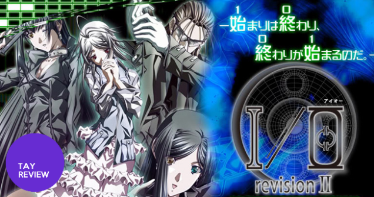

---
{
	title: "Rockmandash Reviews: I/O [Visual Novel]",
	published: "2014-04-14T19:25:00-04:00",
	tags: ["rockmandash reviews", "io", "visual novel", "review", "ani-tay"],
	kinjaArticle: true
}
---

[Ever 17](http://rockmandash12.kinja.com/rockmandash-reviews-ever-17-the-out-of-infinity-visu-1504908037) is a fantastic visual novel written by Kotaro Uchikoshi and Takumi Nakazawa. While Uchikoshi and his Zero Escape series has been getting a lot of attention, the directer and other writer for ever 17, Takumi Nakazawa’s stuff has been getting absolutely no attention at all at least in the west, with I/O and his other games being almost completely unknown. I’m here to try change that. This is my review of I/O, one of the most interesting visual novels i’ve ever played. Also, this review exists for several reasons, but the most important reason is to say thanks. [Lemnisca translations](http://lemniscatranslations.wordpress.com/), headed by GundamAce and Blink Winkel are translating some of the most unique visual novels out there. If you are a fan of the Infinity series, you owe it to yourself to check out their work and what they are going to do in the future.

Note: Gutted the review because it was brought to my attention (and I noticed) this review has massive spoilers! if things don’t make sense, that’s why.

 

I/O is a mystery cyberpunk game set in 2036. The world isn’t much different than ours, except everything revolves around the net. It’s a world where reality and virtual reality collide, and I love how believable it is. I remember a few years ago, I tried to write a story with a very similar setting. I never got around to that, but this world in I/O is essentially everything I dreamed of from that. The setting and premise is amazing, with conspiracies abound, futuristic tech, and something that’s actually believable.

The writing and tone of this game is like a mixture of Ever 17 and Remember 11. It’s mysterious and serious like Remember 11 was, but the insane amount of detail, character interaction and pacing is more akin to Ever 17. It’s great, as it absorbs you into this world and it keeps you interested with a fantastic mystery and solid writing. If you are like me and are a big fan of those games, this one will be right up your alley, absorbing you into this world and getting you interested in all that it has to offer. It was fantastic.

> “A total lunar eclipse occurs for the first time in 3 years. Even though it’s supposed to be a simple astronomical phenomenon, it soon sets off a series of unexpected events. Unexplainable mysteries, terrorist incidents, and network crime surge as if in unison. The truth mixes with lies, as if the world is awake but still sleeping. Something has begun. Somewhere no one can see. Something no one knows about.”

While I/O is written in a nonlinear fashion, the routes are very similar and have a lot in common with each other. While the first 2 routes are pretty normal, after that, this game is essentially a big mindscrew. This game likes to play many tricks on you, and has the typical from the Ever 17 writers, so if you played that you know what you’re getting yourself into, but with it turned up to 11.

Other than the mindscrew, there are few minor things in the writing I had issues with. The first thing I didn’t care for is the plot structure which makes parts of the game feel unnecessary, and I/O was way longer than expected with my playthrough clocking about 55 hours.

To me, I/O is a good story, abit flawed. It was too much mindscrew for my mind, and I couldn’t handle it. If you can get through the mindscrew, you might have the perfect story in your hands.... but if you can’t, it’ll be a good story with a major flaw.

#### Writing - 7/10

The characters…. There’s too many to go over, but they were solid overall and are the reason why you play through the game. The game doesn’t have a protagonist, instead it has an [ensemble cast](http://tvtropes.org/pmwiki/pmwiki.php/Main/EnsembleCast), where every character is fully fleshed out, with well stated motivations, great personalities, interesting backstories and interesting relationships. The characters were spot on, and are absolutely fantastic.

#### Characters - 9/10

Average, for the most part. You read, and make decisions, and that’s the jest of it. What I/O does differently is that it has this annoying yet interesting Defrag system, where after you finish some routes, it unlocks parts of other routes, and you need to essentially play parts of the game twice to get the true ending. Trying to figure out what routes is the main issue, as the completion thing they show at the end of every route is near useless at telling things. In this Defrag system, there’s 3 types of routes: Login, Defrag, and Logout. Login is the start and has 4 routes that you have to completely finish (requires backtracking), Defrag, which is the mindfuckery section, and Logout, which is an epilogue of sorts, but they have their own climaxes and feel like a waste of time, even if they do wrap up the story. Other than that though, it’s quite normal, and as such, it gets a normal grade.

#### Gameplay - 7/10

 

The visuals in I/O are average at best. There’s a lot here, so that’s no problem, but the quality of the art itself could be better in my opinion. The character art is jarring, especially at the beginning, but you’ll get used to it. I think there’s a lot of missed potential here, they could have built a beautiful sci-fi looking world, but it looks very modest. Some things look dated, like the cell phone calls, the 4:3 monitors everywhere, and the typography. Visually, it’s kinda dated.

#### Visuals - 7.5/10

The soundtrack is brilliant. The music is done by Onoken, and he did a great job. This is some great music, everything’s done very well, and is used excellently. It’s pretty good, but it’s not perfect, and they need a bit more quantity; you might get tired of some of the tracks because of how few they have. One track I’ll never get tired of is Theme of LEM, which is absolutely fantastic. I really liked the voice actors, they did a great job of expressing the characters, and I had no complaints.

#### Sound - 9/10

This game will surprise you. I/O is not for the faint of heart, with all the mindscrew, but looking back on it, I thoroughly enjoyed I/O, as I was extremely attached to the characters, but totally confused at the same time. There’s a lot of talent that made this, like Takazawa Nakazawa, Romeo Tanaka the writer of most of Rewrite, and music done by Onoken. With this talent, I got pretty much what I expected, but **THE MINDSCREW. THE MINDSCREW. **It did everything pretty well, but by confusing the player out of the plot, it took some of that enjoyment out. Also, the game has a tendency to crash if press enter while voice is going… and it’s kinda erratic on when it does it. It was a fun ride though, as even if you are confused, you can still enjoy the fantastic charecters, world and surroundings around you. I expected to love I/O, but it does have it’s problems which kept me from loving it.

#### Enjoyment - 7/10

I/O reminds me of [Remember 11.](http://tay.kotaku.com/rockmandash-reviews-remember-11-the-age-of-infinity-1528062359) they are both really good games with one flaw. This game was absolutely great… until route C, when they started to mess with me. Some people might like this more than others. I was really turned off by all the mindscrew.

## OVERALL - 7.5/10, Polarization ± 1

 

You might have noticed that I implemented a polarization thing in the overall score. That’s what I think the difference of opinion will be, and it can go up to 2-3 points. I kinda snagged the idea while reading up reviews. Now that i’m finally done with that, onto [Muv-Luv](http://dexomega.kinja.com/dex-where-do-i-start-with-muv-luv-1561900783)!

***

**Copyright Disclaimer:** Under Title 17, Section 107 of United States Copyright law, reviews are protected under fair use. This is a review, and as such, all media used in this review is used for the sole purpose of review and commentary under the terms of fair use. All footage, music and images belong to the respective companies.

*You can see all my reviews on *[*Rockmandash Reviews*](http://tay.kotaku.com/tag/rockmandash-reviews)*. For An explanation of my review system, *[*check this out*](https://rockmandash12.kinja.com/rockmandash-rambles-an-explanation-on-my-review-system-1619265485)*.*

###### [Rockmandash Rambles: *An Explanation on my Review System* (Updated 11/15/2015)](https://rockmandash12.kinja.com/rockmandash-rambles-an-explanation-on-my-review-system-1619265485)

If you’ve read any of my reviews and wanted to know why I did them the way I do, here’s an…

[Read more](https://rockmandash12.kinja.com/rockmandash-rambles-an-explanation-on-my-review-system-1619265485)

**
