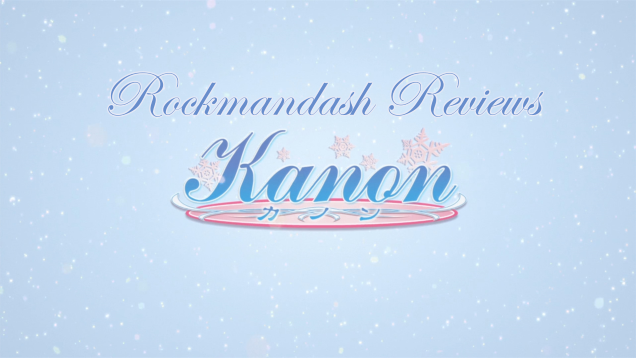
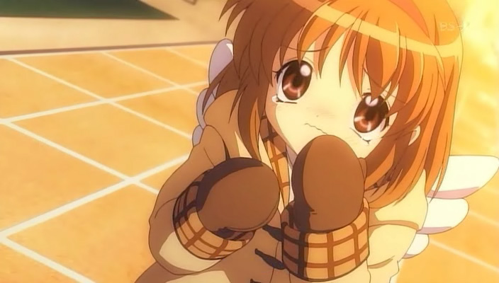
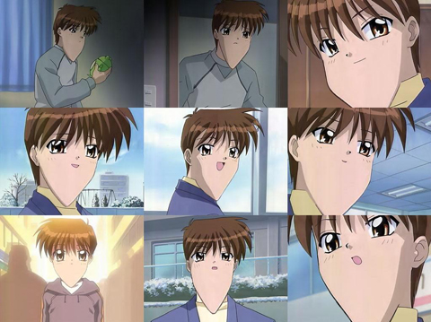
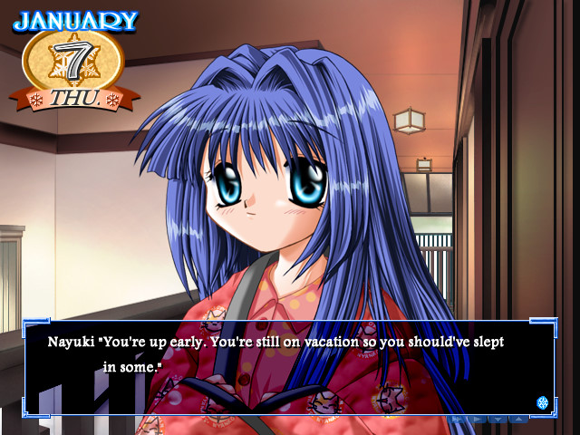
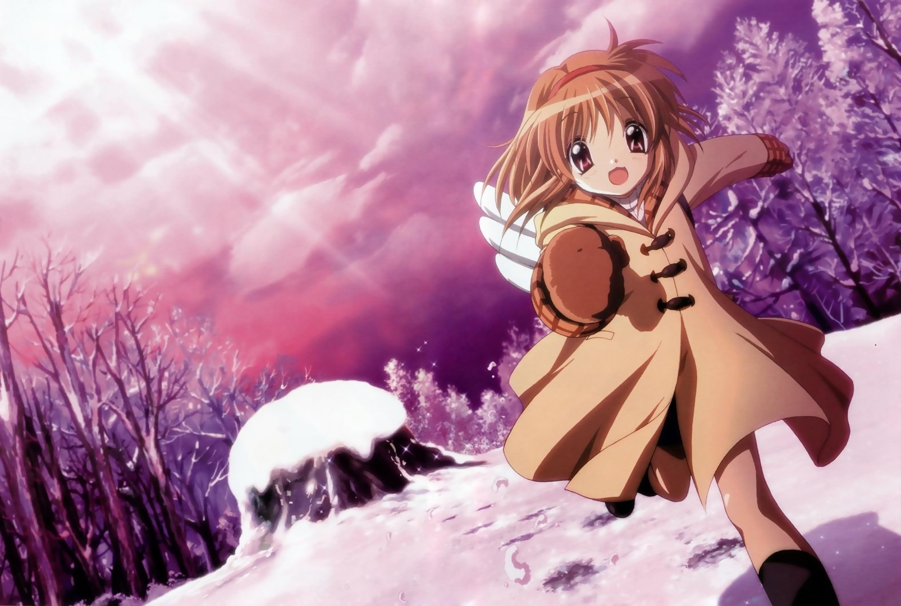
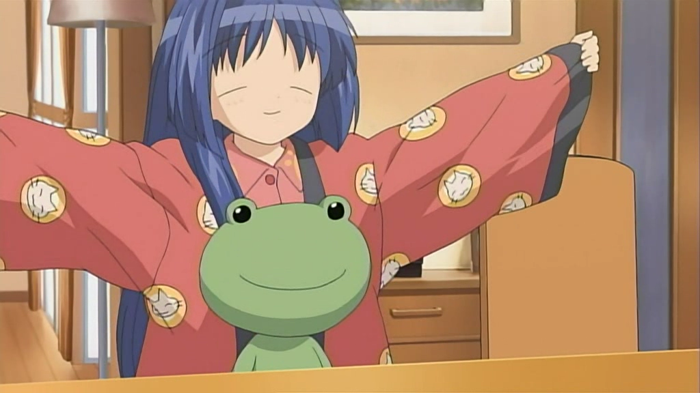
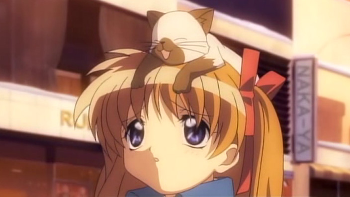
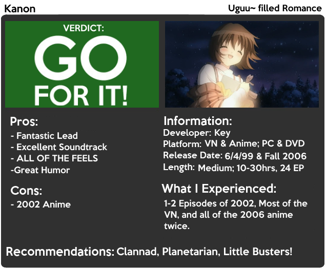

---
{
	title: "Rockmandash Reviews: Kanon [Visual Novel & Anime]",
	published: "2014-07-19T00:00:00-04:00",
	tags: ["rockmandash reviews", "kanon", "key", "marathon", "2002", "2006", "tay-classic", "ani-tay", "uguu"],
	kinjaArticle: true
}
---

Welcome to Rockmandash Reviews and Today we have the first entry into my [Key Marathon](https://tay.kinja.com/rockmandash-reviews-key-marathon-wip-1606707641): Kanon. As Key’s first Visual Novel, can it stand against the more popular stories that Key has made since 1999? Let’s find out in the review.

An important bit of information you need to know before trying Kanon out is that there are 3 main versions out there: the original visual novel, the 2002 anime adapted by Toei, and the 2006 anime adaptation by KyoAni. The plot, characters and story is pretty much the same in all of them, but the main difference is in execution. I’ll talk about the writing first, then I’ll go over all of the differences in order from worst to best.

Also, This is a pretty “moe” show, and that’s just something you have to expect from KEY so I don’t want to see any complaining about it. Thanks in advance.

The story in Kanon follows Yuuichi Aizawa, our cynical bastard of a lead, as he returns to the town where he used to visit when he was younger. As he spends time in this town, he slowly meets up with some interesting girls from his past, regains his memories and learns the secrets of his past. A description doesn’t really do the writing justice: the story in Kanon is solid with an enjoyable slice of life plot, great interactions between characters, and excellent writing for when the plot intensifies. The best part about Kanon is probably the level of quality in the arcs, all of the arcs are pretty solid (with the exception of Nayuki’s, which is kinda weak in my oppinion). It’s the one that started off Key’s amazing formula of buttering you up with enjoyable humor and character interactions, then crushing you down with feels. Kanon is a touching romance story that will probably make you cry the first time you experience it, and it’s done very well.

The characters in Kanon are best described as fantastic. Most notable is Yuuichi, as his cynical personality is just entertaining, with his interactions (aka him making fun of everyone) being very enjoyable. Rarely do you see a character so silly, yet so serious. Rarely do you see someone joke around all the time in a cynical manner, yet be the nicest guy you’ve ever met. The rest of the characters are pretty great too, as they each have great backstories, interesting personalities, weird quirks that make them stand out and are just enjoyable to see. How can I go through a Kanon review without mentioning [uguu~](https://www.youtube.com/watch?v=TT2GRpwwS8M)? I loved all of the characters (favorites being Yuuichi, Nakyuki, Shiori, and Mayuri), as all of them were great.

Kanon is written very well, and it’s a solid romance, even though it was one of the pioneers of the romantic visual novel. No matter which version you check out, you are going to get a solidly written show.

# Writing - 9/10

 

**MY EYES. THEY BURRNNNNNNN. JUST LOOK AT THIS... WHY WOULD ANYBODY WANT TO SIT THROUGH THIS?** I tried to watch a few episodes, and I couldn’t get through it. These are worst case scenarios, as it usually doesn’t look this horrible, but it does look bad quite a bit. The consistency of the quality of the animation shockingly bad, as the show would frequently go off model. At times, it made me wonder they understood human anatomy or have seen a person while making this.

Other than visuals, there are a few other things that are worse about 2002 anime like the voice acting delivery being surprisingly bad considering it’s the same voice actors, the music was botched up pretty badly, the show as a while is nowhere near as enjoyable as the other versions and from what I’ve heard the pacing suffers also due to the fact that it’s a 13 episode adaptation of a long game. If you are interested in Kanon, avoid the 2002 anime. I like to think that this version doesn’t exist... it hasn’t aged well at all, it’s the worst version, and put plainly, it’s a pain to watch.

# 2002 Anime - 5/10

 

Ah, the source material. Kanon is Key’s very first visual novel, and as such, you need to lower your expectations a little bit when it comes to production values, expecially if you are used to newer stuff. The art in Kanon has a very 90’s Visual Novel style, which might be a turn off, but it didn’t really bother me. The art does it’s job, and it’s much more consistent than the 2002 anime. One thing that might be a turn off when it comes to art though is that the only translated version is the original **EROGE** release, meaning it has H-scenes. They were **EXTREMELY** out of place, and I was very annoyed with them. I mean... seriously? A H-Scene in my touching romance with cute moe charecters? Whyy......

As for the music.... this is a fantastic soundtrack, as expected from Key. It’s a really great soundtrack that’s full of well done songs, and a wide variety of them too. It’s definitely an iPod worthy soundtrack. If that wasn’t enough, the usage is great as well, using the music to make the mood. The voice acting is top notch too, as the voices really fit the personalities of the charecters and they help the experience.

The execution of the plot is very solid, but that’s to be expected, as it is the source material. You get the great story as it was ment to be, with every arc being fantastic, but there’s one thing about the execution of the plot in the Kanon VN that’s important to know: it’s a bit slower than you might expect. This might be a pro for some, as you really get to know the characters due to the time, but it was a con for me because the slower than expected pacing made it hard to focus on, in my opinion.

Kanon as a visual novel is solid. You get a great story, but there are things that held it back, like H-scenes, and slow pacing.

# Visual Novel - 8/10

 

Oh, KyoAni. You can really do great things when you try. KyoAni really knows (knew?) how to nail a show like Kanon: it’s a fantastic anime, and is by far the definitive version of Kanon in my opinion, improving on the source material while being faithful to what it originally was.

Kanon 2006 is absolutely beautiful. Kanon has this clean and beautiful aesthetic to it, one that I rarely see. It takes the characters from the visual novel and improves them (like adding back human anatomy) while keeping everything that made them great in the first place. It’s not just the characters that get a visual bump: the snowy town is absolutely beautiful. They did a great job at making the world feel alive: the scenery is absolutely just phenomenal, showing more than the VN did, and it gives you the feeling of depth. That, combined with excellent lighting and the superb sound from the visual novel just knocks it out of the park. It’s a great looking show even 8 years after it originally aired, and I just love it. It shows how far style and charm can go and it’s just fantastic.

With this adaptation, they made Kanon enjoyable, with great comedy, and excellent pacing. While Kanon’s VN had a hard time keeping my attention, the excellent humor right out of the gate just keeps you in the plot, and makes the story more impactful later on. The execution of said story is just fantastic: the connected plot makes it feel more real than the VN, the arcs are pretty accurate and the shorter and more concise pacing makes feel just right for a show like this. They take what was great about the VN and amplify it: it’s much more enjoyable story.

KyoAni did a fantastic job with adaptation and improved the story in almost every way while keeping the charm of the original, thus making the definitive version of Kanon. It’s absolutely fantastic anime, and it’s a shining example of what an adaptation should be.

# 2006 Anime - 9.5/10

 

When I first experienced Kanon, I watched it for the sake of filling up the “Void” that was Clannad. Kanon filled up that void very well, but due to that experience, I always put Kanon under Clannad in terms of what’s better. This Key Marathon gave me the chance of seeing Kanon for what it was worth, and without Clannad lingering in my mind, I loved it. Yes it was similar in style due to both of them being Key works, and while it’ll never have the same impact that Clannad had, it was great. Kanon was less cliche, it had better side stories, and had a more unique cast. Kanon and Clannad are great for the same reasons, but they go doing so in different ways and by comparing them to each other, it makes you appreciate them more for what they are worth. They have a different charm and tone, and that charm makes Kanon great. Kanon is one of my favorites, and I’m sure if you are into this type of story, you will love it just as much as I did.

This run through Kanon also taught me a few things: it has way less impact if you have it in your mind, and if you want to play a VN and watch the Anime, play through the VN first. It’s hard to enjoy a slice of life VN like this when you already know what it leads to.

# Enjoyment - 9.5/10

At this point, Kanon is a like a lost memory in the seas of Key, buried under stuff like Little Busters, and Clannad.... but when you find Kanon, you have a very charming and well executed story that should not be forgotten. It’s a must watch for any Key fan, and a great story overall.

# OVERALL - 9/10, Polarization +.5, -2

 

***

**Copyright Disclaimer:** Under Title 17, Section 107 of United States Copyright law, reviews are protected under fair use. This is a review, and as such, all media used in this review is used for the sole purpose of review and commentary under the terms of fair use. All footage, music and images belong to the respective companies.

*You can see all my reviews on *[*Rockmandash Reviews*](http://tay.kotaku.com/tag/rockmandash-reviews)*, and the rest of my *[*Key Marathon Here*](https://tay.kinja.com/rockmandash-reviews-key-marathon-wip-1606707641)*. For An explanation of my review system, *[*check this out*](https://rockmandash12.kinja.com/rockmandash-rambles-an-explanation-on-my-review-system-1619265485)*.*

This game is available on [*Fuwanovel*](http://fuwanovel.org/novels/kanon) *for download.*
