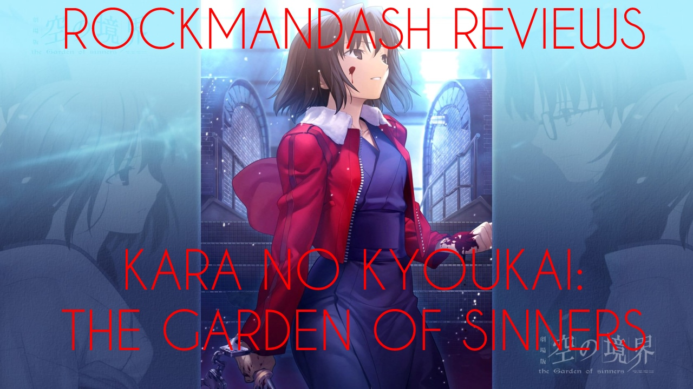

---
{
	title: "Rockmandash Reviews: Kara no Kyoukai: The Garden of Sinners [Anime]",
	published: "2014-02-18T03:25:00-05:00",
	tags: ["rockmandash reviews", "rockmandash12", "kara no kyoukai", "marathon", "type moon", "ufotable", "yuki kajiura", "ani-tay", "ani-tay review", "Type-Moon Marathon"],
	kinjaArticle: true
}
---

Welcome to Rockmandash Reviews and today on Ani-Tay is part 5 of my [Type-Moon Marathon](https://rockmandash12.kinja.com/type-moon-marathon-wip-1534726534), we have series of movies made by Ufotable & Type-Moon called *Kara no Kyoukai: The Garden of Sinners*. *Kara no Kyoukai* is the first series of Type-Moon adaptations by Ufotable, so the question has to be asked: is it a good series? Let’s find out in this review!

Before I start my actual review of *Kara no Kyoukai*, I’m going to start this with some viewing tips:

1. **FOR THE LOVE OF GOD, DO NOT GO TO SOME RUBBISH ANIME STREAMING SITE AND WATCH THIS IN LQ.** Watch the DVD, or Blu-Ray, or something with equivalent quality so you can get the full experience from Kara no Kyoukai.
2. If you want to watch *Kara no Kyoukai*, block out several hours in advance so you can marathon KnK. This series is best experienced all at once and marathoned.
3. Like *Haruhi Suzumiya*, the plot of *KnK* is told out of order. When you go and actually watch it though, it isn’t hard to figure out especially if you watch after the credits. It’s intended to be out of order, unlike how *Haruhi* did it to just screw around with you, so it’s pretty decent.
4. When you watch *Kara no Kyoukai*, you need to be devoting 100% of your focus in *Kara no Kyoukai*. It’s better if you are actively thinking about the plot, as it’s filled with important plot pieces everywhere and you need those to unravel the mystery that is *Kara no Kyoukai*.

With those tips in mind, lets continue onto the review!

*Kara no Kyoukai* is one of Nasu’s earliest stories he wrote and is set in an alternative universe to *Tsukihime* and *F/SN*. *Kara no Kyoukai* is a series of 7 movies, plus some extras but like I said before, the plot is out of order. The first number is the release number, and the 2nd number is the chronological order.

1.|4. Kara no Kyoukai: Overlooking View/Fukan Fūkei (September 1998)

2.|1. Kara no Kyoukai: Murder Speculation (Part 1)/Satsujin Kōsatsu (Zen) (August 1995 to March 1996)

3.|3. Kara no Kyoukai: Remaining Sense of Pain/Tsūkaku Zanryū (July 1998)

4.|2. Kara no Kyoukai: The Hollow/Garan no Dō (March 1996 to June 1998)

5.|5. Kara no Kyoukai: Paradox Spiral/Mujun Rasen (November 1998)

6.|6. Kara no Kyoukai: Oblivion Recording/Bōkyaku Rokuon (January 1999)

7.|7. Kara no Kyoukai Murder Speculation (Part 2)/Satsujin Kōsatsu (Go) (February 1999)

E.|E. Kara no Kyoukai Epilogue: The Edge of Emptiness/ Owari Shou

8.|8. Kara no Kyoukai: Future Gospel/Mirai Fukuin

Even with the out of order plot, the writing is great, as expected from Type-Moon. Kara no Kyoukai is a murder mystery thriller with some great action, but you need to think quite a bit about what the hell is going on before you actually enjoy the writing. I must emphasize this. ***KARA NO KYOUKAI *****IS A CONFUSING SHOW, AND THIS MIGHT RUIN YOUR EXPERIENCE. IF YOU ARE NOT INTO SHOWS WHERE YOU HAVE TO ACTIVELY THINK ABOUT THE PLOT, YOU WILL NOT LIKE *****KARA NO KYOUKAI*****. IT HAS A VERY HIGH BARRIER OF ENTRY.** *Kara no Kyoukai* is a series that gets better on a second watch, and when you know what’s happening, it’s really a blast. What’s so great about the plot In *Kara no Kyokai*, is it’s dark atmosphere. Kara no Kyoukai has a perfect grim atmosphere going on in half of the movies, and it’s really thrilling. It deals with dark issues like drugs, hostages, rape, murder, so you better be aware of this. A great example is in Movie 7, where one of the main characters Kokutou, tries one of the drugs to get to the bottom of the murder mystery in the town. Also, there’s a magic element in the plot that is pretty much the structure for other Type-Moon shows, even though they are much less stated in this show. In Kara No Kyoukai, there are 2 main characters, Shiki Ryougi, and Mikiya Kokutou. Shiki’s a girl with 2 distinct personalities; a male personality SHIKI (織), and the original female personality Shiki (式). Later on in the series, Shiki gains the “Mystic Eyes of Death Perception”, an ability to see death in the form of a line or a point. Shiki really steals the show for most of the series, with her harsh yet awesome personality. Kokutou is a normal nice guy who fell in love with Shiki, but he’s special because he’s so normal. Kokutou probably the only character you can relate to in Kara no Kyoukai, and because he strives for normality, it makes him stand out from the cast of weirdos in this series.The rest of the characters are great, I personally like most of the side characters a bit more because they have more personality to them than the main characters, but all of the characters are written excellently. The show has some pacing issues with a really slow start.. which might deteriorate from the experience, and a slow pace in general.... but once you can get the barriers that the plot presents to most people, you should enjoy this plot. It’s hard to get into, but it has some great writing.

#### Writing - 8/10

 

It might be ballzy to say this, but tied with Redline, Kara no Kyoukai is the pinnacle of Japanese animation, the best that Japanese animation has to offer. With gradients all over the place, great lighting, excellent character art, fluid animation, great atmosphere, etc. The gritty atmosphere of the animation perfectly matches with the gritty atmosphere of the writing. This anime is the best looking anime so far. Nothing but praise about this… it’s absolutely outstanding how great this looks. Everything about it’s visuals… is perfection.

#### Visuals - 10/10

There are series that use music to a comedic effect, series that use music to get things stuck in your head, and then there is Kara no Kyoukai, using music to it’s absolute best to engage you into the plot, the action, the mystery, the drama, the EVERYTHING. The music, and the use of music is PERFECT. The music is done by Yuki Kajiura, who has only made excellence, and this series… is a pleasure for your ears. With a load of memorable pieces, Kara no Kyoukai’s music is made to stand out, to be amazing. I’m gonna shut up so you can hear this beautiful soundtrack.

Listen to it… it’s amazing. Done yet? Well, let’s continue with this review. The Voice acting, is also top notch. I’m no expert, but all the voices fit the characters well, and they sound great. The sound in Kara no Kyoukai, is masterful. This anime has one of the best soundtracks i’ve heard, and it’s a treat to your ears. Just a note though, the naming scheme of this soundtrack is just as confusing as the show itself…. so when you do eventually download/buy it, be aware of that.

#### Sound - 10/10

 

The Plot has a high barrier of entry, but once you can get through that, it’s a roller coaster of amazing experiences. I’m a big fan of the music and the visuals, they did a really good job with the gradients and lighting which makes me happy. All fight scenes were epic. You cannot describe the feeling of those fight scenes without mentioning the word EPIC. I don’t care for the out of order storytelling, but when you understand everything, the plot becomes very enjoyable. Movies 3, 5 and 7 really took the cake in writing and action; they were amazing. Kara no Kyoukai is an excellent and enjoyable show, once you understand it.

#### Enjoyment - 9/10

Kara no Kyoukai is the quintessence of Modern Anime. It does so much right, even if it takes a bit of a commitment to get into. This is one you need to watch, and Ufotable did an excellent job. Kara no Kyoukai is the start of a blossoming relationship between Type-Moon and Ufotable, and it should not be missed.

## Overall - 9.25/10

 

> “I am the bone of my wallet
>
> Anime is my body and manga is my blood
>
> I have bought over a thousand titles
>
> Unaware of loss, Nor aware of gain
>
> Withstood pain to purchase BDs, waiting for one’s arrival
>
> I have no regrets. This is the only path
>
> My whole life was unlimited pricing works” - notsureifsrs from MAL

***

**Copyright Disclaimer:** Under Title 17, Section 107 of United States Copyright law, reviews are protected under fair use. This is a review, and as such, all media used in this review is used for the sole purpose of review and commentary under the terms of fair use. All footage, music and images belong to the respective companies.

*You can see all my reviews on *[*Rockmandash Reviews*](http://tay.kotaku.com/tag/rockmandash-reviews)*, and the rest of my *[*Type-Moon Marathon here*](https://rockmandash12.kinja.com/type-moon-marathon-wip-1534726534)*. For An explanation of my review system, *[*check this out*](https://rockmandash12.kinja.com/rockmandash-rambles-an-explanation-on-my-review-system-1619265485)*.*

About distribution with Kara no Kyoukai… Good Luck! Kara no Kyoukai got published by Aniplex, and will cost you a metric shit-ton to buy, and it’s not available for streaming anywhere…. It might be hard to get, but you should try to watch it. In my opinion, Distribution is the biggest hurdle with this series, at least in North America.

EDIT - I got a Video Review up!

EDIT (7/29/14) - Changed scores to reflect current thoughts.
