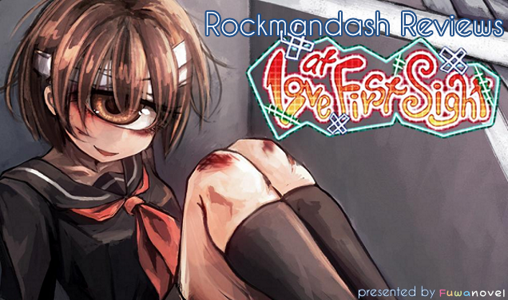
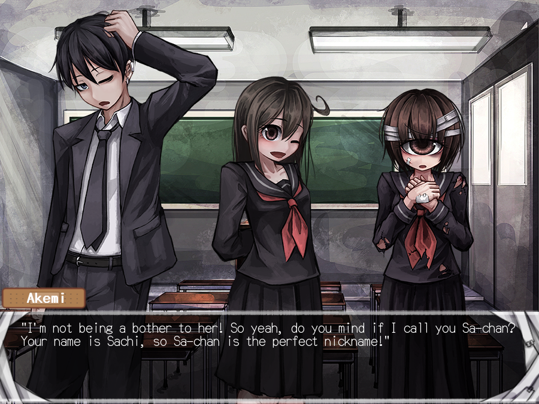
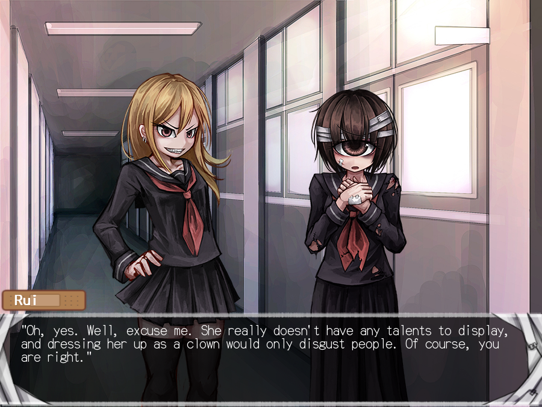
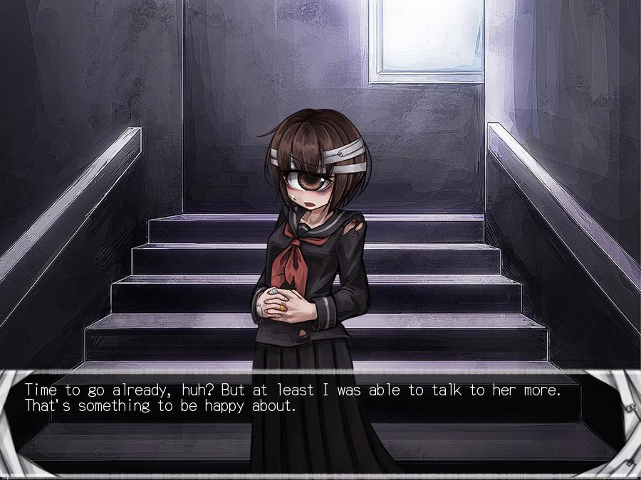
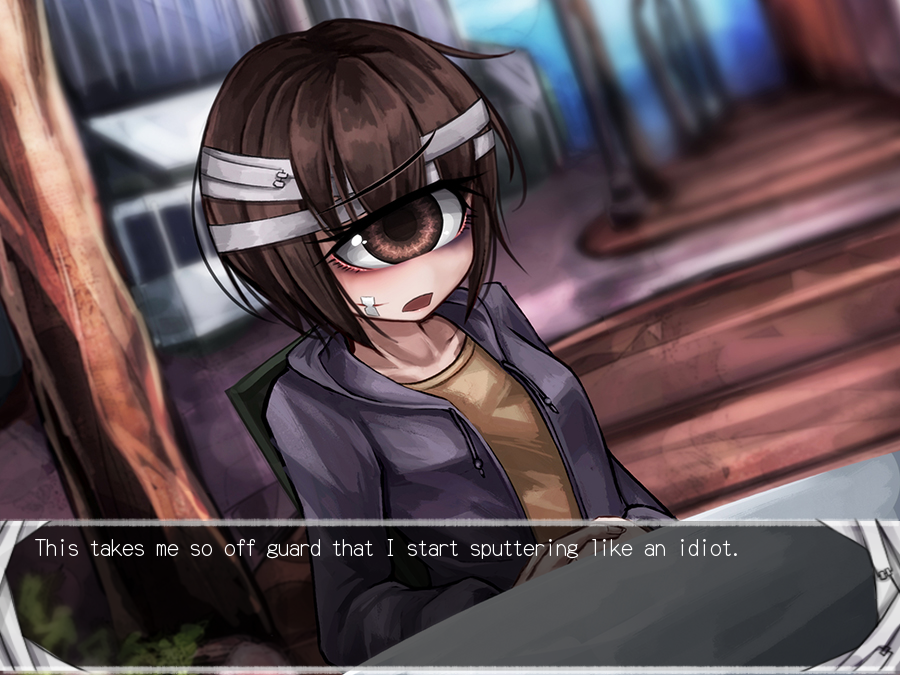
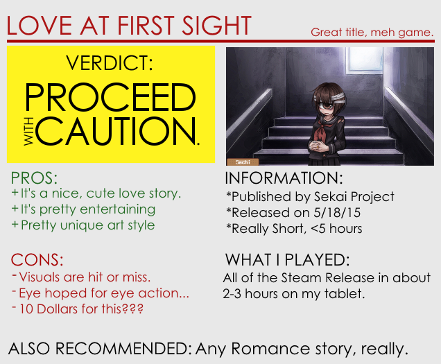

---
{
	title: "Rockmandash Reviews: Love at First Sight [Visual Novel]",
	published: "2015-06-01T10:00:00-04:00",
	tags: ["Rockmandash Reviews", "Visual Novels", "Review", "AniTAY", "FuwaNovel", "Love at First Sight", "Sekai Project", "FuwaReviews"],
	kinjaArticle: true
}
---

I didn’t really know what to expect when I first saw *Love at First Sight*: a nice, short kinetic novel published by Sekai project. It’s exactly what it says on the tin, but with a twist: it’s a love story about a guy who falls in love with a girl at first sight, it just happens that the girl that our MC falls in love with happens to be a cyclops! What??? While I appreciated the pun in the title, that appreciation doesn’t mean I fell in love with it at first sight, or really the rest of the game in general.

***Note:**** This game was reviewed with a review key from *[*FuwaReviews*](http://reviews.fuwanovel.net/)*, a project from the *[*Fuwanovel*](http://fuwanovel.net/)* VN community to make a centralized VN reviewing hub. This did not change the content of the review in any way.*

***

 

To be more specific about the story, it’s about as generic as you can get. Our MC (Mamarou) is a transfer student who has two friends, who make up 2 of the 6 characters in this story. One day, he hears sobbing and meets the shy and bullied Sachi Usui, who just happens to have one gigantic eye. That being said, the disappointment starts off right off the bat: while *Love at First Sight* does what a good love story should do decently, the writing has no defining traits, nothing special at all. This is a tried and true story we’ve all seen before, and if you’ve seen any romance story, you’ve seen this before. This may not be an issue to some because entertaining enough so it doesn’t feel like you’ve been wasting your time, but there’s nothing that makes this game stand out from the crowd, and the writing shouldn’t be the reason you buy this. The only conflict in the story comes and goes in minutes, and the romance is just another typical shy girl romance. This extends to the characters too: while entertaining for the most part, you’ve seen them all before, and they are pretty straightforward, nothing special. The most developed character is Sachi’s aunt for heaven’s sake, and she’s not even there that long.

Also, if you are buying this game because of the novelty factor of our heroine Sachi being a cyclops, it never really comes into the play during the story. *Love at First Sight* is just a slice of life love story, nothing more, nothing less, and considering that she’s a cyclops, it’s pretty baffling they can pull this off. If you’re curious on why she’s a cyclops, how that even works, any of her background, or anything… you are out of luck here. The character’s reactions don’t change, there is no event focused on it, nothing. Hell, the fact that she’s a bullied girl plays a more important role than her being a cyclops! The game’s selling factor isn’t even a part of the story, and that’s a pretty big disappointment.

***

 

Really, the novelty factor that she’s cyclops is the main reason you’d pick this up, and it only shows in the only notable thing about this game, the visuals of the game. Frankly, I’m pretty mixed about it, but I do appreciate what they were going for. The art style really isn’t my cup of tea with its dark and rough design, but it’s a unique art style to say the least, and it’s nice to see something deviate from the norm. The art adds character to an otherwise unremarkable visual novel, and I probably wouldn’t have read through the whole game, which is pretty noteworthy, considering it’s only 2 hours. The music in comparison though, is nothing special. No memorable tracks, and it’s pretty subdued. It’s not something you’ll notice unless you’re looking for it, which is a bit disappointing to say the least.

***

 

Really though, all of this lead to the question that I had in my mind the whole time I played through this game: What the hell, Sekai Project? Why would you support yet another novelty VN that nobody really asked for, and why would you price it at 10 dollars? Steam’s full of novelty VNs that are much cheaper, and there’s nothing that makes this worth that much, nothing that I would personally pay this much for. If this was something that the dev wanted to do for fun and release for the sake of it, I could give that a pass if it was free or relatively cheap, but 10 dollars? This is a 2 hour game that doesn’t justify that price tag at all, and it just baffles my mind that they would price it that high. Yes, it’s an entertaining read, and it’s not a particularly bad visual novel, but for the price they are commanding for, don’t bother. If you’re interested, pick it up on a steam sale or something.

### Overall - 6.5/10, Polarization +2,-1

 

***

*If you liked this review, and you’re interested in seeing more Visual Novel Content, you should check out *[*FuwaReviews*](http://reviews.fuwanovel.net/)*! It’s a pretty nice review hub, and it even includes my content as an external blog! Check it out!*