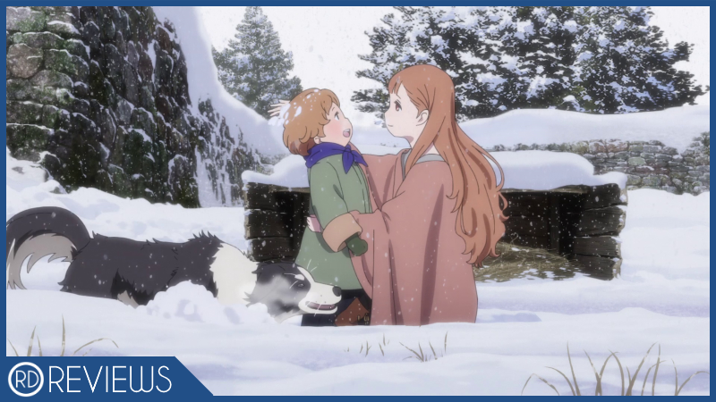
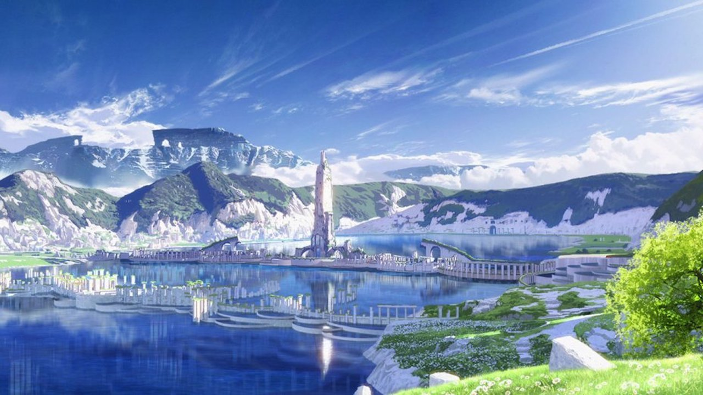
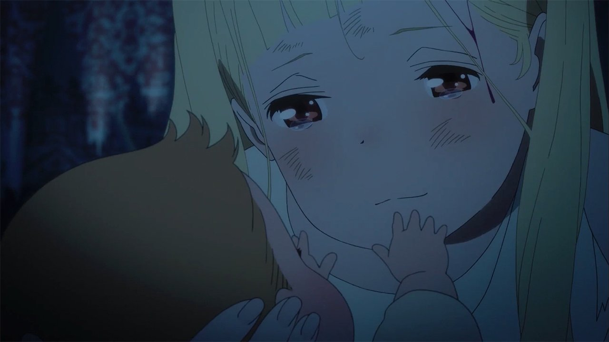
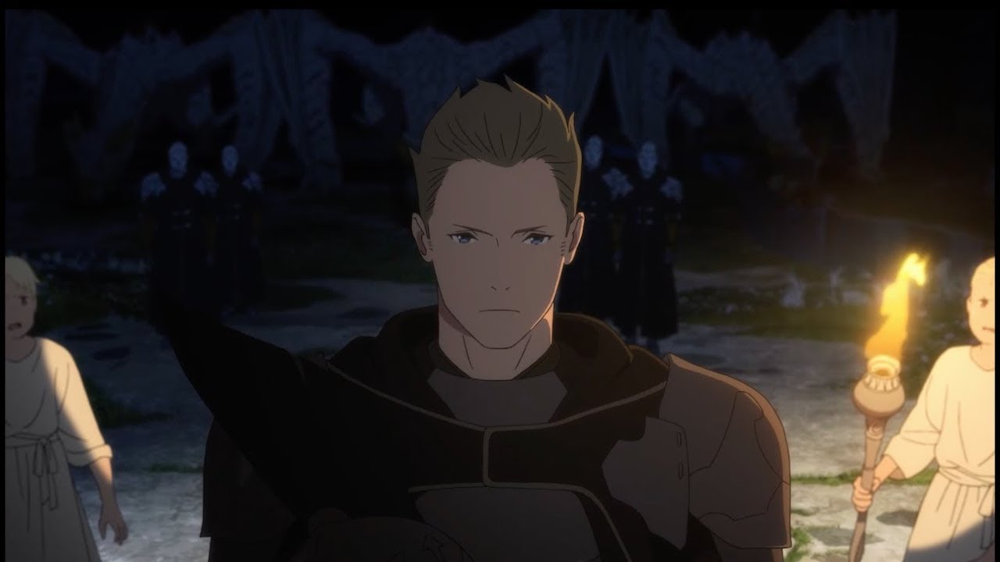
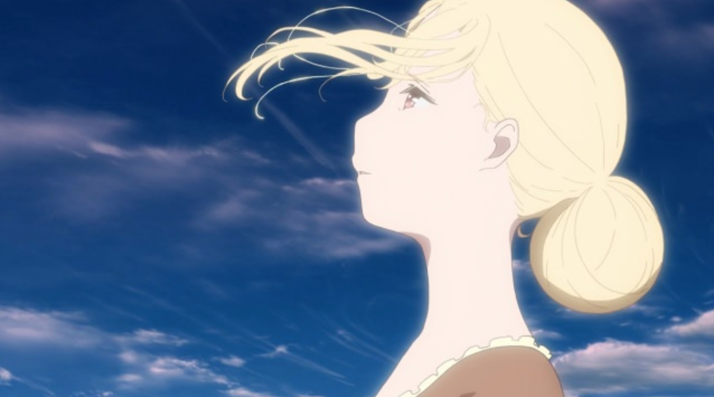
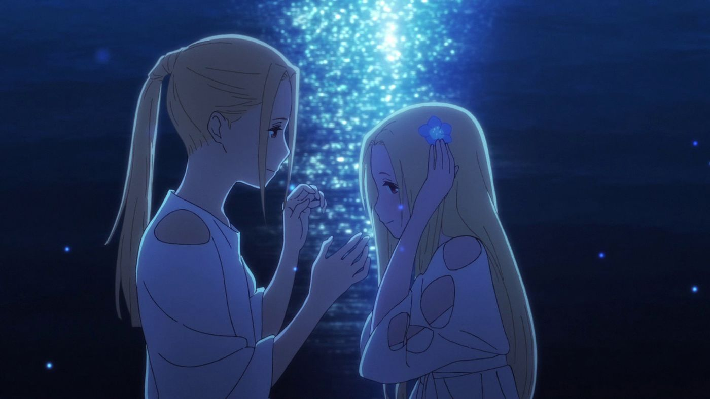
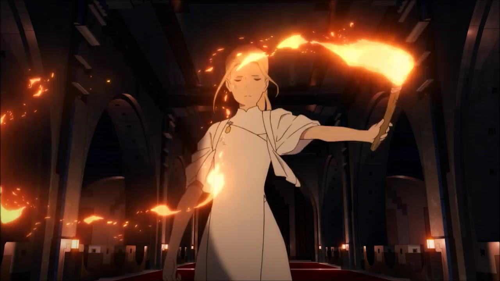
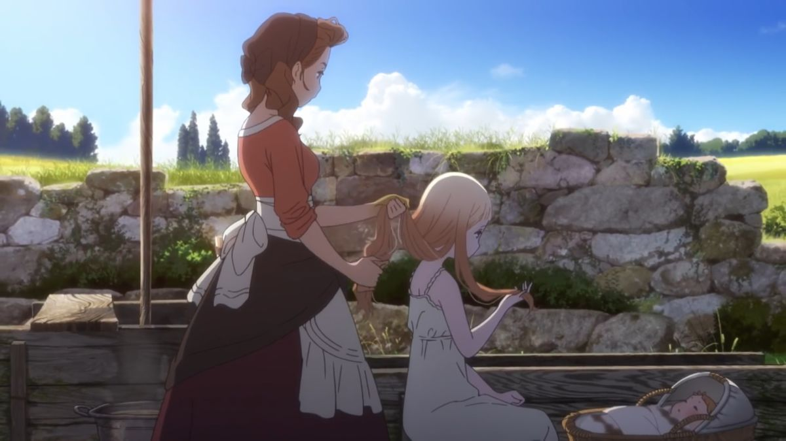
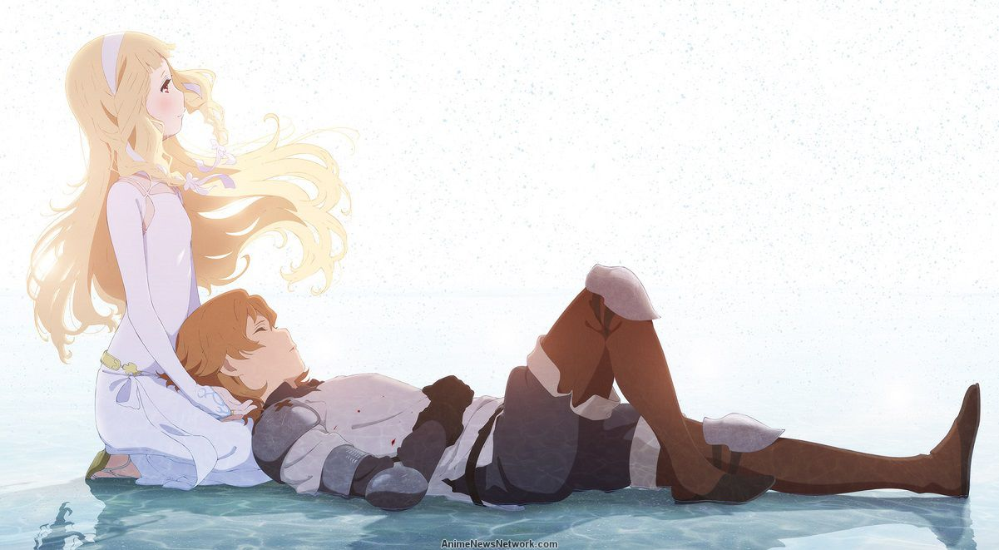

---
{
	title: "Rockmandash Reviews: Maquia: When the Promised Flower Blooms",
	published: "2018-07-24T14:30:00-04:00",
	tags: ["Rockmandash Reviews", "Maquia", "Anime Movie", "AniTAY", "Anime", "Review"],
	kinjaArticle: true
}
---

Mari Okada works can be pretty hit-or-miss, but there’s nothing quite like what she brings to the table. Even if the plot itself is amazing or messy, they always manage to provide those rushing feels, regardless of if you loved the work or hated it. It’s a feeling that can be easily addicting, but what happens when Mari Okada gets the director’s seat for the first time instead of just writing the scenario? You get *Maquia: When the Promised Flower Blooms,* a work that is very, very Mari Okada.

***

Let’s get the easy stuff out of the way: this film is flat-out amazing when it comes to visuals and sound. PA Works always does an stellar job; everything they’ve created makes me say that PA Works makes some of the best animation in the anime industry. I love everything they do and *Maquia* is no exception - the combination of the animation and the music makes the setting convincing and otherworldly, the design of the work makes the themes of the work shine, and the execution of everything just makes *Maquia* a joy to watch. The movie looks and sounds amazing, beautiful at every shot and a joy to hear at every moment. That being said, while these elements about the film are amazing, the presentation of *Maquia* don’t work to try to stand out at all like in other PA Works such as *Nagi no Asukara*. They serve to make the story emotional and convincing, but that’s all. Everything in this movie is tuned to let Mari Okada’s story and vision shine - to let the story, themes and characters grip you - and it definitely delivers.

So, what’s that story? Well… it’s difficult to describe what *Maquia* is about, simply because the story is all over the place and trying to explain everything it does is just going to lead to failure. *Maquia* tries to do so many things in the two hours it’s given and manages to do so much so well, but that makes it hard to convey what the story and experience is like. Even if I told you the basic premise of the work that is plastered on all the promotional material, it wouldn’t even come close to what the story is even about, but I’ll try anyways. Just understand if it sounds confusing, that’s because the work is so multifaceted that it’s hard to boil down the premise into a paragraph or two - to really understand the work, you just gotta go and see it.

*Maquia* is a movie about the titular character Maquia and those she encounters throughout her life, and how they interact with and think of each other. You see, Maquia isn’t just a normal human being - she’s a part of the Iolph clan, a group of people who don’t age. At the beginning of the movie, she lives in the village where only the Iolph clan lives, separate from everything else, but one day soldiers from the nation of Mezarte invade, kidnapping people in hopes of using their immortal powers to their advantage. In this invasion however, Maquia gets taken away by an ancient dragon and is separated by everything she knows and everything she loves. She finds a baby though as she wonders about lost in the middle of a forest, and decides to take care of this baby that’s not hers, who is later named Ariel. While the basic premise and events that go on are mostly surrounded by the conflict between the lolph clan and the nation of Mezarte, the movie of *Maquia* is truly about characters above all else. We focus on Maquia and how she tries to be a mother even though she’s essentially a kid herself, the dynamic between Maquia and Ariel, and the lives that they and other acquaintances live. *Maquia* is a touching movie that covers the fascinating themes of what it truly means to be a mother, about the dynamics and bonds of those around you as well as being an engaging and emotional coming-of-age story, but there’s a few problems with the execution of everything that this movie tries to do that keeps it from being truly great.

First of all, the way that the movie handles essential themes of the movie is just odd to me, and took me out of the work a bit. *Maquia* is primarily about what it means to be a mother, and it spends a large amount of time exploring this through Maquia, with her struggle of what it means to be a mother, despite being a kid at the same time... This dynamic is just a very bizarre thing to make a movie about. In context with the other mother relationships, like the elder and Maquia, Mido and her kids, and Leilia and Medmel, this weird dynamic works because it serves to explore what it means to be a mother, but the dynamic itself is really bizarre to me.

Next, there’s issues with how this movie handles pacing/timing: the movie spans basically the entire lifespan of Ariel (the kid that Maquia finds) and there’s no way you can fit a lifespan into a film without doing some time trickery. What *Maquia* does to deal with this is there’s timeslips everywhere throughout the film. The obvious problem with time skips is that it makes the work have no real sense of flow, and it felt like the work was just doing things for the sake of doing things, which is a really frustrating feeling in a movie.

This is all amplified by that the story of the movie being far too ambitious to fit into a 2 hour movie, and the movie crams things next to each other in a way that felt jolted and unenjoyable. *Maquia* is split into the time periods of Ariel’s life, covering when he was an infant, when he was a little kid, when he was a teenager and when he was a young adult, but because there’s only 2 hours for a film, each of the time periods felt constrained, with nothing getting real development. The movie is a very thematically consistent one, and manages to extract thematic meaning out of each era to make the work satisfying in the end, but that’s about it. The time periods were too short to get a real sense of what the world was like, too short to feel engaging and absorbing, but the big issue is... It wasn’t nearly enough time to develop the characters, which is a huge issue given that this movie is all about the characters.

This lack of development in regards to the characters is frustrating because there’s so many characters you would love to see and engage with, but you almost ever get any time to really get to know them. A great example was the characters of Leilia and Medmel:

**(SPOILER ALERT - LIGHT SPOILERS START HERE)**

Leilia is a friend of Maquia’s and was kidnapped by the nation of Mezarte, one of the most prominent locations in the world of *Maquia*. Mezarte’s king forces her to have a child with the prince of the nation, Medmel being said child. Their dynamic is fascinating and engaging, leading to what is by far my favorite part of the movie at the end, but they get almost no screen time. Medmel for example is literally in only two scenes, and each scene she is in is powerful and moving because of the themes their relationships represent, but we don’t know anything about them and what they are like besides a handful of moments they are on the screen.

**(SPOILER ALERT - SPOILERS END HERE)**

Compound this with the fact that *Maquia* also has a pretty big cast, with many of them being pretty important to the experience - all contribute to the themes of the work, but many important characters have their own storylines to follow, which makes the movie frustrating to follow as a result, trying to keep in mind how each event will affect each character, and remembering what each character and their dynamics with others represent. There’s the story of Maquia, the story of Ariel, the story of Leilia and Medmel, the story of Krim, and the general overarching story that involves everyone, with supporting cast throughout. It’s a lot, and I couldn’t help but feel like shouting out *“What the fuck is this film!?”*, because the movie does so much, and is just weird with what it does in a way that it’s hard to understand and grasp.

It also doesn’t help that only three characters, Maquia, Ariel, and Lang (who’s a guy Ariel grew up with and is really important to Maquia), get any real sense of development and most of them are as boring as cardboard… which is infuriating! Great characters mean so much to nakige-like works like this, as emotional movies are inherently about human emotions and the feelings we see. Without a human touch from likable characters, it becomes so much harder to truly appreciate.

All of this hampered my experience to a certain extent that throughout the first third of the film. I honestly felt like I wasn’t going to enjoy the movie. The lack of character development, the consistent, poorly-executed time skips, and the feeling that it’s just going through the motions is usually a recipe for disaster… And despite that, I still found myself enjoying *Maquia* quite a bit. I think if you try to judge *Maquia* in a traditional and/or objective manner, it becomes impossible to say it’s a good film because the movie screws up so much of what is considered good film making. Thanks to the themes and emotions that this movie builds up, however - due to the gripping nature of the work and *Mari Okada magic* - *Maquia* provides an experience so enjoyable that it makes you wonder what good even means. The movie shines in the second half, where everything builds up to be oh so satisfying, with a release of catharsis that’s done in a superb manner. Everything *clicks*, everything is built up in a way that is satisfying to see, and the way it displays and wraps up the themes to show to you… It might be heavy-handed, but it’s amazing. It’s also obviously a tear-jerker, and some of those scenes are hard to resist crying. If a work of fiction manages to make you cry, it has to be doing something, right…? Right?

*Maquia* is a movie that gets better the more you let it sink in - it’s very multifaceted and full of substance and because of that, it shines. When you think back on movies, you don’t remember trips in execution but the substance and meaning that the work provides. For example, while the beginning of Maquia and wanting to be a mother is rather contrived, there’s so much to this work that contributes to how Maquia thinks and acts in the end, and analysing that is an absolute blast.

If you truly love a movie despite its flaws, who is to say that it’s a bad movie? Is a movie’s ability to make the viewer look past the flaws be considered a justification to call the movie objectively good, or does the flaws it has cement itself as a bad film? If a film you enjoy is a bad movie, then what makes a good movie? Can your subjective experience trump the objective? I think this is really up for you to decide - it’s up to one’s subjective experience and I encourage everyone to go and check it out *Maquia* at least once.

***

The more I think about *Maquia*, the more I think that this movie might just be the most quintessentially Mari Okada work out there. This makes sense because given that this is Okada’s directorial debut and she had her hands all over the film, but it’s still mind-boggling to think about - I don’t believe I’ve ever seen a work that captures what she’s done quite like this one. *Maquia* is not necessarily the most cohesive work. It doesn’t necessarily do everything right. But what you get out of *Maquia* is a thrilling, emotional, and engaging work that is very enjoyable. In the end, this movie manages to take everything it does and puts it together to provide an emotional and entertaining experience that only Mari Okada can provide.

*Maquia* is truly an experience that you must see for yourself. I can’t quite vouch for the quality as it has a significant amount of flaws, but what you’re left with even after those is a gripping, engaging, and emotional ride that is very enjoyable! Whether you think that *Maquia* is a horribly flawed work or you think it’s the best thing since sliced bread, it’s hard not to have a great time with this film, and that alone deserves something. Definitely give Mari Okada’s *Maquia* a shot - you won’t want to miss it.

***

*Thank you for reading! This is Rockmandash Reviews, a blog focused on everything revolving Visual Novels, with stuff like tech and anime every now and then. If you want to check out more of my writing, check out *[*FuwaReviews*](https://fuwanovel.net/reviews-hub/)* and *[*AniTAY*](http://anitay.kinja.com/#_ga=2.29830716.283022684.1516595779-1252363867.1516472140)* where I am a contributor and *[*follow me on Twitter*](https://twitter.com/RockmanDash12)*.*
