---
{
	title: "Rockmandash Reviews: Muv-Luv & Alternative [Visual Novel]",
	published: "2014-05-07T01:00:00-04:00",
	tags: ["rockmandash reviews", "muv-luv", "extra", "alternative", "ani-tay", "review", "mecha", "attack on titan", "tay-classic"],
	kinjaArticle: true
}
---

Welcome to Rockmandash Reviews, and this is my review of the highly regarded *Muv-Luv* Visual Novels made by Age. *Muv-Luv* is a series that defies expectations, manipulates your emotions, and justifies it’s place at the top of VNDB as these games are some of the best in the genre.

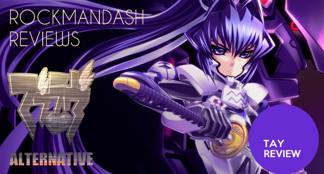

# Writing

Even though there are 2 Visual Novels in the series: *Muv-Luv* and *Muv Luv Alternative,* there are 3 Arcs of this series that are very different from each other but are all very integral to the plot. The 3 Arcs are Extra, Unlimited, and Alternative, and I’m going to talk about them one at at a time, for the sake of convenience.

## Extra

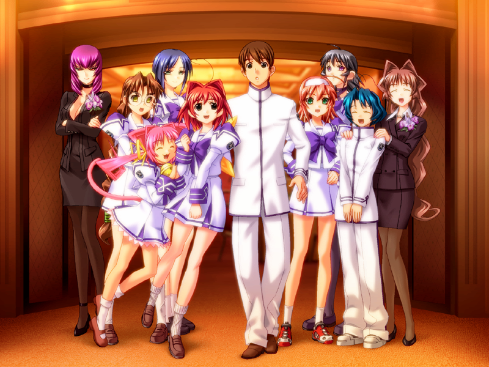

*Muv Luv Extra* is the first Arc of the game, and it’s your traditional dating sim. On your first playthrough, there’s very little worth not here, nothing here but a slice of life romantic comedy. Extra doesn’t do anything remarkably special, it’s a silly and forgettable Visual Novel that is what one might expect from the genre on a surface level, but it’s not horrible in what it does.

For those of you who aren’t a fan of the genre, and aren’t particularly used to it, you might get bored of it and it might be a pain to read. When I first played through the game, I eventually got bored if the antics and skipped most of the second half. Even given that I did do that, I felt like I didn’t really miss much. The one redeemable factor in *Extra* is that it develops the characters very well: Extra does a lot of foreshadowing, gets you engaged with the cast and builds chemistry, so it’s definitely essential to experience. These elements make a repeat playthrough of *Extra* very much worthwhile after you’ve played through the main trilogy, but on your first playthrough it might be rough.

The game really engages you with the world that surrounds Takeru: get to know how his close friends and accentuates act, and you get used to this nice, peaceful world that is in Muv Luv....

## Unlimited

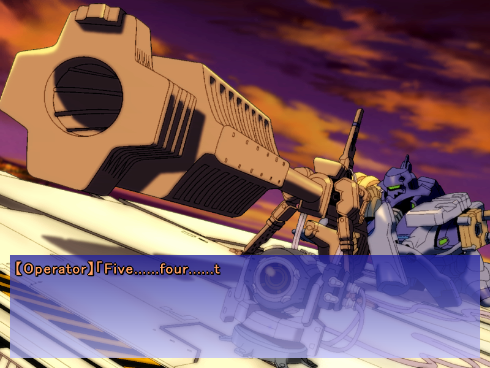

...Until *Muv-Luv Unlimited* rips the main character Takeru out of this nice and peaceful life, and throws him into a universe of despair. *Unlimited* takes place an alternate world where aliens known as BETA invade the world, pushing humanity to the brink of extinction, leaving large parts of Eurasia uninhabitable. In *Muv-Luv Unlimited*, Takeru has to get used to the life of a military cadet, with the treat of death looming upon him… and you are in for the ride.

Unfortunately, *Muv-Luv Unlimited* has one huge flaw that keeps it from being something spectacular… Unlimited does a weird balancing act between the slice of life of *Extra* and the seriousness that is *Alternative* and ends up too lighthearted to it’s determent. In every aspect of *Muv-Luv Unlimited*, everything is a bit too lighthearted: from the atmosphere, to the pacing, to the writing in general. There is absolutely no sense of urgency, which is ultimately frustrating, but the arc squanders those ideas thanks to this imbalance. The atmosphere and tone of a game is very important, and *Unlimited* is an example of what goes wrong when you don’t pay attention to them. Ultimately, it’s done in this fashion to make alternative better, being a key part of the coming of age for Takeru, but as an arc itself, it doesn’t live up to it’s potential.

## Alternative

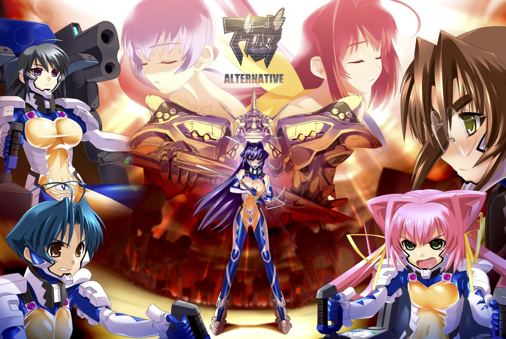

If *Unlimited* was wasted potential though, Alternative is that potential unleashed into the world and made into something amazing. Alternative picks up right from the end of *Unlimited*, where Takeru fails to save everyone and everything he knows is blown to smithereens thanks to Alternative V. Instead of Takeru dying however, he comes back to where he was… at the very beginning of *Unlimited*. This time, Takeru has experience of events, and he tries to change the events so the world isn’t screwed over. At the beginning, it’s a game of spot the difference… but when the [butterfly effect](http://tvtropes.org/pmwiki/pmwiki.php/Main/ButterflyOfDoom) kicks in, it kicks in hard...

Everything changes. The game makes you feel like an outsider of this world, taking that feeling and running with it. It creates a bond between you and the main character, the only person who’s been on this insane trip with you, and the only person you can relate to in this alternate universe.

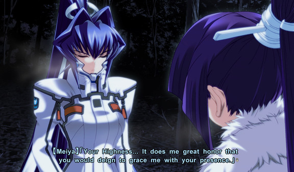

*Alternative* emphasizes it’s unique and different world... and how they built up this world is absolutely fantastic. It’s filled with engaging politics of the world, exposes on the military environment in a remarkably engrossing manner,shows fascinating people with all sorts of problems, and makes you immersed in the society that differs so much from what we’re used to. The best part about this interesting world is that they go so in depth about it, and any world building you would ever want is here... its absolutely fantastic and I wish that more works would build works this comprehensive.

Plot wise, *Muv-Luv Alternative* is a military invasion story similar to the popular *Attack on Titan* but with good pacing and character development. While *Attack on Titan* focuses on objectives and the deaths of your favorite characters, *Muv-Luv* focuses on everything you can think of and builds them in an engaging manner. You get to experience tactics, strategies, ideals, characters, pacing, trauma, even a bit of pseudoscience! It’s pretty much everything I would ever want out of this type of story, and it does it extremely well.

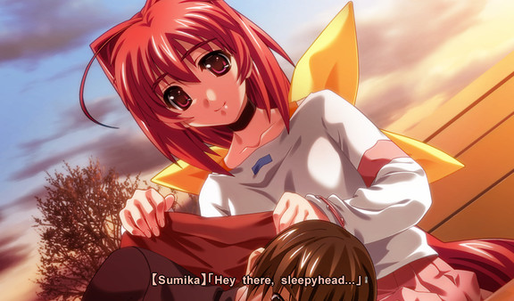

*Alternative* impressed me because it integrated everything in the previous plots, making everything even mentioned important and relevant in some way shape or form, and never leaving red hearings. One thing that’s surprised me about alternative is even though it has a slow pace, I really did enjoy the pacing. I believe it’s because *Alternative* spent every bit of its time explaining the world, doing some of the best character development I’ve ever seen, and the most important part: keeping me completely engaged in the plot.

The writing in this game is absolutely phenomenal, manipulating the player in ways they have not been manipulated before. If [*G-Senjou no Maou*](http://tay.kotaku.com/g-senjou-no-maou-the-tay-review-1524540625) is a roller coaster of a plot, then *Muv-Luv* is a road trip; beautifully showing you the world at the pace you want to go, getting you absorbed, and getting you attached to the plot. I wouldn’t say alternative is the best story ever; it’s not in my opinion. It is however, one of the best stories I’ve ever experienced. It’s does everything you would want in this setting, and does it very well.

## Overall

It’s hard to sum up *Muv-Luv* as a whole, because there’s so much variance between the arcs. That being said: *Muv Luv* has some of the highest highs in the medium, with *Alternative* being 20+ hours of highs. Even though there are lows in the form of *Extra* for some, the better arcs absolutely overshadow the negative arcs, especially because of how well Alternative uses every element of your experience and integrates it into the story. *Muv-Luv Alternitive* is one of the best experiences you’ll ever find in this medium, but if you want to play Alternative, you will have to go through quite a bit lows to get to the better parts of the series.

# Characters

 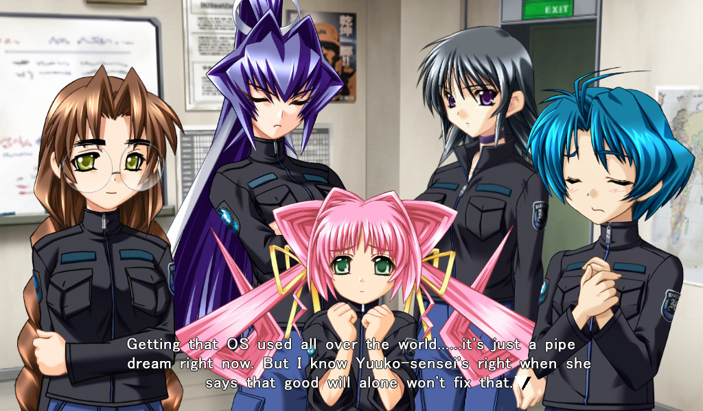

The cast is the highlght of the series. You follow the main character, Takeru Shirogane. At first Takeru is your typical high school student with a carefree and kinda mean attitude, but as you go through the game, you see him develop into a meaningful character, one who understands others, and becomes a mature person. He does an excellent job as a representative of the player, as he’s the only character you can relate to. He’s a great main character, and he’s probably the character I’ve been most attached to in any medium **ever**.

Because *Muv-Luv* starts out as a dating sim, there are plenty of heroines, but moreso than the strengths as individuals, it’s remarkable how the player gets attached to them as a whole. Even with a large cast, all the characters are written absolutely fantastically and they all have a reason for being there. They are all extremely fleshed out with interesting back stories, interesting personalities, etc. Because of your situation in *Unlimited* and *Alternative*, the game really creates a feeling like you are in a squad, and it’s icing on the cake. All the characters are written well, and they make the world feel real, and they are the best part of the series.

# Presentation

 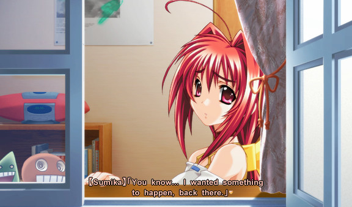

*Muv-Luv* has a bad habit of starting fairly weak, but getting better the further you go along. The presentation are no different than the story in this regard: they both start pretty average at the beginning, but they get better as you progress. At the beginning, the visuals have a 4:3 aspect ratio\*, and average but entertaining art, but the big problem with visuals in the beginning is they didn’t have enough art in general. With the sound, It’s mostly average, with little to stand out. *Extra* has nothing but generic and silly songs, and while Unlimited steps this up a notch with some fantastic songs, tbut the utilizationl and makes Unlimited feel like wasted potential. Even with the knocks on *Muv-Luv Extra* and *Unlimited*, the presentation of these games do their job and they get out of the way for the characters and the world.

\*for the Original Fan TL’d version at least that this originally reviewed, but the localized version is in 16:9 like you’d expect

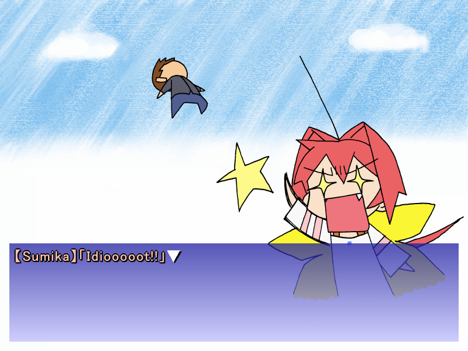

Alternative does a little bit better in this aspect and when you launch it up, be prepared for a slight quality jump. The big difference though, is that Alternative has some niceties like 16:9\* and some of the best [engrish](https://www.youtube.com/watch?v=fbdVfJGRbfw)\*\* I have seen in a long time. As for the sound, some of the tracks are absolutely fantastic, and the timing of these great tracks is something to be admired, but a majority of the soundtrack is just average. Alternative’s presentation is nice because it takes care of all the small details, just like in the plot. Also, All the FMV’s have this nice 80's charm to it, and I dig it.

\*\* The official localization gave them proper voice actors, so this only applies for the FanTL

The character art, UI, voice acting and aesthetics in general are pretty much the same throughout the games. In general, art is just average and there’s no getting around that, but it has it’s charms and it can grow on you like it has done for many. The visuals never actively hinders the experience, but it’s rarely top of the class. The voice actors are the same in all games and they do a pretty nice job in all of them.

# Enjoyment

Normally, I’d just write a few paragraphs about my personal enjoyment of the game, but Muv-Luv is an experience unlike anything else, and as a result it deeply resonated to me, to the point in which keeping my thoughts contained here would do it a bit of injustice. I whole [opinion piece on my experience with Muv-Luv](https://rockmandash12.kinja.com/rockmandash-rambles-why-i-loved-muv-luv-but-you-might-1566859006) but if that’s too long for you, I’ll say it here: It’s phenomenal and I love it.

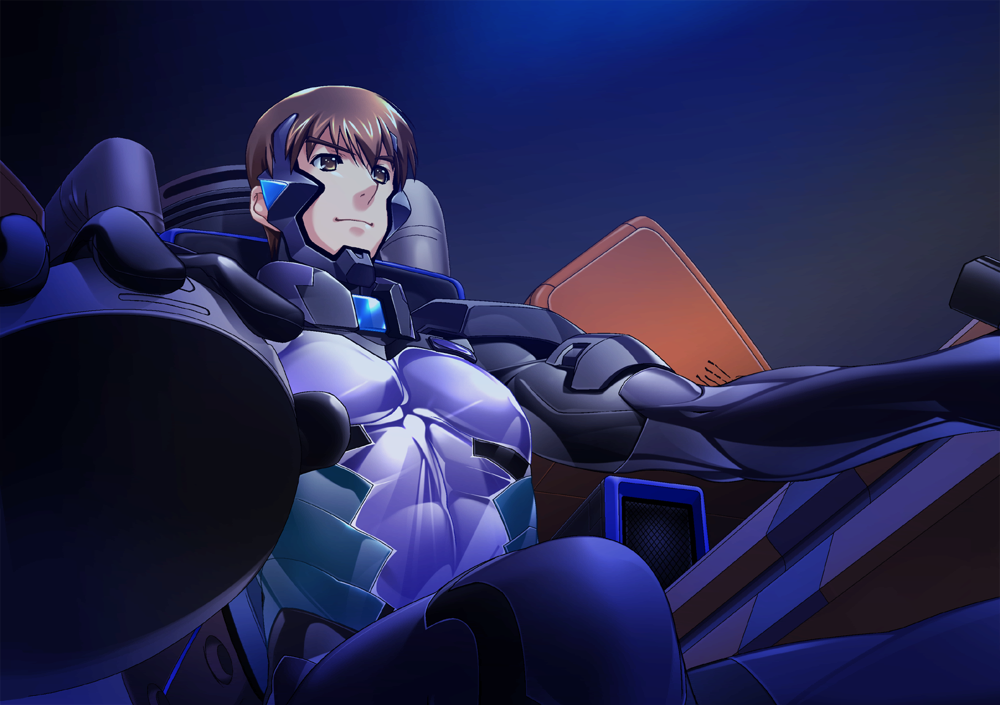

*2020 Edit Note*: I have a few thoughts here from when I wrote this article back in 2014 before the official localization, and I’m keeping them here for posterity’s sake, but know that it doesn’t apply to the current game if you pick it up on steam.

> There are a few little things I want to say before I get into my personal thoughts on Muv-Luv, so i’ll say them here. Muv-Luv made me realize how dependent I am on fan translations, as there were parts that weren’t translated because of the engine, and I felt completely lost. This game hates windows 8 and likes to crash at specific parts in the end of extra and weird stuff like not displaying subtitles on videos. If you have a windows 7 computer, try to play it on that, but if you don’t, you’ll have to do what I had to do to continue playing, which was downloading a save online to get to Unlimited. Also, the [`engrish`](https://www.youtube.com/watch?v=fbdVfJGRbfw) was absolutely “fantastic”, it was one of my favorite parts of Alternative. It really helps add a bit more lightheartedness to a pretty bleak story, and it was very enjoyable.
>
> One thing that might hinder your experience, is the obligatory Eroge warning here: THIS GAME HAS SEXUAL CONTENT***. IT’S AN INTEGRAL PART OF THE PLOT AND KINDA APPEARS EVERYWHERE. IF YOU ARE NOT A FAN, AVOID THIS GAME.

\*\*\* this applies for the FanTL and if you get the 18+ patch for the localized version, but the localization actually does a great job in avoiding these once thought to be essential elements of the story.

# Anime

 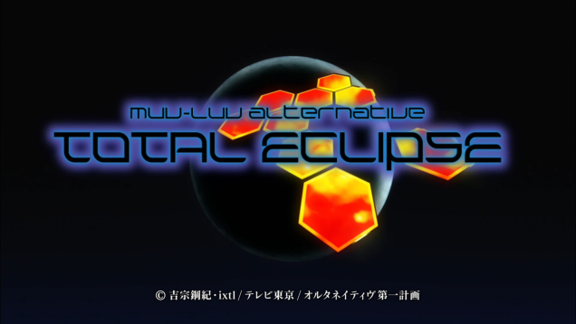

There’s some Muv-Luv Anime Spinoffs worth mentioning here: [*Total Eclipse*](http://tay.kotaku.com/preview/rockmandash-reviews-muv-luv-alternative-total-eclipse-1585812547?rev=1401861401) and [*Schwarezmarken*](https://anitay.kinja.com/schwarzesmarken-the-ani-tay-review-1766320077), read these if you are interested.

I love *Muv-Luv*. It has it’s ups and downs, but it’s a prime example of why Visual Novels is one of the best ways of storytelling, with some of the highest highs that I’ve ever experienced. There’s an INCREDIBLY HIGH barrier of entry, but if you can get through them *Extra* and *Unlimited*, you’ll have one of the best experiences of storytelling that any medium has to offer.

Also, if you want another opinion, check out Dexomega’s reviews on [*Muv Luv*](https://anitay.kinja.com/muv-luv-the-tay-review-1541968420) and *A*[*lternative*](http://tay.kotaku.com/muv-luv-alternative-the-tay-review-1546183909).

**Overall - 9/10, Polarization +1,-3**

 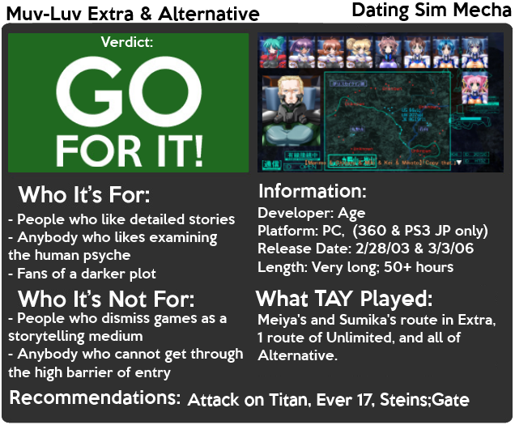

***

*You can see all my reviews on *[*Rockmandash Reviews*](http://tay.kotaku.com/tag/rockmandash-reviews)*. For An explanation of my review system, *[*check this out*](https://rockmandash12.kinja.com/rockmandash-rambles-an-explanation-on-my-review-system-1619265485)*.*

Edit - Revised on 8/16/20 to update and polish the review. Major changes to flow, cut some elements that are not relevant to the steam release.
