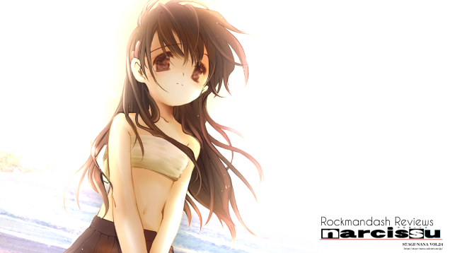
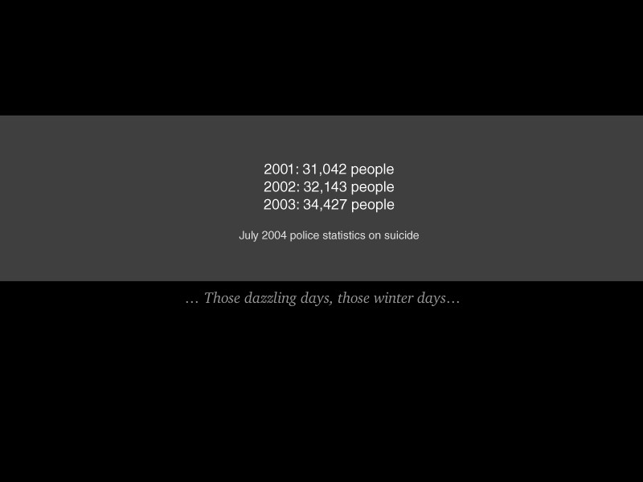
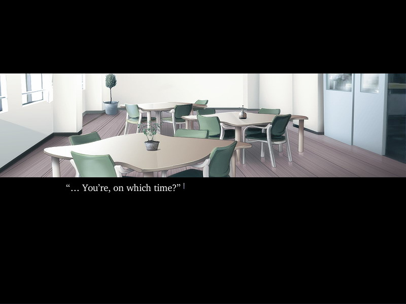
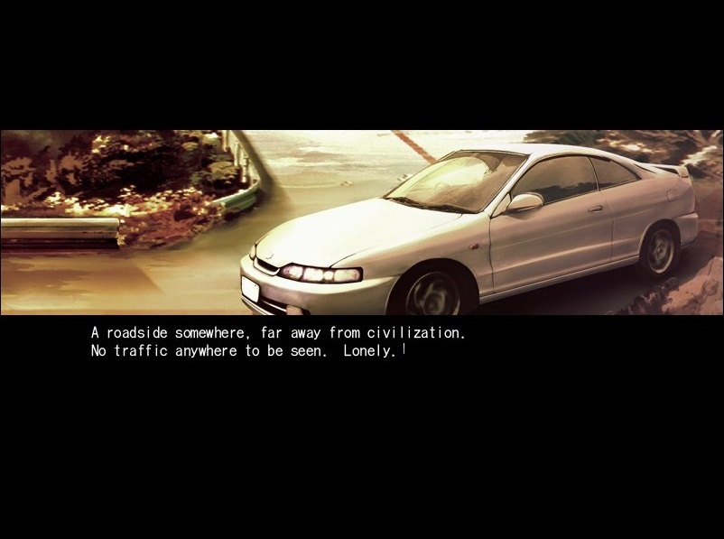

---
{
	title: "Rockmandash Reviews: Narcissu 1st & 2nd [Visual Novel]",
	published: "2014-12-31T12:00:00-05:00",
	tags: ["Rockmandash Reviews", "Narcissu", "1st & 2nd", "Written this time", "AniTAY", "TAYclassic", "Visual Novel"],
	kinjaArticle: true
}
---

I spend a lot of time talking about being attached to a story and why it’s important. Today on Rockmandash Reviews, we have *Narcissu*, an indie Visual Novel that is a great example of this; It’s a short but powerful VN which focuses on the story of those who’s only future is death, moving the player in ways they would never expect.

 

> First screen in the game. Yup.

*Narcissu* follows the residents of the 7th floor, a floor dedicated to those with terminal illness, those that know that they will die and are typically unhappy with the situation that they are placed. It’s not a question of if they will die, but where they will die and how they will die. There is no hope for these characters, yet they hope to manage something out of it... and the way that the game executes it, with it’s limited display of information and the way it recklessly marches forward through it’s story, focusing on one thing is brilliant. It’s well paced, engaging, and it’s a story that I was deeply attached to. It’s a story that presents it’s information in a way that gets you to think, making you ask questions that you would typically never even think of. It’s a story that knows what it wants and executes that ambition with a passion: it will hit home hard, and it knows how to manipulate your emotions. The way it it ponders with the ideas of suicide, suffering, the flaws of the medical system, morality and death create a large impact on the readers, get them to think about the world and the health system a bit more, and were great elements of both world building and plot points.

*Narcissu* is composed of 2 stories, *Narcissu* 1st and 2nd. While they are technically different stories, they are executed pretty much the same and build on the same ideas so you can think of them as one story, but I’ll talk about the differences, which is mainly perspective and what actually happens: *Narcissu* 1st follows a young man who just got his license but is unfortunately sent to the 7th floor due to an illness that is never explained. There he meets Setsumi, a small yet quiet girl that has given up on life, and they go off to escape the 7th floor so they can meet their demise in a place they can truly find peace, where the narcissu flowers bloom. It’s an interesting yet moving romance, one that takes the situation and make your attachment that much more. *Narcissu* 2nd is a prequel, but it also serves to explain points that were glossed over from *Narcissu* 1st. It follows said Setsumi as she watches her senpai Himeko, dealing with her own issues that come with being on the 7th floor, waning to her demise... Himeko is an interesting character trying to help Setsumi and be optimistic, yet acknowledging her fate and reflecting on her life. The relationship between Himeko and Setsumi was deeply interesting, having a dynamic that *Narcissu* 1st does not have, a balance between the past and the future while the first hinges more on romance and mystery. At this point of the story, Setsumi isn’t in the 7th floor yet, but that ominous, looming feeling is always prevalent, and seeing the interactions with her family make it that much painful.

Both games have great relationships and interesting characters that make it that much harder to bear, both building on the themes and making it so solid. It’s that steadfast and powerful narrative coming into play, piling on itself and creating an exhilarating ride. This pileup continues up to the ending, creating an ending so amazing, and emotional that it truly leaves an impact on you, using your attachment to it’s fullest potential. I won’t discuss any more about it, but it’s a really great ending. *Narcissu* is just well written in general. The story was moving, emotional, atmospheric, and on and on.. it’s truly a sight to behold...

 

Its presentation can be described as experimental and minimalistic. By showing less, they show more, and because of the presentation, it bounds the experience to the story in a way that other visual novels could only dream of.

It’s rare to find a game like this where the visuals are not of the utmost importance, and instead providing support. *Narcissu* is not a visual experience, as it only shows you a small window into the world, a strip of the screen. It puts you into the shoes of the main characters who have only looked out of a window to the world for a large portion of their life. It’s a very minimal presentation; if you relied only on the visuals, you would only know the bare essentials of the world. Instead of the scenes, the visuals serve more as an emotional backdrop enabling the person to see the emotion and atmosphere, moreso than the actual scene itself. The minimal presentation enables *Narcissu* to tell you a story via different methods.

The audio is what takes the main stage, stealing the role that visuals usually have by being the prime method of presenting the story. While most games show you the events, and information on aspects like how to identify a character, *Narcissu* flips this around.

Narcissu leaves the sight up to your imagination, making you create an image based on what the soundtrack tells you, creating a beautiful atmosphere that should be the benchmark of soundtracks. It’s what tells you what is happening, who these people are, the environment around you, etc. It’s an atmosphere that leads the story and is the source of your emotions while serving your senses. The music and the atmosphere it creates is the primary way to gain information about the characters and the world that isn’t a core aspect of this game, and the reliance on sound to display information is unlike anything I’ve played... and it’s really great. This execution works fantastically, getting you to think about it yourself while being able to control the flow of information. It’s a unique and brilliant presentation method that shows why visual novels are an amazing storytelling medium, being flexible enough to rely on other scenes. It’s truly an amazing experience, and it’s one I would not be afraid of doing again.

That being said, the soundtrack is still a soundtrack, and it does everything an amazing soundtrack would do... it’s really beautiful. This game relies on sound to create emotion, morso than other visual novels I have played. The haunting, mellow yet grim tracks that lace this soundtrack are beautiful and just listening to them will get you in the mood. The near perfect utilization of them, hitting you hard when it needs to, and manipulating it to feel what the writers intended you to feel. I’m seriously impressed, it’s a fantastic soundtrack that I listened to over and over again after playing through this game. That being said, if I had one gripe with the sound, it would be that the game has technical issues and ends abruptly at points when it really should have faded away. It’s worth mentioning out, but it doesn’t have that much impact in your experience.

Keeping the aspects of the presentation in mind, you can see how the presentation supports the story: The show the emotion, helping to put you into the viewpoint of the main characters themselves, reinforcing that feeling of attachment. The sound creates an amazing atmosphere that plays with the themes while doing amazing world building and moving you along with the tone of the story. It’s a perfect blend of story and assets, and it makes for a great experience where you are hooked into the story... and hooked I was. Starting the game up at 10 PM, then looking at the clock and seeing that it’s suddenly 3 AM is a feeling that I love from VNs, and this one nails it. It was a thrilling, intriguing and entertaining experience that I could not help but love.

*Narcissu* is a wonderful and captivating experience that is unlike any visual novel out there. It’s written well, it’s presentation is unlike anything else, and it’s just a great ride. Really, what are you doing still reading this review? This is a visual novel that I would recommend to anyone and considering that it’s free on steam thanks to Sekai Project, you should be downloading it now.

## Overall - 9/10, Polarization +1, -2

 

***

**Copyright Disclaimer:** Under Title 17, Section 107 of United States Copyright law, reviews are protected under fair use. This is a review, and as such, all media used in this review is used for the sole purpose of review and commentary under the terms of fair use. All footage, music and images belong to the respective companies.

*You can see all my reviews on *[*Rockmandash Reviews*](http://tay.kotaku.com/tag/rockmandash-reviews)*. For An explanation of my review system, *[*check this out*](https://rockmandash12.kinja.com/rockmandash-rambles-an-explanation-on-my-review-system-1619265485)*.*

*Note: You may have seen this like a week ago, being only video. I wanted to be artsy because sound a primary focus in this VN so I wanted people to watch the video, but considering it’s sitting at ~150 views on YouTube, and the point of my reviews is to spead the word, that’s not really going so well. Speaking of said Video Review, if you are interested, check it out here.*
