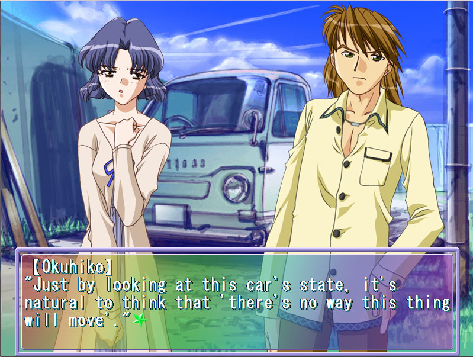
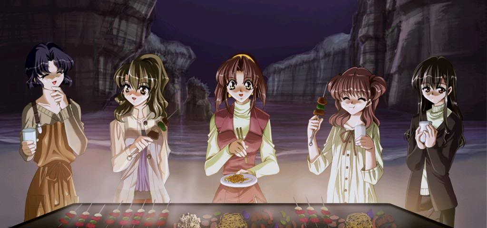
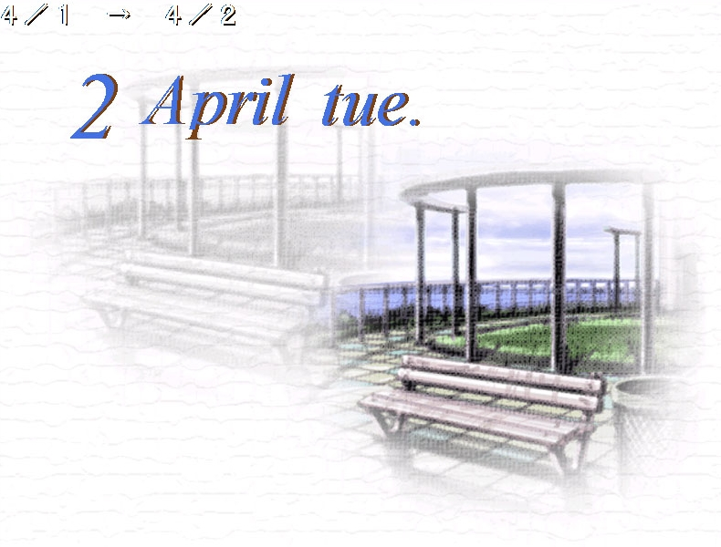
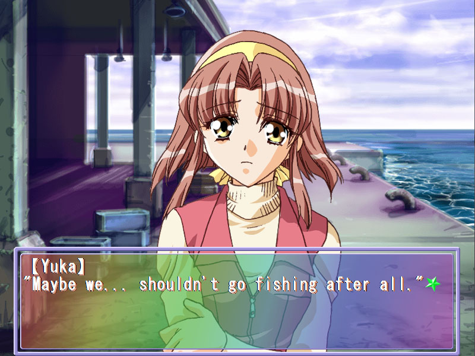
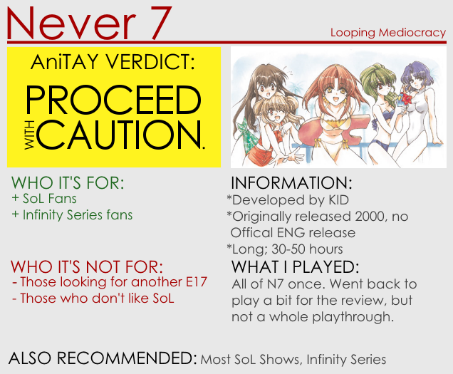

---
{
	title: "Rockmandash Reviews: Never 7: The End of Infinity [Visual Novel]",
	published: "2015-03-17T00:30:00-04:00",
	tags: ["Rockmandash Reviews", "FuwaReviews", "Never 7", "Infinity Series", "Visual Novels", "AniTAY", "Tayclassic"],
	kinjaArticle: true
}
---

Have you ever experienced something well regarded and great, then looked back to see what the creator has made before, only to be disappointed by the results? Today on Rockmandash Reviews, I’m reviewing the beginning of the [Infinity](https://rockmandash12.kinja.com/rockmandash-reviews-infinity-zero-escape-marathon-w-1664979798) series,* Never 7: The End of Infinity*, a game that’s remarkably average on almost every way.

###### [Rockmandash Reviews: *Infinity & Zero Escape Marathon \[DONE!\]*](https://rockmandash12.kinja.com/rockmandash-reviews-infinity-zero-escape-marathon-w-1664979798)

I’m pretty well known around here for being a Fate/fanboy, but if there’s one thing that I love…

[Read more](https://rockmandash12.kinja.com/rockmandash-reviews-infinity-zero-escape-marathon-w-1664979798)

 

While the rest of the Infinity series is primarily a Sci-Fi series with other elements thrown in for good measure, *Never *7 is the inverse of that, being a slice of life romance with Sci-Fi elements thrown in for good measure. The story follows Makoto Ishihara, a college student who rarely attends his classes, and due to this, he and the other other students (Yuka, Haruka, Saki, and Okuhiko) are sent to a “Seminar Camp” on an island far away for a week during spring break as “punishment”. When he arrives on the island Makoto has a dream where at the end of the week, a girl dies before his eyes, with a bell clutched in her hand. He wakes up from the dream to find out that it’s the start of the week... and as he goes through it, he begins having premonitions of future events, each one turning out correct. As the week goes on, events get stranger and stranger, and Makoto gets more confused, curious on what is just going on....

While the premise sounds interesting, (and it is certainly interesting when it picks up) throughout a good majority of the game, it’s just a slice of life that just happens to have stranger than normal things going on. The Sci-Fi aspects like the infinity loop, cloning, premonitions, and cure that are introduced in this series certainly do play a part in this game, and do a solid job gripping you into creating a solid mystery to get you interested (really, the only reason why I finished the game), but the characters and their respective routes are what’s front and center in this game, what hogs your attention. It’s a make or break thing: *Never 7 *can get quite dull at times because of it’s slow pacing, and if you are trying to read it for the (actually quite well done) sci-fi aspects, and don’t really care for the interactions, you probably won’t care for the game. It’s not horrible slice of life, but it’s not great either.

Speaking of things you probably won’t care about, let’s talk about the characters! They aren’t the worst I’ve seen, but they got on my nerves at times and are so generic that you can pretty much describe them with one sentence: Okihiko is an asshole, Yuka’s a cheerful yet level headed girl (who’s a really bad drunk), Haruka is a kuudere way before the deres were a thing, Saki’s a bitch, and the two you meet at the island Izumi and Kurumi are nice and annoying respectively. They’re engaging and entertaining enough, but really, the game doesn’t really give you reasons to care too much about them, and thus I didn’t care. After I got through the end of the game, I found that the only characters I really even remembered well were Yuka and Izumi, mainly because they were the only characters that didn’t bug me, and the only ones that got interesting development because out of the 5 routes in this game, those are the routes that left an impression due to the sci-fi implemented in it. (BTW, if you’re interested in playing this game, you might want to use a guide because it can get confusing, and play Yuka’s first. You won’t regret it.) The rest of the routes were meh and nowhere near as gripping. They were good enough to keep your attention, but really nothing more. That statement is kinda telling of the whole writing in general... It’s good enough, but it could be a lot better.

#### Writing - 7/10

 

*Never 7* is an pretty old VN, and it looks the part. It looks dated, with a low resolution, an older style of character art, UI elements that scream the 90s (seriously? A rainbow textbox? **WTF?)** and a complete absence of a UI for the menus, but it doesn’t look that bad in general because it’s pretty well drawn, expresses emotions well, has clean lines, solid backgrounds (with an interesting painting/pencil sketch design), good CG, and there’s no real main issues visually in the game. The game uses it’s visuals decently enough, and it never detracts from your experience. *Never 7* doesn’t really have any issues with the way it looks, but there weren’t anything that will really wow you either. Pretty middle of the road.

#### **Visuals - 7.5/10**

Simplicity is the name of the game with *Never 7*’s soundtrack, as all of it’s songs are pretty simple and straightforward. As expected due to the time it was released, it sounds very PS1-ish, with decent sound quality and relatively simple melodies but it’s really nothing special. There’s something charming about it’s MIDI soundtrack that I find myself attracted to, as it’s very pleasing to the ears (and it really grew with me listening to it standalone) but there’s nothing that’ll blow you away. Everything else about the soundtrack is pretty averag, from the atmosphere building to the usage to the tracks. It sounds nice, but it doesn’t do really anything special.. at all. Also, surprisingly for the time, a lot of it is voiced, so that’s nice, and they do a good job expressing the other character but it didn’t do too much to influence my opinion of the game.

#### Sound - 7.5/10

 

No joke, when I first played this game, I abhorred it, loathed it, hated it. Coming from* 999*,* Ever 17* and *Remember 11*, I had expectations for something great, something that would be at least similar to the others... but when I saw a generic setting, the generic characters, the generic story, I was extremely annoyed and angry at the game. The tension I loved, the immediate impact of the plot was gone, and I was flabbergasted. Once I calmed down though, actually started to go through the game, and through one of the decent routes in the game, I enjoyed the Sci-fi elements they had, the characters, their interactions, and the plot as a whole. While it’s nothing special, there’s still enough here to entertain you and keep your attention, but it does it no better than anything else like this.

*Never 7: The end of infinity*’s name is silly when you think about it: It’s not *Never 7*, 7 is the only score I’d ever consider giving this game because it’s just so... average, and* End of Infinity* doesn’t make sense either because it’s the beginning of the infinity series and it shows. Average and aged doesn’t sound too great, but that’s the best way can describe about this game, and only those curious in the origins of the infinity series should give it a shot.

## Overall - 7/10, Polarization +1.5, -1

 

***

**Copyright Disclaimer:** Under Title 17, Section 107 of United States Copyright law, reviews are protected under fair use. This is a review, and as such, all media used in this review is used for the sole purpose of review and commentary under the terms of fair use. All footage, music and images belong to the respective companies.

*I’m a frequent writer of Visual Novels and Anime on *[*this blog*](http://rockmandash12.kinja.com/#_ga=1.122760139.1523386611.1417386122)* and the *[*AniTAY Blog*](http://anitay.kinja.com/#_ga=1.243020871.473183827.1418699279)* as well. Come and check them out if you are interested in reviews and opinion pieces on these topics! For an explanation of my review system, *[*check this out*](http://tay.kotaku.com/rockmandash-rambles-an-explanation-on-my-review-system-1619265485#_ga=1.122760139.1523386611.1417386122)*, and here’s *[*my biases in reviewing*](http://rockmandash12.kinja.com/rockmandash-rambles-my-personal-biases-in-reviewing-1688152053)*.*
