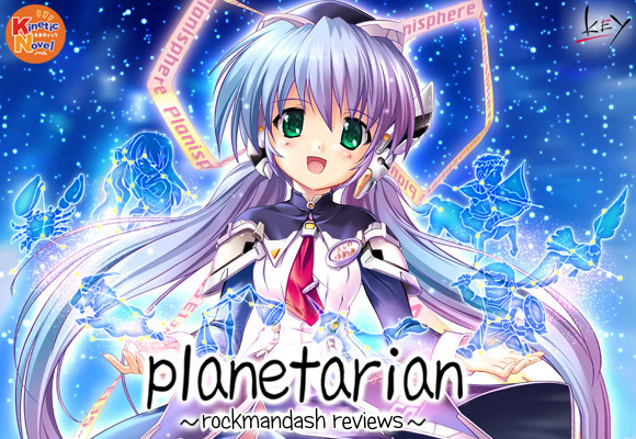
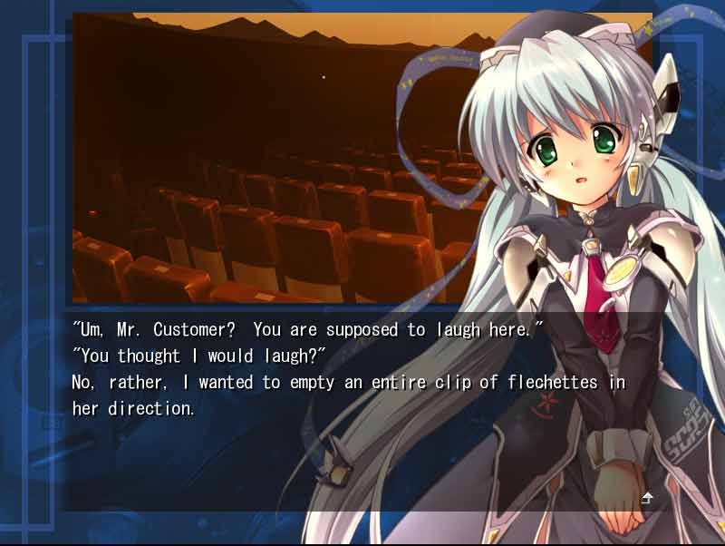
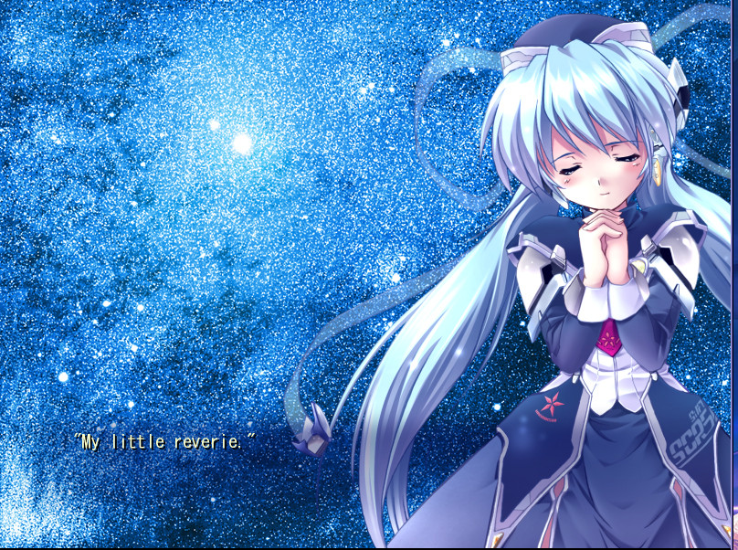
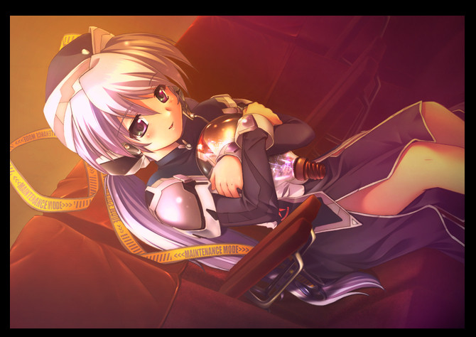
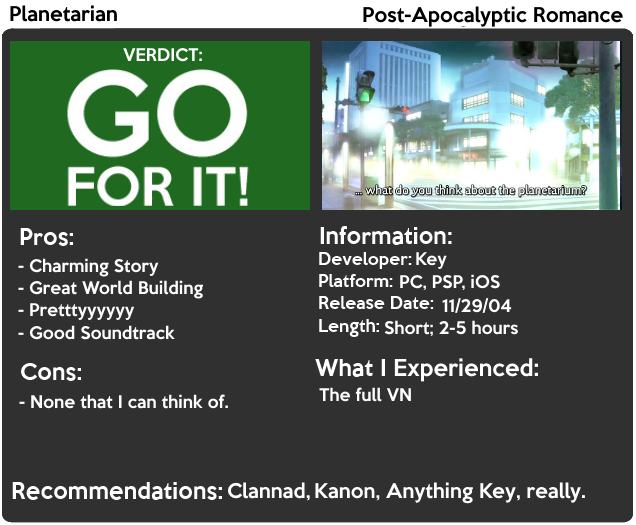

---
{
	title: "Rockmandash Reviews: Planetarian [Visual Novel]",
	published: "2014-07-28T19:00:00-04:00",
	tags: ["rockmandash reviews", "key marathon", "planetarian", "visual novel", "review"],
	kinjaArticle: true
}
---

Why don't you come to the Planetarium? The beautiful twinkling of eternity that will never fade, no matter when. All the stars in the sky are waiting for you.... even as you watch through this review. Welcome to Rockmandash Reviews, and today I'm reviewing one of the most charming stories I've ever had the chance to experience, *Planetarian ~The Reverie of a Little Planet~*.

 

*Planetarian* is a story so charming, and so amazing that I can't help but be impressed by it. It's a short kinetic novel that's about 4 hours, meaning that all you do is read without any interactions, in this short period of time... and I think it's better for that. It may be a turn off for some, but I think it really helps you get into the fantastic world that exists in this game, and into the fantastic story that is *Planetarian*.

The story follows a "junker", a person who scavenges around to make a living in post-apocalyptic world, in which humanity has essentially killed off itself due to nuclear and biological warfare. The way it fills you with curiosity of the world, is something that will always impress me: it explaining it in such a manner that it's just right, Not too long that it drags out, but not too short that it makes you wish for more. It lets you get to know the world, and the influences it has on the people that inhabit it. It lets you see the devastation, and feel all emotion that comes with a world like this. And the way it presents everything makes it interesting and intriguing, never bogging the story down. It's a great example of world building done right, which is impressive, given the length of the game.

That junker finds himself in a planetarium, where he meets this robot named Yumemi, or Reverie in some fan translations. Yumemi is a bit different than what the junker would expect from a robot: she's a cute yet very talkative robot from a consumer age before humans self-imploded, before the junker came to know the world. It's slice of life, but it's an entertaining and interesting slice of life, a thought provoking and enjoyable one.

I just love the characters, especially Yumemi, as her cute innocence and focus on her old life makes a great contrast to the equally as enjoyable junker, who came to know this bleak world. The way that these characters interact with each other, displaying their differences in their beliefs, ideals, way of life, and what life even means to them was quite moving, and seeing them getting to know each other with their thoughts conflicting, makes for some great character interactions. The themes that it approaches, and the way that it executes make *Planetarian* stand out, and shows how well it's written. Also, The pacing is just perfect, and the way the story flows is just amazing.

Last but not least, the story ends with a bang. when that ending hits, you will feel it. It will make you think, cry, appreciate, and smile, the full gamut of emotions felt through this game and the way they do it just blows my mind. It shows the strength of the Key formula; making you cry buckets in such a short period of time, and what a great period of time it is.

*Planetarian *is a great example of what a short VN should be like and it's one that will touch your heart. It's enjoyable throughout, and it's a story that uses what it has effectively to move players in ways they wouldn't expect. It's just well written, and I really enjoyed it.

#### **Writing - 9/10**

 

Considering that it's 10 years old, and it's a short game,* Planetarian *is absolutely beautiful. It's really simple visually, with Yumemi being the only character with art, and it doesn't actually show much, but what they do show is great and the whole aesthetic of the game is really nice. I just love the look of Yumeni, as they put a lot of attention to her, making her look amazing and the game just looks great overall. The only real issues I have with the art is that I wish they had a bit more art to show everything, and I wish most of the art was full screen as most of the art was in a small window, but those are small nitpicks for a pretty good looking game.

#### Visuals - 8.5/10

You know, I could just sum this section by saying it's made by Key and you'd probably get the same context. This atmospheric, touching, and charming soundtrack is just excellent, it's definitely iPod worthy. Everything here works well, is pleasing to the ears, and adds charm in a way that most other games can't really come close to doing. A game like Planetarian really needs to have music that make the mood, and the soundtrack delivers, utilizing it to make you feel everything it wants you to feel while enjoying it's tunes. The voice acting is good too, as the voices really fit characters well. Overall, this game sounds great, no real complaints. What did you expect? It's KEY.

#### Sound - 9/10

Planetarian is a charming Visual Novel that proves how well Key can write. It's extremely short for a Visual Novel, but it uses that time well, executing its in a way that makes it a shining example for a short VN done right. It packs more emotion in a short time span than many do in much longer time, and it's something I'd recommend you check out, especially because it's available on steam from Sekai project.

## OVERALL - 9/10, Polarization +.5, -1

 

***

**Copyright Disclaimer:** Under Title 17, Section 107 of United States Copyright law, reviews are protected under fair use. This is a review, and as such, all media used in this review is used for the sole purpose of review and commentary under the terms of fair use. All footage, music and images belong to the respective companies.

*You can see all my reviews on *[*Rockmandash Reviews*](http://tay.kotaku.com/tag/rockmandash-reviews)*, and the rest of my *[*Key Marathon*](https://tay.kinja.com/rockmandash-reviews-key-marathon-wip-1606707641)[* Here*](https://tay.kinja.com/rockmandash-reviews-key-marathon-wip-1606707641)*. For An explanation of my review system, *[*check this out*](http://tay.kotaku.com/rockmandash-rambles-an-explanation-on-my-review-system-1619265485)*.*

###### [Rockmandash Reviews: *Key Marathon*](https://tay.kinja.com/rockmandash-reviews-key-marathon-wip-1606707641)

Like I said a few months ago, I’m starting up a Key Review Marathon: Reviewing all the main Key…

[Read more](https://tay.kinja.com/rockmandash-reviews-key-marathon-wip-1606707641)

*This game is available on *[*Steam*](http://store.steampowered.com/app/316720)* from Sekai Project.*

*Also, if the game doesn't satisfy your hunger for Planetarian and want an epilogue or prologue, look up the drama CDs. They are pretty good and do the job.*

*Edit: Overhauled the review on 2/6/15*
