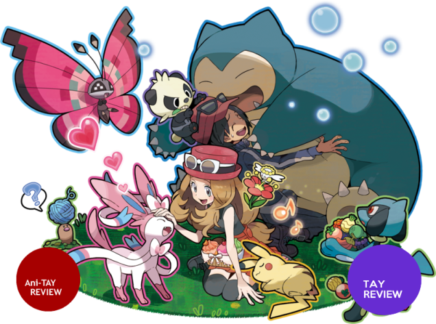
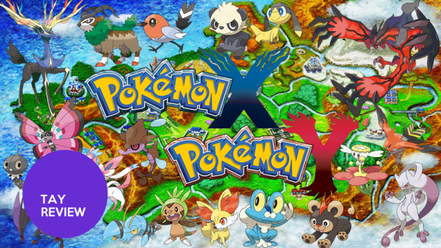
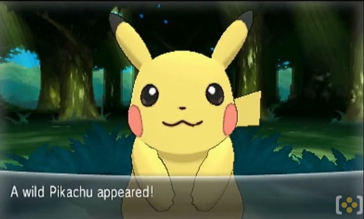
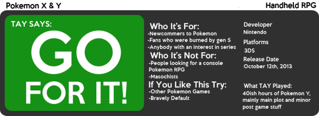
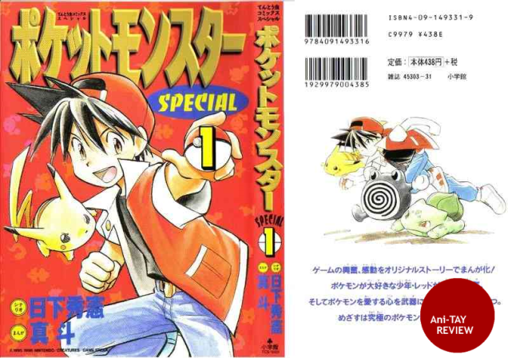
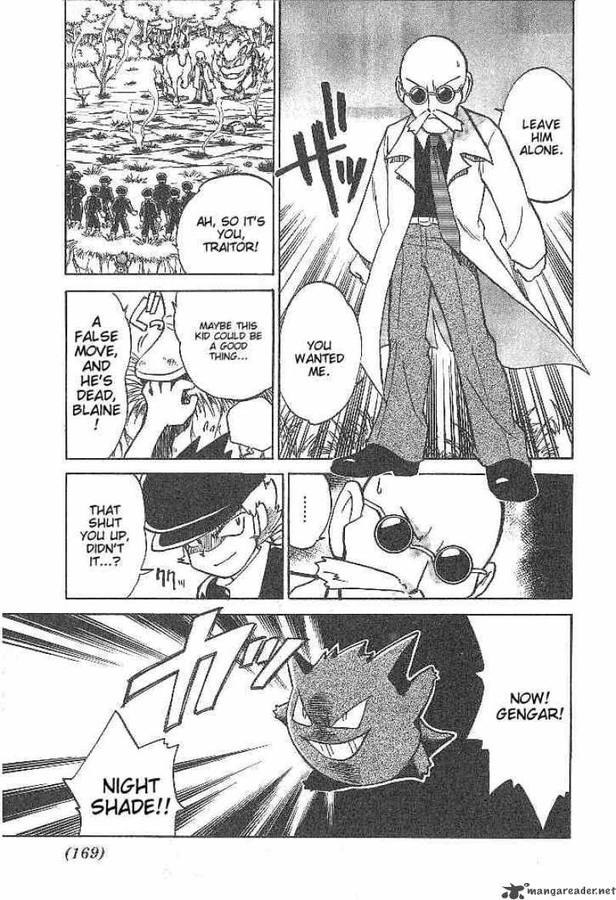
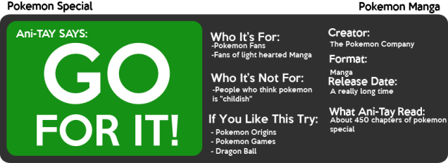
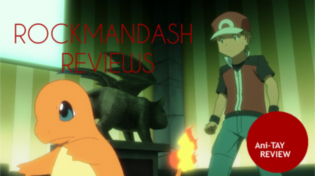
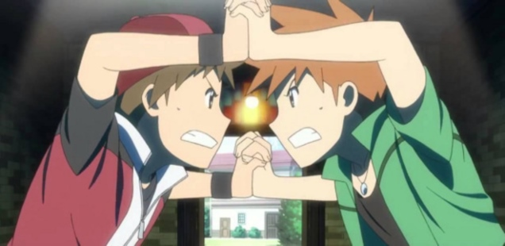
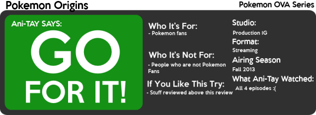

---
{
	title: "Rockmandash Reviews: Pokemon Backlog [Game, Manga & Anime]",
	published: "2014-03-20T22:39:00-04:00",
	tags: ["rockmandash reviews", "backlog", "pokemon", "tay", "ani-tay", "manga", "xy", "special", "origins", "review", "3ds", "ova", "rockmandash12", "rockmandash"],
	kinjaArticle: true
}
---

Around October of last year, a ton if people were hyping up for Pokemon X and Y. I got sucked into the world of Pokémon again, and I wrote 3 Mini-Reviews on this blog I had before I got onto TAY. I was digging through my backlog, and decided to post them up to TAY, with some minor tweaks.

## Pokémon X & Y \[3DS] Review

Pokemon X & Y is the latest (6th) generation of Pokemon by Nintendo, and they are games on the 3DS. Pokemon X & Y is one of the best main Pokemon games, and it brought me back from not really caring for Pokemon after Gen 5.

If you've played a Pokémon game, you've seen this before. You move into town, and then leave off on an adventure through a new region, this time in a Foreigner's view of France, known as Kalos. They tangent off into this [red herring](http://tvtropes.org/pmwiki/pmwiki.php/Main/RedHerring) about mega evolutions, but other than that, it's pretty much the same old story. Get 8 gym badges, beat the baddies known as Team Flare, and become the champion. Nothing too bad, but it's the same old story, but it's much more simplistic in comparison to what they did in gen 5 & 4. The characters were fine, the writing was just typical Pokemon, but pretty simplistic like the earlier generations. Pokémon's the one RPG where story doesn't really matter, and that hasn't changed here.

#### Writing - 7/10

This generation of Pokemon fixed so many things game play wise, it's now fast and engaging, I love it! The EXP Share was changed to an EXP All, and it's broken as all hell but awesome, because you no longer have to spend hours grinding. With the EXP Share the game was a blast! They gave people an incentive to catch Pokémon, which is when you catch them, you get EXP, which is awesome! The Design of the world reminded me of Kanto, I felt like they were trying to return to the roots with this one, and it succeeded. So, they added a bunch of new features, so much so that I can't really mention them all because I haven't used them all. They added fairy types, a new counter to dragon types, a sky battle where you battle in the skies, mega evolutions, which are like super saiyans for Pokémon, Poke-Amie, which is something you can do to play with Pokémon, and Super training, which is AMAZING. The game's length was nice as always, and It had a nice and simple difficulty progression.It's the most fun I've had in Pokémon gameplay in a long time, and I loved it. It's great, but it's not perfect. I have 2 gripes with the gameplay, the first one is that post game there's not very much to do, and Lumiose City is insane to try to navigate.

#### Gameplay - 9.5/10

 

This is Pokémon how it should be. The game looks like a lower res version of XD Gale of Darkness & Coliseum, but its art style makes up for it. The UI looks great, the art style looks fantastic, the Pokémon designs look great, and the new dynamic camera is great... I can go on for days about how good this game looks. The art style is really suited for pokemon, and helps drive the game. It looks slightly worse on the 3DS, do to it being blown up,but it shouldn't look too bad.

#### Visuals - 9.5/10

Pokemon X & Y has a pretty good soundtrack, in the game. In context, it's some of the best music we've seen in pokemon, with a ton of blood pumping pieces that work with the mood or calming ones for routes, but X\&Y's soundtrack is pretty average standalone, a lot worse in comparison to other soundtracks in the series.

8.5/10

I haven't had this much fun with a Pokémon game since I started playing Pokémon. This game is just fun. Competitive is really fun now, and everybody is playing it. It's a really fun game to play.

#### Enjoyment - 9.5/10

Pokémon X and Y is another fabulous entry into the Pokemon series. The Gameplay is great, the music is superb, the Graphics are mind blowing, and they ironed out what made Pokémon tedious. It fixes the flaws that past games had, while adding a bunch of new stuff that's pretty great. Pokemon X & Y is a big step for Pokemon.

## OVERALL - 9/10

 

## Pokémon Special - \[Manga] Review

Pokémon Special is the Pokémon Manga. It's been running since the start of Pokémon and to me is the canon story of Pokémon. This is personally, my favorite manga series, and I have many fond memories with Pokemon Special.

THIS MANGA HAS CHARACTER DEVELLLOOPMMMEEEENNNTTTTTTTTTT! It's pretty much the story from the game with some character development, new arcs, comedy and even a romance (GASP!). It's fantastic, and gives the basic plots of Pokémon a bit of personality. I like how they actually use strategy, and the plot was superb. It's a very shonen-esque plot, but that's what Pokémon is and it's one of my favorites. What makes this so much better in comparison to the stories of the main games, is that it has good pacing. It blazes through the stuff you already have seen while taking a long time with its own arcs. I felt that that was bad sometimes, that they were skipping a bunch of stuff Other perks in comparison to the main game is that it cuts out a lot of fat, it has great charecter iterations, and is just a ton of fun.

#### Writing - 9/10

 

The Art of Pokemon Special does it's job. It's charming, and I personally enjoy it, but there's nothing really noteworthy about Pokemon special's art. It has a pretty consistent art because it's been the same artist since the very beginning, but the art looks better in some arcs in comparison to others. It doesn't really wow you at any time, but it never hinders it.

#### Visuals - 7/10

I love Pokémon Special; It holds a special place in my hart as the definitive version of one of my childhood favorites. Its plot is great, and that's what really matters. It's Pokémon, but with a real story, and I've never been more glad to see Pokémon in a way like this.

#### Enjoyment - 10/10

Pokémon Special lives up to its name. It's really something totally different for the Pokémon Company with a really decent plot and it's very entertaining, with a real story and all. It's not the best, but it's my favorite manga just because of how entertaining it's always been, and there is a bit of nostalgia factor here. Anyways, Pokemon Special is the Canon Pokemon plot to me, and i'd recommend all of you go and read a bunch of Pokemon Special.

## Overall - 9/10

 

## Pokémon Origins - \[Anime OVA] Review

Pokémon Origins is a 4 part OVA series made by Production IG based on the original games. How does Production IG (who's done alot of work with nintendo) deal with the original games? Let's find out!

 

Pokemon Origins is a very faithful adaptation of Pokémon RGBY. I love it because of how close it is to the source material, but it's no different than the games. What makes it amazing is the characters are portrayed in the anime. The plot, even though it's very vanilla, even taking direct quotes from the games is leaps and bounds better than the anime. All the characters, even the mute red are just fantastic, which cannot be said for the full anime. WHY COULDN'T THIS BE THE FULL ANIME INSTEAD ;(

#### Writing - 8/10

DO YOU SEE HOW THIS IS ONLY 4 EPISODES???? They get through all of RGBY in about 2 hours, and they rush it like hell. I WANT MORE OF THIS. MOAR.

Pacing is really just meh, I wish this was a full series over a set of OVA's. Even though pacing is meh, it's by far much much much better than the regular Pokémon anime with a bunch of filler arcs.

#### Pacing - 6/10

Beautiful. Production IG is known for great visuals, and once again and they nailed it. Seeing great characters animated fabulously like this is a great experience and it's something you should experience. The battles look great, the scenery looks great, and the ccharacters look great.

####  Visuals - 9/10

The sound was excellent, with outstanding remixes. Japanese dub was pretty good and the soundtrack playing was GLORIOUS. The remixes are some of the best Pokémon Remixes I've heard. Production IG did a stellar job on the soundtrack. The dub, however... is something to avoid. While it's amazing they got a dub done in 4 months, there was so much mis-casting that it's not very enjoyable. They should have just hired the voice actors from the regular series... Johnny Yong Bosch as Brock is just wrong.

#### Sound - 8.5/10

The biggest problem with saying you like origins is pretty much that you spend the whole time comparing it to the Pokemon anime. It's pretty much better in every way, and by itself, it's a pretty enjoyable OVA. If The Pokemon Company made this into a full series, i'd be a very happy person. It's great, but my one gripe with Origins is that while enjoyable because of nostalgia, it relies too much on nostalgia.

#### Enjoyment - 9/10

Pokemon Origins is a wonderful OVA series, ruined by the fact that it's an OVA series. I loved this, but as an OVA that's only 2 hours trying to adapt a 20 hour game, It makes compromises. I just wish The Pokemon Company gave IG the A-OK for a full season of this.... I'd watch it if you were a Pokemon fan; it'll bring back good memories.

## Overall - 8.5/10

 

***

**Copyright Disclaimer:** Under Title 17, Section 107 of United States Copyright law, reviews are protected under fair use. This is a review, and as such, all media used in this review is used for the sole purpose of review and commentary under the terms of fair use. All footage, music and images belong to the respective companies.

*You can see all my reviews on *[*Rockmandash Reviews*](http://tay.kotaku.com/tag/rockmandash-reviews)*. For An explanation of my review system, *[*check this out*](https://rockmandash12.kinja.com/rockmandash-rambles-an-explanation-on-my-review-system-1619265485)*.*

###### [Rockmandash Rambles: *An Explanation on my Review System* (Updated 11/15/2015)](https://rockmandash12.kinja.com/rockmandash-rambles-an-explanation-on-my-review-system-1619265485)

If you’ve read any of my reviews and wanted to know why I did them the way I do, here’s an…

[Read more](https://rockmandash12.kinja.com/rockmandash-rambles-an-explanation-on-my-review-system-1619265485)