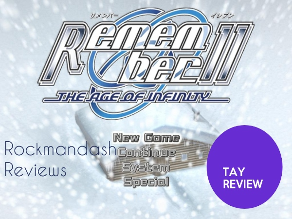
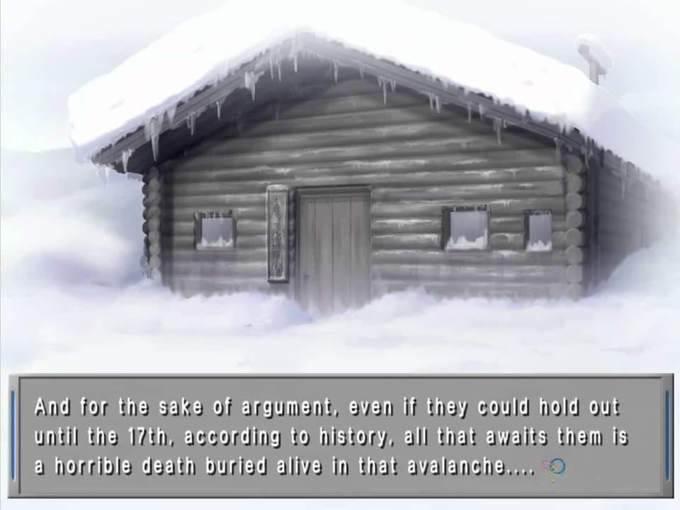
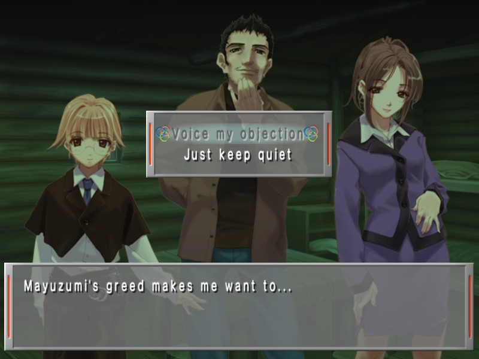
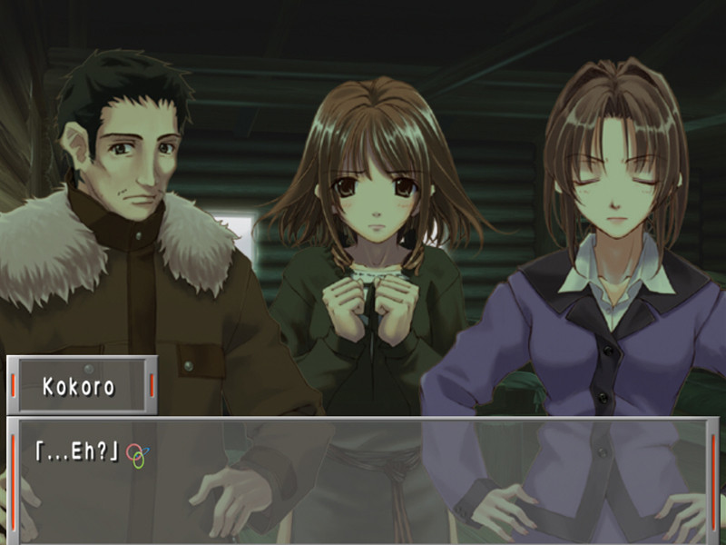
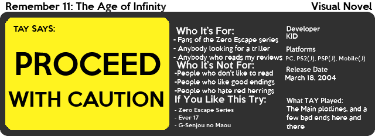

---
{
	title: "Rockmandash Reviews: Remember 11: The Age of Infinity [Visual Novel] - ARCHIVE",
	published: "2014-02-21T13:00:00-05:00",
	tags: ["rockmandash reviews", "remember", "11", "the age of infinity", "rockmandash12", "tay", "visual novel", "review"],
	kinjaArticle: true
}
---

To those who came and found this from google or something, Please check out my [re-done review](https://rockmandash12.kinja.com/rockmandash-reviews-remember-11-the-age-of-infinity-1687285802) of Remember 11 as it's much better written and executed in general. This review is here for archival purposes, but it does not completely represent my thoughts on the game.

***

Welcome to Rockmandash Reviews! Today we have Remember 11: The Age of Infinity. Remember 11 is the third game in the Infinity series, which are made by KID. This game never got a western release, but it got a pretty good fan translation. It's another PC Sci-fi visual novel game which KID does a pretty good job at. Is this as good as or better than Ever 17? Let's find out!

#### **WARNING: This review will reference the **[**Ever 17 review**](http://rockmandash12.kinja.com/rockmandash-reviews-ever-17-the-out-of-infinity-visu-1504908037)** a lot, so you should Watch/Read that first!**

The plot is this game's strength, and its Achilles heel at the same time. The game's structured much more like the Zero Escape games than the other games in the Infinity series, even though this is the 3rd game in the infinity series. The game takes place in 2 places in 2 different times with 2 main charecters, and their minds flip flop between the 2 bodies and the 2 places ~ every 30 minutes. It's a very unique plot device, and the situations they are in each location helps support that. In the first location, Mount Akakura, 4 survivors from an airplane crash, including Kokoro Fuyukawa, our 20 year old female protagonist, are stuck in a horrible snowstorm. The other location is a isolated facility called SPHIA, with Hotori, AKA Keiko, a calm/psychopathic girl, and Satorou, our amnesiac male protagonist.... \*facepalm\*.

In both locations, the main characters need to fight between the outside world, and and what's going on inside their mind. The rest of the cast is no slouch, they are all very memorable and are all written well. This game lives on the atmosphere of the locations, and the atmosphere and it does it to an outstanding degree. There is a huge mystery element to the story, as you and the protagonists have little to no idea about what is going on. The plot is great, and the pacing is great. The writing was one of the best I've ever seen..... **until the ending.** This ending leaves so many things unanswered and feels like there is a 3rd of the game that you will never see. Because of this game's reliance on the player being clueless on what's going on, and the mysteries in the game, the ending flops. KID rushed this game out because of budget constraints, and even though what we got was quality, the game really suffers because of it. The ending makes everything feel like it was a red hearing... finishing at one of the worst cliffhangers I've ever seen. The game is written well, with great atmosphere and mystery but that ending is something you will remember.... but not for a good reason.

#### **Plot - 7/10**

I don't really have much to say here. It's pretty much the same as Ever 17, except worse. It's not horrible, it's just not as nice. It's still a choose your own adventure book-like game but the ending system is just junk. The TIPS thing is stupid. So, the way the TIPS thing works is that when you play the game, you will find blue text, and in the menu, there is this TIPS option, and there is a definition for the blue books. Because of TIPS, you need to play bad endings to understand the broken plot, and when I say bad endings, I mean ALL of the bad endings. You will not be able to understand the game without TIPS, which is stupid. In this game, you play two paths, for each of the players. It works fine, but I just wish that there was a 3rd path explaining the gaping holes in the plot. Your objective is to essentially, NOT DIE. I love how they assigned the skip buttons, and the options work well, but overall it plays like your average visual novel.

#### **Gameplay - 7/10**

The music got better. Somehow, the music got better. The tracks fit the mood even better, and they kick ass. The music is just great, and makes the atmosphere that this game is so dependent upon. The voice acting is great, and the characters are represented well. This game is a treat for your ears. This is one of my favorite soundtracks, and it's fantastic.

#### **Sound - 9/10**

This game very nice. The UI looks great, the CG doesn't look cheesy, the character design is better, everything is better. The game is a Late PS2 game (the game was originally for ps2 in japan, and came out in 2004, but the PC version is the only one translated), so everything looks nice. The art style is great, and all of it looks amazing. It's beautiful, and when you consider the age, you wonder why every other game can't age as well as this.

#### **Visuals - 9.5/10**

I love Remember 11, to an extent. What we got was golden. When I was playing it, Remember 11 was by far, my favorite visual novel. It was excellent.... but whenever I think of Remember 11, I will remember that ending hand how much it pissed me off. It's a fabulous game and I loved it.... but god damn, that's like the worst ending I've ever seen.

#### **Personal Enjoyment - 9/10**

Remember 11 a superior game to Ever 17 and 999 for the most part, but it's missing 1/3rd of the plot and that's a like a silver stake in a vampire. This game has all that's needed to be my standard for a perfect visual novel, but due to budget constraints, the hunt for the perfect visual will have to go on.

### **8/10**

### **I'd give it a Rockman Remarkable if it was finished, but it's not. So Rockmandash Recommends will have to do.**

 
