---
{
  title: "Rockmandash Reviews+: Remember 11: The Age of Infinity [Visual Novel]",
  tags:
    [
      "Remember 11",
      "Visual Novels",
      "FuwaReviews",
      "Infinity Series",
      "Uchikoshi",
      "Ending",
    ],
  published: "2015-02-23T03:40:00-05:00",
  attached: [],
  license: "cc-by-4",
  oldArticle: true,
}
---

Have you ever played a game that you loved, so much so that it was on its way to become
  one of your favorites, only to have it crashing down? Have you ever seen an ending so disappointing, so frustrating
  that you wanted to disown it, making you despair and rage? No, I’m not talking about <em>Mass Effect 3</em>, but
  something much closer to me, with a similar horrible ending. Welcome to Rockmandash <a class="sc-1out364-0 hMndXN sc-145m8ut-0 gIacKn js_link" data-ga='[["Embedded Url","Internal link","http://tay.kotaku.com/rockmandash-reviews-remember-11-the-age-of-infinity-1528062359#_ga=1.183184102.1523386611.1417386122",{"metric25":1}]]' href="http://tay.kotaku.com/rockmandash-reviews-remember-11-the-age-of-infinity-1528062359#_ga=1.183184102.1523386611.1417386122">Reviews+</a>,
  and today on my<a class="sc-1out364-0 hMndXN sc-145m8ut-0 gIacKn js_link" data-ga='[["Embedded Url","External link","http://rockmandash12.kinja.com/rockmandash-reviews-infinity-zero-escape-marathon-w-1664979798",{"metric25":1}]]' href="http://rockmandash12.kinja.com/rockmandash-reviews-infinity-zero-escape-marathon-w-1664979798" rel="noopener noreferrer" target="_blank"> Infinity &amp; Zero Escape Marathon</a> we
  have <em>Remember 11: The Age of Infinity</em>, the game that was so close to perfection in my books, but threw it all
  away. 

<video autoplay="" loop="" muted=""><source src="./1341173074178868772.mp4" type="video/mp4"/></video>

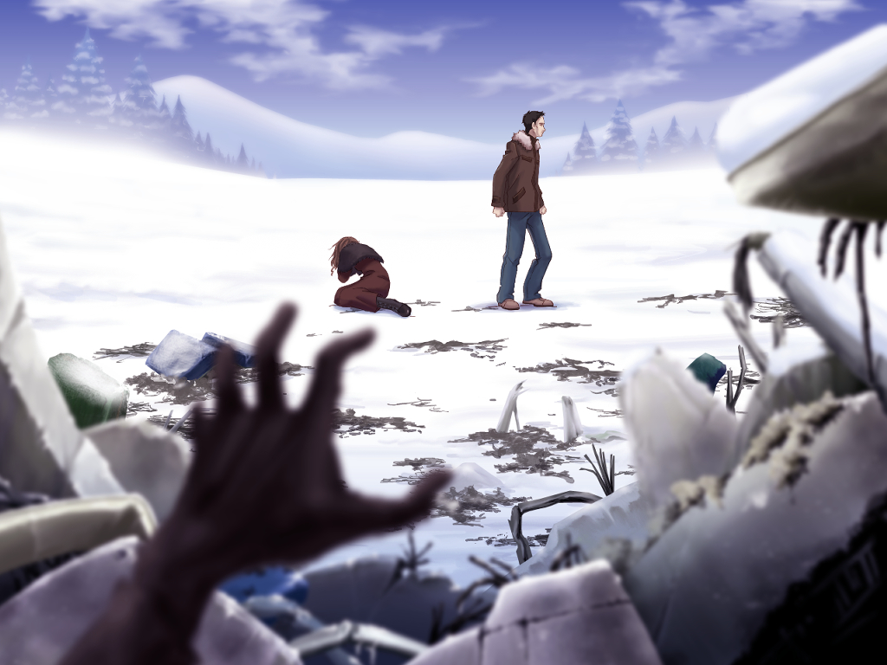

If you know anything about the Infinity series or the Zero Escape Series, you would
  know that the games in the Infinity series are essentially prototypes to the Zero Escape series, where Uchikoshi
  polished the execution and utilized the concepts to it’s fullest potential. One of the biggest elements of that series
  was the tension, how it trapped you into the narrative, engaging you deeply with what it wanted to do. While <a class="sc-1out364-0 hMndXN sc-145m8ut-0 gIacKn js_link" data-ga='[["Embedded Url","External link","http://rockmandash12.kinja.com/rockmandash-reviews-ever-17-the-out-of-infinity-vis-1626111485",{"metric25":1}]]' href="http://rockmandash12.kinja.com/rockmandash-reviews-ever-17-the-out-of-infinity-vis-1626111485" rel="noopener noreferrer" target="_blank"><em>Ever 17</em></a> had elements of said tension, it wasn’t really the focus of
  the game, which aimed more at the atmosphere... leaving<em> Remember 11 </em>to be the game that captures the tension
  in a phenomenal way that Zero Escape eventually used. The amount of tension in comparison to<em> Ever 17</em> is so
  astronomically different that it’s hard to believe they’re made by the same people, but man is it impressive. It’s
  like comparing apples and oranges: <em>Remember 11</em> has a gripping narrative filled with a surreal feeling of
  tension that stole me by storm, entrapping me in the world, while<em> Ever 17</em> had some of it, but wound up
  carrying the story based on the premise.

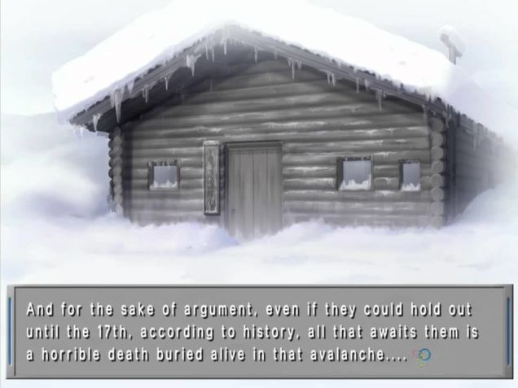

Speaking of premises, this game has quite an amazing one, as it’s pretty unique (to
  me at least) and is executed brilliantly. <em>Remember 11 </em>starts off by following Fuyukawa Kokoro, a third-year
  sociology major, who boards a plane to meet a research subject in the Specified Psychiatric Hospital for Isolation and
  Aegis, or SPHIA. For reasons unknown, said plane crashes on Mount Akasara in the middle of a snowstorm. Of the 31
  passengers aboard the plain, only 4 passengers manage to survive the crash, and those are Kusuda Yuni, Yomogi Seiji,
  Mayuzumi Lin and Fuyakawa Kokoro. They decide to take shelter in an empty cabin until the storm passes.

The story every now and then switches the perspective to Yukidoh Satoru, after he falls
  from the SPHIA clock tower. He awakens with some memory loss and the realization that someone is out to kill him. Due
  to a snowstorm, he’s unable to leave the SPHIA facility, and his only chance at living is to find that person among
  the three other residents (with one of them being known for having a different personality that is a serial killer) of
  SPHIA that is out for him. (or perhaps a hidden culprit?)

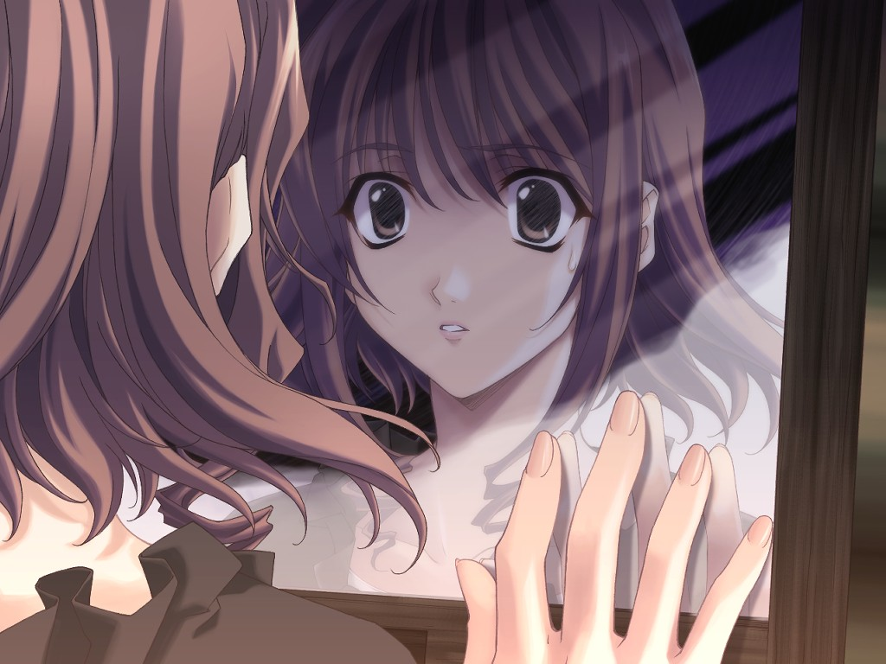
Shortly after, Kokoro and Satoru realize that they are somehow exchanging bodies,
and need to trust each other to live. Will they both survive the deadly situations, and solve the mystery of why all
of this is happening, or how it’s even happening at all? It’s questions like this that <em>Remember 11 </em>executes
so well, as it creates a beautiful mystery based around the situation the characters are in, and an amazing atmosphere
that I fell in love with, which is always at the edge of life, yet in an unnatural calm. The atmosphere is just done
so well, and it’s just something that Uchikoshi excels at, being matched by very few out there. I truly felt like I
was trapped with them, and my life was on the brink of existence… seriously impressive. It created an amazing
narrative that just flowed with the story in the best way possible, and I adored it. This great atmosphere is
ever-present throughout the game, and even enhanced because the main characters need to fight between the outside
world and what’s going on inside their mind: What’s happening during the gaps, and what is happening with the world?
It’s all very interesting and very enjoyable.

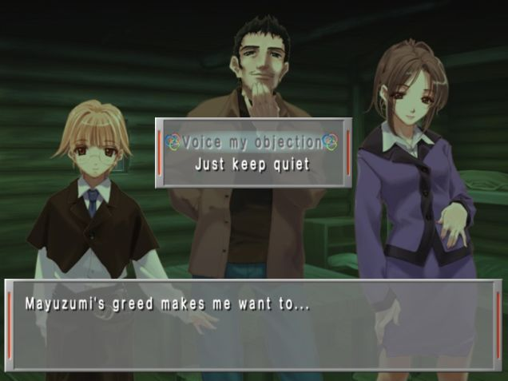
 the writing is pretty much really solid in almost every way, and it’s quite hard to find
faults. The sci-fi aspects and ideals that this game runs with, like the mind swapping, how one would react when they
are claimed to be dead, what an identity is (<a class="sc-1out364-0 hMndXN sc-145m8ut-0 gIacKn js_link" data-ga='[["Embedded Url","External link","http://en.wikipedia.org/wiki/Dissociative_identity_disorder",{"metric25":1}]]' href="http://en.wikipedia.org/wiki/Dissociative_identity_disorder" rel="noopener noreferrer" target="_blank">Dissociative Identity Disorder</a>
is extremely interesting and this game handled it extremely well), and the core essence of survival were all aspects
that I appreciated quite a bit. The way it handles sanity and mental psyche in general was really just solid and
entertaining, and really I loved how thought provoking the game was. The characters and interactions are interesting
and engaging as well,and a majority of them even are really likable too! (Except Lin Mayazumi. She deserved to die.
Damn lawyers...) The pacing is extremely solid and much more thrilling, especially in comparison to <em>Ever 17</em>.
<em>Remember 11 </em>is a brilliant ride that was executed extremely well with phenomenal writing, but there’s
one<strong> BIG</strong> issue with the writing of<em> Remember 11</em> that wrecked it all….

<h2 class="sc-1bwb26k-1 fvCjqJ" id="h116001"><strong>THE WORST GODDAMN
  ENDING I’VE EVER SEEN IN MY LIFE. </strong></h2>
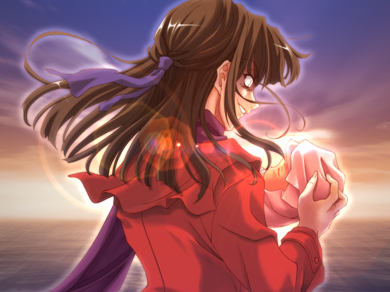

I loved<em> Remember 11</em>. As I was playing through it, I was hyping it up to be
  my favorite game ever, and it really was… until that ending. It ends off at a cliffhanger (literally), leaves just
  sooo many things unanswered and feels like there is a 3rd of the game missing. There is no third route, there is no
  answer. All the interesting plot aspects were dropped, leading to red hearings all over the place, and it leads the
  player into a state of absolute confusion. All the interesting things are dropped, Red herrings all over the place.
  You’re left in a clueless state, and annoyed by the <strong>WHAT THE FUCK JUST HAPPENED? WHY? WHY WOULD YOU END IT
    THAT WAY??? WHYYY?????? </strong>

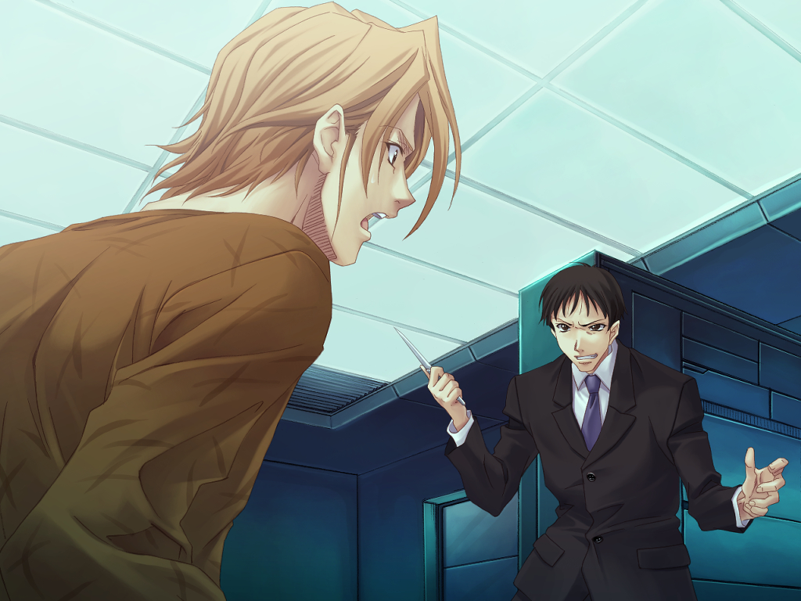

That ending is by far my least favorite ending I have experienced, leading this
  perfect experience with a compelling and strong narrative to collapse, falling apart without even explaining itself,
  making you have to find out what the hell happened yourself. It points out flaws in the story, brings back questions
  that were never answered and kinda just pisses on the efforts that went into the game. It hints at more, but there is
  no more. It’s absolutely the most frustrating ending you will ever experience. Events happen because they happen, and
  you’ll never know. The only way you’ll get even a hint of the events is if you go through the “TIPS” system in play,
  going out of your way to find the information, or search through it on a wiki. “TIPS” is a system that displays
  information on certain text, and it’s implemented on other VNs for information not related to the story, but this
  ending requires information gained via “TIPS”… and this<strong> ABSOLUTELY FAILS</strong>. When you need to disconnect
  yourself from the world to learn what is happening, the game has failed as a narrative. TIPS is a failure to me and I
  will never view it as anything else. I don’t care if what in there is good or even great, because I care about a
  narrative. I care about how they told the story, not just the story and this gets me every time. It had such a
  brilliant narrative, but ending it in a way that makes no sense from a narrative standpoint? I’ll just never
  understand.

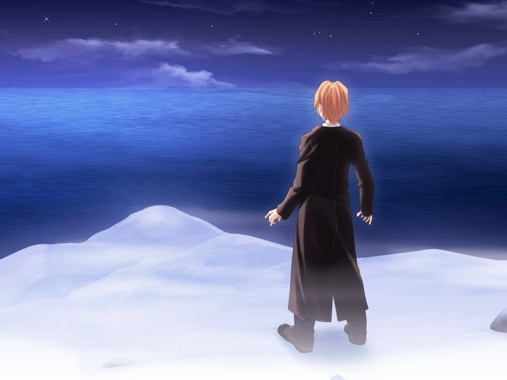

This just burns, especially because <strong>EVERYTHING ELSE WAS DONE SO
  WELL… </strong>The absolutely amazing, emotional ride that leads up to it, the build up and anticipation for a good
  and concluding ending, only for the waves to come crashing in, destroying everything…. KID rushed this game out
  because of budget constraints, and even though what we got was quality, the game really suffers because of it. It’s
  not done, and the people who had involvement in the game know that. The plot self-destructed, and it makes you ask the
  wrong questions: Is she a even a serial killer, something the tension was contingent on? What happened in these
  characters pasts? Did they survive or die, and what is leading to these live/death situations as they switch? what is
  the gap between the time they switch? How does this even work?

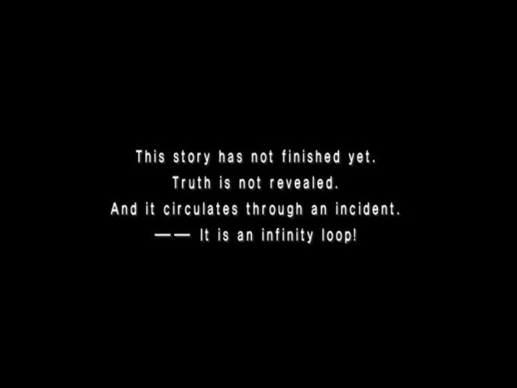

You are stuck in an infinity loop forever, there is no solution. You will not
  understand what happened. You will not like what happened. You are trapped in an infinity loop, and unlike the others,
  there is no way out... the most frustrating aspect of the whole entire series.
<h4 class="sc-1bwb26k-1 fvCjqJ" id="h116002">Writing - 8/10</h4>

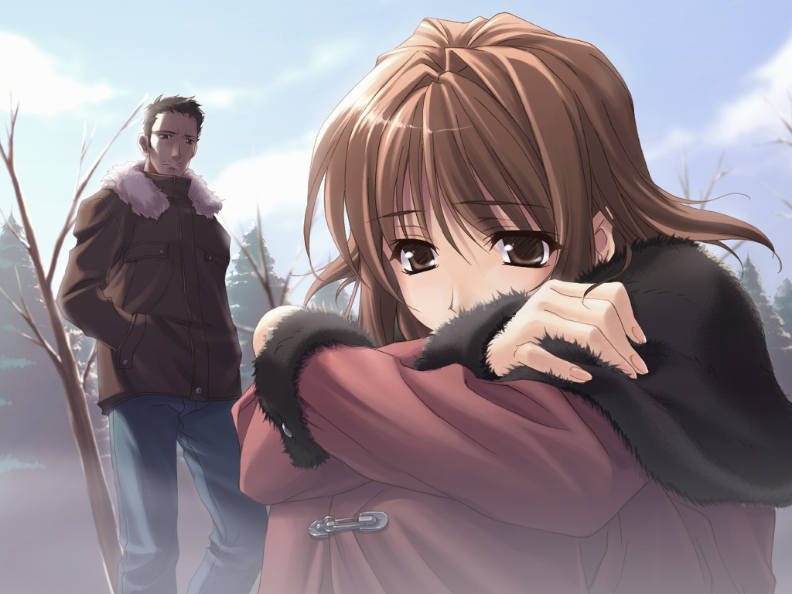
Rarely do VNs look as nice as <em>Remember 11</em> does after such a long period
of time, and rarely do games in general age as well as this one does. This game is 10 years old, and it looks even
better than titles that come out today... and they didn’t even have a big budget! What they managed to do with the
visuals is absolutely outstanding, managing to perfectly craft a world with characters that feel in place and feel
like actual characters while also nailing the atmosphere and the backgrounds perfectly. The character designs just
look great in general, showing a wide range of emotions while having an aesthetic feel (that is something you don’t
really see) while being very enjoyable and interesting to see in action (Yes, this VN has animations!). The visuals
take the tone for what it wants to do and combine it with a fantastic soundtrack to make this an interesting and
amazing experience, one that just flows extremely well. The UI is quite nice as well, something I don’t really get to
say for any game, and I really appreciate the visuals throughout. I really like the style of this, and it’s just so
polished. The animations and effects in the game were really nice touches as well, and I really have just praise for
it. 

Let me put into context on why I’m so impressed: This was a PS2 game, coming out in
  2004. That’s the same age as<em> Fate/stay night</em>, but it looks quite a bit better, still looking great today.
  Yes, there’s been better out since this game like<em> Steins;Gate</em>, <em>Eden*</em> and<em> Rewrite</em>, but those
  also had like half a decade or more advantage.<em> Remember 11</em>’s visuals have aged extremely well, and they look
  solid no matter what standards you judge them by.
<h4 class="sc-1bwb26k-1 fvCjqJ" id="h116003">Visuals - 9/10</h4>

<iframe allow="accelerometer; autoplay; clipboard-write; encrypted-media; gyroscope; picture-in-picture" allowfullscreen="" frameborder="0" height="315" src="https://www.youtube.com/embed/PL6r7nhoGfBVj_wzPg8d6Q9ddjV0uc3QpY" width="560"></iframe>

I’m a fan of <em>Remember 11</em>’s soundtrack, with it being very it’s just as listenable
  as <em>Ever 17</em>’s ever was, but the way they go about it is quite different, with<em> Remember 11</em> being much,
  much more direct than <em>Ever 17</em> aimed to be.

It’s no <em>Umineko</em> with every track being golden but it’s still very pleasing
  to the ears with a decent amount of standalone tracks and the soundtrack in general being just pretty good. It doesn’t
  have a main environmental theme like <em>Ever 17 </em>does with its water, so it takes a totally different approach to
  its atmosphere: Instead of creating a world with music where everything blending in together, <em>Remember 11</em>
  uses the music to create an atmosphere that is focused on tension, on emotion via a more situational, more emotional
  track. it’s an atmosphere of mystery and confusion or unknown, focused on engaging you with the narrative and what it
  wants to do. I also really appreciate the focus on the psyche and mind with the music, or focus on moving how you feel
  and I actually think this approach works well. Also, I have no qualms with the voice actors, as everyone did a great
  job. Really, the sound in<em> Remember 11 </em>is quite nice, and I really liked it.
<h4 class="sc-1bwb26k-1 fvCjqJ" id="h116004">Sound - 8.5/10</h4>

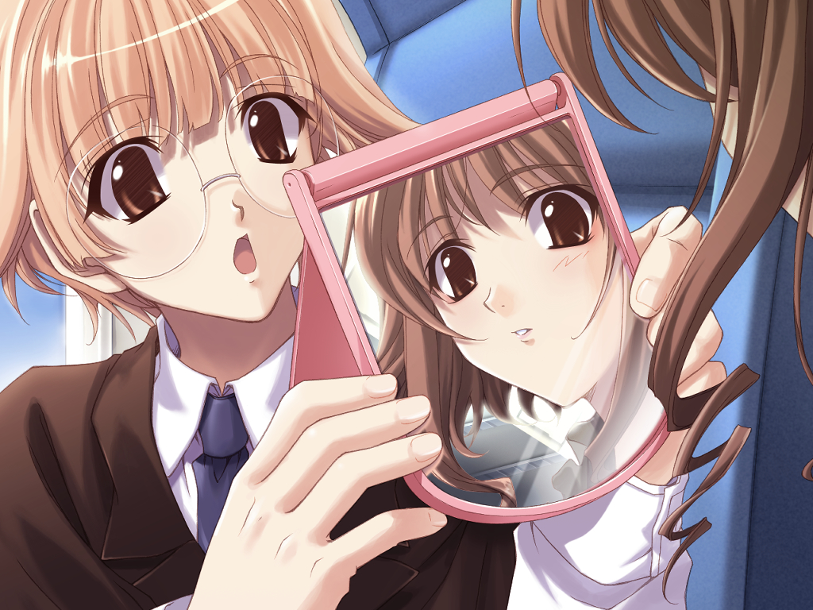
There’s nothing more painful than something building up your hopes and dreams,
making you fall in love with it, then stabbing you in the back when it’s done with you. Going through this process
typically is much much more painful than something bad, and it makes you question yourself. It makes you wonder, what
went wrong, what happened? It’s things like this that sticks in your mind, and it’s these thoughts that will always
surface whenever I think about <em>Remember 11</em>. It was the closest to perfection I’ve ever seen. I was engaged in
the characters, in the world. I was sucked into the narrative, and I loved it. The atmosphere was rich and beautiful,
and everything was to my liking, just a bit more than my current favorite game, <em>999</em>, but like everything else
it was too good to be true. What was quickly escalating to be one of my favorite games collapsed under the pressure,
due to a lack of funding. It’s a damn shame. <strong>IT’S A DAMN SHAME.</strong>

When you are so close to perfection, only for everything to collapse like this, it
  makes for a confusing state of affairs. Do I love it, or do I hate it? I don’t know....
<h4 class="sc-1bwb26k-1 fvCjqJ" id="h116005">Enjoyment - 8/10</h4>

<em>Remember 11 </em>is the best game with the worst ending. It was phenomenal,
  hitting all the right marks, but it all came down, collapsing right there. I loved it so much, but I just can’t accept
  that ending, from a story perspective, and especially not from a narrative perspective. It’s just rubbish and it keeps
  me from loving what could have been one of my favorite games. The hunt for the perfect visual novel will have to go
  on. I’d give it a Rockman Remarkable if it was finished, but it’s not. So Rockmandash Recommends will have to do.

<h2 class="sc-1bwb26k-1 fvCjqJ" id="h116006">Overall - 8.5/10, Polarization +1, -1
</h2>

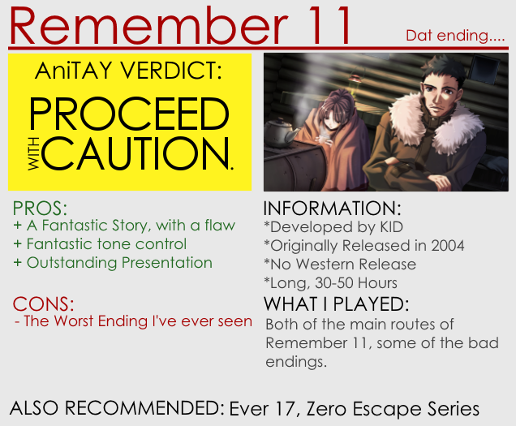

<strong>Copyright Disclaimer:</strong> Under Title 17, Section
  107 of United States Copyright law, reviews are protected under fair use. This is a review, and as such, all media
  used in this review is used for the sole purpose of review and commentary under the terms of fair use. All footage,
  music and images belong to the respective companies.

<em>You can see all my reviews on </em><a class="sc-1out364-0 hMndXN sc-145m8ut-0 gIacKn js_link" data-ga='[["Embedded Url","Internal link","http://tay.kotaku.com/tag/rockmandash-reviews",{"metric25":1}]]' href="http://tay.kotaku.com/tag/rockmandash-reviews"><em>Rockmandash Reviews</em></a><em>. For An explanation
  of my review system, </em><a class="sc-1out364-0 hMndXN sc-145m8ut-0 gIacKn js_link" data-ga='[["Embedded Url","Internal link","http://tay.kotaku.com/rockmandash-rambles-an-explanation-on-my-review-system-1619265485",{"metric25":1}]]' href="http://tay.kotaku.com/rockmandash-rambles-an-explanation-on-my-review-system-1619265485"><em>check this out</em></a><em>.</em>

<em>Once again, thanks to Protonstorm for helping with this review. These would be way
  worse if you weren’t such a grammar nazi.</em>

