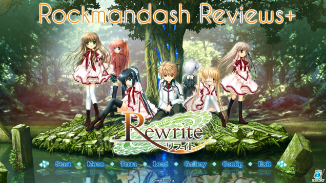

---
{
title: "Rockmandash Reviews: Rewrite [Visual Novel]",
tags: ["rockmandash reviews", "rockmandash", "review", "tay", "tayclassic", "tay-classic", "rewrite", "visual novel"],
authors: ['reikaze'],
published: '2014-02-04T16:58:00-05:00',
attached: [],
license: 'cc-by-4',
oldArticle: true
}
---

 Welcome to Rockmandash Reviews! Today we have a Key Visual Novel, called Rewrite. Prepare
  to rewrite your expectations, as this is nothing like your typical key game.

FYI - I re-did this
  review, so please read that version instead. This is up for archival reasons. 

<aside class="sc-1rh3ayr-6 jfFNjl inset--story branded-item branded-item--kinja" data-commerce-source="inset">

<a class="sc-1out364-0 hMndXN js_link" data-ga='[["Permalink page click","Permalink page click - inset headline"]]' href="https://rockmandash12.kinja.com/rockmandash-reviews-rewrite-visual-novel-1609445042" rel="noopener noreferrer" target="_blank"><h6 class="sc-1rh3ayr-3 jRIPES">
    Rockmandash Reviews+: <i>Rewrite</i> [Visual Novel]</h6></a>

 As I was starting this review marathon, I saw that first Rewrite review could use
      some…
<a class="sc-1out364-0 hMndXN sc-1rh3ayr-0 kOvmIi js_readmore inset--story__readmore js_link" data-ga='[["Permalink page click","Permalink page click - inset read more link"]]' href="https://rockmandash12.kinja.com/rockmandash-reviews-rewrite-visual-novel-1609445042" rel="noopener noreferrer" target="_blank">Read more</a>

</aside>
<h2 class="sc-1bwb26k-1 fvCjqJ" id="h123725">Writing </h2>
 When experiencing something, you have to judge things based on your prior experiences.
  Rewrite tears down those expectations and gives you something totally different. In Kazamatsuri, a Japanese city that
  is a forrunner in ecological studies, there is this underground war between superhumans known as Guardian and
  summoners known as Gaia. Our protagonist in the story, Kotarou finds himself in the middle of this conspirical
  conflict even though he has lived a fairly average life. My first reaction... an action conspiracy... in my Key
  game? 

 Rewrite is Key's longest visual novel to date, with many routes, and each having a
  very different writing style. There are 3 writers in rewrite, thus explaining the vast differences in writing. I'll
  explain the characters with the route, just to make this more orderly. I'm going in the order I played it, and I'd
  recommend you play this game in a similar order. 

 First off, we need to mention the
  protagonist: Kotarou Tennouji. Kotarou is a very dynamic charecter, and he changes how he acts in almost every arc,
  but he's usually a cheery idiot who doesn't really fit in with a superpower that allows him to rewrite his body. At
  the beginning, I wasn't a big fan of Kotarou, but the further along the plot went, I liked him more. 

<h4 class="sc-1bwb26k-1 fvCjqJ" id="h123726">Kotori </h4>
 The first route I played in Rewrite was Kotori's route. Kotori is Kotarou's childhood
  friend and this route is standard Key writing, with your typical romance. I felt like the quantity of romance was
  really disappointing, as there's a bit of it, but nowhere near the typical amounts like in Clannad. I recommend
  playing this first, as Kotori is not in either faction, and her route is the route that give the best scope of the
  conspiracy. If you play this first, you get the best experience out of the common route in my opinion, which is good
  because you will probably be skipping most of the common route in the other routes. 

<h4 class="sc-1bwb26k-1 fvCjqJ" id="h123727"> Lucia </h4>
 Next up is Lucia, our Tsundere class representative.... look at those archetypes fly. This
  route is not as archetypal as the representative character make it out to be, as this route was written the writer of
  Higurashi: Ryukishi07. Lucia's route is a giant mystery, and it's amazing. Lucia is a part of Guardian, and this route
  is my favorite charecter arc. 

<h4 class="sc-1bwb26k-1 fvCjqJ" id="h123728">Shizuru</h4>
 After Lucia, is the Shizuru, our Moral Guard Moe Ninja. This is probably the most
  simplistic route, as it's essentially fun with Moe Ninjas and Sayori fish. This route was written by Little busters
  writer, and I think the route is just OK. The ending was really depressing though, as it's essentially the end of the
  world... 

<h4 class="sc-1bwb26k-1 fvCjqJ" id="h123729"> Chihiya </h4>
 Chihiya's route is what happens when key tries to make Fate/ Stay Night.... It's not as
  good as F/SN, but it's not a bad Shonen. I felt like this route should have been fleshed out more, but I did like the
  character development in this route. This is where Kotarou used his powers to the max, and it had one of the happier
  endings. Chihiya is a part of Gaia. 

<h4 class="sc-1bwb26k-1 fvCjqJ" id="h123730">Akane</h4>
 Akane's route is my least favorite route. It's more conserned about the Doomsday and the
  organization of Gaia (Akane's the head of Gaia BTW) than the charecters, and it was utterly disappointing. I loved
  seeing Kotarou be totally OP, but this route was meh. This route also has a non-writing issue, and that's it lacks in
  CG. This route could have used a bit more Akane, and a bit more romance. 

<h4 class="sc-1bwb26k-1 fvCjqJ" id="h123731"> Moon </h4>
 The Moon route is a short but sweet route on the moon focused on Kagari, aka the Key. The
  Moon route is a convergence of all of Kotarou's past and all of the routes. Kinda makes the happy arcs look much worse
  in comparison because it shows that even in the good ends, the planet will die. Personally, it's one of my favorite
  routes.

<h4 class="sc-1bwb26k-1 fvCjqJ" id="h123732"> Terra </h4>
 Terra is a direct successor to what happened in the Moon route, and it shows Kotarou's
  backstory. I love Terra because it starts you off before all the other routes, and you get to see the real Kotarou: a
  Cynical bastard who's gone through hardships to do great things. Backstabbing, amazing character development, and just
  fantastic writing in general. You know shit is getting real when they change the UI on you. It wasn't Key's style, but
  it was fantastic, and was the best route in the game.

 All of the supporting characters were very interesting. I wish more CG was made for
  them though as several very important characters in the plot don't have any sprites.

  What we got was good, but It was not what you expect from key. The writing feels weak, and there's no romance. I
  thought Key knew this- just because it's for all ages, doesn't mean that it's The biggest problem with Rewrite is that
  they don't focus on their strengths. The writing feels experimental, and just not up to par. The last 2 routes and
  Lucia's routes were awesome, but it doesn't fix the disappointment I got from a majority of the game. 

<h4 class="sc-1bwb26k-1 fvCjqJ" id="h123733">Writing - 8.5/10 </h4><h2 class="sc-1bwb26k-1 fvCjqJ" id="h123734">Gameplay</h2>
 It's a Visual novel. You Make choices, and you read. That's about it. I like the interface
  is awesome, with the spinnie wheel thing in the corner representing how much Kotarou is using his rewrite power, and
  there's a bunch of important stuff that you can just click to and not hidden in key commands. BTW there's a metric
  shit-ton of save slots, if you ever manage to fill them out, I applaud you. Overall, i'm a big fan of the UI, but the
  gameplay is just average. 

<h4 class="sc-1bwb26k-1 fvCjqJ" id="h123735"> Gameplay - 7.5/10 </h4><h2 class="sc-1bwb26k-1 fvCjqJ" id="h123736">Sound </h2>
 This is one section where you get the typical Key. It's a Key game, so of course the music
  fucking rocks! It's a motivating factor, and it helps keep you interested. Rewrite has a large variety in music, the
  music fits in comedic scenes, or in depressing scenes. It passes the iPod test too, and it's just fantastic. The voice
  acting is just as excellent, with all the characters just sounding like you would expect. I love the sound in
  Rewrite. 

<h4 class="sc-1bwb26k-1 fvCjqJ" id="h123737"> Sound - 10/10 </h4><h2 class="sc-1bwb26k-1 fvCjqJ" id="h123738">Graphics/Art </h2>
 I welcome you Visual Novels, to the modern world. Finally! We have Glorious WIDESCREEN HD,
  and no more 800x600 BS!!!! Too bad art is still lacking.... as expected from Key. This is different than the other Key
  games, as the problem with Rewrite's art doesn't lie in Quality, it's in quantity. This game needs much more CG.
  Sprites and backgrounds are reused in an obnoxious amount, and many important characters are not drawn. The game is
  pretty, but too many things are left to your imagination. 

<h4 class="sc-1bwb26k-1 fvCjqJ" id="h123739"> Graphics/Art - 7/10 </h4>
 Personal enjoyment - I enjoyed Rewrite. It took about 1.5-2 weeks to finish, but man, was
  it a fun 1.5-2 weeks. It's something you play to relax, and have fun. Most of it was just slice of life, which was
  fun, and the good routes, were good. The problem is, there were points where I was bored of a game, and for a medium
  that's supposed to entertain, that's a fail. I enjoyed it, it was fun and interesting, but it wasn't mind
  blowing. 

<h4 class="sc-1bwb26k-1 fvCjqJ" id="h123740"> Personal Enjoyment- 8.5/10
</h4><h2 class="sc-1bwb26k-1 fvCjqJ" id="h123741"> Conclusion</h2>
 Rewrite is something totally different. It's taking risks, and those risks are not paying
  off. Rewrite is hit and miss, some parts are excellent, but other parts are just horrible. Usually, I can just say
  everything key makes is excellent, but I can't really do that this time. Rewrite is a good game, but it's very hit and
  miss. 

<h4 class="sc-1bwb26k-1 fvCjqJ" id="h123742">Pros</h4>
 Half of the Arcs are AMAZING 

 It was an enjoyable
  experience 

 Key's excellent Music 
<h4 class="sc-1bwb26k-1 fvCjqJ" id="h123743">
 Cons </h4>
 Half of the Arcs are RUBBISH 

 Hit &amp;Miss behavior 

 Needs More CG 
<h2 class="sc-1bwb26k-1 fvCjqJ" id="h123744"> Overall - 8/10 </h2><h2 class="sc-1bwb26k-1 fvCjqJ" id="h123745">Rockmandash Reccomends</h2>

<strong>Copyright Disclaimer:</strong> Under Title 17, Section
  107 of United States Copyright law, reviews are protected under fair use. This is a review, and as such, all media
  used in this review is used for the sole purpose of review and commentary under the terms of fair use. All footage,
  music and images belong to the respective companies. 

<em>You can see all my reviews on </em><a class="sc-1out364-0 hMndXN sc-145m8ut-0 gIacKn js_link" data-ga='[["Embedded Url","Internal link","http://tay.kotaku.com/tag/rockmandash-reviews",{"metric25":1}]]' href="http://tay.kotaku.com/tag/rockmandash-reviews"><em>Rockmandash Reviews</em></a><em>, and the rest of
  my </em><a class="sc-1out364-0 hMndXN sc-145m8ut-0 gIacKn js_link" data-ga='[["Embedded Url","External link","https://tay.kinja.com/rockmandash-reviews-key-marathon-wip-1606707641",{"metric25":1}]]' href="https://tay.kinja.com/rockmandash-reviews-key-marathon-wip-1606707641" rel="noopener noreferrer" target="_blank"><em>Key Marathon</em></a><a class="sc-1out364-0 hMndXN sc-145m8ut-0 gIacKn js_link" data-ga='[["Embedded Url","External link","https://tay.kinja.com/rockmandash-reviews-key-marathon-wip-1606707641",{"metric25":1}]]' href="https://tay.kinja.com/rockmandash-reviews-key-marathon-wip-1606707641" rel="noopener noreferrer" target="_blank"><em> Here</em></a><em>. For An explanation of my review system, </em><a class="sc-1out364-0 hMndXN sc-145m8ut-0 gIacKn js_link" data-ga='[["Embedded Url","Internal link","http://tay.kotaku.com/rockmandash-rambles-an-explanation-on-my-review-system-1619265485",{"metric25":1}]]' href="http://tay.kotaku.com/rockmandash-rambles-an-explanation-on-my-review-system-1619265485"><em>check this out</em></a><em>. </em>

<aside class="sc-1rh3ayr-6 jfFNjl inset--story branded-item branded-item--kinja" data-commerce-source="inset">

<a class="sc-1out364-0 hMndXN js_link" data-ga='[["Permalink page click","Permalink page click - inset headline"]]' href="https://tay.kinja.com/rockmandash-reviews-key-marathon-wip-1606707641" rel="noopener noreferrer" target="_blank"><h6 class="sc-1rh3ayr-3 jRIPES">
    Rockmandash Reviews: <i>Key Marathon</i></h6></a>

Like I said a few months ago, I’m starting up a Key Review Marathon: Reviewing all
      the main Key…
<a class="sc-1out364-0 hMndXN sc-1rh3ayr-0 kOvmIi js_readmore inset--story__readmore js_link" data-ga='[["Permalink page click","Permalink page click - inset read more link"]]' href="https://tay.kinja.com/rockmandash-reviews-key-marathon-wip-1606707641" rel="noopener noreferrer" target="_blank">Read more</a>

</aside>

<em>This game is availible on </em><a class="sc-1out364-0 hMndXN sc-145m8ut-0 gIacKn js_link" data-ga='[["Embedded Url","External link","http://fuwanovel.org/novels/rewrite",{"metric25":1}]]' href="http://fuwanovel.org/novels/rewrite" rel="noopener noreferrer" target="_blank"><em>Fuwanovel </em></a><em>for download.</em>

