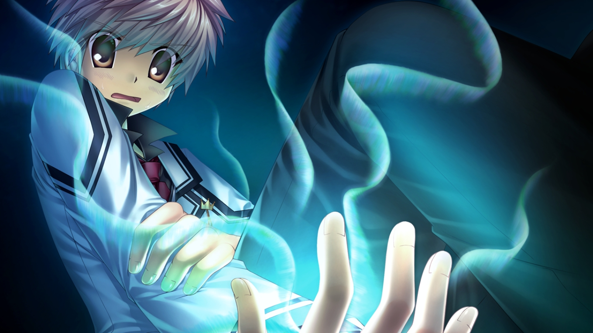
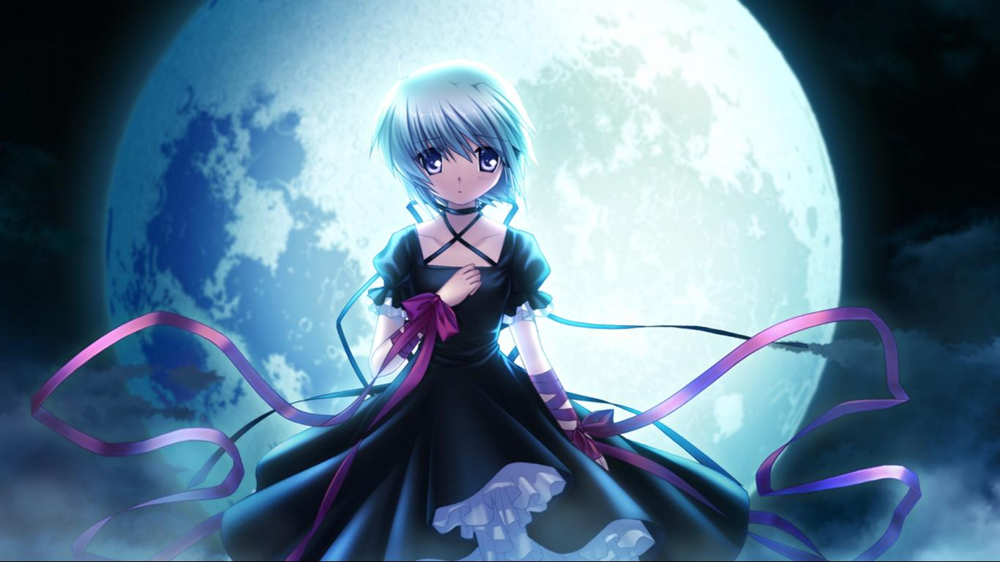
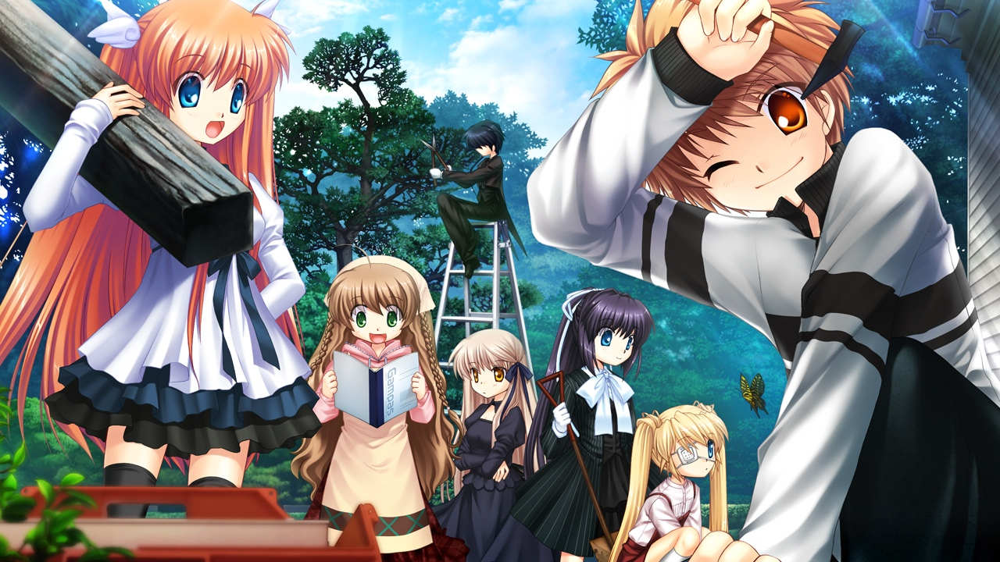
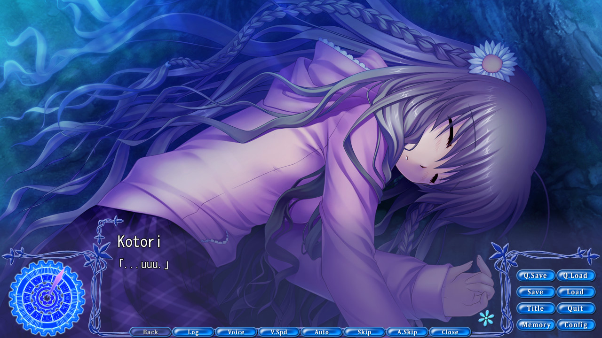

---
{
  title: "Rockmandash Reviews+: Rewrite [Visual Novel]",
  tags: ["rockmandash reviews", "rewrite", "again", "key marathon"],
  published: "2014-08-11T15:00:00-04:00",
  attached: [],
  license: "cc-by-4",
  oldArticle: true,
}
---

 As I was starting this review marathon, I saw that first <a class="sc-1out364-0 hMndXN sc-145m8ut-0 gIacKn js_link" data-ga='[["Embedded Url","External link","http://rockmandash12.kinja.com/rockmandash-reviews-rewrite-visual-novel-1516111258",{"metric25":1}]]' href="http://rockmandash12.kinja.com/rockmandash-reviews-rewrite-visual-novel-1516111258" rel="noopener noreferrer" target="_blank">Rewrite</a> review could use some improvements; I figured that this marathon was a
  perfect opportunity to fix that. Welcome to Rockmandash Reviews+, and this is my <strong>REWRITTEN </strong>review of
  <em>Rewrite</em> for the <a class="sc-1out364-0 hMndXN sc-145m8ut-0 gIacKn js_link" data-ga='[["Embedded Url","Internal link","http://tay.kotaku.com/rockmandash-reviews-key-marathon-wip-1606707641",{"metric25":1}]]' href="http://tay.kotaku.com/rockmandash-reviews-key-marathon-wip-1606707641">Key Marathon</a>,
  so be prepared to rewrite your expectations, as this game is quite different than what you would expect from Key.

 When people experience something, they have to judge things based on prior experiences.
  This is what is normally referred to a bias, and a bias can lead to interesting experiences. A bias can lead to hype
  backlash, or in this case, it can lead you to an experience that would be the exact opposite of what you would expect.
  If you have ever played a Key game, <em>Rewrite</em> will tear down your expectations and offer you an experience
  unlike you would ever expect. 

 The story follows our protagonist Kotarou, who lives an average life in
  Kazamatsuri, a city that is a forerunner in ecological studies. He and his friends in the occult research society go
  into the forest looking for unidentified mysterious animals, but instead, Kotarou finds himself in the middle of a
  conspiratorial conflict and with a weird power. Unknown to most, there is an underground war between 2 factions
  fighting for a way to save the earth: the Superhumans known as Guardian, and the Summoners known as Gaia. While both
  are trying to save the world, they have very different ideas on how to go about that, thus they spend their time
  fighting against each other instead of actually trying to save the world. Rewrite has an an interesting plot with
  great world building, and a unique conspiracy. <em>Rewrite</em>’s story is something that should interest in some way,
  but it was a bit too ambitious, in my opinion.

<em>Rewrite</em> is Key’s longest visual novel to date: It has a total of 7 routes,
  with each having a very different writing style due to them having different authors. While I could go over why each
  individual route is good or bad like I did in the first review, I don’t think that really sums up my thoughts on
  Rewrite’s plot and that makes for a long and confusing review. That being said, i’ll still give a short summary of the
  routes so you aren’t clueless about them.

<ul class="sc-1lmbno3-0 dpuHif" data-style="Bullet" data-type="List">
<li><strong>Kotori </strong>- Kotori’s route is the introductory and it makes for a good reference point. Play this
    one first. It’s your traditional Key romance, and it’s enjoyable.
  </li>
<li><strong>Lucia</strong> - Lucia’s route is interesting because it was written by the writer of Higurashi. It starts
    out as a mystery horror, but turns into a thrilling romance. Personally my favorite character route.
  </li>
<li><strong>Shizuru</strong> - It’s the most simplistic route, and it’s pretty lighthearted. The ending sucks though.
  </li>
<li><strong>Chihiya</strong> - Chihiya’s route is what happens when Key tries to make a Fate/stay night. It’s a good
    shounen, but it could be better.
  </li>
<li><strong>Akane</strong> - It’s boring and it’s focused on the workings of Gaia and doomsday. I’m not a fan.</li>
</ul>

 Even though the character routes are focused on the respective characters, I found
  that characters were enjoyable in the common route, due to the common route being really solid. The common route is
  full of great writing, entertaining slice of life, etc., but with dramatic style changes throughout the game, the
  writing of the game overall gets diluted. The biggest problem with the different writing styles is that the writing
  also varied in quality; some of the charecter routes were pretty good (Kotori, Lucia, Chihiya), but some were pretty
  meh (Shizuru, Akane). The issue is that the charecter routes are lacking in what they should have; the action routes
  don’t have enough action, and the romance was lacking. None of the character routes were particularly great, which is
  a downer, but the last two routes, Moon and Terra kinda make up for it. 

 The Moon
  route is a convergence of all of the routes in the game and this is the point that they actually start explaining
  things, because the game likes to leave you clueless on the conflict. It’s short but sweet route that was executed
  well with a focus on character development... but Terra is even better. Terra is a direct successor to the events in
  the moon route, and it shows Kotarou’s backstory and what actually happens. I love Terra because you get to see the
  real Kotarou: a cynical bastard who’s gone through hardships to do great things. The terra route has it all and it
  does it very well: backstabbing, amazing character development, and just fantastic writing in general. You know shit
  is getting real when they change the UI on you. It wasn’t Key’s typical style, but it was fantastic, and was the best
  route in the game.

 Even though <em>Rewrite</em> was long, it kept my attention well, and that’s not
something I can really say for every VN out there that’s this long. While the length did feel a bit like a chore at
times, I wouldn’t say the pacing is slow; there’s just a lot of content to get through. 

 What we got was good, but it was not what I would expect from key. The writing
  feels weaker than expected throughout most of the character but it was still pretty good, and the Moon and Terra
  routes help to make up for it because of how amazing they were. The biggest problem with Rewrite is that the writers
  don’t really focus on their strengths, and that’s a shame because they do great work when they are doing their
  strengths. The writing feels experimental, and just not up to par. That being said, I did have a good time with it and
  it really hooks you in. It’s just so enjoyable that you can’t help but like it.

<h4 class="sc-1bwb26k-1 fvCjqJ" id="h116918">Writing - 8.5/10</h4>

 I welcome you Visual Novels, to the modern world. Finally! We have Glorious
  <strong>WIDESCREEN HD</strong>, with an absolutely beautiful UI and a beautiful world. The quality is here, with a
  magnificent style that makes everything look great. With some amazing scenery and great effects, the style enhances
  the mood and builds an amazing atmosphere. The character art looks fantastic as well, with a modern style that’s
  pleasing to the eye, something rarely seen in older Key works. There’s just one <strong>BIG </strong>problem with the
  visuals in <em>Rewrite</em>: The quantity of said art. This game needs much more CG. Sprites and backgrounds are
  reused in an obnoxious amount, and many important characters do not even have sprites. The game is pretty, but too
  many things are left to your imagination. This hinders the world it’s built, as the important characters it’s left out
  can be on a specific route for long periods of time, and your just staring at the background. This is the best looking
  key game to date, but Visuals are not just about quality; There is a ton of stuff left to your imagination, and the
  lack of such art is a glaring omission for a VN.

<h4 class="sc-1bwb26k-1 fvCjqJ" id="h116919">Visuals - 7/10</h4>

<iframe allow="accelerometer; autoplay; clipboard-write; encrypted-media; gyroscope; picture-in-picture" allowfullscreen="" frameborder="0" height="315" src="https://www.youtube.com/embed/PLlV_Eg1I9GUawH1umJSJo0wEelS5hUNzj" width="560"></iframe>

Key cannot screw up music. If they ever released a game with bad music, it would be
  the equivalent of pigs flying. <em>Rewrite</em> has a soundtrack that builds an atmosphere and supplements the world
  that very few have approached in quality, and few will ever approach. Every song in this soundtrack has a reason:
  these tracks create a world that feels well developed, and they makes scenes so much better. The soundtrack gives the
  feeling of mystery, of scope, of calm, and it’s all great to listen to. While a lot of it is atmospheric tracks, they
  are some of the best atmospheric tracks you will ever hear, making an atmosphere that is so amazing that you’ll fall
  in love with it. It’s a soundtrack that enhance the story in every way, it’s one of those soundtracks that will leave
  an impression on you just because of how great it is, and you’ll never get sick of it. Seriously... I’ve listened to
  this soundtrack over and over again and I’ve never gotten tired of it. There’s so many amazing tracks in this
  soundtracks, it’s almost absurd. Rewrite has a large variety of music, with a large quantity of it, so quality isn’t a
  problem either. The voice acting is just as excellent, with all the characters just sounding like you would expect.
  It’s one of the best soundtracks Key has ever made and one of the best I’ve listened to. Bravo. 
<h4 class="sc-1bwb26k-1 fvCjqJ" id="h116920">Sound - 10/10</h4>

<iframe allow="accelerometer; autoplay; clipboard-write; encrypted-media; gyroscope; picture-in-picture" allowfullscreen="" frameborder="0" height="315" src="https://www.youtube.com/embed/FNQTQlflYA8" width="560"></iframe>

<em> Rewrite</em> is an enjoyable game. It has a great sense of humor ( <a class="sc-1out364-0 hMndXN sc-145m8ut-0 gIacKn js_link" data-ga='[["Embedded Url","External link","https://www.youtube.com/watch?v=rcFn3FVJLmk",{"metric25":1}]]' href="https://www.youtube.com/watch?v=rcFn3FVJLmk" rel="noopener noreferrer" target="_blank">the oppai route is hilarious</a>),
  with the common route is really solid when it comes to keeping a smile on your face, and even though the serious parts
  of the plot might slack off with the humor, they are entertaining in their own way. <em>Rewrite </em>is a enjoyable
  and entertaining ride, one I hope others give a shot. The fluctuating quality of the character routes might hinder
  your experience though, but it’s really worth it to get to that amazing Terra route. 
<h4 class="sc-1bwb26k-1 fvCjqJ" id="h116921">Enjoyment - 8.5/10</h4>

<em> Rewrite</em> is a game that tries to do too much, and it stretches itself...
  yet still being a lot of fun. When it finally focuses back, it becomes great. It’s a good game with flaws, but those
  shouldn’t hold you back from giving it a shot.

 Also, if you want another perspective
  on <em>Rewrite</em>, check out <a class="sc-1out364-0 hMndXN sc-145m8ut-0 gIacKn js_link" data-ga='[["Embedded Url","Internal link","http://tay.kotaku.com/visual-novel-micro-review-rewrite-739587075",{"metric25":1}]]' href="http://tay.kotaku.com/visual-novel-micro-review-rewrite-739587075">Hitokiri_Ace’s mini-review</a>.

<h2 class="sc-1bwb26k-1 fvCjqJ" id="h116922">Overall - 9/10, Polarization
  +.5,-1</h2>

<strong>Copyright Disclaimer:</strong> Under Title 17, Section
  107 of United States Copyright law, reviews are protected under fair use. This is a review, and as such, all media
  used in this review is used for the sole purpose of review and commentary under the terms of fair use. All footage,
  music and images belong to the respective companies. 

<em>You can see all my reviews on </em><a class="sc-1out364-0 hMndXN sc-145m8ut-0 gIacKn js_link" data-ga='[["Embedded Url","Internal link","http://tay.kotaku.com/tag/rockmandash-reviews",{"metric25":1}]]' href="http://tay.kotaku.com/tag/rockmandash-reviews"><em>Rockmandash Reviews</em></a><em>, and the rest of
  my </em><a class="sc-1out364-0 hMndXN sc-145m8ut-0 gIacKn js_link" data-ga='[["Embedded Url","Internal link","http://tay.kotaku.com/rockmandash-reviews-key-marathon-wip-1606707641",{"metric25":1}]]' href="http://tay.kotaku.com/rockmandash-reviews-key-marathon-wip-1606707641"><em>Key Marathon</em></a><a class="sc-1out364-0 hMndXN sc-145m8ut-0 gIacKn js_link" data-ga='[["Embedded Url","Internal link","http://tay.kotaku.com/rockmandash-reviews-key-marathon-wip-1606707641",{"metric25":1}]]' href="http://tay.kotaku.com/rockmandash-reviews-key-marathon-wip-1606707641"><em> Here</em></a><em>. For An
  explanation of my review system, </em><a class="sc-1out364-0 hMndXN sc-145m8ut-0 gIacKn js_link" data-ga='[["Embedded Url","Internal link","http://tay.kotaku.com/rockmandash-rambles-an-explanation-on-my-review-system-1619265485",{"metric25":1}]]' href="http://tay.kotaku.com/rockmandash-rambles-an-explanation-on-my-review-system-1619265485"><em>check this out</em></a><em>. </em>

<em>This game is availible on </em><a class="sc-1out364-0 hMndXN sc-145m8ut-0 gIacKn js_link" data-ga='[["Embedded Url","External link","http://fuwanovel.org/novels/rewrite",{"metric25":1}]]' href="http://fuwanovel.org/novels/rewrite" rel="noopener noreferrer" target="_blank"><em>Fuwanovel </em></a><em>for download.</em>

