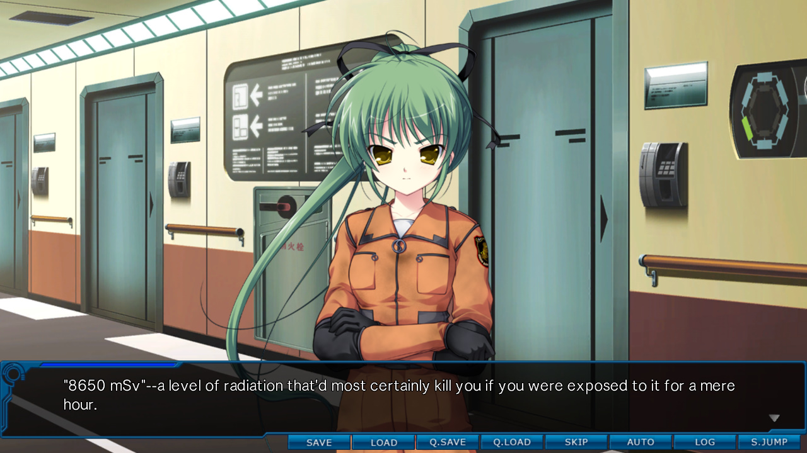
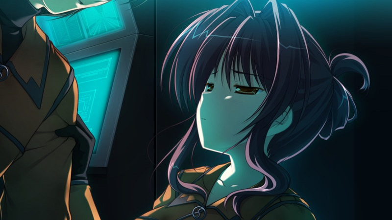
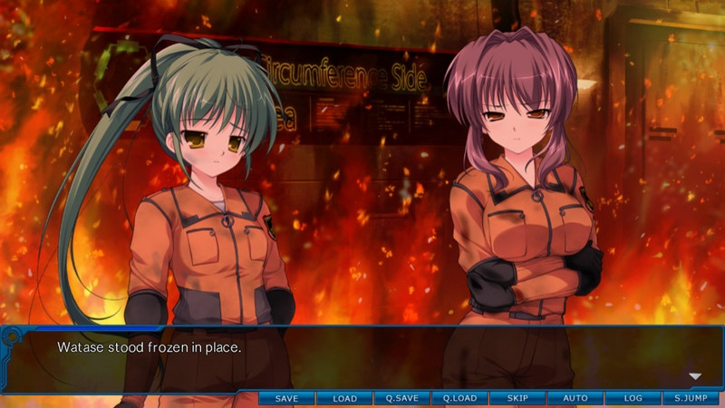
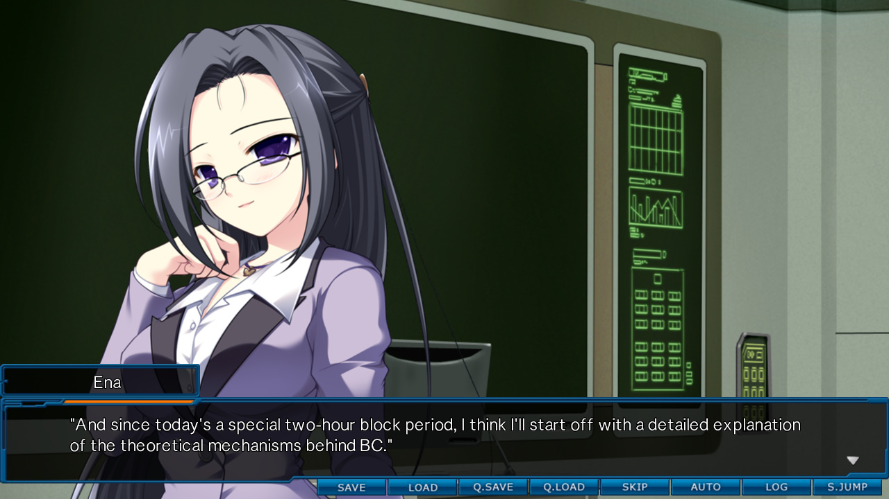
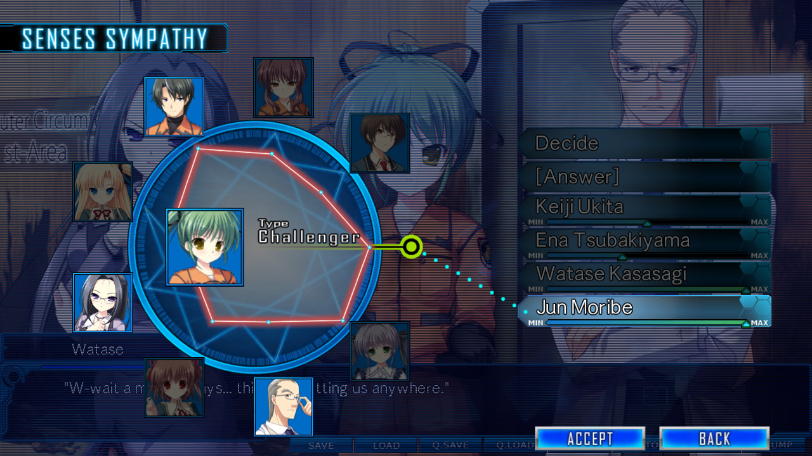
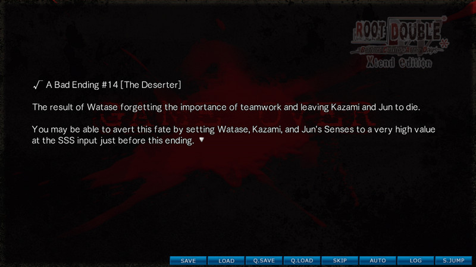
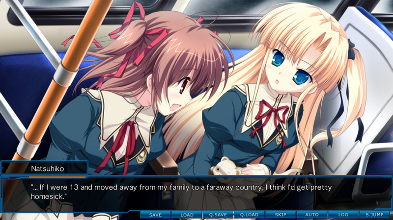
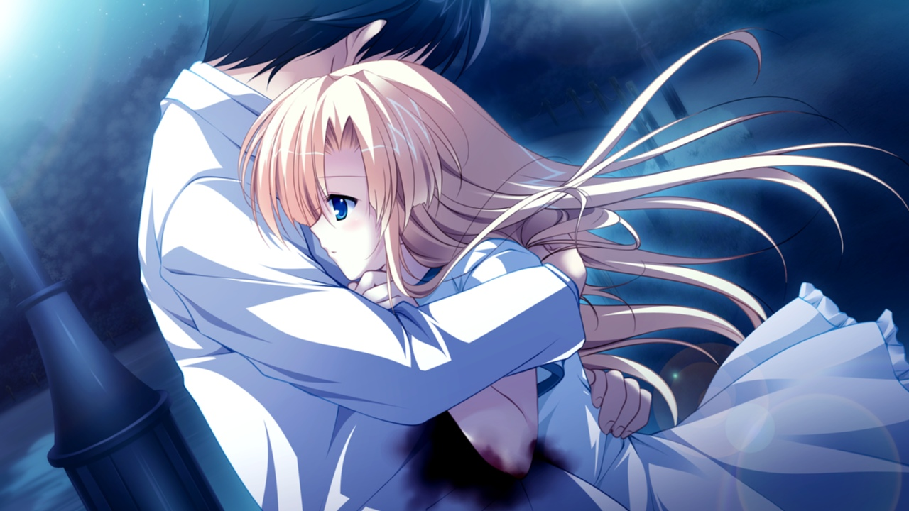
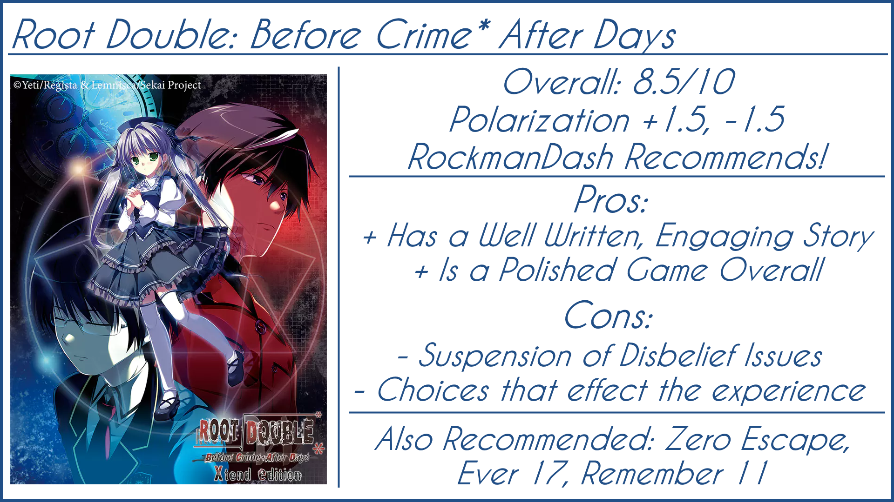

---
{
	title: "RockmanDash Reviews: Root Double: Before Crime * After Days [Visual Novel]",
	published: "2016-06-06T19:19:00-04:00",
	tags: ["Rockmandash Reviews", "FuwaReviews", "Visual Novel", "Root Double"],
	kinjaArticle: true
}
---

<video src="./y3ltkdd1lm7kjpy4eevu.mp4"></video>

Trapped inside a facility with impending doom with no clear explanation why, having to escape in a set amount of time... It’s a tried and true premise, but every time a Visual Novel like this gets announced, me and many people get just as excited as the last time we saw it. Maybe it’s the writing, maybe it’s the staff, but it happens every time, and this phenomenon definitely applies to *Root Double - Before Crime After Days*, a Sci-Fi Escape Visual Novel written by Takumi Nakazawa of *Ever 17* fame. Can *Root Double* match the expectations that one of these fans may have, or is it a repeat of Nakazawa’s incomprehensible [*I/O*](http://tay.kinja.com/rockmandash-reviews-i-o-visual-novel-1563212529)? Let’s find out in this review.

Also, Before we start this off, I have to say thanks to the people who made this, especially Lemenscia Translations. *Root Double* is a Visual Novel that I’ve been looking forward to for a long time, and to see my favorite translation group become official translators through this game? Awesome. Keep up the great work, guys. They translate some of the most interesting Sci-Fi Visual Novels out there, and I’ll always be looking forward to a Lemenscia release.

If you want to watch this instead of read this article, you can see it in video form here:

<iframe src="https://www.youtube.com/embed/tijDZKAp_Ec"></iframe>

***

# Writing & Experience

 

Let’s get this out of the way: *Root Double* is a well-written work and definitely one of the best VNs available in the west (or on Steam), but this is almost to be expected—something you could have figured out if you looked into the staff of this work. With a great premise, interesting twists, well developed characters, and a phenomenally executed final route, this is definitely a Visual Novel that has a story that shouldn’t be missed, but before you start playing this game, you should know this fact about it: *Root Double* is a work that actively prioritizes the writing, but is fixated on its goal of making a great story to the point that the decisions it makes can hinder one’s experience of the work.

To understand why this is the case, we need to understand the premise of story itself and how it is executed, which is tricky given how much the plot of *Root Double* can diverge from its original premise. *Root Double* has a story that drastically changes throughout your course with it, with many changes in perspective on the situation and complete overhauls on how the basic premise is viewed. Given this, it’s fair to say unless a plot summary spoils quite a bit of the story, you’re not getting the entirety of it, so I’ll try to do my best to give you the gist of what’s going on, but keep in mind that your experience with the game may not match up with what I’m saying completely.

The story is set in the year 2030 in Rokumei City, centered on the events that occur during an incident in the nuclear LABO facility: On September 16th, LABO undergoes a nuclear meltdown, and to prevent leakage, the facility shuts down its doors. Unfortunately, this safety mechanism puts our cast of characters at risk of death due to excessive exposure, as they are trapped inside the facility. Of course, they have to try to survive and get out before they all die, but the story is much more than just an escape story: throw in aspects like insanity, ESP, traces of a different meaning of LABO, a world that has drastically diverged from our current worldline, et cetera, and you have a game that has a rather interesting and engaging story and world. These factors makes the premise of the game more about what we do not know than what we do know as we question why the events in the story occur, why the characters in the facility are there, how the events relate to the characters, and the truth behind the facility. These questions make up the essence of the story and this adds so much to one’s engagement and experience of the game.

While malleable, it’s a premise that works exceedingly well - interesting enough to get you hooked into the world, while being flexible enough to do a vast amount of things with the story. *Root Double* is an ambitious one, and it tries to do a lot: it tries to play around with unreliable narration, it deal with the nature of society and racism, it questions what it truly means to be human, it deals with people on the brink of insanity, it shows how the will to survive affects how people react, it goes through how much you can trust others given the situation, etc. It does a lot, and while this giant list may seem intimidating and may make you think they packed too much for it’s own good ala *Rewrite*, *Root Double* generally does a great job integrating its thoughts into the story, even though that demands a lot from both the reader and the writer. Every idea it tries to float around is solidly integrated into the story, with the biggest example being the Senses Sympathy System, which essentially integrates trust into granular controls for the decision making process. It’s a premise that enables an idea and plot-focused story that is rather engaging and intriguing, one that will hook you in and serve as a great example of a work in this genre.

For those of you who haven’t experienced the staples of Sci-Fi VNs through the [*Infinity* and *Zero Escape*](http://rockmandash12.kinja.com/rockmandash-reviews-infinity-zero-escape-marathon-w-1664979798?rev=1465255392639) series, what you can expect from *Root Double* is a story primarily based on mystery and tension, handling them with a specific style that is distinct in comparison to other VNs and mediums. It’s a thrilling and engaging style of writing, with an emphasis on aspects relating to the story and those attributes I mentioned earlier, and it utilizes the medium to its fullest potential, implementing perspective in a way that is near impossible to achieve in other mediums.

For those of you who have played these games, you’re going to be right at home with *Root Double*, as they have a very similar style, given the people who made them and the premise itself (like the return of an evil pharmaceutical company , lol), but *Zero Escape* diehards may be a bit disappointed as it’s a lot like the works in the *Infinity* series, for better or for worse. What this means is the story in general isn’t as tight as *ZE*, and out of those two aspects of mystery and tension, the story is lot more mysterious than tense, and there’s a fair amount of slice of life that, while making the world more immersive, also detracts from the strengths of the story. It’s important to keep in mind that while you may have personal preferences to *Zero Escape* over the *Infinity* series for the most part, neither is worse than the other; it’s just different. Each style has its own strength, like how Nakazawa’s style emphasises characters more than Uchikoshi’s style, for example.

*Root Double* is a game that provides an engaging immersive experience that I wish every visual novel could do, being interesting and exciting to the point that one feels compelled to do nothing but continue on, as the mystery and intrigue sucks you in and keeps you engaged. It was a blast to go through the mystery of the game, it was awesome to see these plot elements unfold in the way it did, the atmosphere was absolutely a blast… I could go on all day explaining why this visual novel is so great to play, but that would take forever, so I’ll say this: The general experience of the game is like getting into a great book that you don’t want to put down, and this is what I personally look forward to in every visual novel. *Root Double*’s experience in general is pretty awesome, and I really had a great time with the VN for the most part.

That being said, the style of the story and decisions regarding the experience that was made in *Root Double* adds some quirks to the game, some being positive, but many of them being a negative. This game can feel like it’s info-dumping at times, the structure occasionally makes no sense, it can be thematically inconsistent, and worst of all, this game has an Achilles heel, as it struggles to keep the suspension of disbelief in tact. The source of these issues? The decision to emphasize the story over the experience. This game is weird in the fact that many of the criticisms one may have during their playthrough of *Root Double* often contribute to some payoff later, which makes for a consistent story with an inconsistent experience—one that can take you out of the game and is just one example of what this game does. Another is in the second route (√B), while mostly a slice of life route, but it flip-flops between two different times, one past and one present, while the one in the past slowly approaches the time in the present. In the context of the experience, the best way to do this would be to be a linear chronological experience that is consistent, but they went back and forth because they wanted to execute a specific plot twist. This twist was absolutely fantastic, but they could have executed it better in a way that did not compromise the experience, and as is it was not worth the expense to the experience.

The other aspects listed are just annoying, like literal exposition dumps in the form of class lectures on topics that pretty much everyone knows about, instead of the aspects that aren’t common knowledge or something they made up. I don’t need an explanation of what nuclear radiation is, nor does anyone else in the modern world. Anyone playing this should have an idea of what it is; we don’t need a lecture on it. The explanations on aspects like BC (which is the mechanic that the story revolves around) though, are potentially even worse because they are an example of how this game can break suspension of disbelief as they are pretty much unbelievable. This game portrays a realistic world, one that seems to be a potential route to our current world, but due to how they time the events in their history (and some of the aspects revolving the science itself... Just don’t think about it.), the work breaks one’s suspension of disbelief. There’s more examples of suspension of disbelief breaking like the fact that in 2030 [*it would be unusual to use the internet*](http://www.animenewsnetwork.com/answerman/2016-05-23/.102406), these issues probably won’t ruin your experience, but it can definitely take you out of the immersion of the game and influence it.

In this context, *Root Double* is an interesting work: it does a lot right in the writing department, but its fixation on the story negatively influences the experience. I’ve been pretty excited for this, expecting it to fill the void of Sci-Fi VNs as I wait for *Zero Time Dilemma*, and while *Root Double* provides a solid experience overall, being engaging, interesting, and compelling, it’s the little things that keep a game from greatness, and in this game, there are definitely things that keep it from reaching its true potential in the experience aspect.

***

# Gameplay

 

While most Visual Novels have very limited gameplay in the form of selecting options, *Root Double* does a bit more than through the [Senses Sympathy System](http://www.siliconera.com/2016/04/28/guide-story-emotion-not-choice-root-double-crime-days-xtend-edition/), which is (as mentioned previously) a form of gameplay that integrates the themes of trust into your decision making process. On the top-right corner, there exists a little hexagon for this system whenever you need to make a choice, and whenever you use it, you need to dial a sense value on a slider based on how much you trust each character and how much emotion and awareness you think the characters need to have. While doing this, you also need to consider the importance of the decision, which is indicated by the color of the lines, with blue being not that important, yellow being a caution and red being a life or death situation. That being said, while it’s well-integrated into the game, looking nice and adding to the story, as an aspect of gameplay, it is essentially a glorified and overly-convoluted choice system that is more frustrating than enjoyable. This is due to some flaws that are fundamental to the nature of the system; attributes that make it unclear what you’re doing. You are just picking a value from min to max, you never have any idea on what your value does, and it’s flat-out inconsistent at times, combining senses, emotions, trust, et cetera, into one system in a way that is impossible to know what any of it does. This makes the decision-making process flat-out frustrating at times, and while this system seems cool from an outside perspective or a story perspective, it’s another example of story over experience, a frustrating system that *Root Double* probably would have been better without (and kinda is, given that you can go through regular decisions after you finish the true routes of the respective route you want to go through).

That being said, this is a Visual Novel, and the selection mechanism isn’t the only the only important aspect of the gameplay, as route structure is just as important to the game as any other attributes that are considered gameplay. Like Nakazawa’s previous works (*Ever 17, I/O*), *Root Double* doesn’t particularly go with a typical VN structure that you are used to, but this is a bit more traditional than those. This game is broken up into five separate routes,√A through √E, in a linear fashion. For your information,

* √A is a mystery route, following Watase Kasagi as he tries to go through the events and regain his memories. It’s a pretty big route and most of the enjoyable bad ends are here.
* √B a slice of life/answer route, following Natsuhiko Tenkawa as he goes through the events of the incident as well as his life the week before, which explains a fair amount of why certain things are happening as well as the concept of BC, which is a core part of the story but is definitely spoiler territory.
* √C a transition from √B to √D, being a rather short route with not much memorable here.
* √D being an answer/true route, the route that converges all of the above while going further into the story, the most important and most interesting one.
* √E serves as an extra route, showing you the epilogue content that you may have unlocked.

They’re all solid routes and the way they interact together structurally is solid, but there’s a weird quirk with them: You really should be going from √A to √E linearly, but the game gives you an option to start from √B, which I highly recommend you not to do. Also, each routes have their own bad ends that are independent from the other routes and the decisions you make in them. The bad ends are some of the best I’ve seen, so I highly recommend you check them out. Also, the game has some nice touches, like the fact that the game automatically quicksaves which makes the experience that much more hassle free and it can tell you how to get back to where you’re supposed to similar to Taiga Dojo from *Fate/stay night,* so even though the game can seem to be frustrating due to the weird choice system. the gameplay experience is not too bad overall.

***

# Presentation

 

*Root Double*, as a work that focuses solely on the story, has a presentation that serves to present the story to you; nothing more, nothing less. At no moment in time can you point to *Root Double* and say that it looks particularly bad, but I’d be hard-pressed to say that it was overly impressive, either. (There’s a few scenes that come to mind, of course). In general, the issue with this game is that it’s not all that inspired when it comes to visuals, serving up a nice, but uninspired, anime style. Given that *Root Double* was made in 2012, the Visuals some of the sharpest and cleanest out there because it’s much more modern than most VNs, but if you’ve played a modern Sci-Fi VN or seen a Sci-Fi anime in the past few years, you probably have a good idea on how this looks. *Root Double* represents the atmosphere and setting well, but the visuals aren’t a standout feature of the game and only serves to do its job for the most part.

I’d say the sound of this game follows the same philosophy as well, managing to do its job, but only to enhance the story. While the music is pretty solid all around, never sounding like it’s out of place or irritating (like the visuals), most of the OST is slice of life or atmospheric, which doesn’t sound that particularly interesting. However, *Root Double* makes this rather tolerable as the soundtrack is one that is used better than it sounds. The music makes its mark, being effective at getting you to feel the emotions of the story, and being noticeable to the point that it seems like it seems could stand alone by itself because of how solid it sounds, but for the most part it fails to do this outside of the game or be that interesting. Of course when the score decides it wants to do something engaging and serious with it’s music, it does it extremely well like with “Rondo Carrousel” above, doing a great job in making an immersive atmosphere, getting you interested in the work, and keeping you engaged with what it has to offer, but in most cases it just does its job. The soundtrack adds a lot to add to the work, but overall it is just another tool in the toolbox for the story.

***

# Conclusion

It’s not often you see a work that prioritizes one thing over everything else, and it’s even more unusual to see that it’s prioritization lead to a worse experience, but *Root Double* is this game, and it’s almost disheartening to see it that way. That being said, while this review may sound harsh with the incessant hammering on aspect of story over experience as it is a key aspect of the game that went wrong, *Root Double* overall, as a work is truly a great game, even if it has flaws that can seem to be rather apparent. With an engaging, interesting, and compelling story, *Root Double* is a game that is absolutely worth playing through, and one of the best VNs that Steam has to offer. This game is definitely worth your time, but just be aware that it has its fair share of issues like suspension of disbelief breaking and exposition dumping that may just keep it from greatness to many.

**Overall 8.5/10, Polarization +1.5, -1.5**

***

**Copyright Disclaimer:** Under Title 17, Section 107 of United States Copyright law, reviews are protected under fair use. This is a review, and as such, all media used in this review is used for the sole purpose of review and commentary under the terms of fair use. All footage, music and images belong to the respective companies.

*You can see all my reviews on *[*Rockmandash Reviews*](http://tay.kotaku.com/tag/rockmandash-reviews)*. For An explanation of my review system, *[*check this out*](http://tay.kotaku.com/rockmandash-rambles-an-explanation-on-my-review-system-1619265485)*.*
