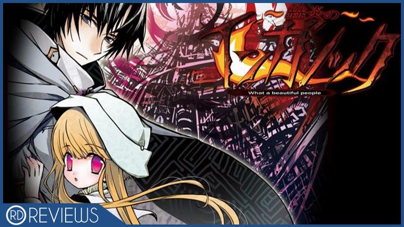
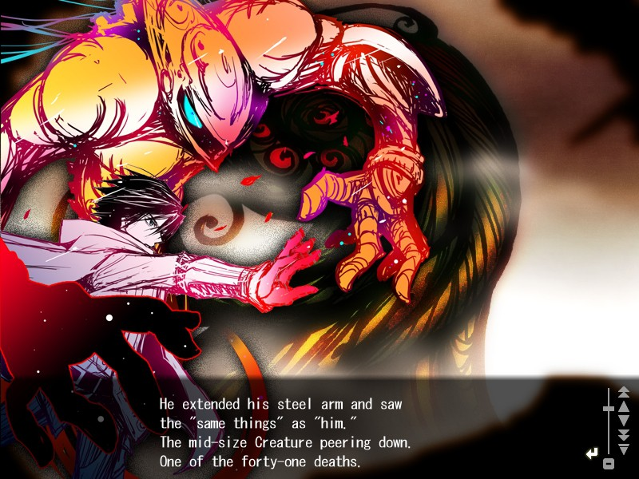
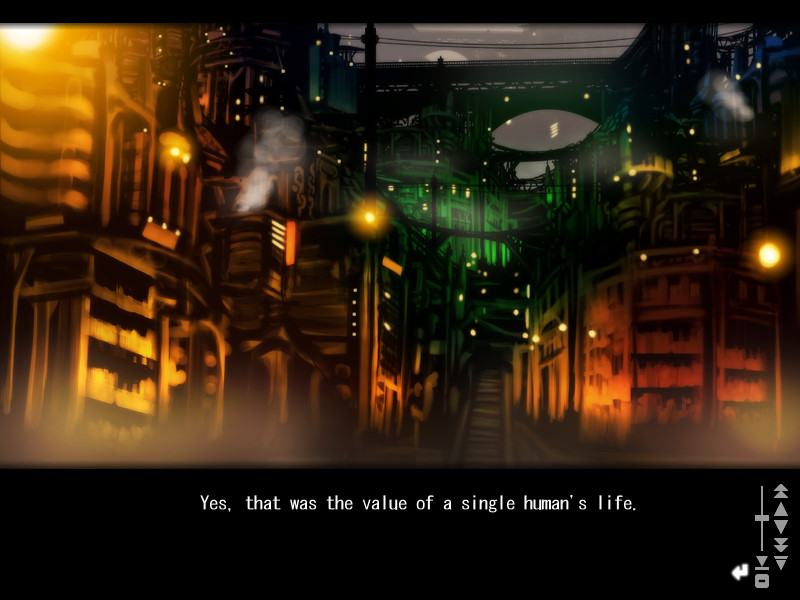
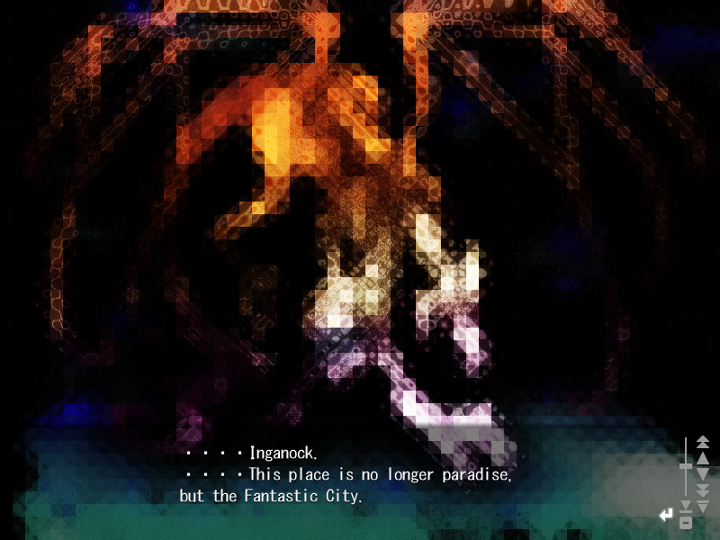
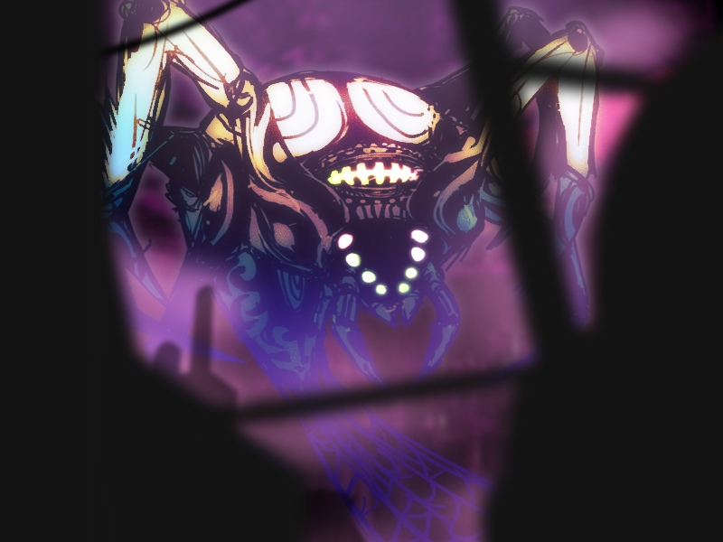
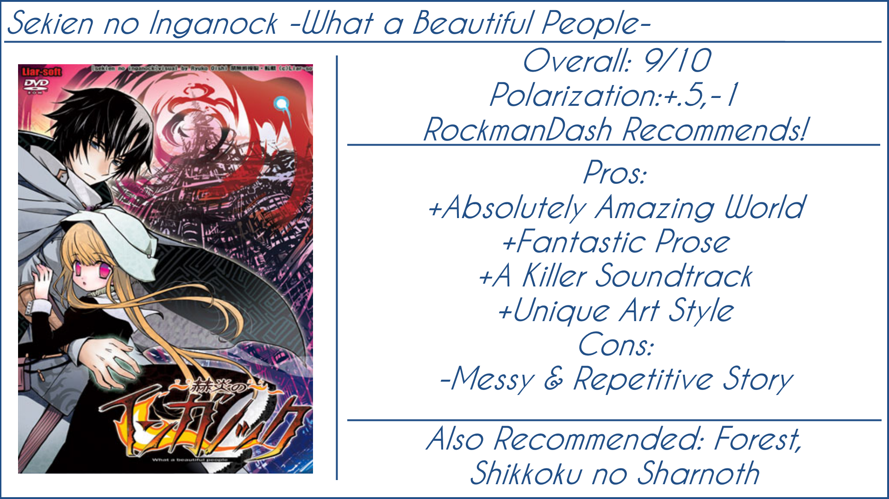

---
{
	title: "RockmanDash Reviews: Sekien no Inganock [Visual Novel]",
	published: "2016-06-28T12:00:00-04:00",
	tags: ["RockmanDash Reviews", "FuwaReviews", "Visual Novel", "Sekien no Inganock"],
	kinjaArticle: true
}
---

What is the purpose of a Visual Novel? Is it to make you absorbed into another world, is it to engage you into an interesting narrative, or is it just to make you have a great time? There are all things that a Visual Novel should strive for, but when a work has all 3, you have a masterpiece on your hands, something beautiful, entrancing, amazing. *Sekien no Inganock*, the second game in the *What a Beautiful* series by Liar Soft is such a game, but this work is not without its faults, a flawed masterpiece.

Before we start though, I need to say that if any of you are worried about the fact that *Sekien no Inganock* is the second game in the *What a Beautiful* series, don’t be. Yes this is the second game in the series, but from what I’ve heard (I’ve only played *Inganock* so far) this is the best to start at as the first game in the series is nowhere near as good as others like this game, none of the stories are directly related, and this is the first one translated to English. If there’s a starting point in this series, this would be it, and from my experience it was a fantastic starting point.

 

**Immersion:** While it may seem like a buzz word to you, when you’re trying to explain an experience, the word immersion becomes more than that, a necessary part of the discussion itself. This is due to the fact that the aspects of immersion like the feeling of being entranced in a world or being hooked into the narrative of certain characters are real aspects that play a significant role in your experience. In *Sekien no Inganock*, the way that they handle this aspect may just be the first thing that will catch your attention, being one of the defining traits of this game. This is because this visual novel absolutely nails the feeling of being in another world as every attribute of the work like serve to create one amazing and cohesive experience, allowing you to lose hours without noticing it. This all starts with the interesting premise, as game sucks you into the bizarre and unusual city of Inganock, a city located in a steampunk world isolated from the rest of the world due to the infinite fog that surrounds the city. The source of the infinite fog? A great accident that occurred 10 years before our world started, an accident that caused 41 “Creatures” to kill massive amounts of people while spreading mutations and diseases throughout the city. In the story we follow, this results in a strict hierarchy of society with the rich trying to isolate themselves and a slum full of people that are mutated to be part human part animal and many diseases that can’t be cured with traditional means. We see all sorts of these as we follow Crack doctor Gii and the enigmatic Kia as they travel to help as much people as they can while managing to get in the center of the events that dictate this crazy city.

*Sekien no Inganock* uses this interesting presence to tell you a tale of a dystopian fantasy, that is so distinct and unique that you can’t help but be fascinated with what this work has to offer. The city is in an absolutely horrible shape, and this story gets you engaged and immersed into this city to the point that it almost feels like you live there. It’s really easy to get invested, getting you curious about the world, curious about the characters, curious about everything it has to offer. How does it do this? Through excellent world building and prose, in a fashion that reminds me of Tolkien, creating a mystical and engaging world that’s unlike anything else you have seen. We experience the story through the eyes of Gii, but this story is both a story about the characters that participate in it and the city itself, handled in a way that gets you invested in what it has to offer. *Sekien no Inganock* may not seem to be your traditional Tolkien-esque high fantasy, here is no doubt in my mind that the world that exists in is equally as fantastical, and just as amazing. How many times can you say that you’ve played a game that has transplanted you into an immersive, engaging world that is totally unlike anything you’ve seen? Well, this game offers it, and it’s one of the few that do so. Personally speaking, It’s something I look for whenever I play a game, and whenever it’s this prominent, I can’t help fall in love.

Just as prominent as the way they meticulously construct the world is the fantastic handling of language, with beautiful and captivating probably being the easiest way to describe the prose of the work, the style everything is said. The word choice, the sentence structure, the way that the words capture the essence of the situation, all of this is absolutely fantastic... but the writing of the work isn’t perfect, a problem seemingly coming out of nowhere to ruin a nearly perfect work. This is because when dealing with writing in a work, there are two main aspects that affect your experience: the narrative and the prose. In Liar soft’s efforts to make a beautiful work of literature, they focus more on the artistic merits of the work over one’s experience, the narrative struggles. From a repetitive structure that makes a large chunk of the game feel like filler, and a lack of explanation about very important aspects of the story, and an ending that doesn’t provide any closure ([though the web novels over at Amaterasu do help a bit](http://amaterasu.tindabox.net/webnovel/Inganock%20Webnovel%20Files/ing_novel0201kgpb.html)) leads to the story as a whole being not the most amazing to experience. It has its strong points like great character interactions and strong character focused stories that make an impact early on, but as an experience as a whole, it could be better. This is the type of work that usually wouldn’t be my cup of tea, but even though this work is oriented in such a way, the strong points of the work outweigh the negatives to create a compelling, engaging, beautiful work. They crafted an amazing work that compels you to go on thanks to the interesting character reactions, and the amazing world, but the anticipation it builds thanks to it’s quality package just doesn’t deliver in the end. Overall though, the experience was pretty great thanks to the immersion and prose, but the story itself lets the writing a bit down. I can’t feel left a bit disappointed because of it, which is a shame.

Also, it’s worth noting that this is an Eroge (thanks Japan), and while I think the story probably could have been done better without it because they can be jarring, they actually are integrated into the story, adding to the relations of the characters. Its inclusion makes it harder to take seriously as a work of art as it tries to be, but at least it’s used well.

 

If the writing was art, the art… is art, with your screen being a beautiful canvas waiting to be filled by drawings that draw you in. Just looking at the art can make an impression on you, and combined into a work that is focused on immersion and world building, the art stands loud and proud being absolutely beautiful. The work feels ethereal, out of this world, a beautiful and engaging imagining of a horrific world that captures your attention regardless of whether you want to or not. Liar soft and especially some of the games in the *What a Beautiful* series has an art style that is ethereal and lively, with sharp lines, over emphasized with bright colors that looks like art, looking like a watercolor masterpiece at one moment and a work of art straight out of a sketchbook in another. There’s nothing quite like the art style that they present in this work, and it all helps to create a work that’s out of this world. Add in great character designs, and this game can look great. It’s a unique art style though, and you may not be a big fan of it at the beginning, but when it’s used well, it can really grow on you. Combine that with one of the best scores in the game, and you’re left with a distinct and unique combination that make this game something special.

With 18 tracks to this game’s name and a length of 10-30 hours, you may think this soundtrack isn’t anything special, but if you asked me to make a shortlist of VNs with a phenomenal soundtrack, this game would probably be on that, with a soundtrack that draws you into a beautiful world, a soundtrack that captures the emotion of the work extremely well, being elegant, memorable, beautiful, otherworldly, and a joy to listen to. I have nothing but positive things to say about this score, sounding great and being well executed in the game, fitting every situation the game calls for. It adds that extra layer of immersion into the game and it really is the stepping stone that transplants you into the game. I love it.

*Sekien no Inganock* is a flawed masterpiece, a visual novel that provides a beautiful, immersive experience with some of the best prose that the medium has to offer, but it’s held back by a story riddled with issues. It’s a beautiful game that you’ll be hooked on for days, but just keep in mind that it fails to pay off in the end. Overall though, *Sekien no Inganock* is absolutely worth a play, with little quite like this out there. Definitely give it a shot.

***

**Copyright Disclaimer:** Under Title 17, Section 107 of United States Copyright law, reviews are protected under fair use. This is a review, and as such, all media used in this review is used for the sole purpose of review and commentary under the terms of fair use. All footage, music and images belong to the respective companies.

*You can see all my reviews on *[*Rockmandash Reviews*](http://tay.kotaku.com/tag/rockmandash-reviews)*. For An explanation of my review system, *[*check this out*](http://tay.kotaku.com/rockmandash-rambles-an-explanation-on-my-review-system-1619265485)*.*
