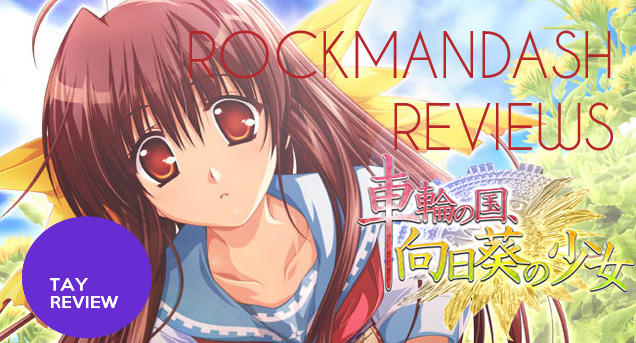
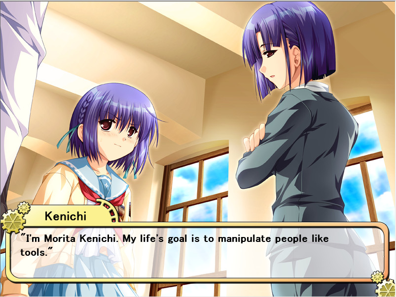
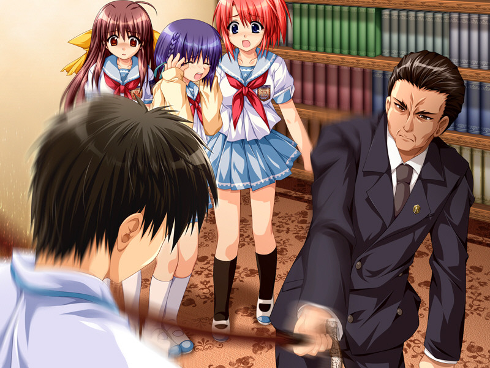
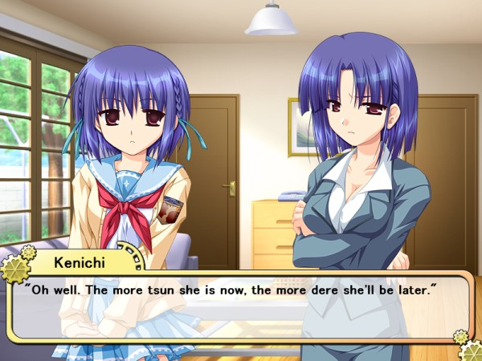
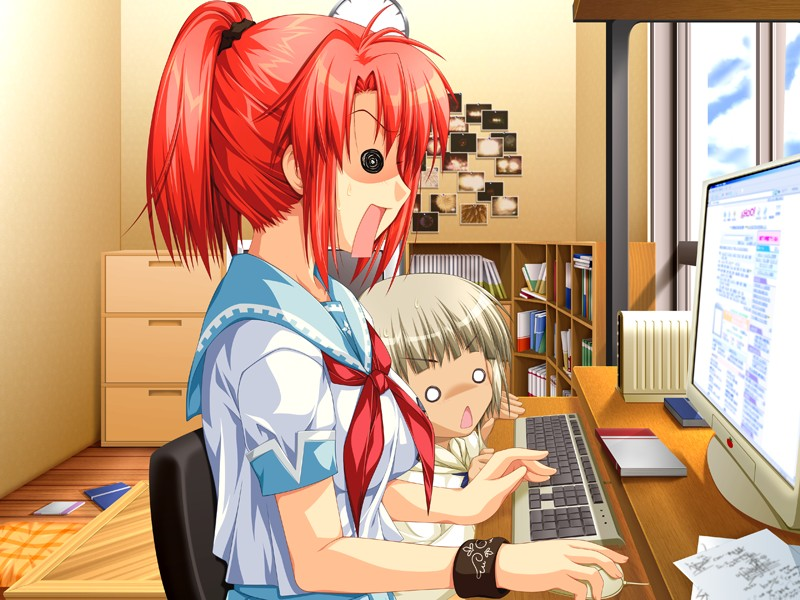
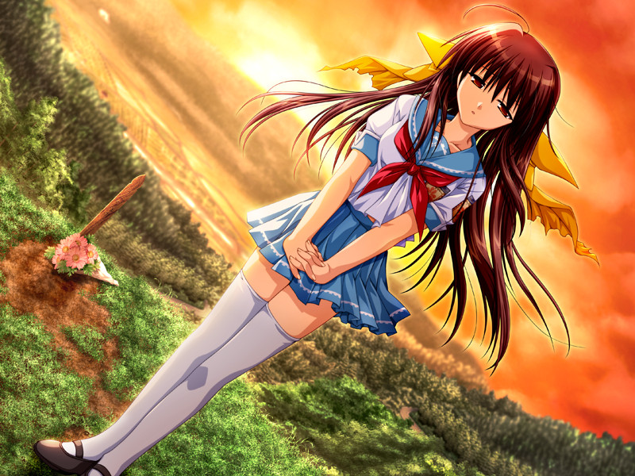
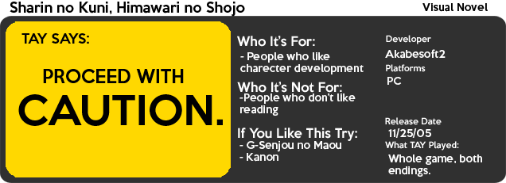

---
{
	title: "Rockmandash Reviews: Sharin no Kuni, Himawari no Shoujo [Visual Novel]",
	published: "2014-03-28T20:30:00-04:00",
	tags: ["rockmandash reviews", "sharin no kuni", "visual novel", "ani-tay", "review", "rockmandash12"],
	kinjaArticle: true
}
---

Welcome to Rockmandash Reviews! After I finished the amazing [G-Senjou no Maou](http://tay.kotaku.com/g-senjou-no-maou-the-tay-review-1524540625), I looked to see if there were any similar games to help fill that void. What I found was a game called Sharin no Kuni, Himiwari no Shoujo, another game also made by Akabesoft2. I was so sure that it was going to be amazing that I recommended it in my [Beginner’s Guide to Visual Novels](http://tay.kotaku.com/the-beginners-guide-to-visual-novels-1541975662) article, and in my G-Senjou no Maou review without even playing it. Now that I’ve actually played this game, what do I think of it? Let’s find out in this review.

I’ll say this at the very beginning. This is not a G-Senjou no Maou clone, it does things very differently than G-Senjou no maou. It’s a much slower game, with a more slice of life pacing. Not much actually happens in the game, as the game spends most of the time character building and talking, so if you are looking for another mystery thriller, look somewhere else. It’s light hearted for the most part, but it can be quite deep.

What this game does have in it’s benifit is a very unique scenario, one you probably find in a game like this. In an unknown country that is not japan, all all aspects of society in this country are influenced by an elite stratum of people known as “Special High Class Individuals.” The best way to think of Special High Class Individuals is to imagine a renaissance man who was amazing at many skills, but with judicial and political power. It’s quite an interesting premise. The main character Kenichi Morita is a Special High Class Individual Cadet, and he needs to pass a final test to actually become one. His final task is to get rid of “obligations” of 3 girls in his hometown that he left from seven years ago. An obligation is a punishment for a crime, kinda like how you go to jail if you kill a person, but instead they have to deal with specific restrictions. An example would be with Sachi, who can only stay up 12 hours due to staying up and gambling online. It’s a very great setup that creates an interesting world and keeps the story interesting. The fact that each arc has a well done, unique message adds so much to the story, and it’s great.

One thing that I’ll continuously praise *Sharin no Kuni* for is the amazing character building that this game has. It’s very rare that you get a cast that’s as likable as this one. *Sharin no Kuni* spends most of it’s time making the characters great, and it definitely succeeds in making a lovable cast. Kenichi Morita is a very interesting character because of the issues with his past, and how he has a totally different personality cloaked by an arrogant exterior. his habit of breaking the 4th wall is very interesting also. Learning about his past is a big incentive to go on in the game, but discussing why would be spoilers so I’m going to avoid that. The 3 girls with “obligations”, Sachi Mitsuhiro, Touka Oone and Natsumi Hinata are pretty enjoyable as well, with each character going through insane amounts of character development in each chapter. I was a big fan Natsumi’s chapter, as that’s when shit hits the fan, but her almost turtle-like protectionism from a bright character was a very interesting arc. One character that has to be mentioned is Masaomi Houzuki, the Special High Class Individual overlooking Kenichi. He’s cold, harsh, and manipulative but understanding. He’s really something else, definitely a character you would not expect. The other supporting characters are pretty good also, as the game as a pretty concise cast, and they are all executed well.

While it does many things well, the story does have quite a bit of flaws. This game relies on your opinions on government to keep you interested, and it did for the most part, but at times it came out very preachy, with some themes that was forced out. Also, I thought the world building could have been much better. They mention interesting things in the world, but never develop it. The worst part about the world building was how fixated it was on Japan... and it didn’t even give the name of the country it was set in, which just rubs me the wrong way.. but this isn’t even the worst bit of sharin no Kuni. The biggest problem with this is in my opinion is twofold: the story doesn’t really pick up until Natsumi’s arc in chapter 4, and it’s slice of life can be excruciating especially if you are like me and just want to see the more exiting parts of the game. It’s a well written and unique story, but I believe that it could have been executed better.

# Writing - 8/10

 

*Sharin no Kuni’s* visuals are pretty similar to *G-Senjou no Maou*, as it runs on the same engine with good character art. The visuals are pretty nice and there’s nothing glaringly bad, but it can be improved, as we once again meet the dreaded 800x600. The character art is pretty good, and some of the background art is really nice, but a lot is left to your imagination sometimes. The game looks pretty good, I just really wish it was in widescreen HD. It’s pretty nice in general.

If there’s one thing that kills it though, it’s the H-scenes. Once again, I’ll pull the obligatory warning for these types of games. **WARNING THIS IS AN EROGE MEANING IT HAS ADULT CONTENT. IF YOU ARE NOT A FAN, THEN YOU SHOULD SKIP THE SCENES.** Seriously. They shouldn’t be here. They don’t add anything to the story, and they are annoying.

# Visuals 8/10

Sharin no Kuni has a solid soundtrack, but it does have some flaws. The biggest issue is not the quality of the songs but the quantity of them. The songs themselves are well composed and help the mood, but Sharin no Kuni needs more variety. You hear the same few tracks over and over again, and it’s pretty disappointing. The usage of the tracks is also not the greatest in the world, but the tracks themselves are pretty good. As for the voice acting, it’s pretty good, I have no gripes with it.

# Sound - 8.5/10

 

I have a bad habit of reading reviews as I work on my own reviews and before I play the games. Many of the said reviews praise Sharin no Kuni like there’s no tomorrow... and here’s where I’ll disagree with a good majority of people who reviewed this game. I didn’t think it was amazing, and there were some parts where I was flat out bored. My problem is that it’s just not interesting for the majority of the story. The slice of life lasts too long, and it’s not the best in the world. What will make or break this game for you is pacing and the political speak...So if you liked G-Senjou no Maou and you can get over the difference in writing style, then you’ll like this game. Personally? I was kinda disappointed with Sharin no Kuni. Maybe I came in with the wrong mindset? Don’t get me wrong, it’s not bad, it’s just kinda disappointing and not my cup of tea.

# Enjoyment - 7/10

Sharin no Kuni is a good game, but it was nothing like what I was expecting. It’s another good Akabeisoft2 game, but if you came in here expecting G-Senjou no Maou, you won’t get that. It’s a game with great characters and a great premise, but it could be better. If you can get over the problems it has, you’ll like it.

# Overall - 8/10 Polarization +1.5, -.5

 

**EDIT** - weedlayer was kind enough to tell me that there’s actually 5 endings, with each charecter having their own ending.... woops! I only played the last 2, so I guess I haven’t really 100%ed the game. Sorry :|

***

**Copyright Disclaimer:** Under Title 17, Section 107 of United States Copyright law, reviews are protected under fair use. This is a review, and as such, all media used in this review is used for the sole purpose of review and commentary under the terms of fair use. All footage, music and images belong to the respective companies.

*You can see all my reviews on *[*Rockmandash Reviews*](http://tay.kotaku.com/tag/rockmandash-reviews)*. For An explanation of my review system, *[*check this out*](https://rockmandash12.kinja.com/rockmandash-rambles-an-explanation-on-my-review-system-1619265485)*.*

This game is available on [*Fuwanovel*](http://fuwanovel.org/novels/sharin-no-kuni-himawari-no-shoujo) for download.

*Note: This review was updated on 9/26, fixing issues and wording things better.*
