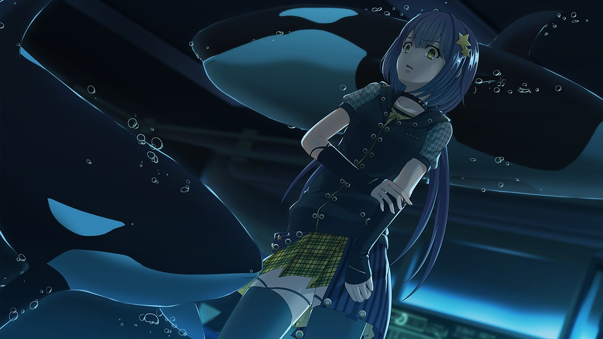
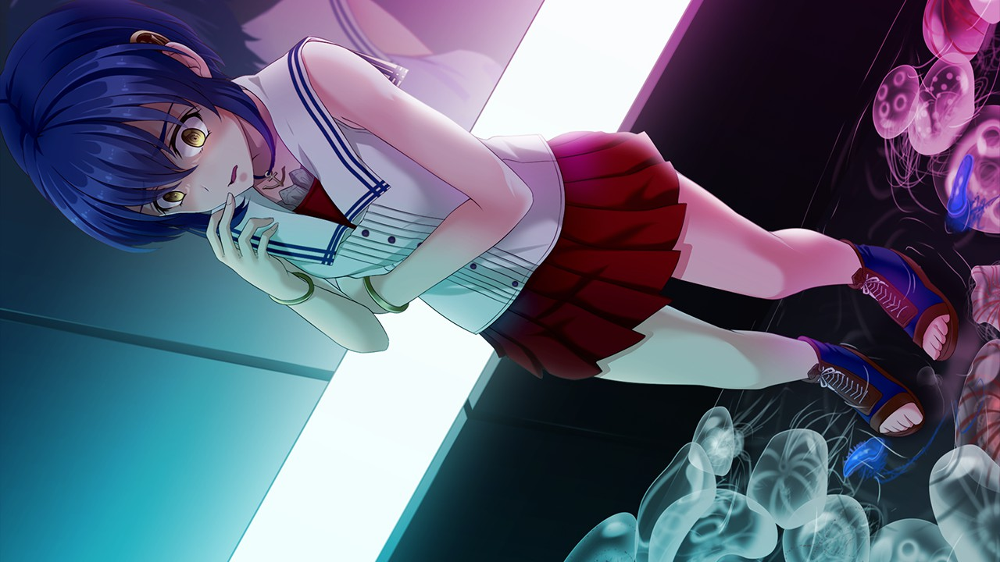
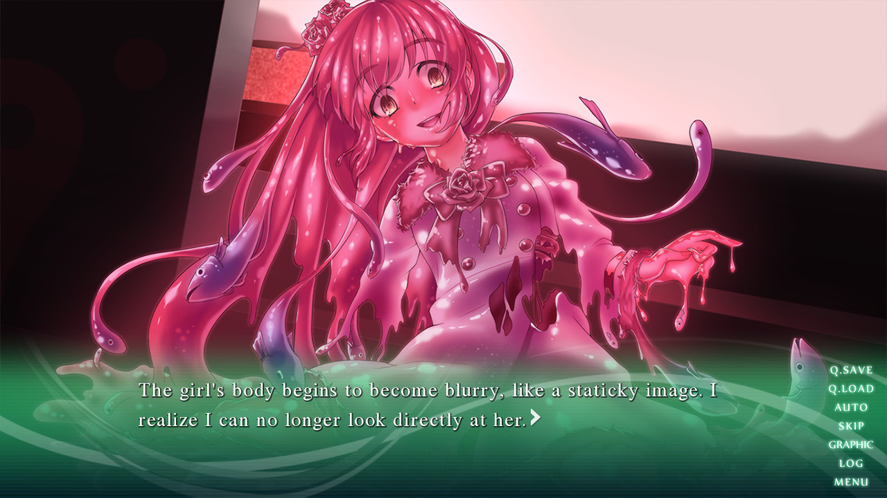
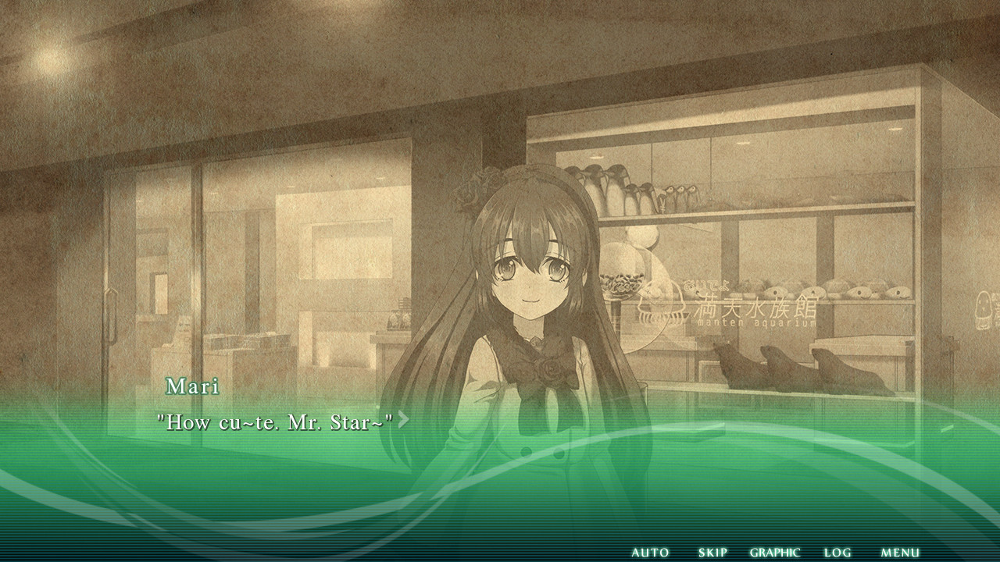
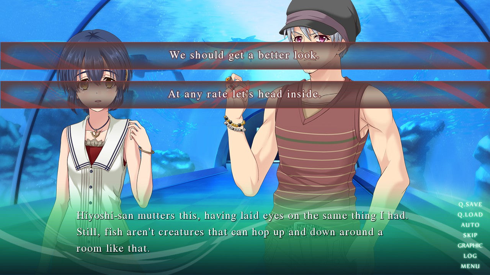
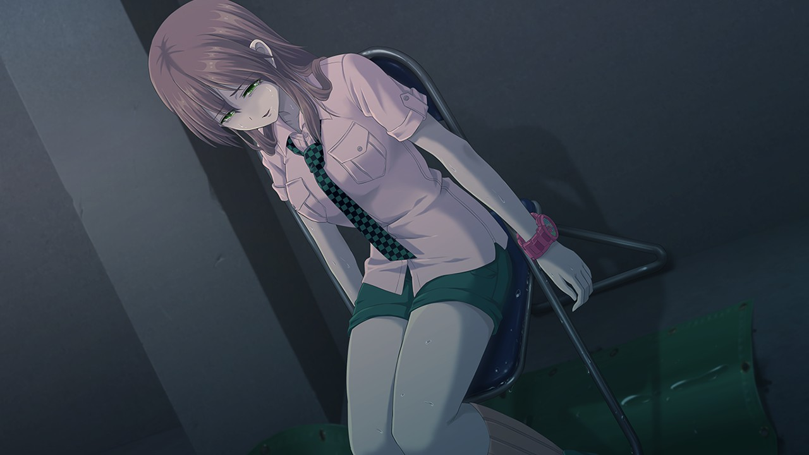
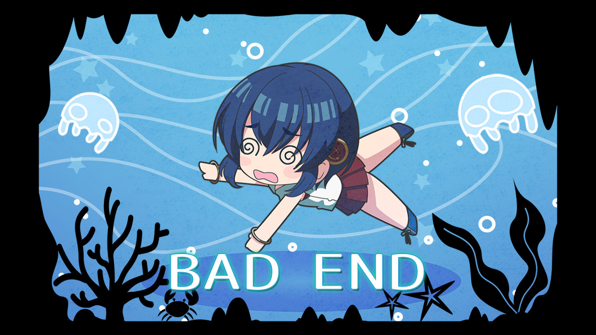
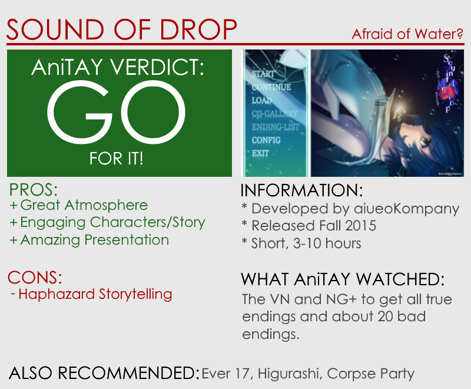

---
{
title: "RockmanDash Reviews: Sound of Drop - fall into poison [Visual Novel]",
tags: ["Rockmandash Reviews", "FuwaReviews", "Visual Novels", "AniTAY"],
authors: ['reikaze'],
published: '2015-11-10T23:00:00-05:00',
attached: [],
license: 'cc-by-4',
oldArticle: true
}
---

<video autoplay="" loop="" muted=""><source src="./1513818381270733093.mp4" type="video/mp4"/></video>
How do you deal with lingering feelings, dripping into your soul like poison? Do you face
  them, or in your attempt to swim, do you sink? <em>Sound of Drop - fall into poison </em>is a mystery horror VN that
  deals with such themes, and<em> </em>does it’s best to make a great experience... but is it enough?

Even though it’s being
  overshadowed by other VN releases, I’d say so, as it’s pretty good. 

The premise is rather strong: In the beautiful Manten Aquarium, there lies
  something deeper under the beautiful tranquil surface that it has, a tragedy that our main character Mayumi has been
  avoiding for years. You see, 5 years ago, her younger sister Mari mysteriously disappeared in this aquarium, and
  Mayumi’s life hasn’t been since... but thanks to her best friend Himeno who is determined to learn about the rumors
  that are spreading, Mayumi heads back to this aquarium. What awaits Mayumi however is nothing but horror, a twisted
  aquarium with everything she has to face and more, with everything out for lust and logic defying feats of insanity
  happening all over the place.

And it does this insanity well, as it is a horror game, after all. While the
  horror is usually your typical the jump scare affair, isn’t really that bad for the most part and can be genuinely
  effective at times (but it’s no <a class="sc-1out364-0 hMndXN sc-145m8ut-0 gIacKn js_link" data-ga='[["Embedded Url","External link","http://anitay.kinja.com/project-hydra-attends-a-corpse-party-for-tortured-souls-1668527219/all#_ga=1.9428919.389453316.1446074032",{"metric25":1}]]' href="http://anitay.kinja.com/project-hydra-attends-a-corpse-party-for-tortured-souls-1668527219/all#_ga=1.9428919.389453316.1446074032" rel="noopener noreferrer" target="_blank"><em>Corpse</em></a><em> </em><a class="sc-1out364-0 hMndXN sc-145m8ut-0 gIacKn js_link" data-ga='[["Embedded Url","Internal link","http://www.kotaku.com.au/2012/01/reader-review-corpse-party/",{"metric25":1}]]' href="http://www.kotaku.com.au/2012/01/reader-review-corpse-party/"><em>Party</em></a><em> or </em><a class="sc-1out364-0 hMndXN sc-145m8ut-0 gIacKn js_link" data-ga='[["Embedded Url","Internal link","http://kotaku.com/kara-no-shojo-the-kotaku-review-1486926848",{"metric25":1}]]' href="http://kotaku.com/kara-no-shojo-the-kotaku-review-1486926848"><em>Kara no</em></a><em> </em><a class="sc-1out364-0 hMndXN sc-145m8ut-0 gIacKn js_link" data-ga='[["Embedded Url","Internal link","http://kotaku.com/kara-no-shojo-the-second-episode-the-kotaku-review-1740205675",{"metric25":1}]]' href="http://kotaku.com/kara-no-shojo-the-second-episode-the-kotaku-review-1740205675"><em>Shoujo</em></a><em>). </em>The
  scenes are effectively written to create a sense of tension and really make the tone and atmosphere of this game work
  pretty well due to the great handling of tension and the horror of the world making the story moving and engaging.

Also, the reactions from the characters along with the insanity that comes with
  being in a twisted environment are great. The characters in general are pretty good too: while some (like the MC) can
  come off as flat at times, most of them get some really great development and are fleshed out to the point you can get
  rather attached to them and that they’re the high point of the story.

The story deals
  with it’s themes and subject matter rather well, taking it’s time to develop everything it needs to along and
  presenting to you in a decent fashion. It manages to get you to think about the themes it deals with like loss, making
  this more than just a thriller. It sets it’s premise well intrigue builds up and gets you really invested in the
  world.

There’s just one big problem with the story.... You see, <em>Sound of Drop</em>
  has a <strong>really bad habit</strong> of mentioning one thing then moving on haphazardly, using excuses to progress
  instead of explaining anything, even if what it has to explain is interesting and engaging. At times this means that
  the story is rushed, and at others it’s just a poor transition. You could chalk it up to the mystery aspect of the
  game, and I thought for a while it was because it was a mystery, but they just do a poor job at explaining nearly
  everything, from the surroundings around you. The explanation on the setting is uses urban myth as an excuse to the
  point that it’s not really believable, bad end happen extremely abruptly, there’s no real sense of flow between a lot
  of the scenes, etc. There’s so many examples in which it just flows poorly, doesn’t hint when it should or flat out
  fails to inform the player, which can potentially ruin the experience.

One of the worst offenders is how it handles transitions with endings, just kicking
  you back to the title screen without a word. Normally this wouldn’t be too big of a problem, but this game has a NG+
  because of the steam release, and the additions is a not an insignificant part of the game. I assumed I was done with
  the game, so I was about to go and write up this review until I checked the endings list and saw 3 more other endings.
  When I started the game again to look for those endings and other elements to use for my review, it threw me into NG+
  with a new opening without even telling me about the fact that there was an NG+, or if this was even an NG+. When I
  started the new prologue scene, I thought it was a second route from a different perspective and only learned it was
  an NG+ when I read online. The game never tells the players anything about this, and I only found it by dumb luck.
  With this game, you really never know what happens, or why it happens.

That is, until you actually go through said NG+. <strong>IF YOU GET THIS GAME, PLAY
  THROUGH NG+.</strong> While the regular ending is satisfying on itself, the added scenes in NG+ are <strong>REALLY
  GOOD</strong> and it fixes almost every flaw I had with the story. The sense of climax with a lot of the endings,
  including the first few routes feel rather artificial and forced, but with the NG+, such issues are gone. The story
  feels a lot more cohesive and it flows much better, everything is explained to the point that it’s really enjoyable,
  etc. Really, it’s written so well that it leaves your jaw dropped, it’s absolutely fantastic and makes the replays
  worth it.

So, even though while this story is an absolute mess in structure, <em>Sound
  of Drop</em>’s story isn’t a negative, with a solid story in NG+ and general that makes up for it’s flaws, proving to
  the world they have a good story.

When I read that the developers of this game aiueoKompany were indie, I was
  honestly surprised by that given the quality of the game and the visuals. <em>Sound of Drop </em>looks absolutely
  fantastic for an indie VN, and pretty much every aspect of it shines here: it has great backgrounds and absolutely
  beautiful artwork overall, detailed character art, CG that is varied and really adds to the experience, nice UI
  elements, a well done font, and the game is always a treat for the eyes. The best part about the visuals have to be
  how consistent and cohesive they are, helping to create an amazing atmosphere that really gets you sucked into the
  game. Really though, nothing but praise for the visuals of the game though, as it was done very well.

One odd thing I want to mention though is that unlike most VNs which is completely
  first person, this game actually shows the main character in the frame. It’s not a necessarily bad, just a bit weird
  because a lot of VNs avoid that and only show the main character in special occasions or to use it as a plot
  point. 

<iframe allow="accelerometer; autoplay; clipboard-write; encrypted-media; gyroscope; picture-in-picture" allowfullscreen="" frameborder="0" height="315" src="https://www.youtube.com/embed/mnFNMHM7-aw" width="560"></iframe>

As a game with sound in the name, one would expect a certain level of quality or amount of
  focus on that element. With <em>Sound of Drop</em>, the game continues to impress as it definitely delivers in the
  quality department, with one of my favorite soundtracks from a VN that i’ve heard in a long time. No seriously, <em>Sound
    of Drop</em> has a great soundtrack, with it’s extremely atmospheric and moody tracks that get you absorbed into the
  game and are a joy to listen to, bringing the game up to another level in enjoyment. The usage of the tracks and
  effects are great as well, and everything melts together to make a great package that compliments every element of the
  game. That being said, some people may be bummed that there is no voice acting, but I wasn’t bothered by it and the
  music experience was still great regardless.

As you can tell from this review, the experience has it’s ups and downs. Yes, the
  work is extremely flawed, with a story that frustrates and suffers because of it’s poor flow, but it’s not that bad of
  an experience because it nails the atmosphere, with it’s writing and presentation, keeping you engaged with the game.
  Even with it’s flaws, playing this game, and being in this world is really a pleasurable experience: Tension is high,
  the world is beautiful, everything blends together to make this a believable world, etc, I quite enjoyed my time with
  it.

It also does a lot of the little things right to keep the player enjoying the work.
  Take for example, this bad end screen:

<em>How can you say no to this adorable Bad End screen? </em>I love the bad end
  screens in this game, as it makes running into bad ends satisfying at times even though the act of doing so can be
  rather frustrating. There’s a lot of small things like this keep the game enjoyable, and all of this helps to make the
  experience great.

Also, the changes with NG+ were absolutely amazing, being touching,
  tense, engaging and made for a great experience. Just for that I’d recommend the game as it makes the experience
  worthwhile. 

<em>Sound of Drop - fall into poison </em>is a flawed game that has traits that are
  normally game breakers, but manages to do other things like having a great sense of tension in it’s atmosphere to keep
  it an engaging and enjoyable experience. Even with it’s flaws though, I wholeheartedly recommend it to anyone as it’s
  a horror game that’s moving and engaging, one that is definitely worthwhile to play and doesn’t deserve being
  overshadowed by others like it is.
<h3 class="sc-1bwb26k-1 fvCjqJ" id="h109598">Overall - 8/10,
  Polarization +.5, -1</h3>

<strong><em>Disclaimer: </em></strong><em>This copy of the
  game was provided by Sekai Project for the purpose of review. Also, Under Title 17, Section 107 of United States
  Copyright law, reviews are protected under fair use. This is a review, and as such, all media used in this review is
  used for the sole purpose of review and commentary under the terms of fair use. All footage, music and images belong
  to the respective companies.</em> 

<em>You can see all my reviews on </em><a class="sc-1out364-0 hMndXN sc-145m8ut-0 gIacKn js_link" data-ga='[["Embedded Url","Internal link","http://tay.kotaku.com/tag/rockmandash-reviews",{"metric25":1}]]' href="http://tay.kotaku.com/tag/rockmandash-reviews"><em>Rockmandash Reviews</em></a><em>. For an explanation
  of my review system, </em><a class="sc-1out364-0 hMndXN sc-145m8ut-0 gIacKn js_link" data-ga='[["Embedded Url","Internal link","http://tay.kotaku.com/rockmandash-rambles-an-explanation-on-my-review-system-1619265485#_ga=1.205141205.473183827.1418699279",{"metric25":1}]]' href="http://tay.kotaku.com/rockmandash-rambles-an-explanation-on-my-review-system-1619265485#_ga=1.205141205.473183827.1418699279"><em>check this out</em></a><em>.</em>

