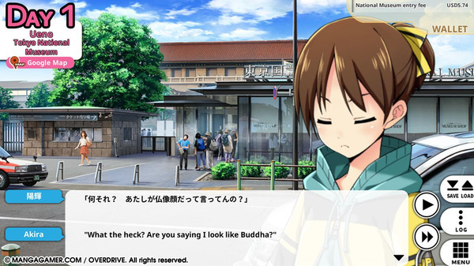
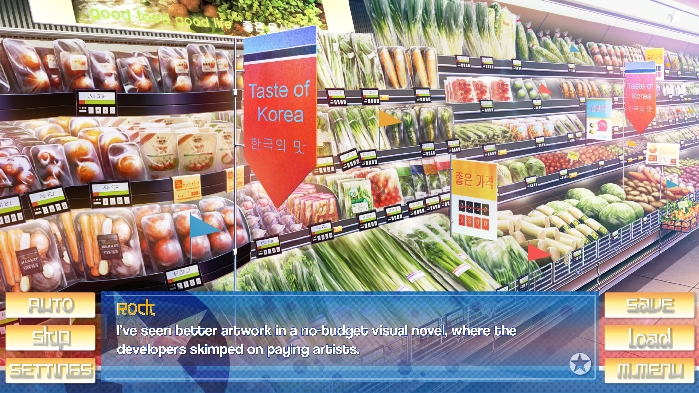
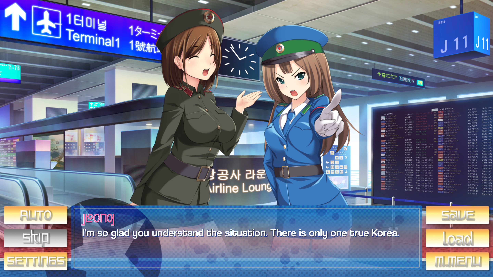

---
{
  title: "RockmanDash Reviews: Stay! Stay! Democratic People's Republic of Korea! [Visual Novel]",
  tags:
    [
      "RockmanDash Reviews",
      "Stay! Stay! Democratic People's Republic of Korea",
      "Visual Novels",
    ],
  published: "2017-05-19T13:06:00-04:00",
  attached: [],
  license: "cc-by-4",
  oldArticle: true,
}
---

While gag Visual Novels are a dime and a dozen nowadays, it takes something a bit
  special to rise out of the ranks. A few years back, OverDrive’s <em>Go! Go! Nippon! </em>did exactly that thanks to an
  extremely silly premise, a tourism guide/romance game that follows a dumb foreigner traveling to japan to stay with 2
  girls he met on the internet. It caught a lot of attention, but who would have predicted that it would grab the
  attention of <em>Panzermadels </em>dev DEVGRU-P, who decided they wanted to on the offense and beat <em>Go! Go!
    Nippon!</em> at it’s own game? Enter <em>Stay! Stay! Democratic People’s Republic of Korea!</em>, a Visual Novel the
  decided to ask the question: What better way is there to make a gag Visual Novel, than parodying a gag Visual
  Novel? 

<strong><em>DISCLOSURE:</em> </strong>Fuwanovel reviewer Valmore served on the <em>Stay! Stay! DPRK! </em>development
  team as a writer. His participation on the title has no bearing in this review, but for ethical reasons this review
  will not have a score.

<a class="sc-1out364-0 hMndXN sc-145m8ut-0 gIacKn js_link" data-ga='[["Embedded Url","External link","https://rockmandash12.kinja.com/rockmandash-reviews-go-go-nippon-my-first-trip-to-1554354147?rev=1495159092007",{"metric25":1}]]' href="https://rockmandash12.kinja.com/rockmandash-reviews-go-go-nippon-my-first-trip-to-1554354147?rev=1495159092007" rel="noopener noreferrer" target="_blank">In my opinion, <em>Go! Go Nippon!</em></a>
  wasn’t a particularly great game, or a particularly funny Visual Novel. It wasn’t the writing or comedy that lead<em>
    Go! Go! Nippon! </em>to internet fame, but the sheer cheesiness of the scenario in this work, and for a good reason:
  The fact that someone actually made a Tour Guide Romance Visual Novel is a development that is inherently funny and
  interesting. Add to the fact that it was done in the most ridiculous, low rent manner with its romance tacked on
  grabbed the attention of many a memer or the attention of those people who like to look at the weird zany shit from
  japan. <em>Stay! Stay! DPRK! </em>doesn’t do much more than <em>Go! Go! Nippon!</em>, basically taking all this
  cheesiness and novelty and cranking it up to 11, but what it does have is the benefit of not taking itself seriously
  and because of this, the work is actually entertaining. It’s not something that seems to make sense on paper because
  novelty is really a one and done thing, but thanks to DEVGRU-P’s addition of the basically memed North Korea, it leads
  to a work that ultimately works with the premise, helping to make an actually enjoyable game. 

<em>Stay! Stay! DPRK!</em> follows a dumb American Soldier who visits the hostile
  and isolated country of North Korea, (almost completely unaware of the political status of the country) to stay with 2
  friends he knew online, who happen to be cute anime girls. The game definitely doesn’t take itself seriously and is
  all the better for it, proceeding to make fun of every aspect of this stupid premise, from breaking the fourth wall
  constantly to jokes about North Korea you’d expect from a game made in the west. Obviously, this means the game is not
  an accurate deception of the state of North Korea, resembling <a class="sc-1out364-0 hMndXN sc-145m8ut-0 gIacKn js_link" data-ga='[["Embedded Url","External link","https://www.reddit.com/r/Pyongyang/",{"metric25":1}]]' href="https://www.reddit.com/r/Pyongyang/" rel="noopener noreferrer" target="_blank">/r/Pyongyang</a> more
  than the nation itself. Characters are caricatures of what people truly are, with the main girls being mixed between
  Visual Novel heroine and North Korea memes, events that occur are your traditional galge affair but with the insanity
  of North Korea shaping everything that happens, etc. The result though is an enjoyable read, showing what a little bit
  of self awareness can do to a work, changing something from an amusing but boring work (<em>Go! Go! Nippon!</em>) to
  something that has a significant amount of novelty, but is actually something I’d actually consider recommending to
  someone else. 

Unfortunately, this act of parody is simultaneously the best and worst part of the
  game. With a parody of a novel game comes a dose of novelty, which will wear off the further you play the game. It’s a
  fun read, but there’s not much substance to the game, and the amount of fun you will have with this work depends on
  how much you enjoy the topic of North Korea, or how much you enjoy the meme culture that surrounds the country. For
  most people, I would have to imagine that readers won’t be constantly amused by the game, and for me I felt like the
  writing and 4th wall jokes felt forced at times, getting old about halfway through the game. Furthermore, while it is
  a parody and is not faithful to real life, it is still a game about North Korea and thus the tone of the game clashes
  with the reality and setting of the work. While I appreciated the meme nature of the game, I did expect a darker game
  than what we eventually got, and a part of me wishes someone would try to make a long, developed and serious route out
  of this game. The later parts of the game seem like they were trying to do this, but were once again limited by the
  tone and focus of the game.

<iframe allow="accelerometer; autoplay; clipboard-write; encrypted-media; gyroscope; picture-in-picture" allowfullscreen="" frameborder="0" height="315" src="https://www.youtube.com/embed/pIdXck3TJpA" width="560"></iframe>

One cannot deny the effort that was put into this game though: while this game tries to
  replicate the low rent feel of the original<em> Go! Go! Nippon!</em> and it’s art for the most part mimics what you
  would see there, you can tell that attention to detail went into it and the game looks quite great, especially for an
  indie. There was a lot of charm in the way they executed assets of the game and while I feel like there could and
  should have been more art and CG in the game, that would take away from the parody, so I’m not really sure what to say
  there. As for the the music, it was passable (I never really noticed it, but I never thought it was too out of place).

Overall though, <em>Stay! Stay! DPRK!</em> is a Visual Novel that is exactly what is
  says on the tin. It’s a parody of a gag Visual Novel, and for the most part it is rather entertaining thanks to an
  amusing premise. It’s a fun time, but the game is inherently limited by the fact that is a parody, so don’t expect
  anything deeper than that. If it seems up your alley, you’ll probably enjoy it, but if not, you won’t.

<em>Thank you for reading! This is Rockmandash Reviews, a blog
  focused on everything revolving Visual Novels, with stuff like tech and anime every now and then. If you want to read
  more of my writing, check out FuwaReviews and AniTAY where I am a contributor.</em> 

