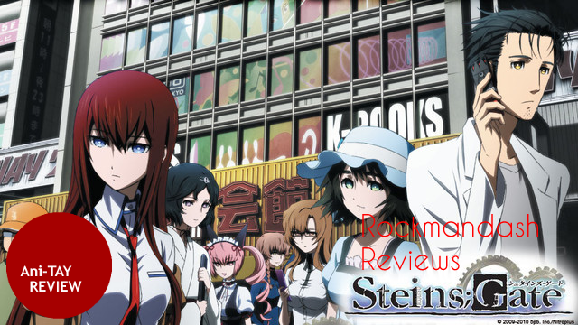

---
{
	title: "Rockmandash Reviews: Steins;Gate [Anime]",
	published: "2014-04-02T23:40:00-04:00",
	tags: ["rockmandash reviews", "anime", "ani-tay review", "rockmandash12", "rockmandash"],
	kinjaArticle: true
}
---

Welcome to Rockmandash Reviews! This is my review of the Anime of Steins;Gate. Steins;Gate is an anime made which was a cooperative project by 5pb Nitroplus, and adapted by a relatively unknown anime studio called White Fox. How well did they do this? let's find out!

Link to [Visual Novel Review](https://rockmandash12.kinja.com/rockmandash-reviews-steins-gate-visual-novel-1557340615)

###### [Rockmandash Reviews: *Steins;Gate* \[Visual Novel\]](https://rockmandash12.kinja.com/rockmandash-reviews-steins-gate-visual-novel-1557340615)

Welcome to Rockmandash Reviews! This is my review Steins; Gate, the Visual Novel. Steins;Gate is…

[Read more](https://rockmandash12.kinja.com/rockmandash-reviews-steins-gate-visual-novel-1557340615)

  

The Steins;Gate Anime is a very truthful adaptation, and the plot is pretty much the same as the Visual Novel. (That means Copy & Paste. YAY!) The key word here is **about**, as a lot of series use time travel, but they almost never go over how it works. How time travel works is the main premise of Steins;Gate, and it even has references to real theories, real groups, and real people. The rules of time travel might be [pseudoscience](http://tvtropes.org/pmwiki/pmwiki.php/Main/FictionalFieldOfScience), but Steins;Gate sticks with these rules and makes it feel like a real thing. The plot was structured very well, almost like it was meticulously hand-crafted like a luxurious item. One thing that might bother some people is the pacing, which starts out slow. I don't believe the slow pace at the beginning holds back the writing at all, as that time is used well to develop the characters and make this game very enjoyable when they eventually punch your gut in episode 12. Even if you didn't think the beginning was slow, definitely picks up. Once it picks up, you need to be prepared for one of the best experiences you will have ever experienced, with outstanding character development, unique scenarios because of this time travel plot, and an atmosphere that will blow your mind. It's an intellectual roller coaster, and it's a fun one.

Steins;Gate follows the Future Gadget Lab and their adventures with time travel. By complete accident, the lab manages to send a email back in time, and the future gadget lab learns to use time travel… with massive consequences (IE [Butterfly Effect](http://tvtropes.org/pmwiki/pmwiki.php/Main/ButterflyOfDoom)). One thing that Steins;Gate nailed with the writing, is the balance between humor and seriousness, which is one thing a lot of shows don't really get. Out of all the amazing characters in this game, the protagonist Okabe Rintarou aka [Hououin Kyouma](http://tvtropes.org/pmwiki/pmwiki.php/Main/MadScientist) steals the show. Okabe's [chuunibyou](http://tvtropes.org/pmwiki/pmwiki.php/Main/MrImagination?from=Main.Chuunibyou) habit is grating at the beginning, but he slowly grows to you, and he as some of the best character development I've seen in anything, ever. Next up is Makise Kurisu, a [Tsundere](http://tvtropes.org/pmwiki/pmwiki.php/Main/Tsundere) [Genre Savvy](http://tvtropes.org/pmwiki/pmwiki.php/Main/GenreSavvy) [Teen Genius](http://tvtropes.org/pmwiki/pmwiki.php/Main/TeenGenius), but done in a unique way which makes here really enjoyable. She's a great female lead, and is personally one of my favorite out there.and Shiina Mayuri, our [airhead cosplayer](http://tvtropes.org/pmwiki/pmwiki.php/Main/TheDitz), is a relief character, but has a surprising amount of depth. I could go on and on about the characters, as they are all great. The same thing could be said about the writing in general about this game: it's great and I could go on and on about it. That's just how good it is.

#### Writing - 10/10

 

Visuals is one of those things that really get the new studios as many of them do not have a specific art style to adhere to. Steins;Gate decided to strip away from the fabulous pixelated water color art from the visual novel, and instead replace it with a gradient filled, sharp and clean look. It's more approachable, and it seems quite a bit easier to do. It's definitely very nice art, but it's not as unique in my opinion, and I prefer the Visual Novel's art. Not to mark it down though, it's a very nice looking show; Not something you'd expect from an unknown studio. The only thing that really needs improvement is the character art, as it could be very weird and distracting at times.

#### Visuals - 8.5/10

I've always found it weird that the soundtracks of the anime adaptations are usually better than the game counterpart, see Fate Stay Night. This anime is no exception to that little weird rule. The Soundtrack of the Steins;Gate anime is fantastic; it's consistently better than VN. The Steins;Gate music is better quality, is used in better times, and is just overall a better soundtrack. Also, I believe that Steins;Gate has one of the best OP's ever. About the voices, they are pretty great. I believe the Japanese cast did a better job with the characters in the anime, as they felt more attached, even if they are the same actors. About that eternal Sub vs Dub debate, the Sub is better in for Steins;Gate in my opinion. I say this because I felt the voices fit the characters better, it's a bit more consistent throughout the series, and I felt like they just did a better job overall. I say this, but the dub is very solid as Funimation really took their time with this localization and even made some of the jokes more approachable to the western audience.

#### Sub - 9.5/10, Dub 8.5/10

 

I really don't have much to say that hasn't already been said before in [Richard's review](http://kotaku.com/the-steins-gate-movie-is-an-emotional-ride-through-time-477595024/all) of the movie. It's an inferior version of Disappearance of Haruhi Suzumiya, and was kinda a disappointment to me, but by no means is it bad. It's still a pretty good movie. It takes place a year after the OVA episode, and Okabe Rintarou feels the side effects of going through all the different world lines, as his memories are unstable and he keeps on leaving the timeline. Kurisu, with the help of Amane Suzuha help change the past and get Okabe back. I felt that the movie had a bit more plot holes and pacing wasn't as good, but it was still a nice part of the Steins;Gate universe. This time, more than ever it's entirely focused on characters. If you didn't like Kurisu or Okabe, You probably will like this movie even less than I do. But, if you're reading this, that shouldn't really be a problem. It was a nice epilogue, but I felt the OVA gave Steins;Gate enough closure, and if they really wanted to use this movie to add to the show, it really could have used more time. If it had the pacing that Disappearance of Haruhi Suzumiya had, than it would be way better.

[](http://kotaku.com/the-steins-gate-movie-is-an-emotional-ride-through-time-477595024/all)

###### [The Steins;Gate Movie is an Emotional Ride Through Time](http://kotaku.com/the-steins-gate-movie-is-an-emotional-ride-through-time-477595024/all)

Richard: Today, myself and fellow Kotaku author Toshi Nakamura are here to look at the recently…

[Read more](http://kotaku.com/the-steins-gate-movie-is-an-emotional-ride-through-time-477595024/all)

#### Movie - 8/10

 

I love Steins;Gate. If I didn't I wouldn't be making 2 simultaneously released reviews, right? I think with the charm of the characters, and the best usage of time travel just steal the show with me. I love how Steins;Gate spends so much of it's time showing all the consequences of time travel, which isn't something you see that often. The biggest pro for the anime to me is the accessibility. In my opinion, the anime is easier to watch, easier to get others to watch, and it's generally the version I go back to whenever I want to experience this amazing experience. The Anime also continues the story in ways that the original game didn't with the amazing OVA episode 25 (about going to america) and the movie (Steins;Gate the Movie: Burdened Domain of Déjà vu). There are a few things that bugged me about the localization of the anime, and that's the changing of the jokes. I felt like that the changes were not always for the better, like trying to replace [engrish](http://tvtropes.org/pmwiki/pmwiki.php/Main/GratuitousEnglish) with rap-like talk, and [Tsundere](http://tvtropes.org/pmwiki/pmwiki.php/Main/Tsundere) with [OTP](http://tvtropes.org/pmwiki/pmwiki.php/Main/OneTruePairing), but some were better, like the all your base reference. Whether you like the localization or not is all up to personal taste. The strong points of Steins;Gate overall though is that it's story is relatable, it has a great concept and it's executed very well. What else is there to ask? This is the formula for a great experience.

#### Enjoyment - 9/10

Steins;Gate is an experience that nobody should miss. This is an amazing game that covers all the nitty gritty about time travel - something that other shows and games in the past were always too afraid to cover. With a great concept, and great execution, this is a no-brainer. This is one of the **BEST** experiences I've ever had in any medium ever, and I'm sure it will be just as amazing for you.

## I give this a Rockmandash Remarkable, and a 9.5/10 overall.

 

[El. Psy. Congroo.](http://tvtropes.org/pmwiki/pmwiki.php/Main/ArcWords)

***

**Copyright Disclaimer:** Under Title 17, Section 107 of United States Copyright law, reviews are protected under fair use. This is a review, and as such, all media used in this review is used for the sole purpose of review and commentary under the terms of fair use. All footage, music and images belong to the respective companies.

*You can see all my reviews on *[*Rockmandash Reviews*](http://tay.kotaku.com/tag/rockmandash-reviews)*. For An explanation of my review system, *[*check this out*](https://rockmandash12.kinja.com/rockmandash-rambles-an-explanation-on-my-review-system-1619265485)*.*

###### [Rockmandash Rambles: *An Explanation on my Review System* (Updated 11/15/2015)](https://rockmandash12.kinja.com/rockmandash-rambles-an-explanation-on-my-review-system-1619265485)

If you’ve read any of my reviews and wanted to know why I did them the way I do, here’s an…

[Read more](https://rockmandash12.kinja.com/rockmandash-rambles-an-explanation-on-my-review-system-1619265485)

This is available for legal streaming on Youtube, or you could buy the DVD & Blu ray combo from Funmation.