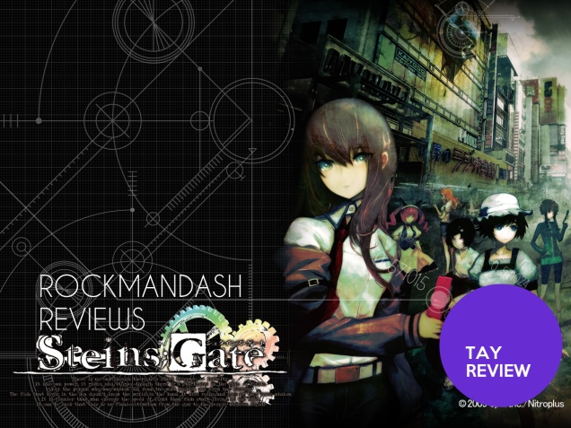
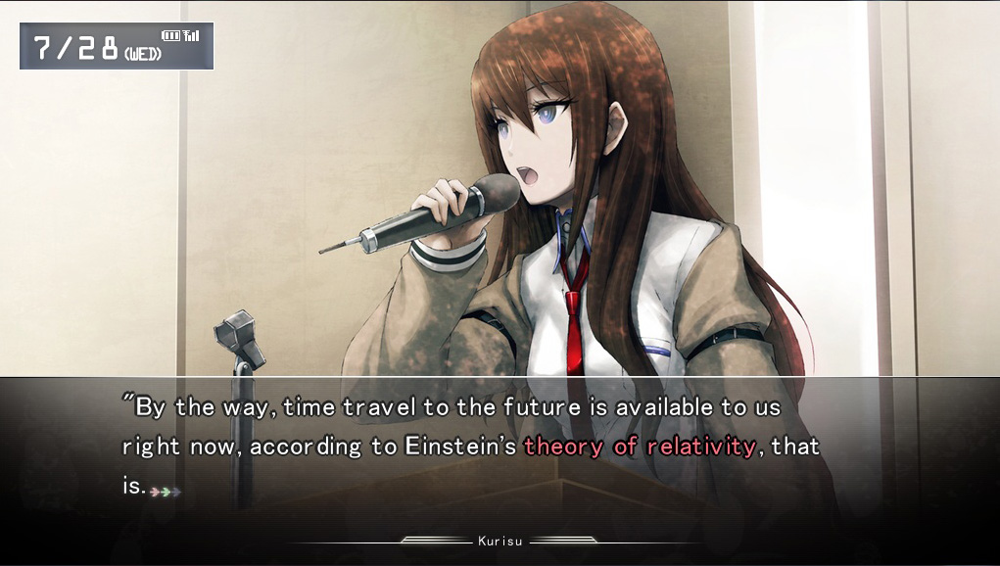
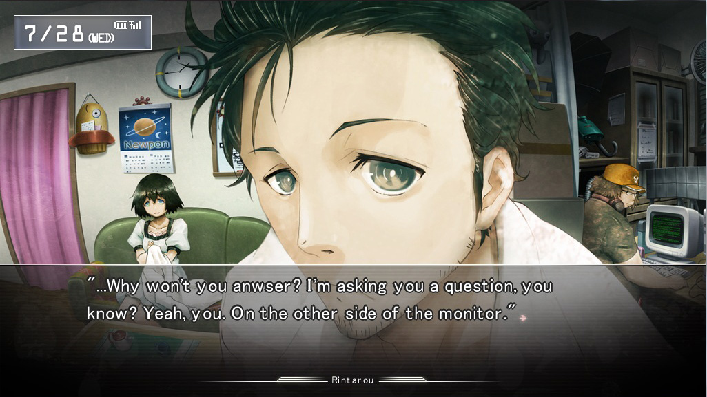
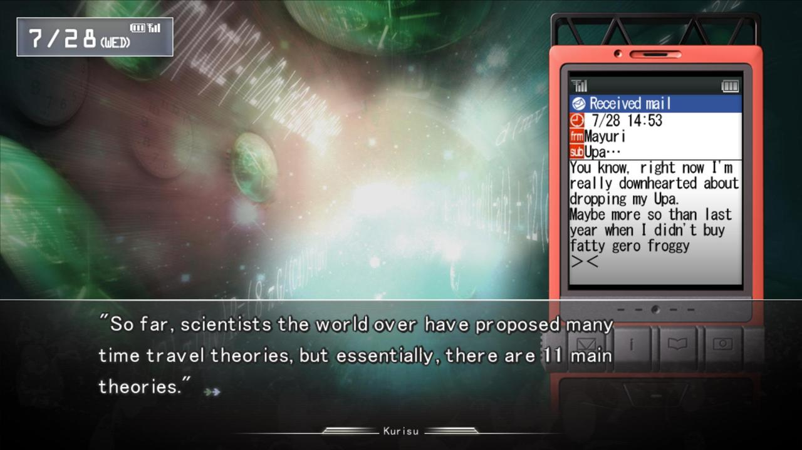
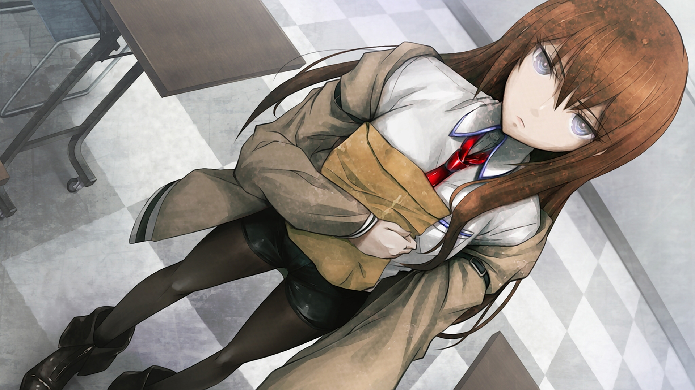
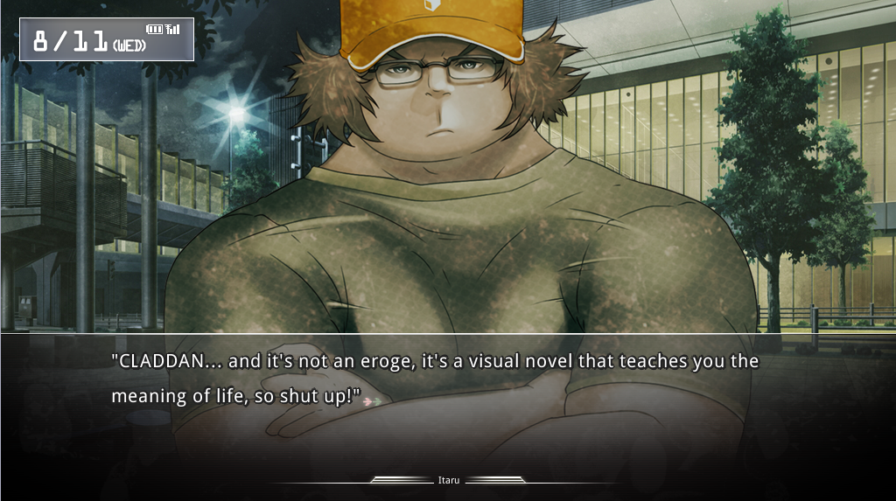
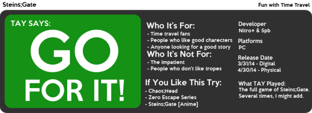

---
{
	title: "Rockmandash Reviews: Steins;Gate [Visual Novel]",
	published: "2014-04-02T23:45:00-04:00",
	tags: ["rockmandash reviews", "visual novel", "review", "rockmandash12", "rockmandash"],
	kinjaArticle: true
}
---

Welcome to Rockmandash Reviews! This is my review Steins; Gate, the Visual Novel. Steins;Gate is a visual novel made which was a cooperative project by 5pb and Nitroplus. This is the [second](http://tvtropes.org/pmwiki/pmwiki.php/Main/Sequel) game in the "science adventure game" series, (The stuff with the semi-colon in the middle, the first game is [Chaos;Head](http://tvtropes.org/pmwiki/pmwiki.php/VisualNovel/ChaosHead) and the 3rd is [Robotics;Notes](http://tvtropes.org/pmwiki/pmwiki.php/VisualNovel/RoboticsNotes)) This is one of my favorites, so let's see how this shapes up in this review.

Link to [Anime Review](http://rockmandash12.kinja.com/rockmandash-reviews-steins-gate-ani-tay-1557356577?rev=1409028905341)

 

To put it simply, the writing of Steins;Gate is phenomenal. Steins;gate is a very [genre savvy](http://tvtropes.org/pmwiki/pmwiki.php/Main/GenreSavvy) Visual Novel **about** [time travel](http://tvtropes.org/pmwiki/pmwiki.php/Main/TimeTravel). The key word here is **about**, as a lot of series use time travel, but they almost never go over how it works. How time travel works is the main premise of Steins;Gate, and it even has references to real theories, real groups, and real people. The rules of time travel might be [pseudoscience](http://tvtropes.org/pmwiki/pmwiki.php/Main/FictionalFieldOfScience), but Steins;Gate sticks with these rules and makes it feel like a real thing. The plot was structured very well, almost like it was meticulously hand-crafted like a luxurious item. One thing that might bother some people is the pacing, which starts out slow. I don't believe the slow pace at the beginning holds back the writing at all, as that time is used well to develop the characters and make this game very enjoyable when they eventually punch your gut in chapter 5.Even if you didn't think the beginning was slow, definitely picks up. Once it picks up, you need to be prepared for one of the best experiences you will have ever experienced, with outstanding character development, unique scenarios because of this time travel plot, and an atmosphere that will blow your mind. It's an intellectual roller coaster, and it's a fun one.

Steins;Gate follows the Future Gadget Lab and their adventures with time travel. By complete accident, the lab manages to send a email back in time, and the future gadget lab learns to use time travel… with massive consequences (IE [Butterfly Effect](http://tvtropes.org/pmwiki/pmwiki.php/Main/ButterflyOfDoom)). One thing that Steins;Gate nailed with the writing, is the balance between humor and seriousness, which is one thing a lot of shows don't really get. Out of all the amazing characters in this game, the protagonist Okabe Rintarou aka [Hououin Kyouma](http://tvtropes.org/pmwiki/pmwiki.php/Main/MadScientist) steals the show. Okabe's [chuunibyou](http://tvtropes.org/pmwiki/pmwiki.php/Main/MrImagination?from=Main.Chuunibyou) habit is grating at the beginning, but he slowly grows to you, and he as some of the best character development I've seen in anything, ever. Next up is Makise Kurisu, a [Tsundere](http://tvtropes.org/pmwiki/pmwiki.php/Main/Tsundere) [Genre Savvy](http://tvtropes.org/pmwiki/pmwiki.php/Main/GenreSavvy) [Teen Genius](http://tvtropes.org/pmwiki/pmwiki.php/Main/TeenGenius), but done in a unique way which makes here really enjoyable. She's a great female lead, and is personally one of my favorite out there.and Shiina Mayuri, our [airhead cosplayer](http://tvtropes.org/pmwiki/pmwiki.php/Main/TheDitz), is a relief character, but has a surprising amount of depth. I could go on and on about the characters, as they are all great. The same thing could be said about the writing in general about this game: it's great and I could go on and on about it. That's just how good it is.

#### Writing - 10/10

 

The gameplay is played pretty straight, but it might throw you off as it does change some things. Like every other visual novel, you make choices and you read a lot, but gone are the flowchart-y gameplay that most visual novels are, this is a very linear visual novel and the choices you make do not change the plot entirely, they change what endings you get. Also, the way you make the decisions is also slightly different in Steins;Gate. In Steins;Gate they have this phone trigger system where whenever you get a message or a call, you have to choose things and depending on your choices within this phone trigger system, things will change. The Phone Trigger system is very subtle, and is a very nice and unique way of interacting with the game. Steins;Gate has many small changes that make it unique, and after playing though so many visual novels that have little to no change in the gameplay department, it's a nice change of pace.

#### Gameplay - 8.5/10

 

Horray for 16:9! This is one of the nicest looking Visual Novels I've ever played, and being in 16:9 is something that really makes my day, as when I play in full screen, it actually like like it's supposed to. About the visuals of the game itself, Steins;Gate has this nice [water colored, pixelated style](http://tvtropes.org/pmwiki/pmwiki.php/Main/DesignStudentsOrgasm) to it, and it really makes it quite unique. They way they use it in promo art and even random parts in the game help set it from other visual novels and it keeps your eyes open. It's a very aesthetically pleasing game. Everything is pleasing to the eye, from random items in the game like the Oopa's, to the character designs, and the backgrounds.There aren't a lot of visual novels that can compare to the charm and aesthetics this game has with its unique style.

#### Visuals - 9.5/10

The Sound in Steins;Gate is pretty good. I thought that they did a great job at picking the cast for the voice-over, as they did an amazing job with the characters and it helps make the experience better. I'll never be able to think of Mayuri without thinking of the excellent Tuturu the voice actor did. On a side note, the voices are the same as the Japanese version of the anime, but they sound different. It's a pretty easy transition for the most part but if you're used to one of them it might be a little jarring. As for the soundtrack, I liked it for the most part, as the music was pretty decent. Most of the music was pretty good, and there are some stellar songs in the game, but I wish that the music was used a bit better. Some of the usage of the soundtrack isn't the greatest, and it could be improved. One little thing I enjoyed about the soundtrack was the ringtones that they have in the game, I have it set as my ringtone on my phone, and it's a pretty decent ringtone. Steins;Gate has some good tracks, but it does have it's forgettable parts too.

#### Sound - 8.5/10

 

I love Steins;Gate. If I didn't I wouldn't be making 2 simultaneously released reviews right? I think with the charm of the characters, and the best usage of time travel just steal the show with me. I love how Steins;Gate spends so much of it's time showing all the consequences of time travel, which isn't something you see that often. While the game and anime are remarkably similar, they are a very different experience. They have minor differences, but I feel like the way most of it is executed in the game has more impact, an example would be the final scene with the credits. I feel that the Visual novel is a better experience overall, as it's more immerse, more unique, and has more content overall. If I was going to recommend a version, I'd recommend the Visual Novel. Because I played through the fan translation, some of the official translation choices confused me. The changing of Ruka's name to Luka is stupid (I understand why, Japanese doesn't make a difference between R & L, but all the other versions spell it Ruka :|), this is just nitpicking though and it shouldn't hinder your experience. The strong points of Steins;Gate overall though is that the story is relatable, it has a great concept and it's executed very well. What else is there to ask? This is the formula for a great experience.

#### Enjoyment - 10/10

Steins;Gate is an experience that nobody should miss. This is an amazing game that covers all the nitty gritty about time travel - something that other shows and games in the past were always too afraid to cover. With a great concept, and great execution, this is a no-brainer. This is one of the **BEST** experiences I've ever had in any medium ever, and I'm sure it will be just as amazing for you.

## I give this a Rockmandash Remarkable, and a 9.75/10 overall.

 

[**El. Psy. Congroo.**](http://tvtropes.org/pmwiki/pmwiki.php/Main/ArcWords)

Video Review -

***

**Copyright Disclaimer:** Under Title 17, Section 107 of United States Copyright law, reviews are protected under fair use. This is a review, and as such, all media used in this review is used for the sole purpose of review and commentary under the terms of fair use. All footage, music and images belong to the respective companies.

*You can see all my reviews on *[*Rockmandash Reviews*](http://tay.kotaku.com/tag/rockmandash-reviews)*. For An explanation of my review system, *[*check this out*](https://rockmandash12.kinja.com/rockmandash-rambles-an-explanation-on-my-review-system-1619265485)*.*

This game finally got an English release from JAST USA, and you can pick it up at [JAST's site](http://www.jastusa.com/shop/steinsgate-limited.html) or at [Rightstuff](http://www.rightstuf.com/rssite/action/store/item/Item?ItemName=sg001se).
