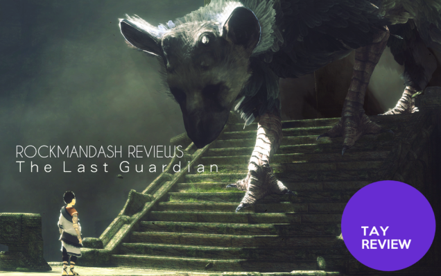
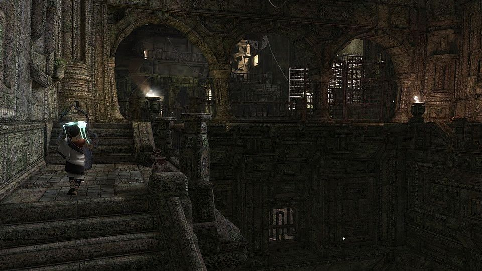
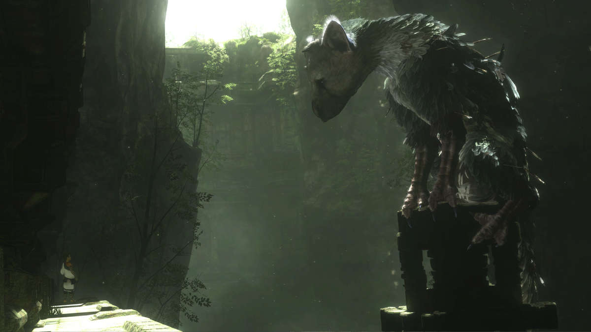
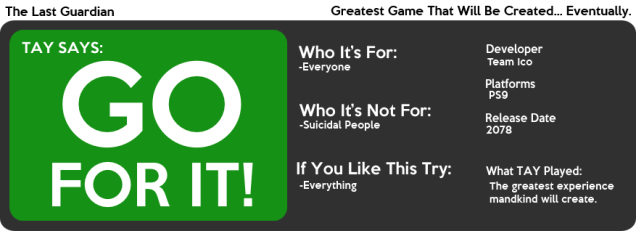

---
{
title: "Rockmandash Reviews: The Last Guardian",
tags: ["Rockmandash Reviews", "Rockmandash12", "The Last Guardian", "Ps9", "April fools", "Reviewing something that doesn't exist is hard"],
authors: ['reikaze'],
published: '2014-04-01T03:00:00-04:00',
attached: [],
license: 'cc-by-4',
oldArticle: true
}
---

Welcome to Rockmandash Reviews! Today is a special review, as my future self from the year
  2078 has sent a D-Mail to me to post a review of The Last Guardian for the PS9. Apparently, it's the greatest game
  ever created, and well worth the 69 years of waiting. Also, because the D-Mail didn't include images or video, i'll
  have to post some of the random footage laying around on the internet.

<blockquote class="sc-8hxd3p-0 nvIqO" data-type="BlockQuote">
Because this is a review from
  the future, I'll give you some information about the launch of this game. The Last Guardian is a launch game for the
  PS9 made by Sony and Team ICO, now known as the head of the Japanese Government. The PS2 commercial based on the PS9
  was extremely accurate about launch times and features, so they just re-recorded it for the PS9 media blitz. When the
  PS9 came out, Japan had a PS9 holiday which was quite impressive, with some of the craziest PR Stunts ever recorded in
  history. I'd love to send this to you, but I can't.
</blockquote>

PS2 commerical that was
  referenced - 

<iframe allow="accelerometer; autoplay; clipboard-write; encrypted-media; gyroscope; picture-in-picture" allowfullscreen="" frameborder="0" height="315" src="https://www.youtube.com/embed/Vdh4TqWFfX4" width="560"></iframe>

<blockquote class="sc-8hxd3p-0 nvIqO" data-type="BlockQuote">
About The Last Guardian,
  because of the way the PS9 works, all of your senses get sucked into the game. I can't really describe the plot
  because 1. The Japanese Government would assassinate me if the masterpiece known as The Last Guardian was leaked about
  50 years ago… 2. It would cause catastrophic effects upon the world because of how timed messages work and 3. It's
  impossible to describe with early 21st century english. It's very similar to ICO, except this game is the most
  absorbing, mind blowing thing you will ever see. Team ICO have managed to make a game with a better plot than even
  Final Fantasy 50 had in less than 5 minutes, and it stays that way. Last Guardian has this charm no other game will
  ever have, it's so simplistic yet so complex that every emotion possible rushes into your mind. There's no way you can
  hate this plot…. literally. The Last Guardian is being deployed as medicine throughout the Universe, and if you like
  the game, It'll heal any wound, disease, etc but if you manage to hate it, the game will suck all of your senses and
  you will die. Kinda scary for people of your time, but the way we look at it in 2078 is that the pros outweigh the
  cons. Just imagine if somebody made Big Rigs for the PS9…. everybody would die :|
</blockquote>
<h4 class="sc-1bwb26k-1 fvCjqJ" id="h121540">Writing - 10/10</h4>

<blockquote class="sc-8hxd3p-0 nvIqO" data-type="BlockQuote">
"The gameplay is the most
  fun, realistic and unique gameplay experience that's ever created. If you liked what team Ico has already created and
  if you like what you've seen from the trailers, you will love this, as it's pretty much that but a million times
  better. It has the best AI, the best interactions with AI, the best puzzles, the best escape sections, the best
  everything. It's the most glorious thing you will ever experience (If you are still alive by the time it's out), and
  like the plot it's impossible to describe with early 21st century English. I'll just say that this is the best
  possible gameplay that mankind will be able to create….."
</blockquote>
<h4 class="sc-1bwb26k-1 fvCjqJ" id="h121541">Gameplay - 10/10</h4>

<blockquote class="sc-8hxd3p-0 nvIqO" data-type="BlockQuote">
"The sharpest of the sharp.
  The most vibrant of the vibrant. the most creative animals you will ever experience. The visuals in the Last Guardian
  is something incomparable to anything else, even in comparison to the trailers that were out at the time of this
  review. by looking at the trailers, you can get a general idea of the visuals of the game, but they just do not
  compare. The stuff that's on the PS4 cannot even compare to the amazing visuals in The Last Guardian. It's the
  greatest game I've ever had the pleasure of viewing, and it's a feast for your eyes."
</blockquote>

Visuals - 10/10

<blockquote class="sc-8hxd3p-0 nvIqO" data-type="BlockQuote">
"My ears were in heaven every
  time I was experiencing this. The best minds of this gaming generation teamed up to create an amazing soundtrack that
  is The Last Guardian soundtrack. It's realistic, but amazing at the same time. It's atmospheric, yet it has depth.
  There is no voice acting for the main character, but all the other voices were the best voice cast ever seen in one
  game. I loved the sound of the Last Guardian. It's perfection. There's no other ways to describe this."

</blockquote>

<iframe allow="accelerometer; autoplay; clipboard-write; encrypted-media; gyroscope; picture-in-picture" allowfullscreen="" frameborder="0" height="315" src="https://www.youtube.com/embed/NPpCKjFrXzE" width="560"></iframe>
<h4 class="sc-1bwb26k-1 fvCjqJ" id="h121542">Sound - 10/10</h4>

<blockquote class="sc-8hxd3p-0 nvIqO" data-type="BlockQuote">
"This is the easiest category
  to explain. This is what it means to enjoy something. It has everything you want in it, and nothing you don't. You
  would think a mashup of so many gameplay styles would clash, but nope, it all ends up being perfect. The experience
  playing through this game, is a once and a lifetime experience, with nothing ever coming close to this. If you like
  something that's both enjoyable and great, this is the game you should play when it comes out.
</blockquote>
<h4 class="sc-1bwb26k-1 fvCjqJ" id="h121543">Enjoyment - 10/10</h4>

<blockquote class="sc-8hxd3p-0 nvIqO" data-type="BlockQuote">
In 2078, the most
  revolutionary game came out, known as Last Guardian. This is a game that will leave an impact on the world, and you
  cannot even compare this to anything previously released to this. It's the best thing mankind has ever created and
  it's left an impact on my life. It's well worth the wait, I can die happy now.
</blockquote>
<h2 class="sc-1bwb26k-1 fvCjqJ" id="h121544">Overall - 10/10 </h2>

(btw if you haven't noticed yet, this is an April fools joke :D)

