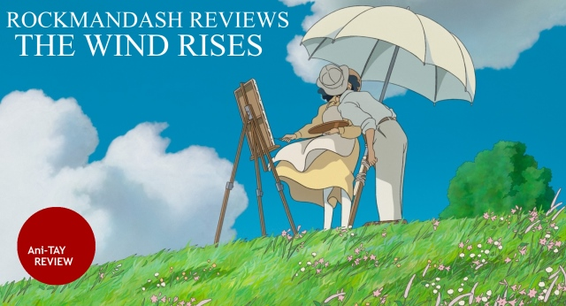
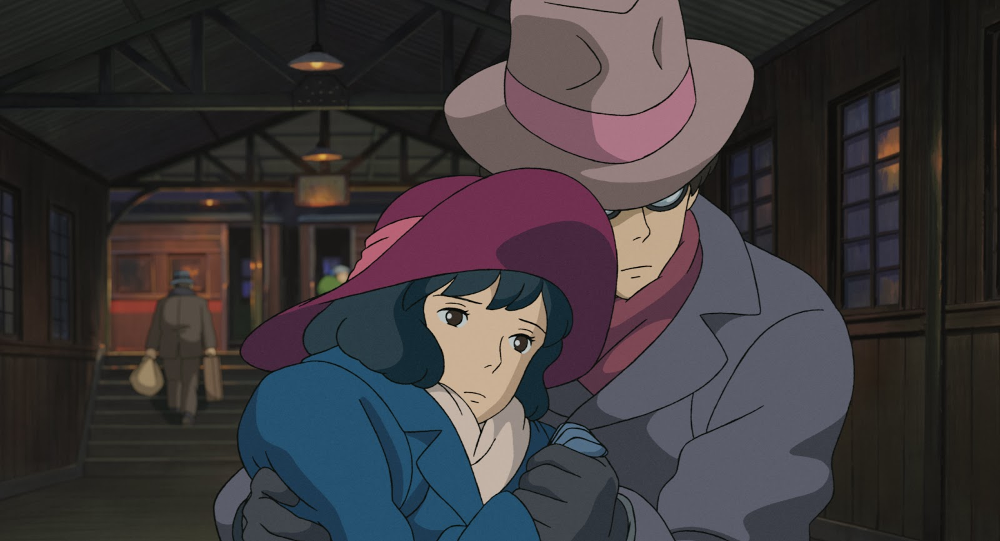
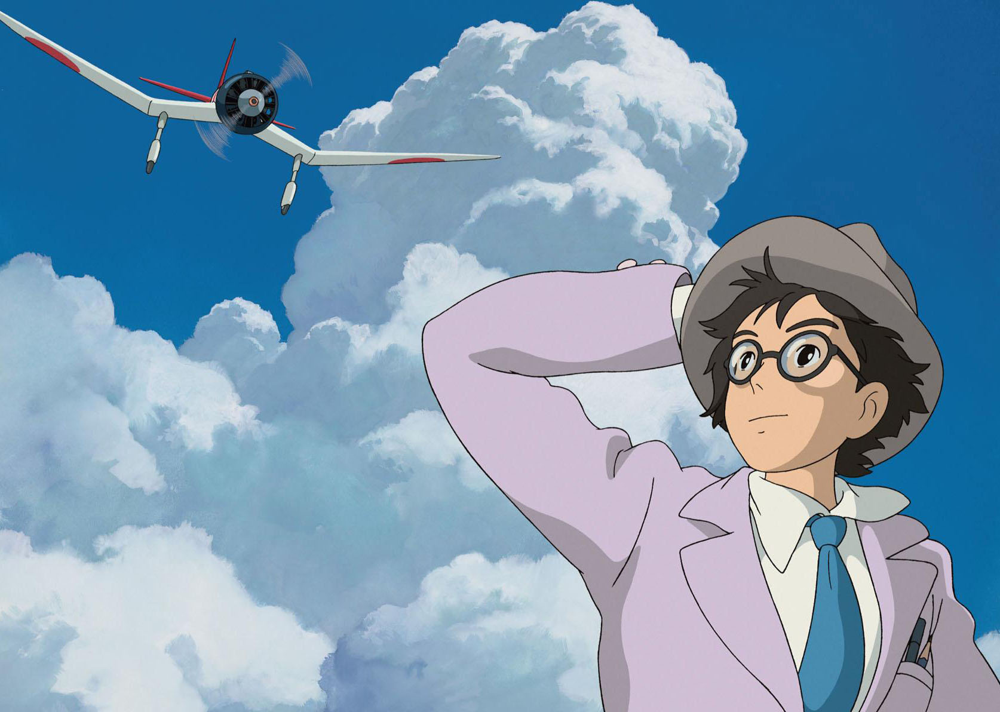
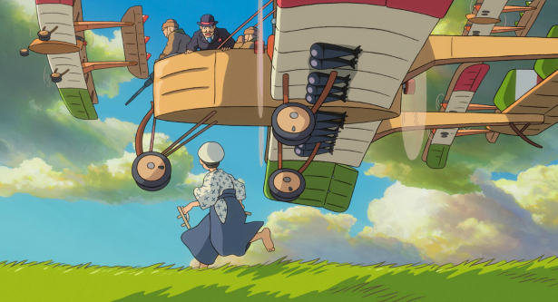
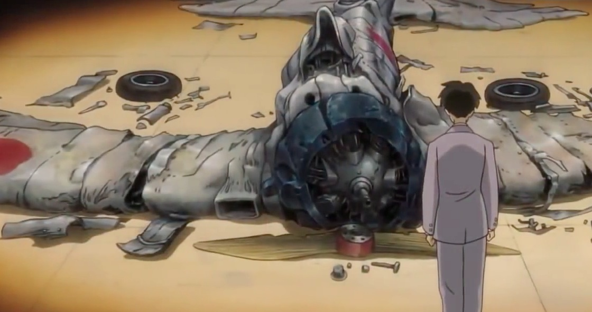
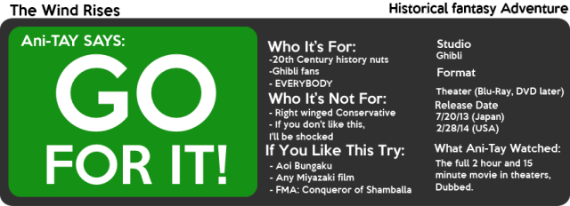

---
{
  title: "Rockmandash Reviews: The Wind Rises [Anime]",
  tags:
    [
      "rockmandash reviews",
      "ani-tay reviews",
      "the wind rises",
      "miyazaki",
      "rockmandash reccomends",
      "ghibli",
    ],
  published: "2014-03-02T12:10:00-05:00",
  attached: [],
  license: "cc-by-4",
  oldArticle: true,
}
---

 Welcome to Rockmandash Reviews! I had the awesome experience of going to the movie
  theaters, and watching The Wind Rises; thus this review was born. Today, we have a review of The Wind Rises; The great
  last horrah for Hayao Miyazaki.

<h4 class="sc-1bwb26k-1 fvCjqJ" id="h114303">Very Charming Story </h4>
 The wind rises is set in <a class="sc-1out364-0 hMndXN sc-145m8ut-0 gIacKn js_link" data-ga='[["Embedded Url","External link","http://en.wikipedia.org/wiki/Showa_period",{"metric25":1}]]' href="http://en.wikipedia.org/wiki/Showa_period" rel="noopener noreferrer" target="_blank">Showa-era</a>
  Japan and the story follows the life of Jiro Horikoshi, a aeronautical engineer and his quest to build a great
  airplane. The plot is very ghibli-esque. It feels like a melting pot of everything Hayao Miyazaki, and you get what
  you expect out of this: a charming yet tragic love story with an excellent plot to back it up. The plot is definitely
  focused on the characters, and all the characters were well rounded and interesting. Of course, our main dreamer
  protagonist Jiro took the spotlight, but he was such a likable character that is really inspirational that I didn't
  mind it at all. The one thing I felt that TWR does better than any Ghibli film in the past, is that it balanced the
  feels and the humor to an amazing extent, and I loved it. Stuff like Grave and Mononoke were all serious, while Kiki's
  Delivery Service and Totoro were very light-hearted. This, along with Spirited away, has a perfect mesh of all of
  them. 

<h4 class="sc-1bwb26k-1 fvCjqJ" id="h114304">Awesome Setting </h4>

 What made the Wind rises stand out from other Ghibli works is even though it's
  about air, it's very grounded to reality. The wind rises shows a setting not used quite often of pre-war Showa era
  Japan, and considering that this is like my favorite setting and it's never used, this made me really happy. (The only
  other series I can recall that uses this era to the fullest like this is the No Longer Human Arc from <a class="sc-1out364-0 hMndXN sc-145m8ut-0 gIacKn js_link" data-ga='[["Embedded Url","External link","http://en.wikipedia.org/wiki/Aoi_Bungaku",{"metric25":1}]]' href="http://en.wikipedia.org/wiki/Aoi_Bungaku" rel="noopener noreferrer" target="_blank">Aoi Bungaku</a>)
  The clash of a maturing Japan, with the clash of old and how advanced Germany was in comparison was very interesting
  to me and it really made the mood for me. I loved how diverse the movie was, it made me glad I watched this dubbed. It
  gives a very pre-war vibe, and if your a 20th century history nut, you'll love it. 
<h4 class="sc-1bwb26k-1 fvCjqJ" id="h114305"> This is Art</h4>

 ALL THE <a class="sc-1out364-0 hMndXN sc-145m8ut-0 gIacKn js_link" data-ga='[["Embedded Url","External link","http://tvtropes.org/pmwiki/pmwiki.php/Main/SceneryPorn",{"metric25":1}]]' href="http://tvtropes.org/pmwiki/pmwiki.php/Main/SceneryPorn" rel="noopener noreferrer" target="_blank">AIRPLANE PORN</a>...
  IT'S SO BEAUTIFUL. The airplanes look just amazing, and they are everywhere. Miyazaki loves airplanes, so it's fitting
  that the last film of his is full of beautiful airplanes. The scenery was also really nice, I loved how Germany was
  portrayed in the film. Because I watched it in theaters, I had the pleasure of seeing it in 4k, on a huge screen. I
  loved every bit of it visually. It looks so good. I'm sure it'll look amazing on a 1080p TV too, but wow, I was blown
  away. I still think Kara no Kyoukai looks better, but this is the best looking Ghibli film out there, and one of the
  best looking animated films in general. The attention of detail.This is what I call art. But, like any other art, this
  leaves a message: Hayao Miyazaki, like Jiro Horikoshi, changed the world. If it was for the good or bad is for the
  historians to decide. But they kept on dreaming and made amazing works. 

<h4 class="sc-1bwb26k-1 fvCjqJ" id="h114306">The Sound</h4>

<iframe allow="accelerometer; autoplay; clipboard-write; encrypted-media; gyroscope; picture-in-picture" allowfullscreen="" frameborder="0" height="315" src="https://www.youtube.com/embed/Tl43T7oKS0w" width="560"></iframe>

 WHAT? A Ghibli film with Meh sound? It was very meh at the beginning, but it got better. I
  have to mention the stupid sound effects. You know how in spirited away, they made some of the sound effects by
  people's voices? That's like half of the movie here, and it's very noticeable. When you here Airplanes making
  brrrrmmmmthhhhhh sounds that sound like people were saying it, you cannot help but laugh. Me and my friends were
  making stupid sounds the whole time.... When I started watching it, I was wishing I watched TWR in sub, but then the
  dub got way better as Jiro matured, and more western culture seeped in, with the Italian engineer, and the German
  traveler. This is one movie you want to watch dub. I cannot forget to mention the amazing soundtrack by Joe Hisaishi,
  this is one of his best works, but the weird sound effects aren't really helping here. 

<h4 class="sc-1bwb26k-1 fvCjqJ" id="h114307">The Beginning</h4>

 The beginning in general was not up to snuff. Along with the Weird acid trip dreams
  about the Italian engineer Caproni who helped inspire Jiro, to the most hilarious earthquake I've ever seen, This had
  a weird start. It doesn't get good until like 30 minutes in, but once it gets good, it's really good. 

 Neither of these actually have to do with the movie itself, they are just things
  relating to the movie that I thought were terrible.
<h4 class="sc-1bwb26k-1 fvCjqJ" id="h114308">THE END</h4>
 The Wind Rises has an inevitable fact
  that will linger on and might influence your experience even before you enter the theater or boot up the Disk: This is
  Miyazaki's last film. It was an amazing swan song, and I loved every bit of it, but this is the end for Hayao
  Miyazaki, movie wise. That is a sad fact, but it doesn't over-shadow this masterpiece of a film. It was the best
  farewell Hayao Miyazaki could have ever made, but it's still a farewell. 

<h4 class="sc-1bwb26k-1 fvCjqJ" id="h114309">Controversy</h4>

 I hate mainstream media. This movie, intensifies this. Along this movie comes a
  wave of controversy because it's a more mature plot, and the fact that it's made in memory of the designer of the
  Mitsubishi Zero, the airplanes Japan used in WWII. This fact is actually an important plot point in TWR, as Jiro is
  just a guy who wanted to make beautiful airplanes, but the government had other thoughts. The controversy annoyed me
  to no end... just enjoy a movie as is; it was a great movie. If you watch it, it gives a very pacifist message, but
  most people coming in will not expect this. Also, a lot of people equate Ghibli to children friendly (obviously they
  have not watched Grave of the Fireflies...), but this is anything but that. The older you are, the more you will enjoy
  this. 

 The Wind Rises was a fantastic movie. If you are a fan of Ghibli, you will love
  this movie. It has all the charm you expect, but it also has an amazing and mature plot. Along with Spirited Away,
  this is my favorite Ghibli film. I loved it, and I think you will too. <strong>GO AND WATCH IT NOW</strong>. You owe
  it to yourself to see this, and I'm sure you will love it just as much as I did. 
<h2 class="sc-1bwb26k-1 fvCjqJ" id="h114310">OVERALL - 9/10</h2>

<strong>Copyright Disclaimer:</strong> Under Title 17, Section
  107 of United States Copyright law, reviews are protected under fair use. This is a review, and as such, all media
  used in this review is used for the sole purpose of review and commentary under the terms of fair use. All footage,
  music and images belong to the respective companies. 

<em>You can see all my reviews on </em><a class="sc-1out364-0 hMndXN sc-145m8ut-0 gIacKn js_link" data-ga='[["Embedded Url","Internal link","http://tay.kotaku.com/tag/rockmandash-reviews",{"metric25":1}]]' href="http://tay.kotaku.com/tag/rockmandash-reviews"><em>Rockmandash Reviews</em></a><em>. For An explanation
  of my review system, </em><a class="sc-1out364-0 hMndXN sc-145m8ut-0 gIacKn js_link" data-ga='[["Embedded Url","External link","https://rockmandash12.kinja.com/rockmandash-rambles-an-explanation-on-my-review-system-1619265485",{"metric25":1}]]' href="https://rockmandash12.kinja.com/rockmandash-rambles-an-explanation-on-my-review-system-1619265485" rel="noopener noreferrer" target="_blank"><em>check this out</em></a><em>. </em>

<aside class="sc-1rh3ayr-6 jfFNjl inset--story branded-item branded-item--kinja" data-commerce-source="inset">

<a class="sc-1out364-0 hMndXN js_link" data-ga='[["Permalink page click","Permalink page click - inset headline"]]' href="https://rockmandash12.kinja.com/rockmandash-rambles-an-explanation-on-my-review-system-1619265485" rel="noopener noreferrer" target="_blank"><h6 class="sc-1rh3ayr-3 jRIPES">
    Rockmandash Rambles: <i>An Explanation on my Review System</i> (Updated 11/15/2015)</h6></a>

If you’ve read any of my reviews and wanted to know why I did them the way I do,
      here’s an…
<a class="sc-1out364-0 hMndXN sc-1rh3ayr-0 kOvmIi js_readmore inset--story__readmore js_link" data-ga='[["Permalink page click","Permalink page click - inset read more link"]]' href="https://rockmandash12.kinja.com/rockmandash-rambles-an-explanation-on-my-review-system-1619265485" rel="noopener noreferrer" target="_blank">Read more</a>

</aside>

