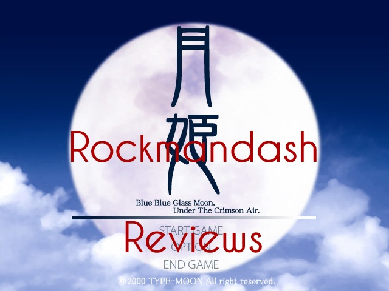
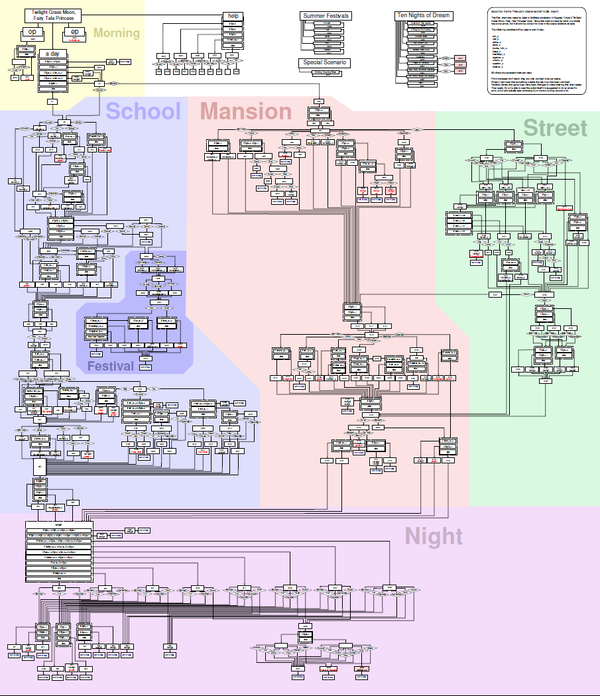

---
{
	title: "Rockmandash Reviews: Tsukihime [Visual Novel]",
	published: "2014-01-28T18:08:00-05:00",
	tags: ["rockmandash reviews", "tayclassic", "fate stay night", "tsukihime", "lunar", "legend", "tay review", "type-moon", "type-moon marathon", "rockmandash", "visual novel"],
	kinjaArticle: true
}
---

Welcome to Rockmandash Reviews, and this is Part 4 of the Type Moon Review Marathon. After the juggernaut that is known as fate /stay night, there's only one logical choice to review next and that's Tsukihime, Nasu's doujin breakout Visual novel.

Link to new Review: [http://rockmandash12.kinja.com/rockmandash-re…](http://rockmandash12.kinja.com/rockmandash-reviews-tsukihime-visual-novel-1614282097)

# Writing

Tsukihime follows Shiki Tohno, a an average high school student as he goes through 5 arcs in total, 1 per heroine, and they are split into 2 storylines: near side of the moon and far side of the moon. Near side of the moon is Arcueid and Ceil's story, it's a more action based story about what is happening outside of the tohno mansion and it deals with the vampires and events in the town. Far side of the moon is Akiha(isn't it sad Shicchan?) and the 2 maids: Hisui and Kohaku. Far side of the moon is a darker and more complicated story about Shiki's past and the secrets of the Tohno family as Shiki slowly decays and goes insane.

The characters themselves are solid, as they all have interesting backstories. Arcueid really steals the show though, with her bright personality that is just entertaining. She makes an appearance in every route, and pretty much dictates the whole game. I really can't think of a criticism for any of the characters, they are all written well. The back story and development of all the charecters help drive the plot, and this show is very charecter driven. The charecters are done very well.

About the pacing of the show, No complaints here. It was pretty solid, as it went slow enough so you could get immersed in the story, but not so slow that you get bored. Great as always.

What did I think? Even if it's Nasu's first big work, it was pretty good. The concepts and the writing is great. The plot is very good and enjoyable. The charecters are supurb It's type moon, whatcha expect?

**Writing - 9.5/10**

# Presentation

I don't feel like I should be rating this because of my bias to newer works, but I'll do it anyways. Tsukihime came out in 2000, as a doujin. When it came out, type moon wasn't a company. Knowing this, you can't really expect the most impressive visuals, but i'm just not a fan of the presentation. Here are my list of complaints about the presentation of this game:

1\. The Backgrounds are just pictures not drawn and this is very jarring

2\. the UI is extremely dated

3\. the game has very few music pieces, and most of the time there isn't any music playing at all.

4\. No voice acting.

5.The game runs at 640x480.

honestly, the presentation doesn't hold up well. This is due for a remake, which is coming… we just don't really know when, and there's no real sign of progress. the presentation is probably the largest barrier in this game, as it's pretty dated.

**Presentation 5/10**

# Gameplay

It's a visual novel. you select options and read. If you get a bad end, you get sent to Teach me Ciel Sensei! segments, which are similar to the tiger dojos in fate stay night. Once again, i need to warn you that if you're not into ero scenes, make sure to install the censor patch as you are installing the game. it just cuts the scene out and is great for people who are not into that kind of stuff.

**Gameplay - 7/10**

# Lunar Legend Tsukihime - Anime

Tsukihime has a 12 episode anime adapted by studio deen…. and it's one of the worst anime I have personally seen. Lunar Legend Tsukihime is essentially near side of the moon, but they tried to mix dark side of the moon into the plot, and they failed at doing so. It's so bad thatt, I've never finished the anime... I've been able to stomach through fsn's anime because it was kinda interesting. Avoid at all costs; there's a reason why it doesn't exist.

**Anime - 0/10**

# Personal Enjoyment

Im a fan of Tsukihime. The Characters were awesome, and the writing was excellent. The presentation is distracting, but it doesn't take away from the story that is tsukihime. I like tsukihime's story just as much as I do FSN's, but FSN is a more enjoyable experience.

**Personal Enjoyment - 9/10**

# Overall

I really enjoyed tsukihime, but it's aged visuals make it hard for me to rate this….. so much so that i really don't want to. It's has some of the best writing Type-Moon has put out yet horrible at visuals. I love it , but it's dated. I'm anticipating the day that Type-Moon does a remake for this.... which has been in production for years. The rating you see today is a rating for Tsukihime as is, and when they make a remake, i'll do a separate review for the remake. Tsukihime gets an 8 out of 10, and Rockman Regrets… wait for a remake.

**Pros:**

Fantastic Writing

**Cons:**

Presentation

That THING that does not exist.

**Overall - 8/10**

# Rockman Regrets

Tsukihime has a direct sequel called Kagetsu Tohya, but i'll probably be skipping that because of this insane thing they call a flowchart.

***

**Copyright Disclaimer:** Under Title 17, Section 107 of United States Copyright law, reviews are protected under fair use. This is a review, and as such, all media used in this review is used for the sole purpose of review and commentary under the terms of fair use. All footage, music and images belong to the respective companies.

*You can see all my reviews on *[*Rockmandash Reviews*](http://tay.kotaku.com/tag/rockmandash-reviews)*, and the rest of my *[*Type-Moon Marathon here*](https://rockmandash12.kinja.com/type-moon-marathon-wip-1534726534)*. For An explanation of my review system, *[*check this out*](http://tay.kotaku.com/rockmandash-rambles-an-explanation-on-my-review-system-1619265485)*.*

*This game is availible on [*Fuwanovel*](http://fuwanovel.org/novels/tsukihime) for download.*
