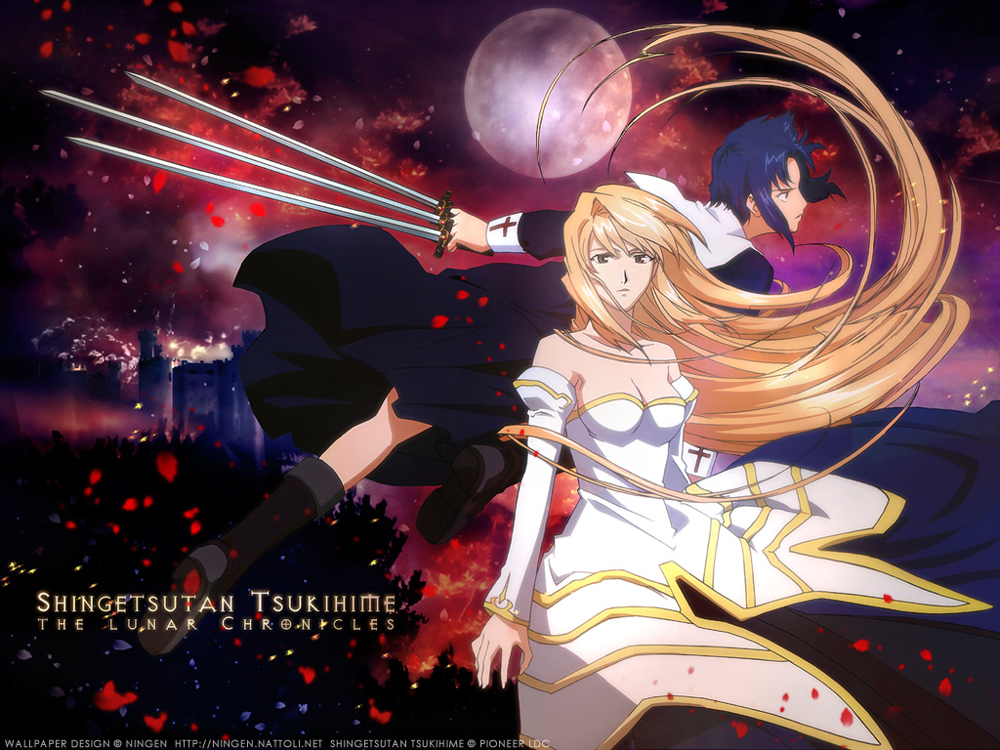

---
{
	title: "Rockmandash Reviews+: Tsukihime [Visual Novel]",
	published: "2014-09-10T18:00:00-04:00",
	tags: ["Rockmandash Reviews", "Ani-TAY", "Type-Moon", "Tay-Classic", "Tsukihime", "Review+", "Type-Moon Marathon"],
	kinjaArticle: true
}
---

Time waits for nobody. The further we go along, the more we advance... but every now and then, we need to take a step back to appreciate the past and the progress we’ve had. As we approach Fate/stay night (2014), now is the perfect time to look back on what started it all. Today on [Rockmandash Reviews+](http://rockmandash12.kinja.com/rockmandash-reviews-tsukihime-visual-novel-1511280291), we have [Nasu’s](https://rockmandash12.kinja.com/type-moon-marathon-wip-1534726534) breakout doujin Visual Novel: Tsukihime.

Nasu never ceases to amaze me. When you think of doujin writing, you do not usually equate it with amazing... yet on his first try, Nasu wrote a story that some may consider to be the best story he’s written, and in my eyes, it’s one of the better ones out there. Tsukihime follows Shiki Tohno, a high school student. He’s not your typical high school student however, as Shiki Tohno has the Eyes of Death Perception: eyes with the ability to see death. After years away from the Tohno household, he moves back home following the death of Shiki’s father. Shiki’s sister, Akiha, assumes the responsibility of being the new head, and decides to let Shiki come back. As the story progresses, Shiki gradually discovers his mysterious past, and becomes implicated into strange adventures.

In Tsukihime, there are 5 routes in total, which are separated into 2 scenerios: Near Side of the Moon, and Far Side of the Moon. The Near Side of the Moon routes have Arcueid and Ciel’s routes, and these are more about the actual plot. It’s fun with vampires, great action/romance writing, but with your Nasu twist on the story with intruging questions of morality, world building and lore that can be matched by very few people, and lots of other things that Nasu is known well for in F/SN, like the fight scenes. Near side of the moon is great and well done... but when you start Far Side of the Moon, that’s when you find the more interesting writing. The Far Side of the Moon has Akiha, Hisui and Kohaku’s routes ([isn’t it sad Sacchan?](http://s3.amazonaws.com/s3.roosterteeth.com/images/Rulebreaker48380ee7aec5a.jpg)), and is by far more out there. In the Far Side of the Moon, Tsukihime deals with the issues of the Tohno mansion... which is quite a bit more interesting than you may expect. Shiki goes absolutely **INSANE** in almost every Far side route, there are characters that appear that you would never expect, and some of the plot twists will leave your mind blown. It’s trippy, it messes with your head, and it’s something I really enjoyed.

Keep in mind that not all of Tsukihime is serious though: quite a bit of the game is a silly slice of life with entertaining humor. The switch in tone from slice of life is done masterfully, and both are very entertaining. It helps with the development of characters, and it’s something that adds lots of character to me. This may make the story not be as dark as you would expect from a plot like this or even in comparison to something like Kara no Kyoukai, but it adds to the story, and is amazing nonetheless.

The thing that separates Tsukihime from other Type-Moon works (other than Kara no Kyoukai, but KnK is the prototype version of Tsukihime and they share lots of stuff.) is how it focuses on the characters, and instead of the characters being lead around by the plot, the characters push the plot around. Nasu does this approach very well, expecially for Tsukihime, because it does what it wants to do very well due to this approach. Starting off with our protagonist, Shiki Tohno, we have an interesting lead that is actually his own character instead of a player proxy. He has his own interesting personality, and his lack of familiarity with his situation makes him a bit of a viewer proxy. However, his reactions to what’s going around is what makes things great; the romance that builds in Near side is great, but seeing him essentially self implode mentally was an interesting experience, and it makes for a great read. As good as Shiki is, Arcueid is the one that really steals the show, with her bright personality that is just entertaining, and the fact that she’s a True Vampire. Her backstory, bubbly personality and thoughts on modern society make her an interesting character, and she essentially steals the spotlight whenever on the screen. The great character interactions, especially between Shiki and Arcueid were just amazing with great humor, and interesting humor. These interactions are a large part on why this game is entertaining. All the other characters are done equally as well: all of them are well developed, memorable, interesting, are quite unique, have an amazing back story, and help dictate the plot. The show builds a decent mystery on all of the characters, and unraveling them is just a great ride, it’s suspense and mystery done right. The game focuses on a small cast, and utilizes them very well, which is an approach that’s known to work well.

The plot is just executed well. Everything from the pacing to the characters, to the back story to the world building, it was enjoyable, and when you consider that this is a doujin game, you can’t help but be impressed. Tsukihime is a well written story.

#### Writing - 9.5/10

 

The Visuals in Tsukihime are very dated. Every time I look at it, I wish that the remakes were out... it has not aged very well. Tsukihime came out in 2000, as a doujin. Knowing this, you can’t really expect the most impressive visuals, but it’s been 14 years, and expectations change. It’s passable, with good character art and OK backgrounds, but it’s definitely aged, with an antiquated UI and an “impressive” standard definition resolution of 640x480. For the most part, the art itself is fine. Characters are detailed, almost everything is pleasing to the eye, and it does the job... but it’s not the greatest and there’s been much better since. A minor nitpick I have with the art though is that the backgrounds are just pictures, not drawn. To me this is very jarring, but it’s not something that will ruin your experience. However, there is something relating to visuals that may ruin your experience: this is an eroge... soo... **CUE THE OBLIGATORY EROGE WARNING HERE. **To me, this is like the final nail on the coffin. At the time it was a necessary evil, but things have changed now, and I think it detracts from the experience.

The presentation just doesn’t hold up. This is due for a remake, which is coming… we just don’t really know when, and there’s no real sign of progress. For now, the presentation is probably the largest barrier in this game, as it’s really dated.

#### Visuals 5/10

There’s something very charming about the soundtrack of Tsukihime. It’s very simple, but it’s concise. It does what it needs to do, and because of that, it doesn’t try to be more than it is; we get music that pulls at your emotions, and sound effects that convey the raw essense of the action. The music is all pleasing to the ear, and it’s a pretty good soundtrack overall. There’s just a few big issues with the soundtrack though that keep it from greatness, and the biggest is the amount of tracks. Tsukihime has 10 tracks, for a 30+ hour game..... sigh. These are memorable songs, but even if you don’t care for them, you will remember them... because they’ve been played to death. As for usage, It was ok. Due to the shallow volume of different tracks, the music cues can be repititious; however, each of them is well suited to the scene; however, each of them is well suited to the scene. However, I wish that they used the music more; there’s a lot of unnecessary audio silence.

#### Sound - 7/10

 

Tsukihime, with it’s character driven writing, has the potential to be better than Fate/stay night, but as an experience, F/SN wins due to a more memorable story and the world building IMO. I like Tsukihime’s story just as much as I like F/SN’s, but F/SN is a more enjoyable experience, with the more epic plot, better music, and better visuals. Tsukihime is a much more character focused story (which has it’s pros and cons) with better pacing, it deals with different themes that are equally as entertaining but are more unique ([Insanity is fun](http://www.lurkmore.com/w/images/9/9e/Thischair.jpg)) and deals with tone better, but one thing that can be said is that both were enjoyable and the writing was excellent. Honestly, if the visuals were at the same quality, I’d probably like them equally as much, but I don’t.

#### Enjoyment - 7.75/10

 

[Let me get this straight. There is no Tsukihime anime.](http://tvtropes.org/pmwiki/pmwiki.php/Main/FanonDiscontinuity) [This segment may talk things that relate to Tsukihime in an anime form... but it’s not real.](http://angryfreak.files.wordpress.com/2009/06/hisuisays.jpg)

Let’s say that hypothetically, there’s a Tsukihime Anime that’s called Shingetsutan (Lunar Legend) Tsukihime, and is 12 episodes, adapted by J.C. staff. This hypothetical anime would be, by far the worst anime I have ever seen, and would probably be the worst adaptation on this planet. Lunar Legend Tsukihime would try to be Near Side of the Moon, but at the same time try to implement parts of the Far Side of the Moon routes into the plot. Unfortunately it would fail at both, so it would start making things up, and nothing would make any sense. It would try to explain things, but because it leaves so many things unexplained, you’d never actually know what’s going on. The pacing would be so slow that it would be inexcusable and show-ruining, considering how much info they have to put in, and how slow the game is already is. The pacing would singlehandedly make this the most boring show I’ve ever seen. They’d also throw in random flashbacks for scenes that don’t need to be shown in flashbacks, and just other really stupid execution stuff like that.... it would have so many execution issues that it would make people cry. It would be so bad that I would never be able to soldier through it. I’ve been able to soldier through F/SN 2006 anime because at least the basic premise and execution wasn’t unbearable, but this would be unbearable. If you ever see this hypothetical show, avoid it at all costs; [there’s a reason why it doesn’t exist](http://reapers0shadow.files.wordpress.com/2013/01/tsukihime-anime-doesnt-exist.jpg?w=300). If you don’t want to read the VN, go read the manga. At least the manga exists.

#### Anime - 0/10

Tsukihime is a great story that needs a new coat of paint: it has some of the best writing Type-Moon has put out, yet due to the age, there’s quite a bit holding it back. It’s a great VN hiding under the shadows of Fate/stay night, and that’s a shame. I’m anticipating the day that Type-Moon does a remake for this... which has been in production for years.

## Overall - 8/10, Polarization +1, -2

 

Also, Tsukihime has a direct sequel called Kagetsu Tohya, but i’ll be skipping that because of this insane thing they call a flowchart.

***

**Copyright Disclaimer:** Under Title 17, Section 107 of United States Copyright law, reviews are protected under fair use. This is a review, and as such, all media used in this review is used for the sole purpose of review and commentary under the terms of fair use. All footage, music and images belong to the respective companies.

*You can see all my reviews on *[*Rockmandash Reviews*](http://tay.kotaku.com/tag/rockmandash-reviews)*, and the rest of my *[*Type-Moon Marathon here*](https://rockmandash12.kinja.com/type-moon-marathon-wip-1534726534)*. For an explanation of my review system, *[*check this out*](https://rockmandash12.kinja.com/rockmandash-rambles-an-explanation-on-my-review-system-1619265485)*.*

###### [Rockmandash Rambles: *An Explanation on my Review System* (Updated 11/15/2015)](https://rockmandash12.kinja.com/rockmandash-rambles-an-explanation-on-my-review-system-1619265485)

If you’ve read any of my reviews and wanted to know why I did them the way I do, here’s an…

[Read more](https://rockmandash12.kinja.com/rockmandash-rambles-an-explanation-on-my-review-system-1619265485)

###### [Rockmandash Reviews: *Type-Moon Marathon*](https://rockmandash12.kinja.com/type-moon-marathon-wip-1534726534)

In preparation for the Fate/stay night: Unlimited Blade Works Adaptation by Ufotable, I decided to…

[Read more](https://rockmandash12.kinja.com/type-moon-marathon-wip-1534726534)

*This game is available on *[*Fuwanovel *](http://fuwanovel.org/novels/tsukihime)*for download.*

*Also, Huge thanks to Raitzeno for all the editing he did.*
